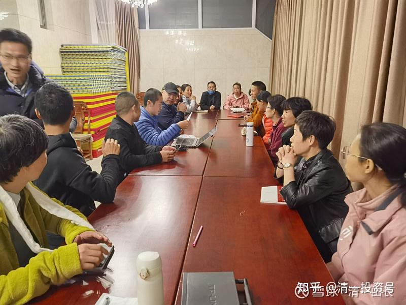

[原雪球专栏](https://zhuanlan.zhihu.com/p/594079627/edit)[222篇.培训21天，只是要知道三个字——我是谁？](http://link.zhihu.com/?target=https%3A//xueqiu.com/9310099567/200940716)

清一山长 2021年10月24日

21天心理行为课大总结

曾芳+韶关 **我是谁？**

**21天的课程结束，每一天都很精彩而新鲜，山长从各个方面、用各种形式给我们讲解和呈现，让我们认清自己的信念系统，引导我们建立正确的信念系统，21天的课程，重新翻阅笔记和思维导图，内容极其丰富，指导着我们人生的方方面面。学习结束后，萦绕在心头的，一直还是那个问题——“我是谁？”。我是谁？我是曾芳，我是女人，我是母亲？我不是我的名字，不是我的身体，不是我的角色——那我到底是谁？我来做什么？要去向何处？**

施蒙 南京

要用21天的时间来消化山长的课程那是妄想，这21天的精华我要用3～5年的时间去理解，并用一辈子的时间去践行。课后最大的心得是我愿意去反思自己，比如在生命面前，我们总是想得到最好的，为此从不思考是不是用错了方式，只是不停地活在假想的生活里，得到的从不在意，失去的时候又不及时忏悔。我的心出了问题，求而不得郁郁寡欢，最终错失本该属于我平静幸福的日子。近日来自己常常深深忏悔自己的无明，反思自己的言行。

来上课之前我带着很多困惑，夫妻关系不顺畅，孩子在学堂状态不好，我自己工作越做越迷茫，整个人陷入一种无名状态，总觉得有一种声音在拉扯着我，当我去书店的时候，双脚不自觉的会走到精神类书架旁，想在书中找到答案。因疫情课程延期，终于有机会走进了课堂。

焦悦容 肇庆

感恩先生推荐我去上心理行为课，也是我非常渴望的课程，终于达成所愿。山长第一课就跟我们讲信念系统，说明这一节课是多么的重要，什么是信念行为？如果我们把人理解为电脑，人比电脑高级，信息进去之后，有程序运作，会哭闹会干活，我们是“智能机器人”，是上帝造的，跟普通系统有什么不一样，跟电脑差别不大，我们哭笑都是有东西驱使的。有人笑有人哭就是装的信念系统不一样。在不同的人看来，人就是完全不同的人。如果不改变你的信念系统的话，会后悔莫及。

曾芳+韶关 **心理行为课的七大理由**

参加完心理行为课，孩子家馆组织学习分享，我给各位家长做了题为“选择心理行为课的七大理由”的分享，真心诚意地感受到课程的超值，值得现场学习，全文如下。

参加学习之前，我报名的原因是自己需要和渴望学习成长，当时进入新教育几个月，深感自己做家长和别人做家长的差距，“父母是原件，孩子是复印件”那句话深深地敲击了我的心灵，为了提升原件质量，当山长课程一开放，我就毅然决然地报名了。我记忆犹新今日学堂最早的宣传片——选择今日学堂的七大理由，当时朴实的拍摄和剪辑，以及青涩、稚嫩的老师和孩子们，深深地打动了我，学习完21天课程，我以一个新鲜出炉的见证者身份与大家分享，选择心理行为课的七大理由，这也是我的收获。

**理由一、课程内容更整体、更系统**

山长从来不规劝我们参加付费课程，反而经常说的一句话是“你们钱多人傻”才来上课。因为山长的课程内容已经全部公开出来，即使付费课程也并没有超出公开的内容，此言的确不虚，但为什么我认清了自己“人傻钱不多”还是建议您参加课程呢？首要的理由就是，21天的课程帮我整体、系统地梳理了自己的信念系统，深挖出自己的信念盲区和谬误，让我认清楚了自己是谁，清晰了自己的人生定位和今后的路程。可以说，心理行为课是我人生的指路灯。

**理由二、课程讲解更细致、更深入**

课程上，山长与我们面对面，近距离，像邻家大哥、又似严父，还是心理医生，他时而以最犀利、直接的语言点醒我，又以丰富的真实案例——更多的是山长自己、亲人、身边朋友的亲证经历，多方面的论证，带领我们多角度地看清事实真相。21天的课程，山长偶尔也跟我们分享一些在公开场合不便直说的“内部消息”，深深感受到山长的拳拳大爱。

**理由三、课程形式更易理解和吸收**

心理行为课采取半天讲解＋半天自习的方式进行，自习给了我们及时消化和吸收山长课程的机会，自习采取自由讨论、分组讨论、辩论、创作表演等各种形式进行。课程时而严肃，时而轻松活泼，时而笑料百出。

**理由四、学习氛围浓郁热烈**

心理行为课集合了新教育圈热爱学习的众多老师和家长一起参加学习，大家都有强烈地学习愿心，讨论、辩论积极热烈。学习结束，班级立即成立了班委，将在后续开展线上联动学习复盘，将所学落实到实践中。

**理由五、小助教闻名不如过招**

今年元旦，清一大学少年班首次亮相，惊艳四座，相信大家都已一睹他们的风采。尽管新教育的分享凭实力说话、干货满满，但舞台的华丽总免不了给人一种包装的不真实感。心理行为课，我们有了与这些“明星少年”零距离接触、观察和共同学习过招的体验。这些优秀的学子担任我们的小助教，21天与我们一同听课、梳理思维线，写作业，他们还同时承担带领我们晨练、安排讨论等各项工作，16～17岁的年龄，作业质量和思维呈现随时秒杀我们——这些众多名牌大学毕业,并在社会中工作生活了十几、二十年的叔叔阿姨们。小组讨论，学员们常常各显神通、上天入地的激辩，小助教却慢条斯理恰当控场，并直指核心地提炼、总结，让我们心服口服。看到这些孩子，深深地感叹道：**孩子就当如此培养！**

**理由六、课后看书更易理解和吸收**

接触到新教育，我开始是如饥似渴地在网络上挖宝，从示范课、到各个公众号，到山长博文，再到各个QQ群，我阅读所有能搜到的信息，不放过实时新鲜出炉的文章，又买来新教育系列书籍，每天陆续翻阅。山长的文章像是有魔力，每天吸引着我，同时又震撼着我的心灵。我以为我看懂了，但实际上与新教育的老师、家长们一聊天，我就发现自己好多连皮毛都没理解。山长的文章看起来平易近人，很容易读，实际有着很强的逻辑和深刻的理论，上完心理行为课后，我再翻阅新教育书籍，发现自己对山长的文章有了新的认识，同时之前看不太懂的地方也更易理解了，我决定重新一一阅读山长博文。

**理由七、晨练运动无形中收获**

心理行为课的晨练对于动则几公里跑，几十公里徒步的老师家长们来说，是运动量很低且很轻松的事，没想到这样轻松的运动形式却让我收获了很好的运动体验。这次课程晨练中，我们学习了太极单招和“游四门”。刚开始练习太极单招，几天就练习风摆杨柳和云手这两个动作，我真觉得有点无聊，也完全找不到感觉。我们参观了武道馆，看到孩子们一天几小时练习同一个动作，了解到山长很长时间才会教新动作，**孩子们就这样日复一日练习同一个动作，但他们都是自主管理、自觉练习**。我思考他们为什么可以这样一直“无聊”的练习，如果要为了克服“无聊”而练习，我想也坚持不了多久吧！我照着明洁的视频反复练习，渐渐地，几天后找到了一些感觉。看起来简单的三个动作，专心的练习，每次都有很多细节需要调整。我原来久坐工作，肩颈脊柱都很硬，练习的时候骨节啪啪作响，练习半小时一身暖洋洋的，我相信，持续练下去，我的身体将柔软下来。经过自己练习后，我再翻出市面流行的太极套路视频看，真能看出那些花架子和真正的内家拳的区别了，也理解了**武道馆的孩子那专注的眼神，沉静的心性是练武自然流露出来的。**

山长的课程都是超值的，除了感受课程本身的满满收获感，山[长和](http://link.zhihu.com/?target=https%3A//xueqiu.com/S/00001%3Ffrom%3Dstatus_stock_match)刘老师都会时不时送出一些超值神秘礼物，也是特别令人惊喜的。

21天的心理行为课远远不止这些收获，零距离接触武道馆，甚至还有与小同学们擂台PK的机会，每一天都过得新鲜、充实。21天的课程，打破了我的一些固有观念，使我遇事多思考、多理性、多觉察，就如姚老师分享的**“拿到不是就得到，最重要是课后的实践、修炼”**，我还需要用更多的时间和实践来消化和吸收，这个课程对我来说是终身受益的。

（以下内容为编者收录）

**评论回复：**

**[一握微笑](http://link.zhihu.com/?target=http%3A//xueqiu.com/n/%25E4%25B8%2580%25E6%258F%25A1%25E5%25BE%25AE%25E7%25AC%2591)回复[清一山长](http://link.zhihu.com/?target=http%3A//xueqiu.com/n/%25E6%25B8%2585%25E4%25B8%2580%25E5%25B1%25B1%25E9%2595%25BF)：**

我是今年5月份第一期心理行为课学员，今天再回顾课程，收获不只是在课堂，山长的课需要后期反刍学习的。

一，做作业带给我的的收获。21天课程，21天的课前作业基本就是被动完成，为了进课堂不得不做，至于质量就不考虑了，当时想这样写作业有什么用？现在我发现当时做21天课前作业，课后总结的收获，好像课程回来后在生活中不惧怕什么任务了，曾经遇到事情“我不行，我不能，我不可以”的信念改为了“我试试，我可以，我能”的信念的转变。从课程结束回来后，自信心不断增长，越来越活出没有局限的人生。

二，全新的大脑开始“启封”。课程中，深刻体会到山长说的我们的大脑是全新的，没去上课时，还认为自己脑子很好使，到了山长课堂，感觉自己的大脑怎么真的就如从没用过。当时感觉活了40多年都没用过脑子。回来后好像不再惧怕用脑，反而还喜欢上了有挑战的事情，可以通过学习去完成。21天课程打开了我太多的可能性。

三,点醒沉睡的种子。通过21天课程，感受到山长的知行合一的力量，再次回顾课堂，才感受到山长的淳淳教导背后的大爱之心。山长接纳我们的无明，用润物细无声的智慧浸泡我这颗沉睡多年的种子，说实在的，在课堂上和刚结束时，我都不知有没有收获，但在回来的日子，又有我们班级对课程复习的安排，现在才发现课程的功效慢慢在对我起作用。有幸生长在这个时代接触新教育，有幸亲近山长聆听山长的教诲。感恩！

**清一山长[2021-10-25 13:25](http://link.zhihu.com/?target=https%3A//xueqiu.com/9310099567/201012513)回复[一握微笑](http://link.zhihu.com/?target=http%3A//xueqiu.com/n/%25E4%25B8%2580%25E6%258F%25A1%25E5%25BE%25AE%25E7%25AC%2591)：**

“**全新的大脑开始启封**”。祝福你们，好好用好自己的新脑子[献花花]！

**[黄红珍](http://link.zhihu.com/?target=http%3A//xueqiu.com/n/%25E9%25BB%2584%25E7%25BA%25A2%25E7%258F%258D)回复[清一山长](http://link.zhihu.com/?target=http%3A//xueqiu.com/n/%25E6%25B8%2585%25E4%25B8%2580%25E5%25B1%25B1%25E9%2595%25BF)：**

感恩山长用心付出！这两位同学都是坐在我旁边的左邻右舍！23天在一起学习，看到她俩的眼神从刚来时的暗淡无光，到结束时的喜悦、祥和、绽放！新教育是改命的教育，真实不虚！在中国，能有机会得到山长课程的人不知道是多少分之一，我就是那幸运的之一！我珍惜！我觉醒！我改变！我幸福！

我昨天跟17岁女儿聊天，她问我：“您们上山长课程每期那么多学员？山长把每个人的作业和日记总结都要看一遍，山长怎么做到有那么多时间的？”我回答女儿：“你去上山长的课，问山长吧！”女儿说，上山长和刘老师的课是她必须要做的事情。18岁自己挣钱养活自己不乱消费，攒钱上课。我说：“你上上课，我愿意先给您投资。”她说：“我还是要自强、自立、自尊、自爱，我15岁从那个市区，家长心目中排名前三的重点高中，读完高一退学来到新教育学堂学习三年了，我18岁养活自己有这个本事，我靠自己。感恩您们对我人生成长路上正确的选择，自己已经拥有了亿万富翁的思维心智模式。”

**清一山长[2021-10-25 13:27](http://link.zhihu.com/?target=https%3A//xueqiu.com/9310099567/201012848)回复[黄红珍](http://link.zhihu.com/?target=http%3A//xueqiu.com/n/%25E9%25BB%2584%25E7%25BA%25A2%25E7%258F%258D):**

你女儿挺自强的[献花花]，有福气！

**[杭州西斗门](http://link.zhihu.com/?target=http%3A//xueqiu.com/n/%25E6%259D%25AD%25E5%25B7%259E%25E8%25A5%25BF%25E6%2596%2597%25E9%2597%25A8):回复[清一山长](http://link.zhihu.com/?target=http%3A//xueqiu.com/n/%25E6%25B8%2585%25E4%25B8%2580%25E5%25B1%25B1%25E9%2595%25BF)：**

怎么感觉有教派的意思。

**清一山长[2021-10-25 14:21](http://link.zhihu.com/?target=https%3A//xueqiu.com/9310099567/201020056)回复[杭州西斗门](http://link.zhihu.com/?target=http%3A//xueqiu.com/n/%25E6%259D%25AD%25E5%25B7%259E%25E8%25A5%25BF%25E6%2596%2597%25E9%2597%25A8)：**

尊重您保持你的全新大脑的权利，也尊重您的判断和选择。但对您喜欢贴标签的行为，表示不认同。同样基于自尊原则，替您拉黑我自己了，免得您的宝贵大脑受到不良影响[俏皮]。同样提醒您一句话：**如果您有自尊的话，您不会去关注不认同的人；如果您懂得尊人的话，您不会对您不懂的事情胡乱发言，胡乱贬低他人！**因此，既然您根本就不懂自尊尊人，您被拉黑，是一种必然。

**[ellhll李华丽](http://link.zhihu.com/?target=http%3A//xueqiu.com/n/ellhll%25E6%259D%258E%25E5%258D%258E%25E4%25B8%25BD)回复[清一山长](http://link.zhihu.com/?target=http%3A//xueqiu.com/n/%25E6%25B8%2585%25E4%25B8%2580%25E5%25B1%25B1%25E9%2595%25BF)：**

山长您好。记得之前求教过山长**“现实有的父母能量很高，但是孩子却不尽然”**的原因，山长教导**“只有善缘的孩子，才会尽量跟你共振。恶缘的孩子，无论父母怎样做，好还是歹，他都一门心思跟你反着做。只是父母的能级越高，越不容易被他们控制操纵罢了。否则家长放弃自己提升与坏孩子共振，就是‘死’在他们手上，一起堕落苦海”**我想，在处处都是江湖的群居社会中，是不是也是同样的道理，对于非善缘的人和江湖，我们也是尽量提高自己的能级，才不会那么容易被拖进局中。除此之后，还有什么办法能独善其身吗？山长的江湖课智慧一直耳闻，无缘亲见，恳请山长让我们见识一点点。山长时时在法布施，这样请求有些贪心，冒犯老师的地方我先诚挚道歉。

**清一山长[2021-10-27 13:41](http://link.zhihu.com/?target=https%3A//xueqiu.com/9310099567/201263778)回复[ellhll李华丽](http://link.zhihu.com/?target=http%3A//xueqiu.com/n/ellhll%25E6%259D%258E%25E5%258D%258E%25E4%25B8%25BD)：**

无欲则刚。
