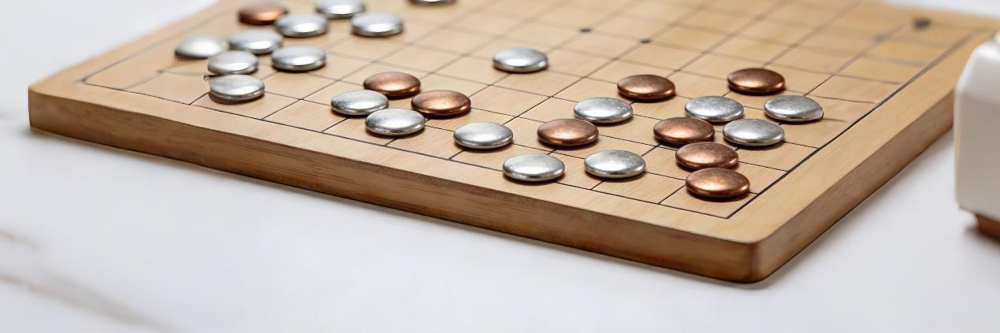

232篇.连续两天重仓大涨的复盘思考！(配图版)

**清一山长**[2026年1月27日08:59](https://zhuanlan.zhihu.com/p/1999288089948989426)

**​**最近两个交易日，我的收益（浮盈）就超过了2014年我的总资产。这是历史上连续两日，我的账户都获得最大单日涨幅的破纪录表现！

原因是我重仓股——有色金属整体上涨，多股连续涨停！

这些有色金属，我默默地买进来已经很久了。最长的一些持仓，我的融资延期已经七次——意味着我已经连续持仓快四年了！最短的买入也有几个月了！每天我都要为这些持仓，支付五位数的利息，这可不是一笔小开支。一年下来为银行和券商做的贡献可不小，已经是他们的第一融资大户了！

这些股票，我买入后长期不涨，但我一直没有怀疑过我的判断。只是奇怪——明明全世界货币放水这么严重，怎么都要体现在大宗商品里面的？怎么这几年有色金属还如此低迷？违背常识！因此，我3块多钱，就大量买了很多洛阳钼业，两块多钱买了白银有色，8块多钱买了中金黄金。还有7～8元的金钼股份，7块钱的天山铝业等等。当然，还有中金岭南，还进入过10大呢！甚至近期进入的冠农实业，似乎也和有色有点关系（间接控股）。

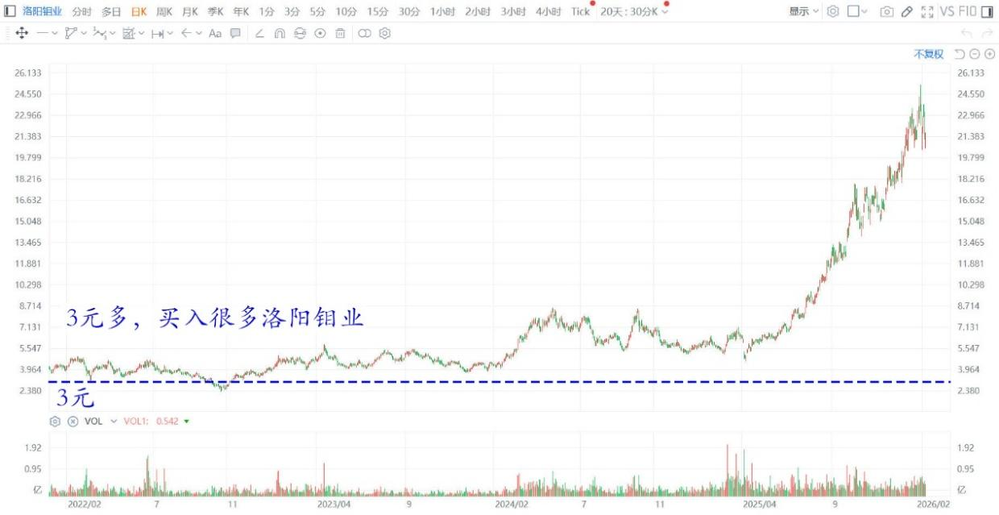

**洛阳钼业港股2022～2026年日线图**

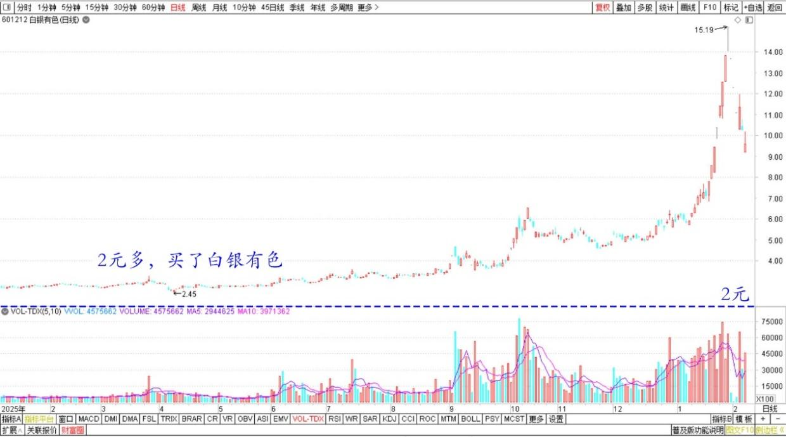

**白银有色2025～2026年日线图**

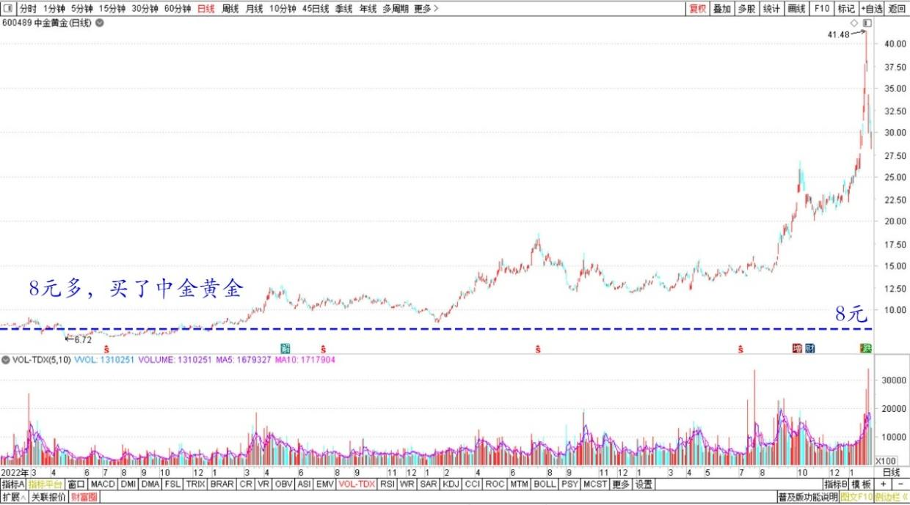

**中金黄金2022～2026年日线图**

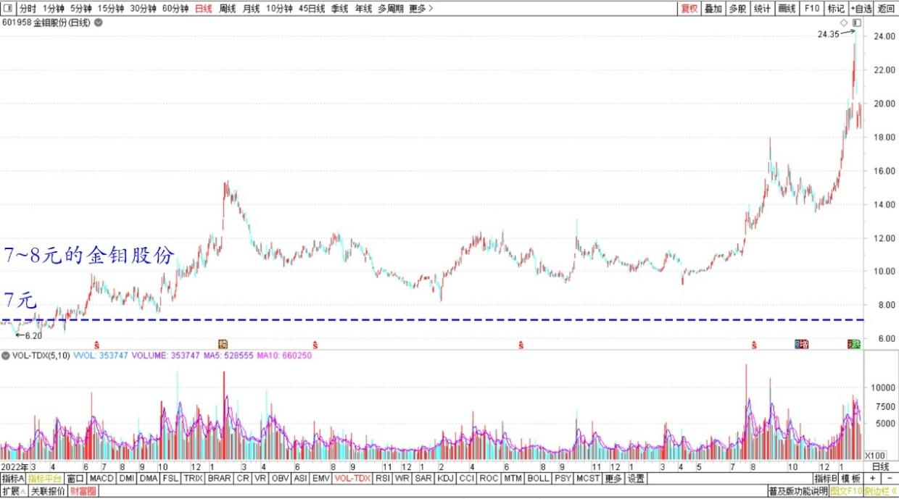

**金钼股份2022～2026年日线图**

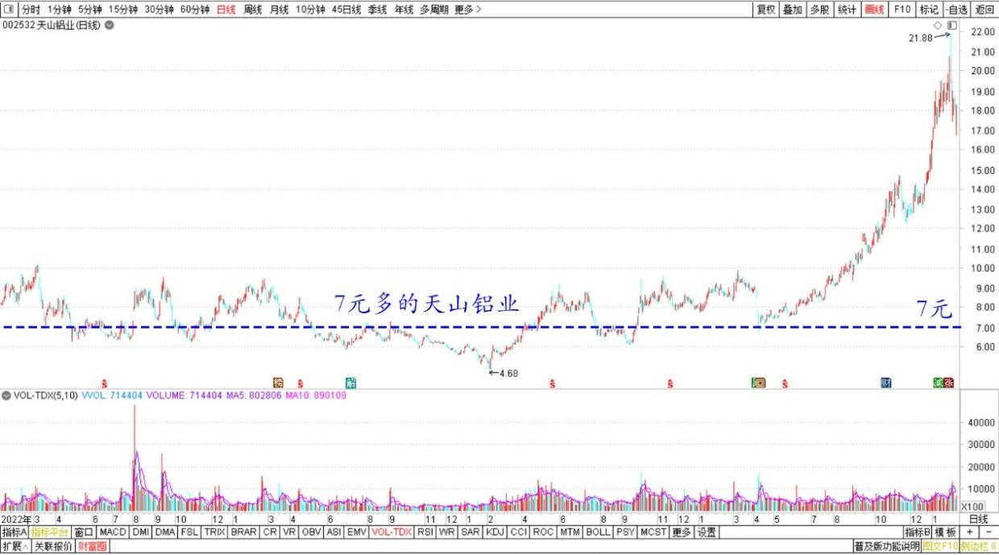

**天山铝业2022～2026年日线图**

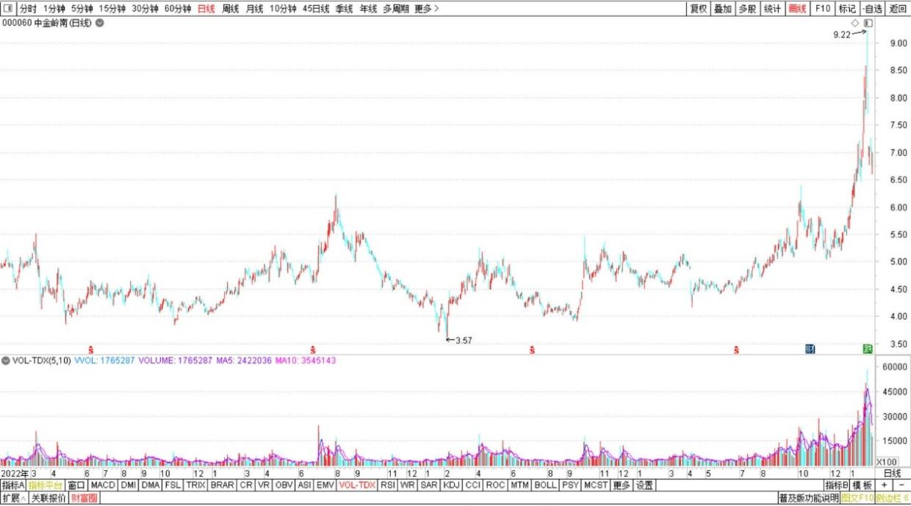

**中金岭南2022～2026年日线图**

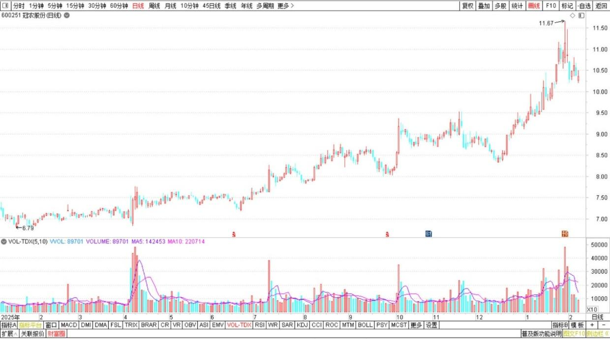

**冠农股份2025～2026年日线图**

现在总算到了大收获的时间。现在，仅仅一天的涨幅，就可以完全覆盖最近五年的融资利息，证明我原来的满仓满融是成功了。

我不是巴菲特，我违反了很多巴菲特的投资铁律，其中一条就是“不要借钱炒股”，巴老是对的。所以我还有大量的股票，是其他稳健的股票用于平衡持仓。我买入的时候，基本是10年的长期底部位置。因此，我用索罗斯的方式来计算的话，就是：如果我明明有很大的确定性，基本确认不会有太大的风险，而回报会非常丰厚的话，我就应该大量地持仓，而不是浅尝辄止！

我计算的结果是：这些股票，买入时机，基本是10年没涨了，或者处在10年来的底部位置！我持有这些股份，能够带来的最大亏损，大概就是融资利息了！股票继续下行，导致我本金亏损的可能性并不大。但如果我的判断是对的，有色金属将来大涨的话，我就有大赚的机会。因此我果断地大量融资，重仓大量买入有色金属股票，放起来等风口。至今有色金属一直没有减仓，只是换股，甚至我还加仓了不少低位的有色金属。

现在，是高光时刻，群众非常激动，歌舞升平，大量涌入的时刻。每天的成交，是原来的10倍，甚至百倍！

现在，连菜场的大妈，都知道“应该买黄金、白银”，都知道“有色才是未来”，甚至白银还要从现在的100，涨到200、300。现在不买了晚了！

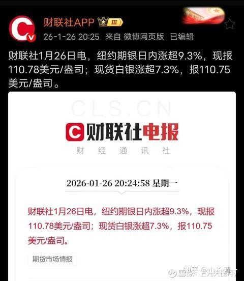

看到大量的这些喜气洋洋的消息，只能让我更加的不安！

**我认为：当所有人都知道某件事情的时候，这件事情大概率就不是真的！**

这就是索罗斯的**反身性理论**！

**现在所有人，都知道黄金，特别是白银很好，是一定要持有的资产。货币不值钱，要换实物，甚至会去买铜条来“保存”。这样大概白银的行情，也就快到头了！**

**当然，我无法判断顶部，涨疯了的股永远无法判断价值。但我决定：从明天开始，应该开始把白银减仓甚至清仓了！**

连续六天的涨停，白银有色完全杀疯了！

**我打算卖掉这些股份，还融资了！退出白银赛道，我认怂，承认不敢赚钱，把美好的机会让出去吧！**

我觉得有些遗憾：几个月前，白银在6元期间整理的时候，我判断是白银有色的右侧最佳买入时机。但我保守了，没有加仓大量买进白银有色，而是保守地换了5元多的铜业。现在铜业虽然也涨了40%多，但白银的涨幅是接近100%了。所以，我的保守，似乎让我没有赚到更多的钱。我看多不做多，失去了一些机会！

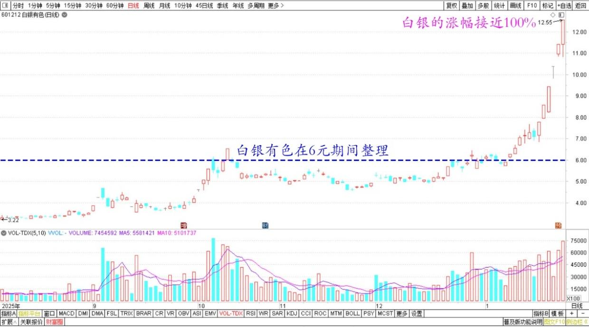

**白银有色2025年8月～2026年1月日线图**

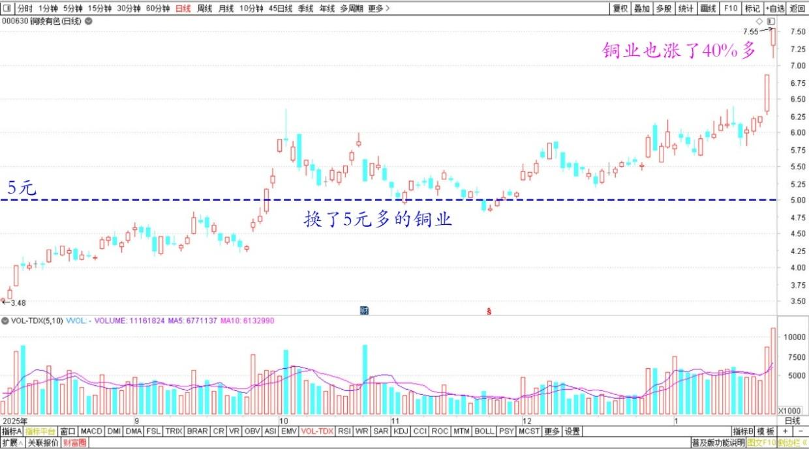

**铜陵有色2025年8月～2026年1月日线图**

但我当时买了大量的低位铜业股，就保证了一旦回撤，我的回撤空间不大。涨幅——我认为会最终追上白银的。毕竟，铜的工业需求其实比白银更强，市场的短缺仓位更多。电力系统的强大需求，会导致铜业是长期繁荣的。只是白银现在有强烈的金融特性，不好比。可能涨到天上，也可以跌到地下。我就不去判断了！

如果现在我把涨幅巨大的股票，卖掉一部分，用来还了融资之后。我会买什么补仓呢？

因为**现在这行情，空仓显然不是很明智的！**

我想我是不是应该买入汇金为了压制股市上涨，而卖出的股票？肯定不是这些股票不好，而是**这些股票是汇金的工具，将来大盘出问题，需要稳定市场情绪的时候，这些汇金卖出概念股，就会拉升了。**这就是2015年我股灾反而获取了更大收益的判断！4000点卖掉融资仓位，股灾中大量买入银行股，最终救市的时候，涨了30%就卖出，连续做了几次，市值创了新高！

现在也是4000点了，但还不到我要全部减掉融资的时候。**我认为应该是5000点以上才需要全部减掉融资！**不过，现在的点位失真。比如今天， 我的持仓全面大涨，但股指几乎没动，就是因为汇金大量抛出！

据说今日，证金公司就抛出了850亿的上证50股票，这个数据好猛，上证50在使劲跌。说明中央真的不希望市场上涨！

所以，我们是不是也忧国忧民一回？帮助证金公司完成任务？把它抛弃的股票捡一点回来？为国接盘，免得证金概念股跌得太惨了。比如兴业银行，居然比我2018年抛出的价格（19元多）还便宜。它不是白白赚了8年的钱吗？这不太公平！证金抛弃这些优质股一点也不心疼。这几天这些股都是大跌的，好可怜。虽然我2018年后就没有买兴业了，持仓也只有几百股，但依然为它打抱不平，是不是可以考虑买一点了？

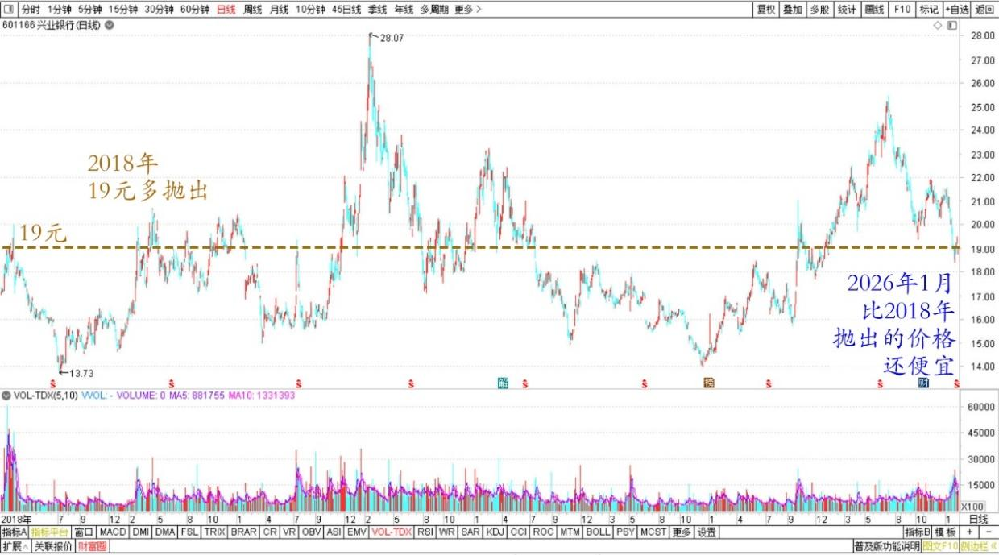

**兴业银行2018～2026日线图**

另外——**电力是未来AI赛道的核心需求，布局电力的潜力股显然很重要。我打算补充一点电力概念股——在大家都没看到的地方去买“电力和金属”双概念重合的股。**

这样我就有双重的胜率。炒作电力，我的股票会涨。炒作金属，我的股票也会涨，岂不美哉。何况股票现在尚在低位，不贵！哈哈！将来能源概念炒作的时候，涨起来说不定也能像有色一样疯狂呢！

感谢伟大的中国，感谢大A。

今天白天讲课，喝了一些咖啡，导致睡不着。所以起来胡言乱语一气，把今天的盘面复盘思考一下！

祝福大家大吉大利，恭喜大家发财。另外，**电力是未来AI赛道的核心需求，布局电力的潜力股显然很重要。我打算补充一点电力概念股——在大家都没看到的地方去买“电力和金属”双概念重合的股。**

这样我就有双重的胜率。炒作电力，我的股票会涨。炒作金属，我的股票也会涨，岂不美哉！何况股票现在尚在低位，不贵！哈哈！将来能源概念炒作的时候，涨起来说不定也能像有色一样疯狂呢！

感谢伟大的中国，感谢大A。

今天白天讲课，喝了一些咖啡，导致睡不着，所以起来胡言乱语一气，把今天的盘面复盘思考一下！

祝福大家大吉大利，恭喜大家发财。

**（标题、图片为编者所加）**

文章音频：

[649篇.连续两天重仓大涨的复盘思考！(配图版)](http://link.zhihu.com/?target=https%3A//www.ximalaya.com/sound/956129208)

**参考链接：**

[225篇.燕京的猜想](https://zhuanlan.zhihu.com/p/2001294008115287766)

[226篇. 设定“止赚线”](https://zhuanlan.zhihu.com/p/2001908287390650417)

[227篇.昨天补仓的铜陵今天涨停](https://zhuanlan.zhihu.com/p/2002022964682568534)

[228篇.白银第四个涨停，铜业第一个涨停](https://zhuanlan.zhihu.com/p/2002506915129880752)

[229篇.观察两年之后，再买白酒](https://zhuanlan.zhihu.com/p/2002828781535118919)

[230篇.白银继续涨停，中金岭南涨一倍](https://zhuanlan.zhihu.com/p/2002834813908963593)

[231篇.1499元的茅台酒与1360元的茅台股票](https://zhuanlan.zhihu.com/p/2002832147816413177)

[链接汇总（截止2026年1月24日）](https://zhuanlan.zhihu.com/p/621215591?utm_psn=1967007144831350474)

