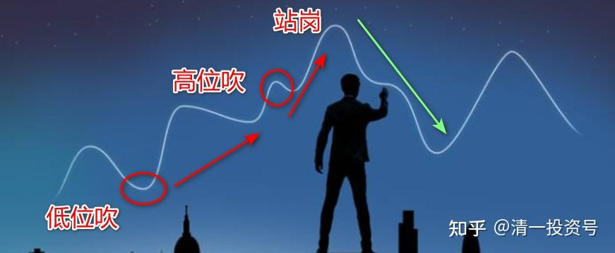
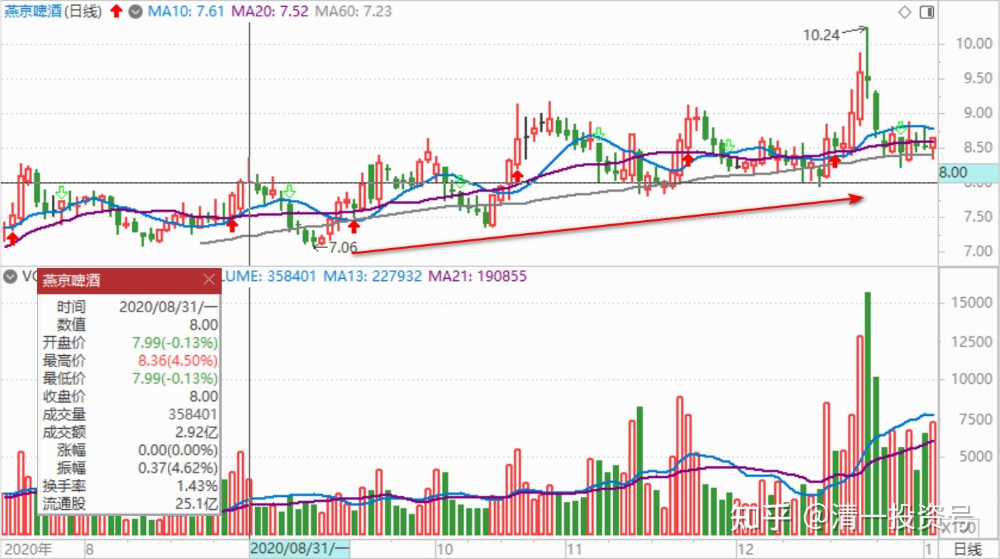
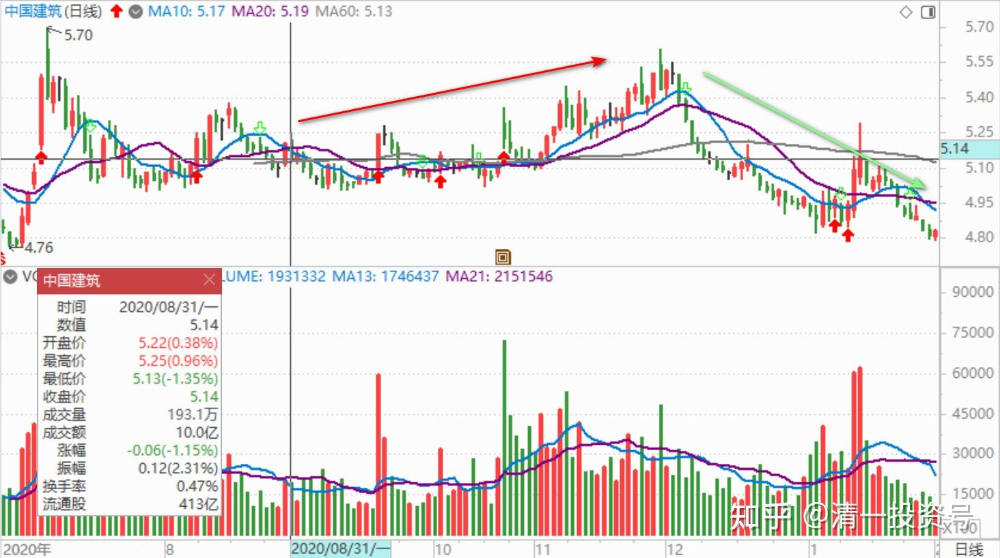
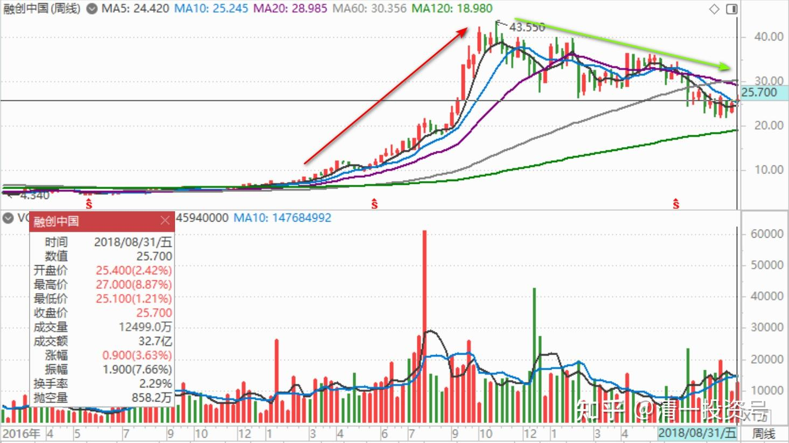

38篇.低位吹票和高位吹票

清一山长 2020年8月31日

花甲老头 发布于2020-08-31 01:16

《[建议亲戚买房最后恩断义绝，你还信推股票的？》](http://link.zhihu.com/?target=https%3A//xueqiu.com/6594360415/158022798)
[这件事情在我的心里像一根刺一样，很多年过去了还是不能忘记。我并没有财务上的损失，只是人性放大的丑恶是我无法面对的。很多人... - 雪球(xueqiu.com)](http://link.zhihu.com/?target=https%3A//xueqiu.com/6594360415/158022798)

清一山长2020-08-31 14:48:51（跟评上文）

说话听音：楼主显然认为中建并不值得投资，虽然也不太烂[笑]。不过我一两个月前已经买了中国建筑。如果赔了，我认我自己投资无能。不怪别人推荐和介绍中建。我不认为是别人因为自己套住了，要让我来帮助解套接盘的。我这点小钱，解个毛套。中建的盘子太大了。没人有这个实力，除了AB。

不过，我认同贴主的观点，也感谢帖子分享的故事。世界上，就是有很多这么无耻的人存在。他们半点亏都不能吃，半点便宜都要占。你如果跟他在一起，就必须永远担保他们不断赚钱，还要赚钱比你多。万一亏了，你就是罪人。尽管你也亏了。虽然你知道以后会回来，不担心。但这些人的担心、攻击、谩骂，就会毁了你的生活。

但贴主从此就不相信所有人，也极端了。林子大了，什么鸟都有。这世界上，什么人都有。有不要脸的人，也有自尊心很强的人。都有。关键是我们要选择跟什么人做朋友，以及我们要拉黑什么人！我们需要有更高的处世技巧，而不是只会埋怨人心不古。这样，只会让自己陷入低落的心情，解决不了任何问题。很划不来。

对了，多说一句话：如果我买了中建、燕京啤酒，**我是盈亏自负的。**万一也有人跟风我，去买中建、燕京的话。我要提醒你注意——我是反向指标，往往一买就跌，一卖就涨。请注意不要跟我的风，会赔钱的。我不是主力，管不住股票的涨跌。我也不是带头大哥，负责帮你们“打家劫舍”。我只是在雪球分享我的投资心得，不构成投资建议。您爱买不买的随意！我为我的投资负全部的责任，跌了，该我自己承担亏损，不怪任何人；涨了，也不会认为是我的本事大，我认为是我的运气好！

花甲老头回复清一山长:

[可怜][可怜][可怜]片面了，很多人让我分析股票都说了这个，**利润可以，基本面也可以。**但是他们跟着买和自己了解后买入是两码事，如果可以对中国建筑了解到您的地步，这些朋友不会再来拿着这个票来问我，说明他们自己还不坚定，买入的理由就是大佬说好，但是为什么好他们可能不清楚。文中希望每一位投资者投资一个公司，都是出于自己的理解和认知，不能因为别人所说的去买。是这个意思 [害羞]

清一山长2020-08-31 22:39:14回复花甲老头:

同意您的看法，**是否买入要依靠自己的投资逻辑。**不过难处就在于：大多数人其实没有思维判断力，无法做到您说的基本要求。投资逻辑的建立，说起来简单，其实是很难的。如果每个人都有自己的投资逻辑的话，中国股市就不会这么“精彩”了。谁让中国教育就不教思考呢？

所以，我如果看到一些确定性比较高的机会，就会多说几句，让相信我的粉丝们有机会赚点稳定可靠的钱。2013年～2014年上半年，我一直在嚷嚷，让周围的大家可以买股票了，买大蓝筹。我买了什么，也大方地告诉别人，成本价多少很明白。当时我唱票最多的，就是让大家去做“招财猫”，买入10元的招商银行睡觉去。

2015年以后，就不太说买股的事情了，更不鼓励融资。因为涨高了。反而被一些人笑话我“老了，过时了”。特别是2018年年初，我高价19元多，退出了兴业银行后，再度地买入新股票，就不多说话了。**当时怕美国崩盘带垮中国。就只敢买消费股，抵消不良影响。**我重点是酒股，比例很大，白酒、啤酒，尤其是啤酒，但对外说的并不多，怕误导人。顺鑫农业，19元买后持有两年多，并没有大力“吹票”。惠泉买入后，当时也没吭气，是当上十大才曝光的。原因就是这些说不清楚的股，分红，经营不够确定的股票，少说。风险自己担。

现在说中建多一点，是认为5元的中建，涨不涨，什么时候涨，不好说。但要跌破五元，我看也很难。安邦就算不断出货，也最多就只打到五元前后，承接力算很强的了。安邦出中建，也很怪异。明明持有高价的招商，几百个亿市值，已经涨了这么多，干嘛不卖掉招商？非要低价压着中建出货，低价赔本卖？缺钱也不能这样干？而且显然不是缺钱的问题。所以——我就敢于反向而行，大概率差不了。**反正5元的这个底部，持有拿股息也勉强过得去了。将来赚是肯定的。**多少不好确定。**所以，我买中建的时候，就大声说出来。希望让人多赚点钱。这股没法操纵的。**估计中建涨了，我就没啥好说的票了。

一个人，不能看他是否分享股票来区分好心还是坏心，就看是什么价位。**如果是低位吹票，保险系数大的股票，分红率高的，大概率是真的自己看好，也想让别人赚钱的。如果高价吹票。大概率就是收割韭菜了。**我5元买了融创，涨到40多元的时候，看某兵到处大吹融创，说要到88.48元，就忍不住出来说了几句话，意思就是这个价位吹票，容易误导人，看好的可以继续持有不卖，新买入的话，风险还是很大的。结果马上就被他拉黑了。我倒是不认为融创一定涨不到80元，而是认为：5元的时候，使劲唱票可以（也没见他5元出来唱票的），40多元再来唱票，就算将来涨到80元，恐怕中间的波动，就会造成很多粉丝破产。后面真跌到了十几元。现在又起来，30多了吧？就算是茅台，1700元吹票的人，我看居心也不良好[大笑]。

(标题、图片为编者所加)

**文章音频**：

[392篇.低位吹票和高位吹票_清一投资号文章同步音频](http://link.zhihu.com/?target=https%3A//www.ximalaya.com/sound/683632495)

**参考链接：**
[12篇.早期珠江啤酒、燕京啤酒的换仓记录](https://zhuanlan.zhihu.com/p/602033762)

[13篇.买卖操作后的富足之心](https://zhuanlan.zhihu.com/p/604162057)

[14篇.珠江的破位急跌，名曰跌停进货法](https://zhuanlan.zhihu.com/p/606062514)

[22篇.它很可能是下一个重庆啤酒](https://zhuanlan.zhihu.com/p/645392522)

[23篇.危机时刻好公司不用担心](https://zhuanlan.zhihu.com/p/646998882)

[24篇.守住筹码很不易](https://zhuanlan.zhihu.com/p/648860208)

[25篇.筹码收集完毕，正在养股](https://zhuanlan.zhihu.com/p/650255857)

[26篇.现在最应该做的，就是稳稳的做好轿子](https://zhuanlan.zhihu.com/p/651196882)

[27篇.股票交易风格与伴侣选择](https://zhuanlan.zhihu.com/p/653139189)

[28篇.看图要反着看](https://zhuanlan.zhihu.com/p/654521213)

[29篇.行情还没完，后面还有大机会](https://zhuanlan.zhihu.com/p/655878269)

[30篇.给做短线人的建议](https://zhuanlan.zhihu.com/p/657061174)

[31篇.股票也分贫富，贫富会换位](https://zhuanlan.zhihu.com/p/658569494)

[32篇.主力志在长远](https://zhuanlan.zhihu.com/p/659254835)

[33篇.宁愿套牢也不想踏空](https://zhuanlan.zhihu.com/p/660596526)?

[34篇.我的投资不需要别人来打气](https://zhuanlan.zhihu.com/p/661931571)

[35篇.明显是市场的错误定价](https://zhuanlan.zhihu.com/p/663378280)

[36篇.研报的几点信息](https://zhuanlan.zhihu.com/p/664613658)

[37篇.啤酒生意不简单，不是投钱就可以弄](https://zhuanlan.zhihu.com/p/665812265)
