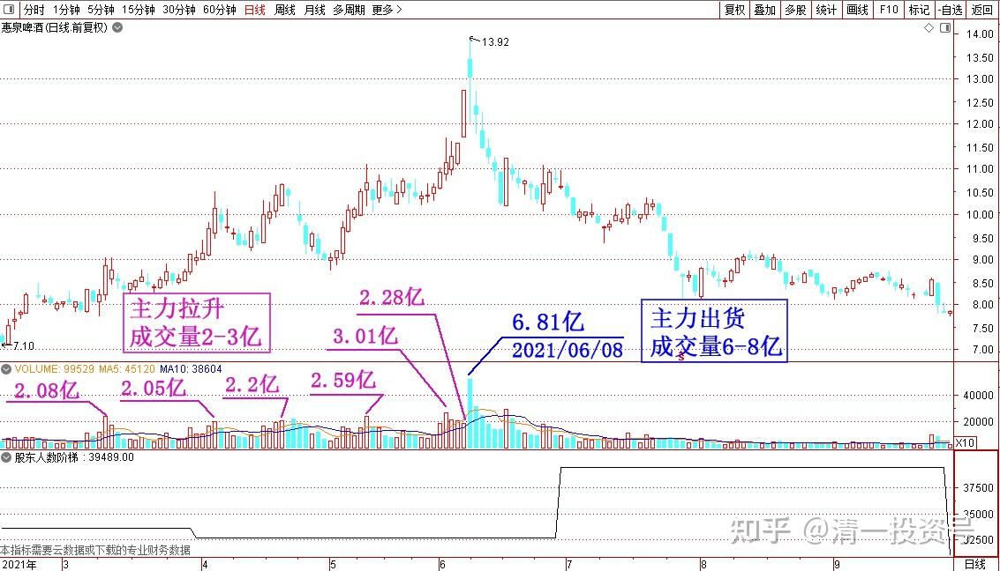
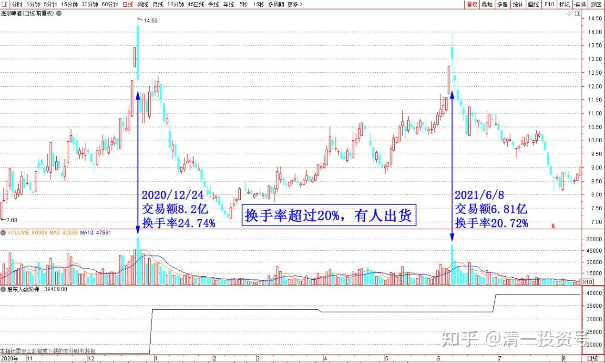
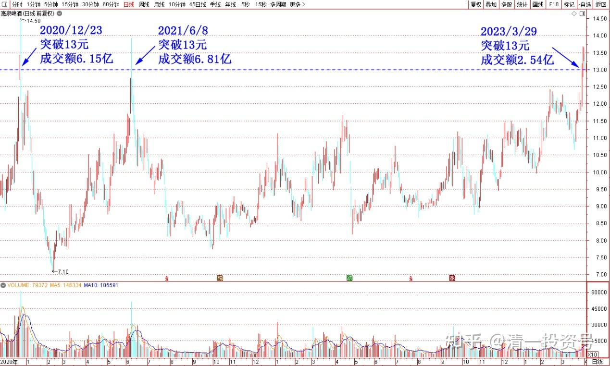
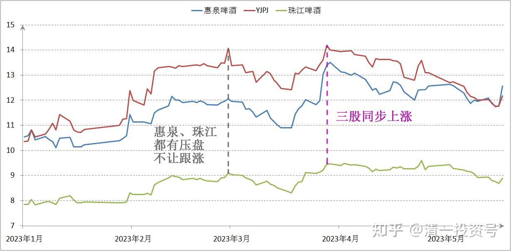

51篇.今日啤酒股普涨，盘后总结和思考！（配图版）（上）

清一山长 2023年3月31日

昨天比涨停价低一分钱，13.17元卖出了13万股惠泉，以9.19元换入13万股珠江，一比一换股玩。今天惠泉继续涨，收盘13.39元。换入的珠江也涨到9.44元，应该不算换亏了。只是我有点纳闷：昨天如果多涨一分钱拉涨停，我至少愿意放出200～300万股。这些股，看今天这架势，肯定就是补不回来了。T飞了。为啥主力昨天就是不愿意多给一分，拉涨停让我下车？为啥主力今天要大大方方的涨过涨停价，每股多了0.21元？不等于一天就白送我60多万吗？

其实，如果不拉涨停，盘面的价格都是虚的。因为我肯定不可能以这个价格，轻松卖掉手上的筹码。看买卖排行上，都是一个一个甚至是个位数的小单子。卖压大了，股价就掉下去了。盘面上，没有看到主力的出货迹象，因为他根本就没有出货。主力只是在小心翼翼地维护股价上行，拉一拉，吐一吐。尽量维护股价上行通道。做起来也不容易，我也别讨人嫌，偏要抢着出货，抛给主力拿货，占主力宝贵的流动资金，破坏上行走势。我就这样，看他慢慢维护上行趋势线，慢慢走上去好了。以后，**我会跟主力一起，等待散户们热情洋溢的冲进来，这时候盘面极其活跃，成交踊跃，此时才能出货**。本质上，我赚到的钱，是散户出的钱。但能力上，我是沾了主力的光。我如果太贪心，吃了饭不肯走，想要占尽便宜，可能会被主力反手做掉。所以我争取早一点溜走——起码比主力更早溜走。由于量大，恐怕需要有机会就慢慢地抛。别想一天之内就走掉——除非涨停！

什么样的迹象就是主力出货了？如果用惠泉来作为标准的话，日成交量必须达到6亿以上，才能判断主力开始出货！现在还完全没有主力出货的迹象。都是散户在跑跑跑。主力吸货的时候，成交量低迷。一天只有数千万。**主力拉升的时候，成交开始活跃，成交量2～3个亿。主力跑路的时候，成交量6～8个亿**。这是正常情况下的判断。不正常情况，大局不利，有意外发生，就不一定按这过程走了！

昨天的价格，差一分钱，性质是完全不一样的。涨停收盘的盘面语言就是“秀身材”——看看，老子不差钱，就差股。你们有股，全都卖给我，哀家全收了。【我一般喜欢反向做，一看盘面上大声做多，我就跑了。我信不过庄主的话！】

如果昨天明明能涨停，但就是不涨停，差一分就不肯涨停。尾盘股价还慢慢地掉下来，弱弱地收尾。这种盘面语言就是“示弱”，表示“小老儿能力有限，拉不了涨停，实力不足，不如赶快趁现在给的价格还好，赚了钱就走吧。别贪心！”！走势，往往与盘面语言相反。今天已经验证昨天的确是装怂！不过——**昨天冲涨停的换手率，如果超过20%，就是有人出货了**。实际上才7点多的换手率。可以判断是低位筹码被换走了。真正的拉升在后面。

今天，惠泉稳稳当当地走向新高——当年惠泉没站稳的13元高峰，现在看起来根本就不是事儿（当年冲13元关口，成交破7个多亿）。多费力呀？今天才两个多亿成交额，就轻轻松松站稳了1339高地。根本就是毫无压力就过了1300压力线。当年冲13之前。蓄势很久，我都等得着急。现在漫不经心就过了。这种盘面，就可以肯定地说：**现在13～14元，不再是惠泉的顶部了！只相当于两三年前的10元重心地带**。证明啤酒股的重心已经上移。所以不用操心着急的走。主力昨日的盘面示弱，其实是很强。不用害怕！

另外，今天的YJ也很有意思，再度回到14元多的前高位置。盘面语言就是在表达：上次开研讨会，就已经说过燕京潜力无限，你们都来抢筹码，一下子就破了14元的高价。哀家怕你们成本高了，利润少了，寡人就故意的出头，压低股价，破了前期做的长期平台位置。给你们机会，可以在比平台价格更低的好价格拿货，大家一起赚钱。我已经给了这么长时间，让你们补仓，都打到12元多了，这么便宜的低价，你们还有人不满足，还想继续观望等更低？真贪心——现在没机会了，上新高了！现在你们要货，12元的肯定没了。13元的也没了。只有14元的，你爱要不要？不要——以后也没了！将来就只能拿15元的了！

这盘面语言不复杂，害得一路观望的人，看懂了语言的人，怕被主力丢下车，直接飞了。只好急急忙忙地上车。今天的成交量不小，四个多亿了（其实也不用太担心，这个量能，只相当于惠泉日成交7～8千万的水平，不算多）。除了自然的散户浮筹，按道理也有不少是主力换庄给的货。昨天的涨幅不小，相对上一次突破14元7个多亿相比，成交量少了很多，显然筹码锁定良好。但从走势上看，没有主力主动给货的痕迹，一路上行无回调。直接从原来的13.6元平台区域，涨到了14.19元。从这个走势来看，周五继续涨引领是趋势。所以我认为下一步应该是冲击15元的关口了。也许15元关口，还会有一段时间的整理。

另外，这一次YJ虽然今天是领涨的。但外围环境已经明显不一样了。上次涨过14元的时候，惠泉、珠江都有压盘不让跟涨。当时珠江，记得是依然被强行压在9元上下盘桓。正好让我有机会换股添差价。今天两股都正常跟涨。

前期YJ的下跌，两股也很有意思，就是不跟跌。说明一部分本来看好YJ的资金，跑到估值更便宜、更安全的惠泉和珠江上面去了。啤酒股显然有大量的新资金正在加入，三股基本上就是同步上涨。**整体的环境已经变化，板块的股性激发成功，真正上涨的氛围起来了，容易吸引跟风盘。判断未来啤酒行业的好消息会越来越多。**就像白酒行业，这几年到处都是“上涨共识，业绩优异共识”。给人不买白酒就白活了一样的感觉。未来可能会有“不买啤酒就不会炒股”的共识。坏处就是：我原来喜欢玩三股切换，多弄一些差价的图谋，如果大家都同步上涨，我就无法实现切换套利了。而且——真的热起来了，我就该慢慢消失了。白酒热太快，我全都悄然退出。其实几个热点股票，我都买入过的，酒鬼酒19元买入。泸州老窖、五粮液，都买入过这些十倍股。但都没说啥就走了。走的时候不能说这酒好，不然真害人！我买啤酒的原始资金，其实基本上全来自2014年以来的白酒股的利润和本金。这几年主要是酒水帮忙，不然账面的业绩就难看了。其他股没赚啥大钱！一点银行股还赔钱了，账户这几年能节节高，都拜中国人爱喝酒所致！

——今天的操作，就是14.21～14.22元，卖出了十几万股YJ。**虽然知道以后还会涨，我看多，但不妨我卖一点股票，拿一点现金在手上周转**。但由于现在没发现有啥可以买的，这一点点卖出后的资金，就先放在账上，以后等看有啥机会好了。财不入急门，慢慢等机会。

