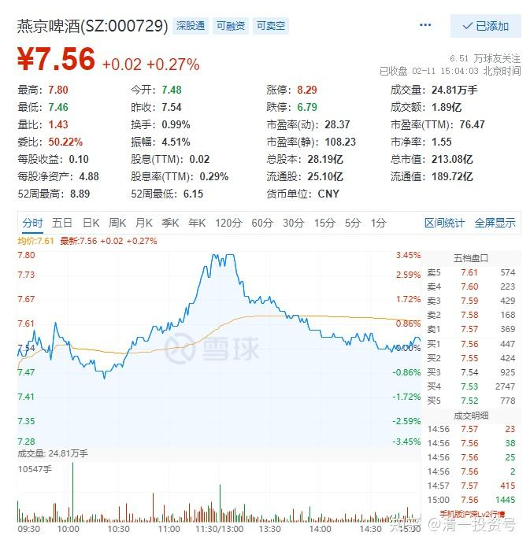
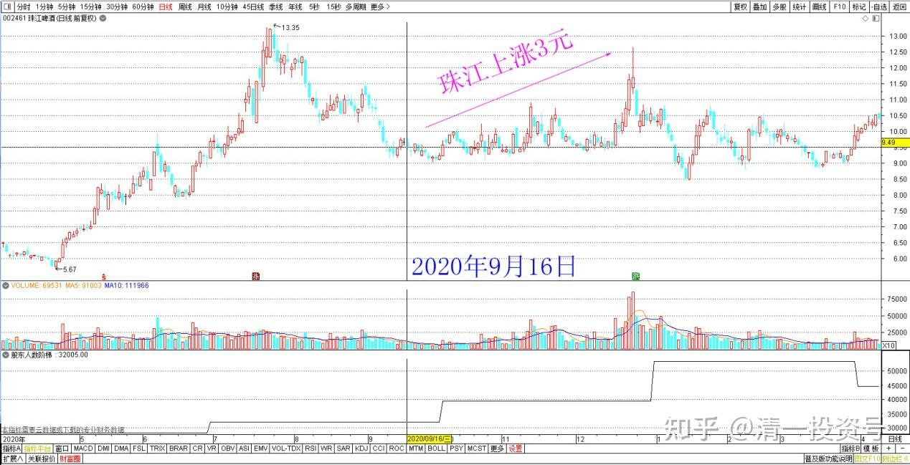
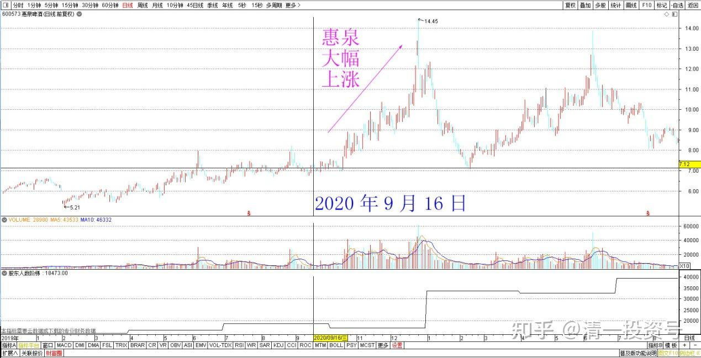
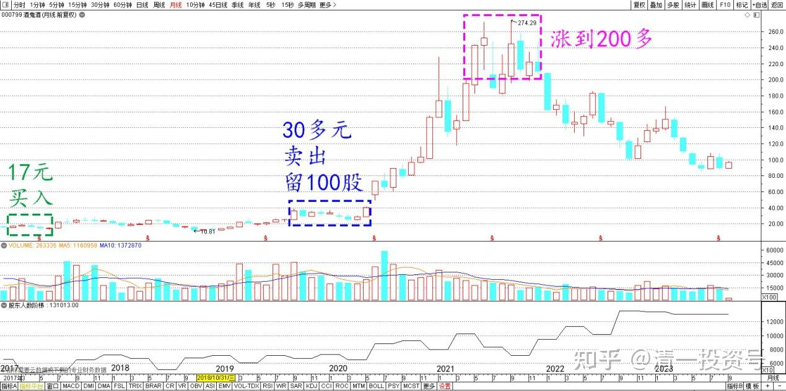

**专篇22.成熟投资者的思考方式**

清一山长 2022年2月11日

今天燕京中午急拉，现在又跌回来，这是在培养散户的惯性——让你们涨就走，不走就活该你倒霉。大家下次就会“长记性”，一看到拉涨，就赶快走了。结果，下次你真走了，可能你就踏空了。燕京这种动作，会不断地做，但越做，你就越不能走。**要学会与市场信息逆反，你才会赢。所以，股市考验的就是你的人心。看不懂，做不到，不如不看盘，起码不受影响。**

所以，你们发现：股市的做T一族，一向就是占一点小便宜，赚上一毛两毛的就高高兴兴的。但最终是吃大亏：一旦涨了，两三元就丢了。一旦大跌了，十元二十元就没了。一年多前（2020年9月16日 见附录），有个傻子，天天在雪球示范他做T珠江啤酒和惠泉啤酒。每次T上两三分钱，甚至一分钱就秀出来。我看着实在糟心，就出来骂了他一顿，拉黑了。没过多久，珠江、惠泉都涨了三元多。这种人就是呆子、傻子，还以为自己最聪明。

其实，**来炒股，就要记住：我们才是傻子，是羊；主力才是聪明人，是狼。**我们的一举一动，他都能看见。这叫做**弱者体系**。**要承认自己是弱者，知道自己信息、能力、实力等等都不足，就会采取自我保护措施，吃亏也不吃大亏。**就像你是一头肥猪，其实也没关系，老老实实地呆在猪圈里面，起码一生过得还算舒服。但你想去草原上跟狮子一起散步，一起用餐，就是太把自己当回事情了。这是大象级别的动物才能做的事情。你去这样玩，就是去找死的。可惜，股市上，这种自以为是的人太多了。

**我每次买入股票，都在想：我万一买错了，能不能接受？能接受的股票，我才买。不能接受的股票，我就不买。**所以，**我绝对不买高位的票**，再好都不买。比如茅台。就算看好燕京、中国建筑、中国中铁，我依然不敢高位买，甚至低位我敢买一点，我也**不敢满仓满融单吊一只股。**为啥？万一我错了咋办？**每次一旦操作，都在想：“错了我也能接受结果”，你才是成熟的投资者。**比如燕京冲高回落，你别想：我高点就卖掉，低点再接回来，每天T他几万块钱多好。而要想：**我卖掉后，如果继续涨，我能够接受吗？我能找到替换它的股票吗？**如果你能接受，你就卖好了。继续涨多少，你都不揪心。不然--—你就只能一辈子活在懊悔中。

酒鬼酒，我原来是17元买的，涨到30多元，我觉得很不错，就都卖了，留了一百股做纪念。结果——他居然涨到200多去了，我没有啥遗憾，只说：**这些钱不是该我赚的**。当然，我拿着一百股，也可以天天吹：酒鬼酒我还拿着，已经涨了十几倍了，看我多会买。这就是死要面子了。我从来不说酒鬼酒，为啥？买入的时候，我不知道为啥买，我没有重仓的理由。只是觉得这个价格很便宜，买了跌下去我也不怕，不会垮的。后来卖出的时候，虽然赚了钱，我也不知道咋赚的，所以，我有啥好说的？说出来对别人也没帮助。

酒鬼酒月线

燕京虽然拿这么长时间，看起来没有涨，但我的账面利润是8位数，已经足够了。比酒鬼酒赚的还多很多。因为我看得更懂一些。**所以我们只能赚我们看得懂的钱。**说不定，将来燕京会创一个我的个人记录，让我赚9位数呢！天知道会不会。**我也不追求这个结果，随缘就行了。给多给少，都是天意。我是否每天都认真做好了自己的事情，才是人道。**

附：

清一山长 2020年9月16日

[$珠江啤酒(SZ002461)$](http://link.zhihu.com/?target=http%3A//xueqiu.com/S/SZ002461) 什么叫做T？这段时间，总一直看到一个“高手”，在我持仓的几个啤酒股上做T，几乎每天都要分享一下他的操作，花名还是一个武侠的名字。如果这人是真高手也就算了。问题是：他的示范毫无价值，简直就是垃圾。自己经常T飞。他每次做T，有个三分钱，就赶快T了。做成了，还得意洋洋地分享出来。燕京他做了几次，每次赚了几分钱。然后，就T飞了，眼看燕京涨了几毛钱。这伙计，就又跑来珠江“示范T操作”，结果又被套牢了两毛钱。我看的实在是扎眼。就直接拉黑了。为了保护我的眼睛不受污染。我认为，长得丑，就别出来吓人了。要分享，一定要看你的分享是否能够帮助大家，否则就是制造垃圾。我一看到制造垃圾的人，在我看的股票页面上，就会拉黑。有时我一页只看到两三个评论，我纳闷为啥？因为其他被我拉黑的帖子，都不出现了，所以看起来就稀稀拉拉的。这样真好！

这种几分钱的T，做起来难度极高。我知道有一些短线高手在做。面前放着8台电脑，专门的操作软件，要一键进出。最快的时候，我一个朋友告诉我：他的两笔相反的买卖，是同一秒成交的。两分钱，他们都可以设法搞到手。每天清零，坚决不持股过夜。全是T加零。每天不增加股份，也不减少股份。他们不投资股票，只是拿账户来做差价。高手的话，一天挣个几万，也没问题的。不过要超过十万，就很难了，所以这种买卖有头寸限制。仓位大了，没办法T的。所以不适合大资金来做。拼的就是力气活。他自嘲——他们这群人，提高了股市的流动性。

说实话，他这本事我可没有。但我赚的比他多。我做T，都是大头T，利润超过10%我才做。少了我觉得没劲做。

小散户，来啤酒这里做几分钱的T，难度极高，基本上就是亏本正常，套牢正常，但赚钱不正常。有钱你也赚不到。为啥？你判断正确了，只赚两三分钱。如果你判断错了，亏多少？啤酒一天上下几毛钱。**只有看准趋势，做长波段的T，才是可以赚钱的**。你们已经看到我惠泉8.04卖出后，直到7.11买回来的了？T了93分。这种T，才过瘾。一次搞到你几十次都搞不到的利润。

再比如：珠江我9元多走了一批货，T飞了。我就放弃，去买入燕京了。这些燕京持仓，已经赚钱了。珠江最后在13.55元，我卖掉了一批货。跌到11元我才买回来，这就是T成功了每股两元多的差价。现在跌破10元，我该笔买卖亏不亏？没亏，只是少赚了一元的差价罢了（跟我持仓不动相比），我如果耐心等到现在，利润更高。但如果你11元一样跟我买入，你就亏了1元多。

再给您示范一个高级T的例子：

今天，我开始回补我泰国卖出的股票，今天买回来KBANK。我是5月初买入的，买入价85B。六月份高点卖出的，卖出价116B附近。已经卖出几个月了，我的数千万资金，就一直躺着不动，一直在等机会。我公开说过的，我认为下半年，会给我有机会补回的。这股我卖出以后，就慢慢开始跌了，我一直耐心等着，一直坚持不动，跌了10元不动，跌破100不动，跌破90还是不动。今天跌破80了，我开始补回了。补回的价格，是79.75元。我挂单就放着，自然成交的。今天买了两千多万的货回来。差价多少？超过36B。现在我的成本，每股扣除赚的利润，只有40多。我认为他不可能跌到这个价。

如果我不做T，一直死守在现在，我的这笔投资是亏损的，因为现在创了新低。当然，我买入的时候就准备了亏损的，这个股，是从230的高价跌下来，我85左右买进，已经是打了三折的价格了、而且是十年来的最低价。上次08年的金融危机，才跌破过这个价。所以，我拿在手里之后，她跌到50，我也不会放手的。不放手，我就不会亏。**每年拿利息就可以了。没想到，一个多月后，她奇迹般的上涨了，所有的银行股等，全都上涨了30%以上。我一看：不跑白不跑，长持变做短T，就赶快卖掉了。没多久，就下跌了。**

为啥我要卖掉？因为泰国经济一两年内，没有反转的可能。甚至我认为下半年经济会更惨。所以我才不跟涨，反而把泰国人惶恐时候低价卖出买进来的仓位乘机反手卖出，**一个多月，就赚了五年的利息。我可以继续持有五年，没利息都安心了**[大笑]。（实际上它依然会跟我发利息的，泰国股票利息稳定性很好）。我算过：仅仅靠这批股票的利息，我的团队成员，就可以在泰国正常生活下去了。所以，股票赚不赚钱就不重要了。关键是持有这些肯定不会倒闭的，可靠的泰国上市企业。

我在国外生活，原来一直靠国内的资金过日子，现在开始，我可以靠泰国的投资过日子了。用泰国赚的钱在泰国生活。我认为只有这样，才能“扎根海外”，而做股票，是最容易进入海外的方式。而且受欢迎！（去打工是非法的，他们不欢迎外国人抢泰国人的工作，我就利用泰国人帮我打工好了[俏皮]）。

文章音频链接：[https://www.ximalaya.com/sound/664863819](http://link.zhihu.com/?target=https%3A//www.ximalaya.com/sound/664863819)

**参考链接：**

专篇1 [306篇.前缘1.雪球的最后一贴--胜利曙光都已经出现](http://link.zhihu.com/?target=https%3A//xueqiu.com/2017773236/247159187)

专篇2 [307篇.被特别关照的股--前缘2](http://link.zhihu.com/?target=https%3A//xueqiu.com/2017773236/247387457)

专篇3 [308篇.立此存照--前缘3](http://link.zhihu.com/?target=https%3A//xueqiu.com/2017773236/247580614)

专篇4 [309篇.见识传说中的拖拉机账户](http://link.zhihu.com/?target=https%3A//xueqiu.com/2017773236/247973779)

专篇5 [310篇. 拉升在即](http://link.zhihu.com/?target=https%3A//xueqiu.com/2017773236/248351982)

专篇6 [311篇. 进入右侧投资时代](http://link.zhihu.com/?target=https%3A//xueqiu.com/2017773236/248658236)

专篇7 [313篇. 小主力进货的阶段](http://link.zhihu.com/?target=https%3A//xueqiu.com/2017773236/249221851)

专篇8 [316篇.两轮回调对比](http://link.zhihu.com/?target=https%3A//xueqiu.com/2017773236/249675370)

[专篇9.主力的水军](https://zhuanlan.zhihu.com/p/619400004)

[专篇10.主力完成筹码收集](https://zhuanlan.zhihu.com/p/629948708)

[专篇11.主力、游资、右侧投机客纷纷进场](https://zhuanlan.zhihu.com/p/631628731)

[专篇12.进入震荡期](https://zhuanlan.zhihu.com/p/633057526)

[专篇13.永远回避风险，不亏损第一](https://zhuanlan.zhihu.com/p/635191087)

[专篇14.高位十字星缩量及主力操作的三个阶段](https://zhuanlan.zhihu.com/p/635191930)

[专篇15.准备起跳](https://zhuanlan.zhihu.com/p/636886203)

[专篇16.大幅回调，老手加高手](https://zhuanlan.zhihu.com/p/638552635)

[专篇17.股东数所传递的信息](https://zhuanlan.zhihu.com/p/639002631)

[专篇18.突破9元是燕京的基本目标](https://zhuanlan.zhihu.com/p/640000051)

[专篇19.YJ、惠泉今天盘面语言对比](https://zhuanlan.zhihu.com/p/640550916)

[专篇20.暗示洗盘快结束](https://zhuanlan.zhihu.com/p/641509884)

[专篇21.现在是新主力的成本区](https://zhuanlan.zhihu.com/p/642330561)

**

**
