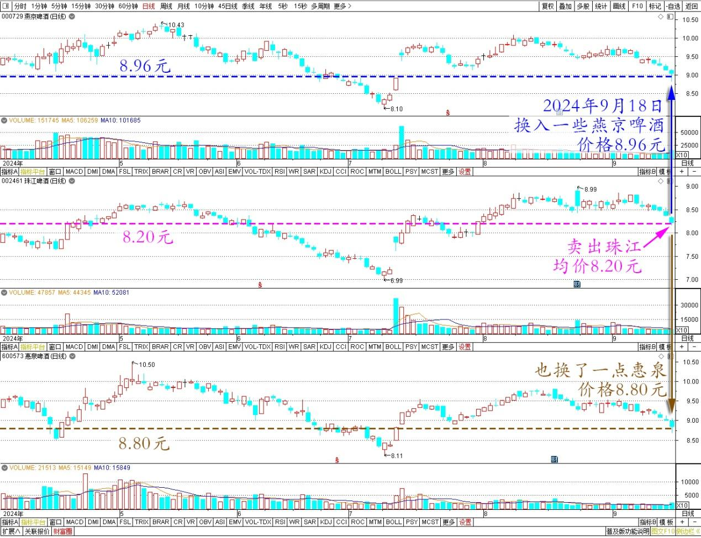

100篇.股市不景气，但一股没少

清一山长2024年9月18日

今天挂单换了一些燕京啤酒，是8.96元买入的。用的资金是卖出珠江换的，卖出均价8.20元！8.80元的惠泉也换了一点！

燕京、珠江、惠泉啤酒2024年4月～9月日线图

**股市不景气，跌了不少。不过我的股份一股没少，还多了一点。所以没啥好担忧的！**

标题、图片为编者所加）

**文章音频**：（

[483篇.股市不景气，但一股没少](http://link.zhihu.com/?target=https%3A//www.ximalaya.com/sound/758775653)

**参考链接：**

[90篇.珠江换燕京，天山换华菱](https://zhuanlan.zhihu.com/p/710097153)

[91篇.珠江喜迎涨停，换燕京和惠泉](https://zhuanlan.zhihu.com/p/711439700)

[92篇.差价0.9元，珠江换惠泉](https://zhuanlan.zhihu.com/p/711415396)

[95篇.差价8毛多，珠江换惠泉](https://zhuanlan.zhihu.com/p/712702963)

[96篇.守低位风口，不天际追高](https://zhuanlan.zhihu.com/p/717712671)

[97篇.差价7毛多，珠江换惠泉](https://zhuanlan.zhihu.com/p/717710915)

[98篇.从消费数据看酒类投资前景](https://zhuanlan.zhihu.com/p/719002561)

[99篇.卖出珠江逢下跌，补回燕京和惠泉](https://zhuanlan.zhihu.com/p/720736786)

