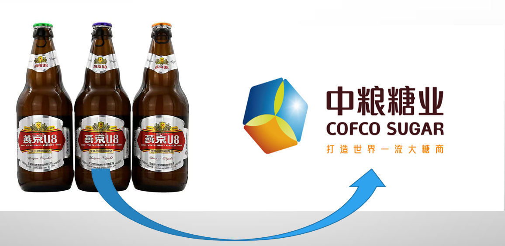
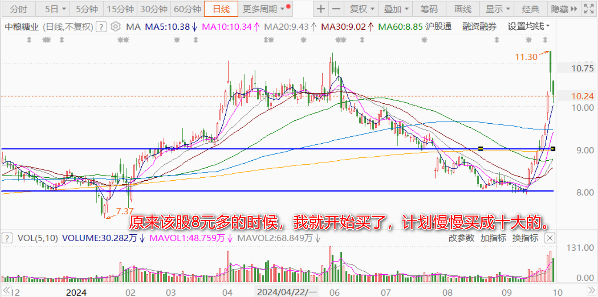
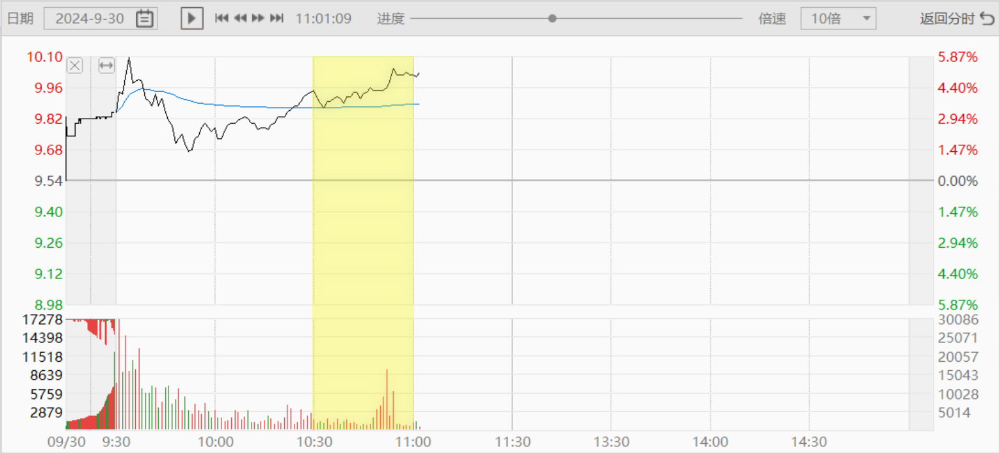
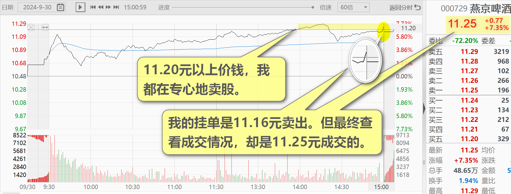
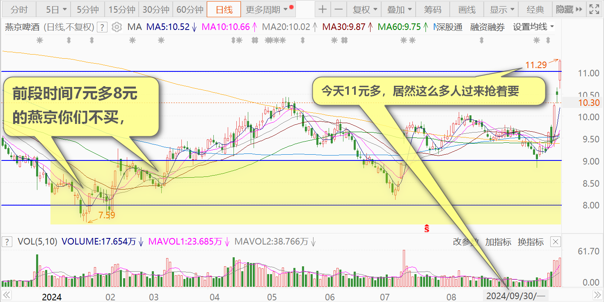
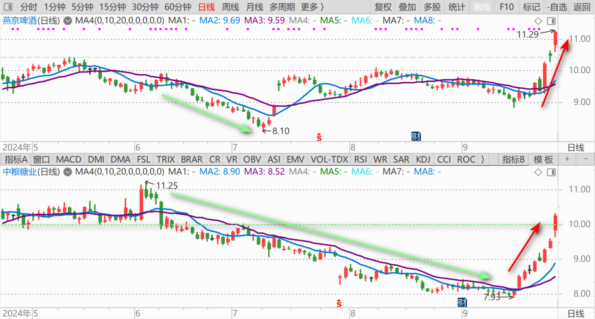

107篇.用高价卖出的燕京换9元多的中糖

清一山长2024年9月30日～10月1日

**一、用高价卖出的燕京换9元多的中糖（2024年9月30日）**

今天股市太疯狂了，我的个人账户市值创新高，单日浮盈也创造了新纪录。

一大早我看市场，明显是抢筹行情。害得我都不淡定了，上午赶快下手，把一只心仪已久的，曾经的德隆系控制的大牛股，买了一百多万股进来，砸了一千多万元进去。**原来该股8元多的时候，我就开始买了，计划慢慢买成十大的。**

哪里想到现在会这样涨上来，都不给我机会。上午10:30以后，我看中粮糖业（SH:600737）9元多，有冲过10元的迹象，但有一些千手压盘压着买货，我就把这些压盘买掉了。买完之后，马上又冒出来了千手卖盘，所以我继续买，看你有多少要卖了。**这样短期内，我就吃掉了一百多万股！**大家看10:30到11:00有成交量放大的盘面，就是我干的！接下来，我看它就跳到10元上去了，就停手不买了！

**我是不追高的，如果我想要的股涨了，我往往就放弃买入！**虽然错过了一些赚钱的机会，但也避开了很多被套牢的机会。今天行情上涨太突然，我被迫追高买入了这么多，心里还是无法接受。所以——我在下午，就开始平仓了——用我的燕京啤酒来平仓。正好已经涨过11元多了，当然就开启卖卖模式了。11.20元以上价钱，我都在专心地卖股。但我最吃惊的是，快收盘的一笔账刷新了我的观念。由于马上收市了，我还没有冲抵完今天的买单数量，所以——我在2:58分，就追单6位数的卖单。由于看到盘面显示是11.17元，我的挂单是11.16元卖出。但最终查看成交情况，却是11.25元成交的。**最后一分钟，居然主力拉了9个价格档次扫货，可见市场的热络程度！**主力比我想要的价钱还多给了上千元的礼金。我今天就拿来买东西送给学生食堂去吧！

我挺奇怪的——前段时间7元多8元的燕京你们不买，你们要等跌到5元才买。我就一直慢慢地收集，燕京买到要吐了。今天11元多，居然这么多人过来抢着要，你们真是太有趣。

便宜都不要，贵了才要？是不是中国人的钱太多了？我当然只能随缘——你们要，就送一点出去！不贪心，不跟你们抢。有人要，我就放一些货出来（我早上抢的中糖，也是别人“不要”，送出来的货。我可没有一路高挂追着买。看早上盘面，有人大量压单卖货，我正好想要这些股，才高价换股换进来的——用我下午高价卖出的单子来换的，所以算是平等交易）。将来市场无论涨跌，我都很划算。万一两只股都跌了——我新换的股，分红更多。我死拿在手上，比死拿燕京更划算。如果涨了——反正大家都一起涨，我肯定也不亏！我不会因为看到燕京涨了，觉得今天卖出去就吃亏了！**涨跌我都开心！**

**二、股票的套利空间：有利于大资金（2024年10月1日）**

**股票的套利空间：有利于大资金。**

企业股票回购专项债的利率，仅仅只有1.75%，那么大概率这个中国版TSLF的资金成本大致不会超过2%。而现在沪深300的加权股息率在3%，而总体红利板块的股息率接近5%。所以这个工具对于大资金而言，**短期就是一个无风险套利**。当然**随着股价的上涨，这个套利的空间会快速收窄，早上车的早好**，所以你知道为什么外资这两天像疯了一样。

（标题、图片为编者所加）

**文章音频**：

[492篇.用高价卖出的燕京换9元多的中糖](http://link.zhihu.com/?target=https%3A//www.ximalaya.com/sound/766916602)

**参考链接：**

[98篇.从消费数据看酒类投资前景](https://zhuanlan.zhihu.com/p/719002561)

[99篇.卖出珠江逢下跌，补回燕京和惠泉](https://zhuanlan.zhihu.com/p/720736786)

[100篇.股市不景气，但一股没少](https://zhuanlan.zhihu.com/p/722064096)

[101篇.珠江合理、惠泉低估、燕京未来可期](https://zhuanlan.zhihu.com/p/846471968)

[102篇.股票大涨，平掉一些融资仓位](https://zhuanlan.zhihu.com/p/987269048)

[103篇.仓位管理的奥秘：燕京浮盈已回到2023年3月高峰！（配图版）](https://zhuanlan.zhihu.com/p/991766711)
