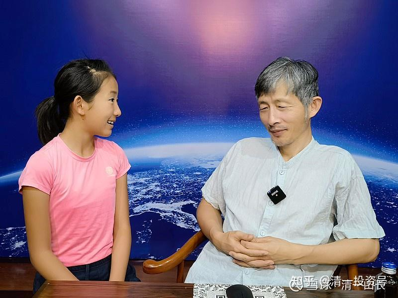
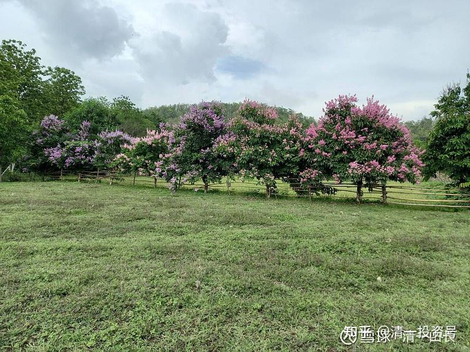

[原雪球专栏](https://zhuanlan.zhihu.com/p/570447582/edit)[159篇.思想肉食动物：超额利润来自于精神的强大！](http://link.zhihu.com/?target=https%3A//xueqiu.com/9310099567/179742504)

清一山长2021年5月13日

今天燕京啤酒划出久违的中阳线，虽然不如大阳线美丽，但已经显示突破在即，惠泉啤酒今天也涨了不少。我重仓押注的这两只股票，今天一天，给我带来了几百万的账面浮赢。

与此同时，我却看到网上报道的泰国的民生艰难：一公斤西瓜，卖2泰铢都卖不出去。

[网页链接](http://link.zhihu.com/?target=https%3A//mp.weixin.qq.com/s/X6gXeu3DG9cSu1AjJu4D2Q)：[https://mp.weixin.qq.com/s/X6gXeu3DG9cSu1AjJu4D2Q](http://link.zhihu.com/?target=https%3A//mp.weixin.qq.com/s/X6gXeu3DG9cSu1AjJu4D2Q)

我实际在市场上公开买到的西瓜，没有两泰铢的价格，大约是6泰铢左右一公斤。一个五、六公斤左右的瓜，大约30泰铢的样子。还有这个帖子——辣椒一公斤10泰铢。

[网页链接](http://link.zhihu.com/?target=https%3A//mp.weixin.qq.com/s/V18e_HySoKcWKuTZZCBIjA)：[https://mp.weixin.qq.com/s/V18e_HySoKcWKuTZZCBIjA](http://link.zhihu.com/?target=https%3A//mp.weixin.qq.com/s/V18e_HySoKcWKuTZZCBIjA)

辣椒我很少买，不过水果买得多，最便宜的新鲜芒果，今年买过5泰铢一公斤的，一般10泰铢一公斤已经可以买到很好的了。

据说，去年疫情爆发后，原来在曼谷、芭提雅等地做服务业的很多泰国人，都回家种地去了。种地的人多了，却增产不增收！种出来容易，卖掉很难。农民都要哭死了，他们**没有思想，没有技能，没有精神上超越他人的优势，就只能出卖体力**（**低端服务和种植，都是出卖体力的不同方式**）。但**出卖体力的人多了，就连亏本卖体力，都卖不出去，这就是底层人的悲哀**。**随大流，一切都跟别人一样，看起来似乎安全，其实人生的危险也太大了。你必须在底层无助的挣扎，生活在绝望之谷，以及苦难之上，常常需要等待别人的施舍和救援，而身边全都是相互倾轧的对手。**

你的西瓜卖10泰铢，我5泰铢，兑现劳动力。你想要10泰铢就没办法，只好卖5泰铢，最终油钱都挣不到。我上次，买了十公斤的黄瓜回家，因为十公斤一袋，才卖20泰铢，一大堆卖不出去，老板着急。我都觉得：不好意思不买，买回来大家凉拌黄瓜，吃得开开心心的。农民们，普通人都很苦。

而这一年多，我在泰国，感受到的却是风轻云淡的休闲度假生活，每天都是非常美好的日子。今年的气候很好，雨季很早就来了，不像去年干旱。物资丰富，环境优雅，我根本没有苦难的感觉。但我身边一些泰国朋友，我能看到他们面对“疫情意外事件”的绝望，以及他们对我越来越谦恭的态度（原来有点傲气十足的，似乎我要求他们合作，今年反过来了）。这就是同一片土地上，你的层级不同，感受完全的不一样。

我相信国内一样——冰火两重天。**思想强大，精神力量强，远远超越他人的人，获得了超额的收获**。而跟随者，盲目乐观，不思进取的傻瓜，这两年应该日子不好过。

而去年到今年，我的股票账户，包括泰国账户在内，都获取了很多收益。可以说，是除了2015年这样的收获大年外，我收获次多的年份。去年泰国的投资，小试身手，就赚了几千万泰铢。

去年利用疫情的恐慌，几乎在最低点买入，赚了一大波票走掉。A股更不用说了，去年到今年酒股大涨。我去年就判断：别的东西都看不懂，消费是必然的通道，所以大量布局“消费股”，虽然目标有点偏，主要布局了啤酒，白酒投资并不多，但总体获利还是很多的。比很多坚守传统产品的人多多了。我看到坚守中国平安的人苦不堪言，看到“某猪兄”私募面临清盘。他们显然在后疫情时代，没有准备好变化，运气也不够好。我幸运地抓住了后疫情时代的“消费股”的必然赛道。

今年，面对通胀，这些“消费股”，依然会爆发更精彩的记录，所以我依旧死拿不放。只把最安全的传统投资品种作为保险使用（毕竟不能孤注一掷）我去年和今年，疫情中干了什么好事？来帮助和建设我们的国家和社会？才赚了这么多钱？其实想想，啥也没干。我就只是玩玩键盘，没有对社会做啥实在的贡献。就像狮子抢了绵羊来吃，其实对社会来说，没啥贡献。天道是平衡的，我对狮子家族，有点小贡献，但牺牲了绵羊家族的利益。

我甚至根本没有对酒厂投入一分钱帮助他们生产和销售，但我取得了比一般酒厂更多的收益。一个人，战胜了一个大型酒厂的收益。（我看年报表，去年惠泉一家上市公司，上千的员工，辛苦努力了一年。企业的年度收益总额，还没我一个人的年度盈利高——甚至不如我去年啤酒股上的盈利多）。

这说明了啥道理？不是我聪明，更不是我努力。而是我**利用了他人的愚蠢，利用了羊群的无知**。有人收获比我更大，虽然惠泉我是二股东，但惠泉啤酒上，赚钱最多的人，我都不知道是谁。其实，我认为：这个现象，说明了一个宇宙真相：**这个世界上，没有啥“公平”可言的。不是努力就有回报，不是勤奋就有收入。**

这是一个思想竞争的时代。**过去的人类，竞争靠体力；现在的人类，竞争靠思想，靠精神**。如果你思想强大，你就能吃掉别人的收获，自己活得好好的；如果你思想弱小，你就被人吃掉。没有啥温情可言。

我的工地上，辛辛苦苦替我干活的泰国工人、缅甸工人，不知道我睡一天的觉，都可以赚到他们一辈子打工，都赚不到的钱。中国工地上的工人，不知道他们喝的啤酒，其实有一分钱要分给我；他们创造的利润，每年都会给我带来几百万的分红（中国建筑）。我不仅仅占用了他们的劳动成果，我还夺走了他们的工资（去买白酒、啤酒喝）。但我没有用体力来抢，没有用暴力来强迫，我用的只是思想，我完全合法地抢劫了这些干活的人。

在泰国生活，我基本吃素，看起来像素食动物。但思想上，我更像是狮子一些，我相信我的思想比一般人更强大。我利用超越平庸人的思想、眼光，收割了中国的股民，也收割了泰国的股民。这些“羊群”，自己把自己的劳动成果送给了我。

《原则》的作者说过：如果你加入游戏，就必须承认规则，你必须同这个世界上最聪明的人同台竞争——**输家付账原则**。**你必须一上桌子，坐在台面上，就要看出谁是傻瓜。如果你居然看不出谁是傻瓜，证明你自己就是傻瓜。乖乖地退出这个游戏，才是唯一的出路。**

我习惯看各种有趣的股票，不管买没买，都想看看，有没有傻瓜。有时候，看懂了，找到傻瓜了，我就下注。偶尔也会看错，会输点小钱。但大多数还是看对了，就赚钱了。如果我的确看准了谁是大傻瓜，可能会下很重的赌注去赌。燕京啤酒的牌桌上，有重阳集团的裘国根，我一直以为他是聪明人，现在依然认为他是聪明人。但我们两个现在走的路，是相反的。如果我对了，燕京啤酒将赚到我投资历史上最多的单股利润，因为我二季度几乎肯定会进入十大。当然，如果裘国根不傻，我才傻，我太自以为是，也许我会落得历史上最大的单笔亏损。目前我的亏损记录，只是单股几百万。燕京会给我带来单股亏损数千万的损失吗？

这是一场博弈，**只有思想强大的人能够生存下去**。**我喜欢思想的强大，我不喜欢放弃自己的头脑，听他人的摆布**，这在现在社会，太恐怖了。周围的聪明人，都要来吃你。**防止被吃掉的办法，就是自己必须变聪明一点。**

我很高兴的是：所谓的现代学校，应试教育，无论中西，都在大批的培养“绵羊”。我培养的思想强大的下一代，可以轻易地收割他们。感谢这个伟大的时代，感谢伟大的工业制式的教育系统。制造了这么多的“绵羊”，“狮子”都不够用！

我对小女的教育，就是天天教她：**身体和思想都必须强大。**因为落后就要被“狼”吃！周围的“狼”群太多了。这就是强者思维，从小灌输。她眼睛看到的很多泰国朋友、我们的员工，有很多的“坏毛病”。比如他们有不动脑子，喜欢吃垃圾食品，损害自己的健康和身体，听不进去好的建议，固执、自负、不进取、不阅读、不学习等等。

我告诉小女：正因为他们有这些不良的毛病，思想上懒散无知，才轮到他们给我们干各种重活、体力活。在40度的高温中，帮我们建房子、种作物，让我们生活得很幸福。如果我们跟他们一样愚笨的话，我们连在泰国生活的权利都没有！连他们都不如，我们只能做难民。所以——为了生存，我们必须思想和身体都强大。

小女目前最喜欢看的书，就是侦探系列。她喜欢看如何识破骗局的书籍和电影。每天6点钟就起来开始早锻炼，肌肉强健。可以把一大箱子总重28公斤的芒果搬起来就走。看样子，将来，可以做一只小“狮子”，而不是无能的“绵羊”。

这是我的小庄园之一角：花开了，很漂亮。这里每年的维护费用20万泰铢以上，养活了一家子的泰国人（园丁）。周末就要开启的新的心理行为课程，核心内容，就是“**什么是精神力量？如何才能提升精神力量？**”。**这是中国唯一讲精神能量的课程**。你在其他地方听到的课程，只是知识，不是精神力的提升。

（以下内容为编者收录）

**评论回复：**

**[月亮未来](http://link.zhihu.com/?target=http%3A//xueqiu.com/n/%25E6%259C%2588%25E4%25BA%25AE%25E6%259C%25AA%25E6%259D%25A5)回复[清一山长](http://link.zhihu.com/?target=http%3A//xueqiu.com/n/%25E6%25B8%2585%25E4%25B8%2580%25E5%25B1%25B1%25E9%2595%25BF)：**

我是羊，跟在狮子后面，不会被吃吧？

**[清一山长](http://link.zhihu.com/?target=https%3A//xueqiu.com/9310099567)[2021-05-13 18:09](http://link.zhihu.com/?target=https%3A//xueqiu.com/9310099567/179760181)回复[月亮未来](http://link.zhihu.com/?target=http%3A//xueqiu.com/n/%25E6%259C%2588%25E4%25BA%25AE%25E6%259C%25AA%25E6%259D%25A5)：**

如果您跟得很紧，一步不拉，总是跟在狮子后面，捞点剩饭吃，基本就没事。就怕您吃开心了，跑在狮子前面去开饭了，就很危险了。一句话，记住狮子会随时转身的，别以为它一直只会低头吃吃吃。看到狮子不吃了，你也别吃了，狮子转身，你也要赶紧转身，别狮子转身，你迎面上去打个招呼，表示友好，你就忘掉了你原来是羊。它会用牙齿提醒您这一点的。[大笑]

**[伏击狙击手](http://link.zhihu.com/?target=http%3A//xueqiu.com/n/%25E4%25BC%258F%25E5%2587%25BB%25E7%258B%2599%25E5%2587%25BB%25E6%2589%258B)回复[清一山长](http://link.zhihu.com/?target=http%3A//xueqiu.com/n/%25E6%25B8%2585%25E4%25B8%2580%25E5%25B1%25B1%25E9%2595%25BF)：**

底下的评论多为吹捧溢美之词，这种让人看了很不舒服的文章底下的评论却是一边倒，仿佛让我看到了一大群崇拜金钱物欲的僵尸。

一个号称读过很多书的人，也天天教导别人多读书的人，却整天泡在雪球上寻觅发财的机会，写的文章也是戾气很重。愚以为无论是知识性文章还是智慧性文章读过之后，会让人宁静有所思才算得上好文章。可清一山长的文章就是大喊：大家来这里挣钱吧！看你们这些傻瓜只有我挣到钱了。看我的儿女上个狗屁大学，不会赚钱上学有啥用，都给我赚钱去。教育女儿说：看泰国那些下人，他们是因为懒惰，愚蠢才做我们的仆人的，你要引以为戒。

在人类的历史长河中，各种领域顶尖优秀的人太多了，谦逊、仁爱是他们的基本素质。不可否认将自己比喻成狮子的清一山长确实赚到了钱，但金融市场的再次分配有何骄傲可言。我知道我发表此文章后，必然会被拉黑，也需如他说：被他拉黑会失去很多发财的机会。但我义无反顾的要说出来，因为捍卫基本的价值观是我的义务，哪怕失去清一山长的一百万也在所不惜。

**[清一山长](http://link.zhihu.com/?target=https%3A//xueqiu.com/9310099567)[2021-5-13 22:46](http://link.zhihu.com/?target=https%3A//xueqiu.com/9310099567/179782315)回复[伏击狙击手](http://link.zhihu.com/?target=http%3A//xueqiu.com/n/%25E4%25BC%258F%25E5%2587%25BB%25E7%258B%2599%25E5%2587%25BB%25E6%2589%258B)：**

[你好虚伪喔！骂别人戾气很重。自己的网名叫做伏击狙击手。连叫军界之王都要伏击。骂别人【天天泡在雪球上寻觅发财的机会](http://link.zhihu.com/?target=https%3A//xueqiu.com/5570911643)】。你泡在雪球上是为了做慈善的？天底下怎么会有这么心口不一，虚伪狂妄之人？看我不顺眼，走开就是。看了恶心，偏要关注我，偏要认真看，你不是找抽吗？为了帮助你心口如一，我就顺手帮您拉黑我自己了。走你！

**[一切有道](http://link.zhihu.com/?target=http%3A//xueqiu.com/n/%25E4%25B8%2580%25E5%2588%2587%25E6%259C%2589%25E9%2581%2593)回复[清一山长](http://link.zhihu.com/?target=http%3A//xueqiu.com/n/%25E6%25B8%2585%25E4%25B8%2580%25E5%25B1%25B1%25E9%2595%25BF)：**

山长，先不说别的，光看图，您是我见过最帅的大爷[笑哭]

**[清一山长](http://link.zhihu.com/?target=https%3A//xueqiu.com/9310099567)[2021-5-13 22:54](http://link.zhihu.com/?target=https%3A//xueqiu.com/9310099567/179782846)回复[一切有道](http://link.zhihu.com/?target=http%3A//xueqiu.com/n/%25E4%25B8%2580%25E5%2588%2587%25E6%259C%2589%25E9%2581%2593):**

一把老骨头了，有啥帅的？我的思想和心灵，倒是很年轻。[大笑]

**[熙娃的后勤部长](http://link.zhihu.com/?target=http%3A//xueqiu.com/n/%25E7%2586%2599%25E5%25A8%2583%25E7%259A%2584%25E5%2590%258E%25E5%258B%25A4%25E9%2583%25A8%25E9%2595%25BF)回复[清一山长](http://link.zhihu.com/?target=http%3A//xueqiu.com/n/%25E6%25B8%2585%25E4%25B8%2580%25E5%25B1%25B1%25E9%2595%25BF)：**

我佩服您的炒股思维，但对您教育的某些方面说不出的反感！不知怎么想起一位马来华侨对我说的，马来人都很懒散，很穷，华侨很勤奋所以华侨一般很有钱！我从他的只言片语里也能感受到贫富差距带来的优越感！这难道不是马来反华大屠杀背后的心理因素吗？现代社会能获取大量财富的人确实有种比普罗大众更能洞悉规则的能力，但并不意味这些规则就是合理的！如果这些规则被财富占有者以律法之名强化下去，导致社会财富更集中在少数人群手里，那么被“精英”们蔑视的“懒惰又愚蠢”的贫穷大众只有用暴力来打破这个规则！如果您是纯炒股的，我就不啰嗦这么多！但您是做教育的，您真的相信那些接受您的价值观的孩子真的将来一定会成长为获取财富又反哺社会的伟大人格的人而不是精致的利己主义者？小时候我们从媒体上被知道李嘉城是多么了不起的励志偶像！但年纪大了才发现，他的发家史也不过是一部垄断史！马云也是如此！也许早期这些人身上确实有很多闪光点，但财富积累到一定程度，没有几个人能做到超然！

**[清一山长](http://link.zhihu.com/?target=https%3A//xueqiu.com/9310099567)[2021-05-14 00:25](http://link.zhihu.com/?target=https%3A//xueqiu.com/9310099567/179787448)回复[熙娃的后勤部长](http://link.zhihu.com/?target=http%3A//xueqiu.com/n/%25E7%2586%2599%25E5%25A8%2583%25E7%259A%2584%25E5%2590%258E%25E5%258B%25A4%25E9%2583%25A8%25E9%2595%25BF)：**

您的**心智模式，就是“有钱人很坏，钱多了就变坏”**。**所以，为了“做个好人”。您不会选择让自己成为有钱人的。当您遇到赚钱的机会，您拥有了金钱，您一定会有意无意地损失掉。因为您的心智模型在驱使您丢掉这些“让您变坏”的钱。特别是大钱！**[大笑]

祝福您一切如意。认为我是坏人，就尽量跟我反着做好了，好人一生平安[献花花]！

**[熙娃的后勤部长](http://link.zhihu.com/?target=http%3A//xueqiu.com/n/%25E7%2586%2599%25E5%25A8%2583%25E7%259A%2584%25E5%2590%258E%25E5%258B%25A4%25E9%2583%25A8%25E9%2595%25BF):回复[清一山长](http://link.zhihu.com/?target=http%3A//xueqiu.com/n/%25E6%25B8%2585%25E4%25B8%2580%25E5%25B1%25B1%25E9%2595%25BF)：**

您没有明白我的意思！您宣扬的获取财富需要的方式和品质没有什么问题！甚至比很多致富法门更有道德感！只是觉得您的教育理念中缺少了一些东西，就是没有引导孩子获得真正的同情和悲悯！其实我也明白这种人文情怀有批评家说是无用软弱的东西！这种东西也不是一代就能培养出来的！但是教育特别是新教育面对的是未来，如果没有一点“超越”的色彩，那和线下读书就是为了找份高薪工作的功利教育又有什么本质区别？我特地去B站看了您推荐的公开课，还没看完，但目前您的教育给我的感受确实如此！这些孩子将来大概率会成为很成功的人，但是他们被灌输的理念也大概率加剧了阶层的隔阂！PS：我没有真正接触过您，所以不想武断地说您是个好人还是坏人。成年人本来也很难用好坏去定义。我长期关注各种新教育，您是我看到的做得规模最大的，难免心目中抱有更高的期待！我不可能成为有钱人，肯定也跟我的“思维方式”有关，性格决定命运嘛！再次说我还是很佩服您的炒股思路！但是告诫球友抄作业还是要多翻几年的贴子，看清别人的成本和介入时间点，不能亏了就来骂被骗了！另外炒股的思路千万条，适合自己的才是对的！

**[清一山长](http://link.zhihu.com/?target=https%3A//xueqiu.com/9310099567)[2021-05-14 10:13](http://link.zhihu.com/?target=https%3A//xueqiu.com/9310099567/179813578)回复[熙娃的后勤部长](http://link.zhihu.com/?target=http%3A//xueqiu.com/n/%25E7%2586%2599%25E5%25A8%2583%25E7%259A%2584%25E5%2590%258E%25E5%258B%25A4%25E9%2583%25A8%25E9%2595%25BF):**

**第一：看不懂，没关系，别出来装圣母，给我瞎贴标签，为富不仁啥的。**

第二：**小女和她的同学们，是我见到的最善良、最有同情心、最不鄙视下层人的“富二代”**。跟国内很多冷漠、自私的学生群体大不一样。他们跟下层人，甚至工人的关系都很好，还会一起干活、做事。经常会送东西，给周围的邻居。每年都会去给泰国人送礼物，今年送了一百多袋米、油给村里的老人，**以节日新年敬老的名义，不以“救穷”的名义**。我们买芒果回家，一般是批发一箱子回来。小女每次都会分送泰国的仆人、园丁，以及周围的邻居。她的**态度，是恭恭敬敬的送人，不是做大小姐的样子**。因为，我告诉她：**穷人有穷人的优点，也有穷人的自尊，我们要尊重他们。而且，世界上穷人最多，没有他们，我们的生活会很不容易。**我每年给几十个学生全免费的供养上学，生活费都我出。没有任何回报我的条件和要求。连感谢信都不需要写。

但是，**同情穷人可以**，但要求小女：**千万不要学习穷人的心智模式。**穷人穷，就因为穷人的心智模式就是必须穷。富人当然会有坏的问题、狡猾的问题、挖坑的问题，但**穷人未必就是好人，也许他们更坏。很多最恶性的案件，其实出在穷人阶层。因为他们没有判断力，会自伤伤人。富人要有利可图的事情才干，坏事也会干；穷人会无利可图，害人害己的干事情**。所以，**宁肯与聪明的坏蛋在一起，也不要跟愚蠢的“好人”在一起。**因为他/她会害死你，还一副很无辜的样子。所以，**蠢人才是最危险的动物**。而**穷人中，蠢人比富人的比例大得多**。
所以，**保持觉知，保持判断力、思考力，才能在世界上行走自如**。这就是要点。

**把什么都要拿来做一番道德评价，也就是中国人的泛道德主义了**。可惜，**现在的中国，看起来这么的讲道德，但可能是我见过的国家和民族中，国人的道德底线，是最差的群体**。

小女一回国，到机场就纳闷：怎么这里的人都很生气？是的，国内就这样子。气氛都不一样，脸色一个个都很难看，随时要保护自己的样子。起码在国外，大家相处都很轻松、友好。虽然底层上，泰国也有人干坏事。但互相欺骗的事情，要比中国少得多。国内处处是坑，有必要，没必要都要坑人。

至于教育的方式：我办的是“狮子”学堂，您觉得不好，这没毛病，我没说谁都要做“狮子”。但您别来要求我改成你认为好的“圣母”学堂。您如果喜欢“圣母”教育，您就自己办一个这种学堂没问题，我会祝福您的。但不会要求您按照我的标准来办“狮子”学堂啥的。这就是尊重！自尊与尊人！

依然祝福您和家人一切如意！[献花花]
