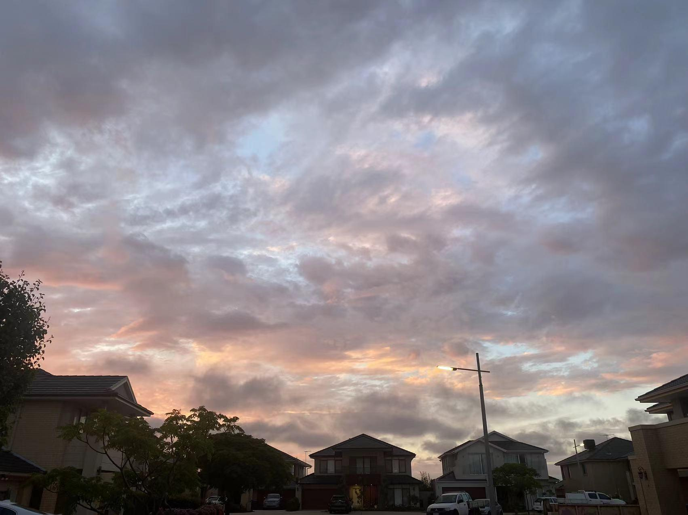

原43篇.向死而生：谈仁东控股及股市陷阱

清一山长 2020年12月4日

前言：山长给三语高中上课，有一次学习的内容是《期货大作手风云录》这本书，作者叫刘强。下面是节选的山长的三段话：

1. 这本书是他用生命写出来的，你们用心去读，从书中把他的死亡和失败的基因给找出来，你能够找到，而且能够找到你自己身上相同的基因（你们身上绝对有），把它剔除掉，你就走上了成功和赚钱之路。

2. 我的成功学方法是从别人的失败当中吸取经验，让自己不失败。我的目标很简单，只要我避免了失败，我就是成功的；只要我避免了亏钱，我就是赚钱的；只要我避开了死，我就活下去了。

3. 要赚钱就要记住，不要亏钱。要成功就要记住，不要失败。你要活下去就要记住，不要死。这叫做“向死而生”。你要是想生，不要天天去研究“生”，而要去研究“死”。当你去研究死的时候，其实你就会活得很好。当你去研究失败的时候，你就会活得很成功。因为当你知道这样做就会不成功的时候，就会明白自己应该走另一条生路。

山长的核心价值观是：为他人创造价值。不管在哪里，时刻都在践行。在雪球，他也像教导三语高中的学生一样，同样的智慧分享给所有有心学习的人。下面这篇文章整理，就是雪球课堂上的【向死而生】——研究陷阱，才能不掉陷阱。

正文：第43篇《向死而生：谈仁东控股及股市陷阱》

清一山长雪球非专栏帖子整理文章

[清一山长](http://link.zhihu.com/?target=https%3A//xueqiu.com/9310099567) 2020-12-04 13:38

[$仁东控股(SZ002647)$](http://link.zhihu.com/?target=http%3A//xueqiu.com/S/SZ002647)哈哈，笑死我了，居然有这种股，有这种走势，正在发生。看懂了图形背后的故事，真的好搞笑！为中国人的“聪明”敬佩，也为中国人的愚蠢而好笑，可怜、可叹、可笑！其智可及也，其愚不可及也！有很多人，这些天，都要关灯吃面了。比重庆啤酒的面，难下咽多了。

很多人家，正在上演家庭破产的故事，夫妻吵架、解体的故事。这一切，正在发生中。他们今天难过的背后，是十天前的志得意满、洋洋得意。真是祸福相连，所以，永远别得意。

帮你们分析一下K线图背后发生的故事，你们就知道：

别去预测个股的股价能走多高了；

千万别做空，涨起来你根本就无法想象；

也千万别追高，跌起来你也根本想象不到；追高的最后，你赚多少钱，都要赔出来的。

所以，我的股票涨高了、下跌了，就算是惠泉**，补仓时也不超过我卖出的最高数量，顶多加上利润部分。**不会认为自己看懂了，就一把梭哈的！

这个股，就是我说的，**走完了全部庄股阶段的股票。**它带来了很多的欢声笑语，也带来很多的哭声，甚至可能是带血、带人命的庄股！

这个股，主力进入的时间是去年——2019年6月。打出12.5元的黄金坑后，就一路慢慢走高，走到17元最高后，又慢慢调整到15元。**这时候很多耐心不够的人，就都走了，认为没前途，主力进入是假的。这时候，特别像现在的燕京。**像这种没有业绩的股，看没有庄，死股，当然散户就都走了，筹码全丢给庄家了。不过，总有一些聪明人，一些死不甘心的人，继续潜伏等待机会。

去年年底，该股再次跌到15～16元的平台，创造14元黄金坑后，主力筹码已经收集完毕，正式开始拉升了。**这一波，涨了一倍，达到了24元的高峰。让所有持股的人，都兴奋莫名。大多数稳健的长期持有者，已经退出，不再介入了。**

之后大起大落，最低居然跌倒了16元，接近了主力拉升之前的价位。**给人一种“主力已经炒完了、退走了、完了”的印象。**散户们自然大肆逃跑，主力其实没有逃走，但已经利用盘面控制，大幅买进散户的血筹，大大地降低了持仓成本，**并把散户的筹码全收集完了。这是我说的第三阶段。**

**惠泉跟这个股比，现在的价位，相当于仁东拉升前17～18元的时候，不断震荡。**以后，冲上去之后，惠泉会破12元的，但也很可能破完就会跌回9元，甚至破8都有可能（用仁东作参考的话）。就**像是珠江啤酒，破了13元，又跌回9元多一样。都还在蓄势呢！**主力都还没有真走掉的。这个价位，主力其实油水不厚，但工作都做完了，没到真正开饭吃大餐的时候。所以，我多说一点没事。

我说**最精彩、最激烈，但散户被吞吃的概率要比原来要大得多的时候，也就是惠泉过了10元的时候，就快来了！**我很期待进入这个区间（惠泉10元以上），但大多数人是不适应的。**大多数人，都会在这个阶段亏本。**就像是珠江，很多人被套住了，而我是大笔的盈利。

**因为我基本上跟上了庄家的节奏，没有追高，反而高位出了大把，9元多才重新恢复的仓位。**

至于后面从16元，走到60多元的这个过程，惠泉、珠江啤酒等，会不会跟？**大致就是从12元跌到8.8元，后来重新拉升，一路顺风，走到25～30元？我就不知道了。**惠泉啤酒，原来到过20多元的。再走一遍创新高，也不是没可能。所以，我会拿一部分就是不卖的底仓，比如十万、二十万放着，看她走这些阶段。

但是，真走出来仁东这个图形，可能性不大。因为这样非常考验庄家的操盘水平，以及庄家运作股票市场的能力。

就是用钱拉升后，还要**花钱不断地聘用一批外围的营销号、大V、**专家等等，用来拉垫背的人。越多越好，需要很多人帮他用各种投资群，各种理由来拉人。**还要在网上做广告，宣扬“神人”可以帮你赚钱的神话，吸引你加群**等等。**如果有影响力的大V，也会来拉的**。比如我有五万多人，会根据我的粉丝数，代替他们发看好惠泉的文章、评点，无脑看好惠泉，前途无量等等。**特别是我的前期示范很好，又是第三大股东，“信用”特别好，可以给我高价的。这样拉人气，主力最喜欢。**

**所以，我说10元以上，我不说了，其实也是保护你们。**

**惠泉如果真要走30元这个珠峰，以后肯定有人要冒充我的名字，出来拉群、建群、拉人的。甚至我的真人会被收买、封号，让假人出来冒充我的。**

你们要记住：以后，**10元以上说让你们买惠泉的，肯定不是我。**也许你买了冲到20元，也不用感谢我。感谢庄家的打赏吧！你赔了也别找我。

**因为，我就算以后高价追了惠泉，也不会告诉你们的。**因为，我就算将来20元买了惠泉，可能我的成本依然是负数，可能我是24元卖掉后补充进来的仓位。我可以这样玩，你们不可以这样玩的。**我来示范我20元买了，跌到0元我也是赚的，你们可能就赔惨了**。所以，就算我真的买了20元的惠泉，我说出来就是存心要欺骗你们跟买的，可能就是为了完成主力给我的拉人任务，你们买了，完成任务，我有“提成”的。按照业绩——你们来买的人数资金的多少来计算的。

但是，别以为这样做，你们就会亏钱。不会的，你们看仁东，“专家们”会从16元就告诉你这个股要涨，你不信，它真涨，还天天涨，一路涨过你想不到的20元、30元、40元、50元、60元。很多专家也天天在群内说，这股多好、多好！买了仁东的小散，也高高兴兴地告诉别人：他听了一个专家的话，买了仁东，每次卖出都是错，每次买入都是对，相信专家就是好。最后，你自己把老婆的本都拿来买了股，你的亲戚朋友，都相信“大神"指导买了它。**其实，在这个不断拉升的过程中，真正的主力，正在悄悄地派发，边拉，边卖出，筹码逐步地分散了。别以为主力拉升，就是拿钱一路买。而是拿消息散布来一路买的，但他会维持股价真的不跌。最终，高位一路买入，筹码就全到散户手里了。**散户还开心得不得了，天天感谢专家、群主，估计还配资买入了。

**现在为啥跌了？因为主力走掉了，就不维护股价了。**估计就把手里最后剩下不多的股份全部卖出了，然后任由股价滑落不管。**主力重新去物色新的股坐庄，专家们从各种群消失，不再发言了。这些韭菜们，一看图形不对，原来给他们信心的专家也消失不见了。全都吓死了，就知道这时候主力真的逃走了**。惊慌失措，反应过来，大家就一起都跑。哪里跑得掉——**已经8个跌停了。每天几十亿资金抢着逃走，但接盘只有几百万，全关死了**。原来20、30、40、50，一元一元涨上去的高兴的散户们，今天看着5元、10元的往下掉。实在是奇葩！我奇怪的是：每天几百万买入的散户，是雷锋吗？100股、200股的买。也许是当彩票来玩的？

有人认为这种图，是主力出不来，资金链断裂了。笑话，**这么长时间，拉升时这么好的量，主力怎么走不掉？**主力早就悄然撤退成功了，别以为庄家这么傻。你看不懂，是自己傻！现在是原来一路跟随，吃饱了的股民，连本带利全吐出来的时候了。

这个股，会跌到多少？跌回原来的平台可以买吗？

**我告诉你：这种集群狂奔的散户，是最可怕的。他们就像狮子王里面惊慌的牛羚一样，谁都挡不住。**只有徐翔这样的牛人，敢于一搏。但我看盘面上压盘三到四十亿的资金，估计没人愿意来反向一下的。如果主力还在，跌五个板，会来一次反抽，给人希望，再慢慢跌。但我认为：**此股主力早已成功撤退，所以毫无维护的意思，直接跌了8个板。**

仁东跌到多少我会买呢？

告诉你吧：**跌破一元我都不买。因为，我根本无法判断十年后这家公司还在不在。**

**但我肯定十年后惠泉啤酒、燕京啤酒、珠江啤酒都在。**

所以，别说15元我买了会涨到60元。我看懂了图，我都不敢进入的。因为它往上固然可以涨到60，往下也可以跌到0，这种买卖，怎么能做？我还是喝啤酒算了！赚少一点没事，至少我死不了！

申明：对于仁东走势，背后的手段描述，全都是我个人的猜测。如有巧合，全属意外！各位别当真，就是讲个乱猜的故事玩玩的！

配图：风雨欲来霞满天。丰收的机会是给早做准备、提前耕种的人。

