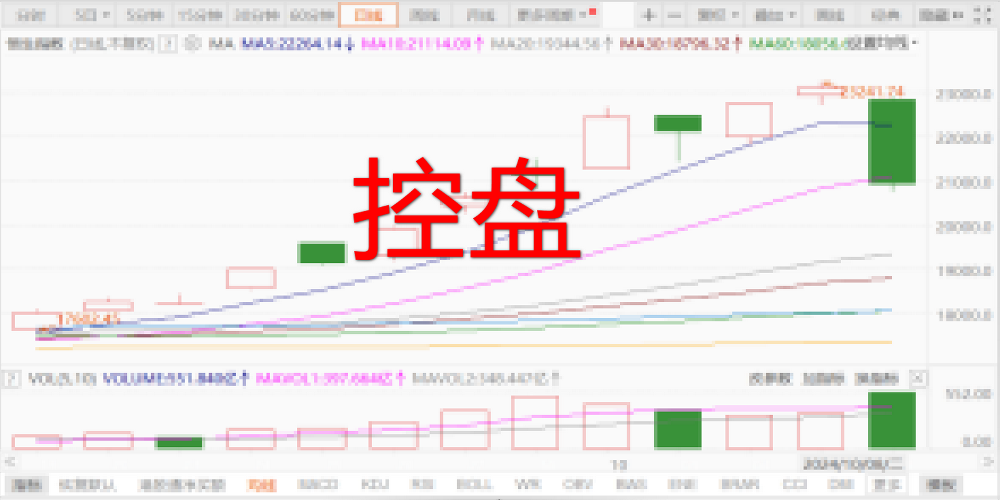
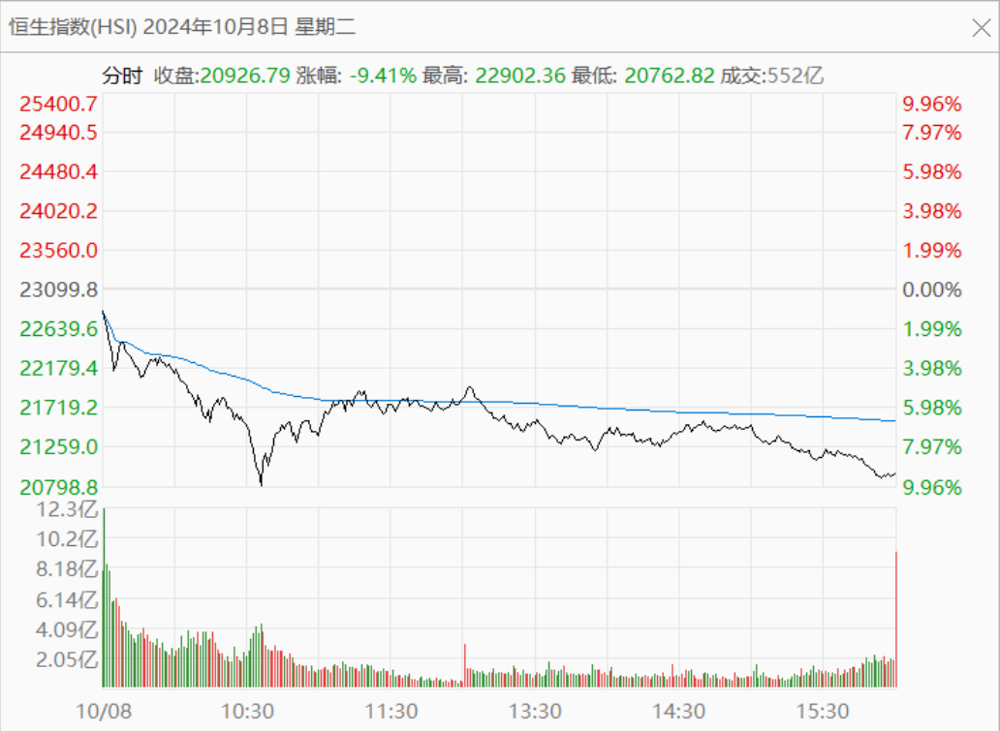
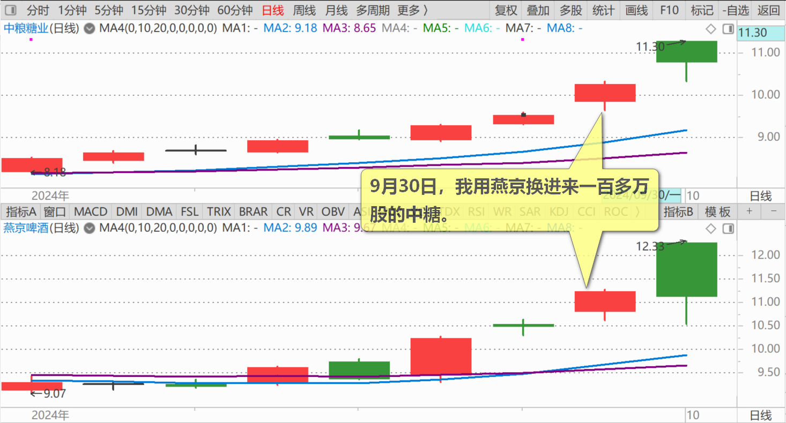
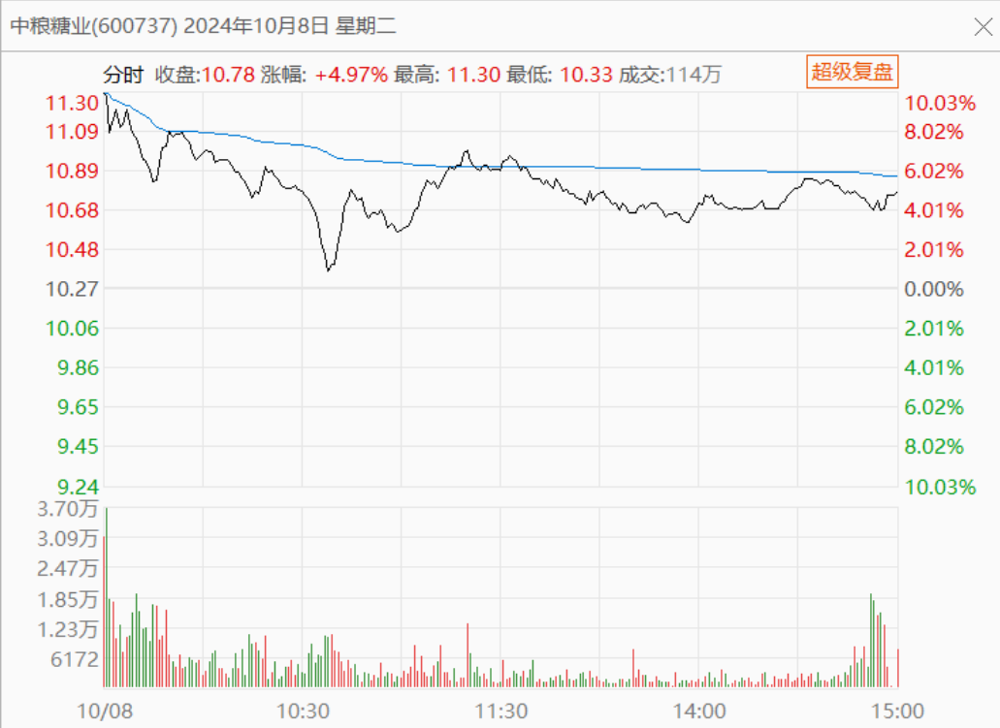
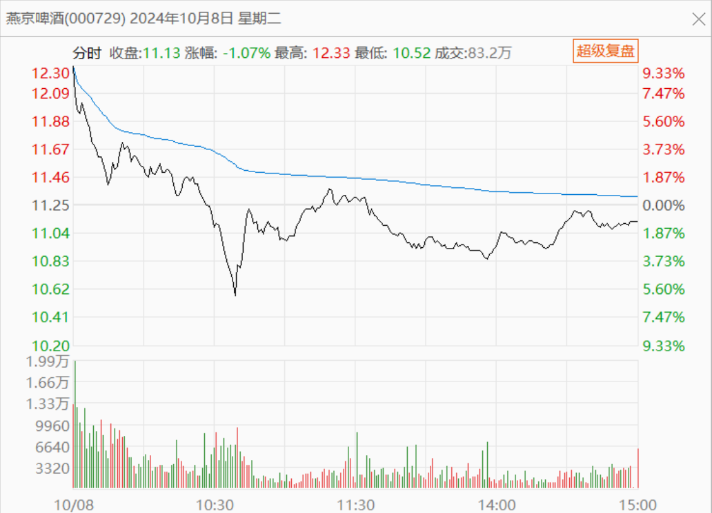

110篇.这样走势是明显的控盘行为

清一山长 2024年10月8日

**今天走势的确很意外：港股大幅下跌，让一致预期上涨的A股控盘后逐级下调。**

其实这是一个非常好的开盘，我最怕开盘后就涨停了，然后就只能干瞪眼。如果筹码不充分换手的话，未来急剧上涨必然带来狂跌。不如今天就下调一些，让前期的获利盘离开，走势就更安全了。今天用港股的大跌来打破股民的一致预期太好了，但**这样走势，反而说明了未来必然上涨。因为这是明显的控盘行为——控盘的目的，是让踏空的大资金有机会进仓。**如果都涨停了，买啥货？

9月30日，我用燕京换进来一百多万股的中糖（600737），

今天果然开盘就涨停，然后破了涨停下跌，但我相信还会涨上去的。

**燕京走得很弱，这个也说明我的判断是对的——中糖更低估。**可是我现在却不敢动，不想卖掉中糖换燕京锁定涨幅，我就啥都不做吧！多看看热闹！没看懂，啥都不做更安全。

分享看盘经验：**今天开盘就冲涨停，后期回调也不多的股票，要么就是实在太低估了，主力完全就打压不住的股票，要么就是主力要借机出货的老庄股。**这种老庄股，如果你手上有的话，最好就放掉，换一些今天盘面看死气沉沉的，没啥希望的，最近几年没有走出啥大行情的新庄股。**因为主力控盘不错，不想大涨，参与者也不多，所以今天走势反而看起来有点弱！这种股将来会有强庄股出现的。**

简单一点说，就是**强股未必是真强，弱股未必是真弱。**孰强孰弱？还要你根据平常的基本功，对企业的基本面，博弈双方的势力强弱进行认真地分析才行。好了，不多说了。我去看股票了，看有啥漏网的鱼没有！

（标题、图片为编者所加）

**文章音频**：

[495篇.这样走势是明显的控盘行为](http://link.zhihu.com/?target=https%3A//www.ximalaya.com/sound/768094273)

**参考链接：**

[100篇.股市不景气，但一股没少](https://zhuanlan.zhihu.com/p/722064096)

[101篇.珠江合理、惠泉低估、燕京未来可期](https://zhuanlan.zhihu.com/p/846471968)

[102篇.股票大涨，平掉一些融资仓位](https://zhuanlan.zhihu.com/p/987269048)

[103篇.仓位管理的奥秘：燕京浮盈已回到2023年3月高峰！（配图版）](https://zhuanlan.zhihu.com/p/991766711)

[104篇.股票意外上涨，中建涨幅居前](https://zhuanlan.zhihu.com/p/2114948739)

[105篇.青岛涨停，重庆、燕京封单少](https://zhuanlan.zhihu.com/p/2115518194)

[106篇.2700多点居然有人敢大肆做空](https://zhuanlan.zhihu.com/p/2117255489)

[107篇.用高价卖出的燕京换9元多的中糖](https://zhuanlan.zhihu.com/p/2118297575)

[108篇.节后港股分析：昨天抢筹行情、今天日内调整](https://zhuanlan.zhihu.com/p/2594334405)

[109篇.国庆长假后第一天A股是否开盘就是收盘？](https://zhuanlan.zhihu.com/p/2594398022)
