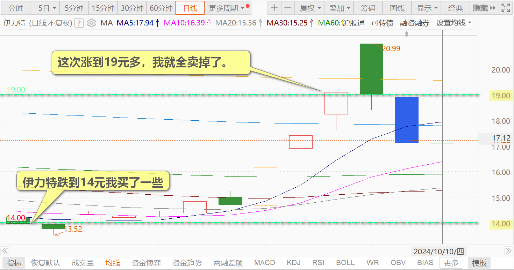
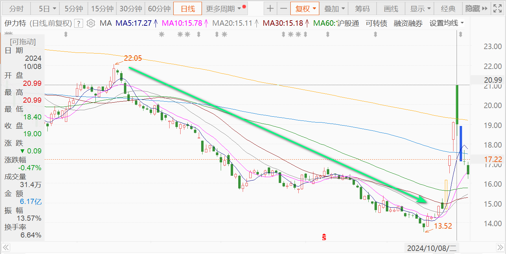
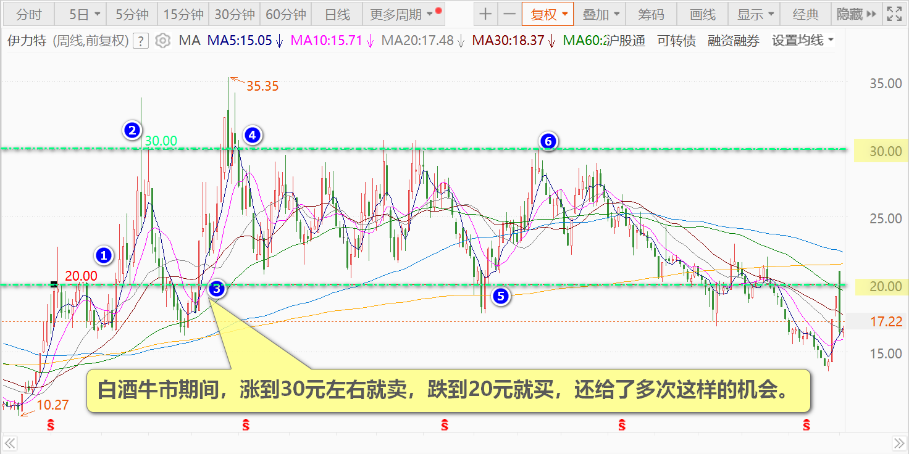

114篇.伊力特跌到“绝望区间”我才买

清一山长 2024年10月10日

**伊力特跌到14元我买了一些。这次涨到19元多，我就全卖掉了。**

今天发现伊力特总公司的增持公告，却很意外地发现：集团公司增持了630万股！

【 伊力特10月8日晚间发布公告称，伊力特集团计划自2024年2月27日起至2025年2月26日的12个月内，以自有资金或自筹资金通过上海证券交易所交易系统以集中竞价交易方式增持公司股份，计划增持公司股份金额不低于人民币1亿元（含），不高于人民币2亿元（含）。自2024年3月4日至2024年10月8日，伊力特集团采用集中竞价方式累计完成增持约630万股，占公司总股本的1.33%，增持金额约为1.3亿元，本次增持计划已实施完毕。】(链接：[https://www.163.com/dy/article/JE0HQ2CR051984TV.html](http://link.zhihu.com/?target=https%3A//www.163.com/dy/article/JE0HQ2CR051984TV.html))

我好奇他是多少钱的成本——就认真算了一下：**伊力特集团公司的增持价格是每股20.63元！**可是，10月8日涨停也就是20.99元。难道这次涨停，就是集团公司拉的？价格太接近涨停价了，这也是这个股今年4月份以来的最高价区间了，这个价格拉完就一路下滑。我其实挺怀疑：这是不是给被套的主力解套的机会？干嘛原来13～14元不来增持？偏偏涨到20多元跑来增持？真是神经病！真拿钱不当钱呀？

不过，话又说回来：**起码该集团公司，认为伊力特20.99元是不贵的，算是良心价！**那么——如果下次再跌倒14元，肯定算是很便宜了，我还是可以买的。现在——价格17元，似乎也不高，离最高点还有两个涨停呢！就冲着“白酒”这两个字，我认为白酒行业股票上，都是急于出货的架势，拉升就是为了出货，不是为涨的。所以我现在不想介入。**就算觉得17元便宜我也不买，非要到跌到13～14元的“绝望区间”我才买，这样起码不会被套太深。**

这个股我原来赚了不少钱走的，做了好几轮，有点感情了。白酒牛市期间，涨到30元左右就卖，跌到20元就买，还给了多次这样的机会。因为跌到20元似乎就是“可以接受的价格”！这一点我跟集团公司的想法一样。这样几个轮回下来赚了好几次钱。后来再跌到20元就不买了，去买啤酒去了。结果——跌到13元多了，不忍心，14元就买了一些回来，19元涨了又卖了。因为我买入本来不指望涨的！怀旧罢了！

未来怎么走？我也不知道！**跌到13～14元？就继续买来拿利息算了。不跌——就不要了！**

（标题、图片为编者所加）

**文章音频**：

[499篇.伊力特跌到“绝望区间”我才买](http://link.zhihu.com/?target=https%3A//www.ximalaya.com/sound/769198231)

**参考链接：**

[105篇.青岛涨停，重庆、燕京封单少](https://zhuanlan.zhihu.com/p/2115518194)

[106篇.2700多点居然有人敢大肆做空](https://zhuanlan.zhihu.com/p/2117255489)

[107篇.用高价卖出的燕京换9元多的中糖](https://zhuanlan.zhihu.com/p/2118297575)

[108篇.节后港股分析：昨天抢筹行情、今天日内调整](https://zhuanlan.zhihu.com/p/2594334405)

[109篇.国庆长假后第一天A股是否开盘就是收盘？](https://zhuanlan.zhihu.com/p/2594398022)

[110篇.这样走势是明显的控盘行为](https://zhuanlan.zhihu.com/p/3366754296)

[111篇.燕京走势健康，清洗筹码阶段](https://zhuanlan.zhihu.com/p/2594476768)

[112篇.对今天走势判断错误，本可以让我一天爆仓！](https://zhuanlan.zhihu.com/p/2594508494)

[113篇.国家队出手，中建涨停](https://zhuanlan.zhihu.com/p/2594572589)
