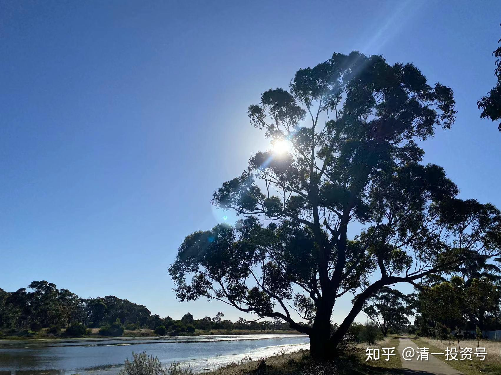
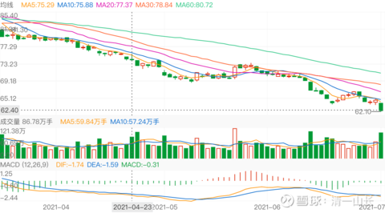

原44篇.2021年谈现金股

清一山长 2021年1月-11月

清一山长雪球非专栏帖子整理文章第 44篇 《2021年山长谈现金股》

1. 中国电信

2. 中国建筑

3. 黔源电力

4. 甘肃电力

5. 北京银行

6. 农业银行

7. 中国建材？？？

**正文——**

[清一山长](http://link.zhihu.com/?target=https%3A//xueqiu.com/9310099567) [2021-01-04 16:11 · 来自雪球](http://link.zhihu.com/?target=https%3A//xueqiu.com/9310099567/167552707)

[$中国电信(00728)$](http://link.zhihu.com/?target=http%3A//xueqiu.com/S/00728) 买入了差不多一百万股中国电信，价格是2.10元。看差不多是10年的最低价。还买入了不少仓位的中国中车，2.56元。我以为：电信这种股，就跟公用事业股一样，稳稳的赚钱。稳稳地分红的股。没啥成长的空间，不能指望他急涨，但也没啥潜在的危险，几乎是垄断经营。居然会出现十年多的最低价，我就买入，当准现金股来用吧。

资金是买了几十万股中国宏桥腾出来的。去年两个股都是3元多4元的样子，我在3元多还补仓了宏桥的。现在宏桥涨到了7.20元，以后估计还会继续涨，我现在只剩460万股了。以后宏桥可能继续涨，我也认了。但万一别的股跌惨了，我可以卖出中国电信来加仓（就算不涨价，我这样也赚了），这就是准现金股的意思，宏桥止盈一部分。总得让别人也有机会赚钱（铝和金属高价时刻来临）

我算是为国接盘吗？还是在帮美帝亏钱？（我认为被迫卖出的美国人，肯定没人能赚钱。十几年的地最底部位置，赚个毛线？）

1. 中国建筑，**黔源电力，甘肃电力**

[至-简](http://link.zhihu.com/?target=https%3A//xueqiu.com/2515925656)

[$燕京啤酒(SZ000729)$](http://link.zhihu.com/?target=http%3A//xueqiu.com/S/SZ000729) 昨天把中国建筑、珠江几乎抛光了，换入的燕京，搞的仓位太重了，今天又换回去了，但燕京的主仓依然不动，没有融资，可以一直耗着，摊低了一点成本，还得了几个月的饭钱。谢谢助力！04-16 13:40 · 转发(11)[· 评论(10)](http://link.zhihu.com/?target=https%3A//xueqiu.com/2515925656/177339943%23comment) · 赞(24)

[清一山长](http://link.zhihu.com/?target=https%3A//xueqiu.com/9310099567) [2021-4-16 14:13 评论](http://link.zhihu.com/?target=https%3A//xueqiu.com/9310099567/177344349)[至-简](http://link.zhihu.com/?target=https%3A//xueqiu.com/2515925656)

这操作棒。把中国建筑当准现金股，保险股，基本没错。投机完，就把现金股买回去，不贪心。

[清一山长](http://link.zhihu.com/?target=https%3A//xueqiu.com/9310099567) [修改于2021-07-01](http://link.zhihu.com/?target=https%3A//xueqiu.com/9310099567/188181886) 15:00

[$中国平安(SH601318)$](http://link.zhihu.com/?target=http%3A//xueqiu.com/S/SH601318)今天平安跌了2.46元，持有平安的朋友，估计都是心凉凉的吧？

我没有买平安。因我看不懂平安，我只会在极度安全的价格买一点，很早的时候买过，赚过一点跑了。现在从价格上说，已经进入我认为的低估价格期间，按道理是可以无脑买了。但由于我是技术派出身的假价投，所以忍不住看看技术走势，看了，就真不敢买了。

1. 看看平安从94元下跌以来，特别是最近几个月，几乎没啥像样的反弹。

2. 而且：底部成交量特别大。五月份，走势很像是主力挖坑后的向上走势，很多长期看好平安，有点技术眼光的人，估计都被忽悠进去了。放巨量成交，一天就87亿的成交量，多方力量大释放。

3. 但很快就慢慢跌了下来，显然是有主力在乘机逃走。

4. 最近更是放量大跌。

所以：我倒吸一口凉气，不敢进场了。

手边偏偏惠泉涨停后的冲高日，我卖出的资金较多，用不用都有点不好想。就买了一点一大堆人都不看好的**黔源电力。**是14.15元买入的。为啥？**就是因为太低迷，没人卖。成交清淡。今天一天才2千万。下跌的股，没人买我才敢买。**有人大卖，我那敢买？缺点是：买不到啥货。今天只买了几万股。我当现金股存起来，如果别的股大跌了，也许可以用来换钱。我估计这种股，继续跌下去蛮难的。

**中国建筑今天倒是买了M级仓位。4.64元。**主要的资金，都是中建自己的分红，基本没占用我的自由资金。自由资金，我想想等惠泉会不会破10呢?

我的分享，是记录自己的投资足迹，盈亏自负，不建议任何人跟随买卖。请不要跟随。投资是一个自己负责的事情。我买入后随时下跌，卖出后常常上涨，所以，我不是一个好的跟风指标。

清一山长 [2021-09-10 17:36](http://link.zhihu.com/?target=https%3A//xueqiu.com/9310099567/197380301)

[$中国建筑(SH601668)$](http://link.zhihu.com/?target=http%3A//xueqiu.com/S/SH601668) [$中国建材(03323)$](http://link.zhihu.com/?target=http%3A//xueqiu.com/S/03323)

一周末小总结：我一向不管自己的账户与大盘的比较情况，今天偶然看到手机账户上有这个功能，觉得很有意思：最近六个月，我三个月跑赢了大盘， 三个月跑输了大盘。证明我根本就不是啥牛人，这个成绩要被基民骂三个月。在勉强接受三个月。我看到：456三个月，我只有一个月，勉强赢过大盘一点点，其他两个月，全是跑输的。7月，我的总资产减值了12%，明显跑输大盘。8月资金就回来了11%，9月至今天10天，又回来了9%。最近两个月，大幅跑赢沪深300。

**不过，我从另外一个指标来看，我的账户其实动力十足。**年初我的账户创了新高，后来几个月跌幅巨大。**现在账户，已经恢复原来的资产数值了。但是——我持仓的股票价格，都没有创新高，甚至离新高还远。**重仓的燕京啤酒还在6元多晃悠，当时我账户新高，燕京是8元多。现在就已经恢复市值，如果燕京再回到8元多的高点，我的这个账户的市值，是新高又新高的。现在就恢复账户新高，似乎有点不对劲。

**中间发生了什么？其实就是我这半年在不断换股，所以市值虽然看起来没有涨，但股票其实多了很多。**比如卖掉13元的惠泉，换7元的燕京。燕京跌到6元，我的市值不涨反跌。但实际上股票已经多了不少。类似这样的操作这半年做了一些，所以：现在的市值，已经达到上半年最高点时候的资金总额了。

**说明：赚股，换股策略，比死拿的策略更好。涨了就要卖一点。**

（**我卖掉后会买准现金股拿着，比如卖掉惠泉的钱，我买了甘肃电力，以及黔源电力，我是当现金股买的，因为这种股，几乎不涨，也不跌，其实也没跌的空间）**，

**如果别的股跌了，我就卖掉这些现金股去买入低价的股票。**所以，我基本上总有钱来买进大跌的股票。只是没想到这些水电股最近也大涨一把，当然就卖掉，去买别的现金股了

（持股涨了，我拿钱回来只买准**现金股——利息高，不会跌，走势难看，躺在底部不动，涨不涨我也不在乎的股就是现金股**）。反正我就是不追高。这样一直保持有钱买，会获得很多想不到的机会。上半年的大跌，其实给了我不少机会去买入原来卖掉的股，比如伊力特，老白干。差价10元多重新买进来，又多赚10元卖出去，都做了两轮了。再涨就要做第三轮了。

**总结：随时保持账户有足够的【准现金】备用，才有更好的机会，去买一些看好的，波动大，盈利大的股。涨了赶快跟随追高，是最笨的。耐心地等待时机，才是最好的策略。**

反省和不足：中国建筑不太够意思，最近一年多，都不给我做T的机会。反而不断跌破心理线，害得我不断加仓，严重超过了我想长期持有的数量。为了报复中国建筑，**计划是：一旦出现中国建筑敢冲涨停之类的，我就出掉几百万，当现金收回来备用。**中国建材也是涨一点涨不多，让我也不敢卖。还不断的跌回10元以内，害我不断在低于10元的时候买进，把我的现金积蓄都消耗光了。**如果敢大涨，我也要也卖掉20%作为现金股收回备用。**

现在我选的现金股是啥？水电股是没得选了，很遗憾。**我就只好选北京银行、农业银行这样股，当现金股来用了。**反正这些股，跌也跌不了，涨也不会涨的。存起来比银行理财要高！用涨了不少的钱，来买他们，心里踏实。有色的钱，水电股赚了的钱。都存在这里呢。**等惠泉啤酒，中国中铁又再度大跌了，估计这些钱，就又出来救市了**[大笑]。

清一山长 [2021-09-27 13:37](http://link.zhihu.com/?target=https%3A//xueqiu.com/9310099567/198882462)

[$洛阳钼业(SH603993)$](http://link.zhihu.com/?target=http%3A//xueqiu.com/S/SH603993) 还有金钼股份，两只股，今天居然都往跌停方向砸盘，毫无犹豫的样子，实在想不到。我很庆幸早就跑光了，洛阳是7元多跑光的，金钼股份是9元多跑光的。抛光后，两个股居然继续大涨，我以为已经踏空了，放过了大牛股。但我也不再意，本来我买入有色就是投机的，投机成功，当然我就走了，换了现金股，等机会再说。买入时，我感觉会有一波有色行情的。趋势有利于有色。看看股票价格也在相对的底部徘徊，还开始拉升，买入价格安全。没想到这么快，居然就涨了。涨了，当然就走了。这段时间却突然转向，两个股都突然大跌，实在不可思议。

现在该重新买入吗？我不入地狱谁入地狱？算了吧。如果知道是地狱，干嘛要去地狱呆着？**目前走势，不太像大牛股的涨势回踩动作。**

洛阳股的前面几次回踩，倒是典型的涨势回调的动作，非常明显。最近这十来天的走势，根本不像股票的正常回调洗盘，倒像是主力紧急出逃的样子。目前所有的技术指标全部走坏。而且走势急不可待，显然持筹人很基于出逃。如果主力要走长期的涨势，要维护盘面的话，是不能这样走的。今天的回调，已经破了6月份以来的回调底部。数学上说，是卖出者最佳的回补仓位的机会。但趋势上说，还不能这样胡乱冲进去。**跌势未尽的样子。**

幸运一点的话，今天会像8月3日一样，属于冲跌停震仓吸货手法。这一天成就35亿，非常的成功。今天也吸引了很多人这样猜想洛阳的下一步走势，今天赶快追买，说不定都是前段时间踏空的原持有者。但我想：万一这一次，并不是震仓回调，只是基面面变化后的杀逻辑下跌的中继线位置，就现在买进去，恐怕会被套牢很久的，需要等下一个周期了。

**个人以为：很可能是出现了严重的长期上涨逻辑已经不再存在，才导致现在的双杀局面。**由于中央最近一个月的出手压制产能，明显看出在控制和打击大宗商品的上涨，且出台的措施极为严厉，可以是史无前例的。**不惜自伤，也要伤人的拼死打法。可知未来的效果也必将是史无前例的。**有可能会出现钢铁产能严厉控制之后的铁矿石走势头，下跌绵绵无尽头。我猜测机构在这样的政策巨变之时，绝对不敢贸然拉升。反而更希望明哲保身。所以近期是不可能拉升的。甚至担心后市有问题，会出掉相当部分头寸，以策安全。**如果我的判断正确，很长一段时间，这两只股都没有涨升的希望。所以：我现在就不买入了，**继续等等？除非进一步下跌，跌过头了的话，我就来救救市场，搏一把看看。如果只是现在的价格，主力依然有利润拿的。不亏。

当然，国家的策论是短期还是长期不好说。**如果不知道，不如继续观望。等看清楚再说。没看清就涨了，是自己没本事拿这种钱。就去买别的看得清楚的股好了。**

清一山长 [2021-10-12 18:09](http://link.zhihu.com/?target=https%3A//xueqiu.com/9310099567/199922812)

[$金钼股份(SH601958)$](http://link.zhihu.com/?target=http%3A//xueqiu.com/S/SH601958) 又回到我的买点了？以为卖飞了的股[哭泣]。9元多跑掉的。

研究了一下十大股东，发现证金汇金是2015年年中成为第二大，第三大股东的。收盘价格是最低10.53，最高价格15.49。证金去年年底就开始走，今年一季报走光。二季报汇金也消失了。离开的价格是5-6元。绝对亏本生意，真的在救市。不过他们走了，说明这个价格不需要救了，结果刚走完，三季度就来了一拨行情，突破了10元。存心不让两金公司赚钱。现在的价格如何？我看最低跌到6元区域吧？可能会有20%的跌幅。但涨起来，超过10元也不奇怪。所以，算是值博率还过得去。我可以考虑补回我卖掉的头寸。**如果跌回6元，就加仓多买一点。现在先锁定卖出的利润，为第一原则。该从现金股里面换钱出来干活了[加油]**

清一山长 [2021-11-03 20:24](http://link.zhihu.com/?target=https%3A//xueqiu.com/9310099567/202057626)

[$黔源电力(SZ002039)$](http://link.zhihu.com/?target=http%3A//xueqiu.com/S/SZ002039)这个股，我14元买的。计划是拿了长期吃股息，躲避货币贬值风险的。当时应该是惠泉啤酒冲13元卖掉后，账上大量的现金，想用在最保险的地方，就买了几个“底部稳定现金股”。**她是其中一只，另一只是甘肃电力**。没想到没多久就玩连续涨停的游戏。居然连续玩了六个涨停。我很傻，在第二个涨停就跑掉了，完美错过后面的四个涨停。今天才终于跌破我的出货线了，也不遗憾，只是看它的走势完美地说明了道理：**中国的股票，都是一群疯股，都正常的，涨了会过头，跌了也会跌过头。涨停是涨给你看的，一旦涨停，就涨不停。一路出手，没毛病。不跌回来，就是死也不买。**

观察它在涨停之前，**多年就是一个“死股”，死气沉沉的，脱离大盘，该涨就是不涨，跌也不咋跌**，磨得人没脾气。很多小散就慢慢走掉了，结果它就大涨了。我是当“现金股”买的，就是看它处于长期底部，不会跌的样子，当现金股买进来，居然涨了，赚了超过十年的股息，我当然就走了。如果晚点走，收获更大几倍。所以，一旦涨了就要稳住手。

不过，这一招对燕京啤酒就无效了，涨了不走，重新跌回来坐电梯。惠泉如果连续涨两个涨停不走，也要做电梯的。**我一般会等两个涨停后，都会走一些的。**这个电力股太妖了，不算规律的，要有大运，才能拿到后面的利润。中国宏桥我如果13元的高位不走，等到现在，要有上千万的浮盈会重新跌回去。现在跌惨了，等它分红后，我再继续买入吧！主要是不想付20%的股息税，太高了。

一句话：**涨了应该走，赚了是别人的福气。**高位拿货，赚这种钱不容易，要祝福拿了我两个涨停货的人，后面赚四个涨停去。**等跌惨了的时候，别人都不要了，再拿回来。股市上，到处都是机会，没必要跟别人抢。是你的就是你的，不是就祝福别人。**
