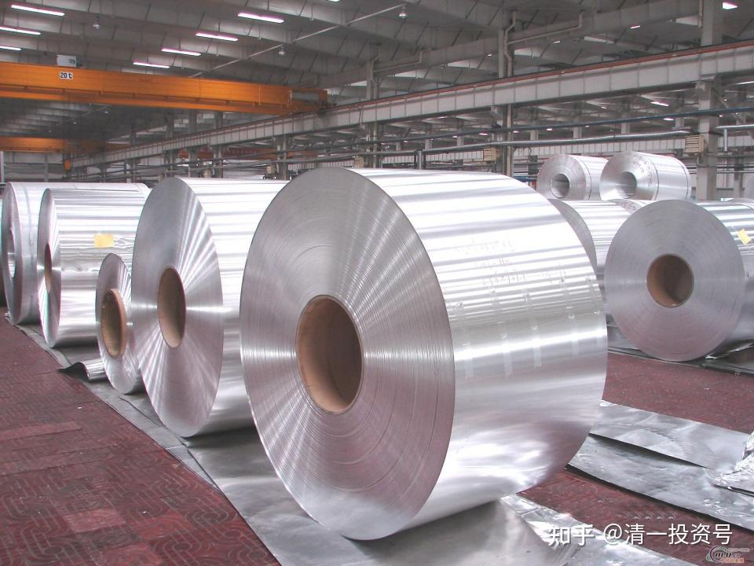
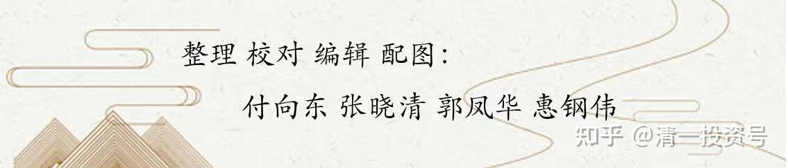

11篇.中国宏桥系列十一：股价不可预测 买和卖都有原则

清一山长2021年06月～2021年09月

**导读：**

一、不去预测宏桥的涨跌，依据价格进行仓位调整的策略

二、魏桥集团在深圳宝安区建立深圳总部项目的解读

三、中国宏桥买入威海银行的思考

四、卖掉涨了的中国宏桥，买入中国中铁与中国建材的逻辑

**正文：**

**一、不去预测宏桥的涨跌，依据价格进行仓位调整的策略**

@[ROE20笨财猫](http://link.zhihu.com/?target=http%3A//xueqiu.com/n/ROE20%25E7%25AC%25A8%25E8%25B4%25A2%25E7%258C%25AB)2021-06-18回复[清一山长](http://link.zhihu.com/?target=http%3A//xueqiu.com/n/%25E6%25B8%2585%25E4%25B8%2580%25E5%25B1%25B1%25E9%2595%25BF)

山长，能看看宏桥什么状况吗，跌了3分1，成本在4蚊，到14没卖，跌回到10蚊。

**[清一山长](http://link.zhihu.com/?target=https%3A//xueqiu.com/9310099567)**[2021-06-18 14:59](http://link.zhihu.com/?target=https%3A//xueqiu.com/9310099567/183730274)回复ROE20笨财猫：

您好搞笑喔。14元你都淡定地坚持不卖，现在10元，却心慌慌的拿不住的样子。到处问人。

涨跌，你以为我说得清吗？问我，你问错人了。我不是股神。我的宏桥投资历史，就不是一个聪明人，知道涨跌的大神的决策。而是一个傻瓜，傻傻地相信张士平不会骗我的信心。

2017年，我从3元多持有到13元，又再度跌回2.88元。我80%的持股，坐了一回过山车跌下来。如果我知道会这样走，早就全跑光了。低价再接回来不香吗？问题是我不知道它会跌回来，我以为它要涨过20元。跌下来，只好承认自己笨蛋，继续买买买。2017年第四季度，一个季度成交89亿元，换手率9%。其实可以看出：大多数筹码都没有跑，持仓心态都很稳，结果大家的判断都是错的。

现在：一季度破13元，高位换手已经220亿。如果再发生一次跌回2.88元的走势，其实我一点也不觉得奇怪。因为已经有过这样的历史，干嘛就不会有这样的未来？这样的换手率，证明很多资金已经跑掉了。

不过，您放心，就算可能跌回2元多，我不会抛掉我剩下的200万股的。**我不去预测涨跌。低于10元我不想卖。就傻傻的继续持有。高于14元，我会继续减仓，因为我已经发现了更低的，值得持有的标的可以买。**宏桥出来的钱，我很多买了中国中车H股，3元多一点点的股价。因为我认为这是一个伟大的企业，我愿意慢慢地坚守这家公司，不在乎它涨不涨。起码当年宏桥3元的时候，中车还10元呢！现在换过来挺划算的。

本轮，我的确在12-14元之间跑了很多持仓，一大半。因为我吸取了2017年的教训，不要去预测股价。我跑的时候，并不知道会跌得这么惨的。因为大家都在说：这一次肯定会涨到20元。**我想：已经赚得够多了，可以卖一部分出去，给点钱给别人赚。**没想到现在居然跌了这么多。我不会后悔我没卖完。我也不预测未来会不会重新跌到2.88元。我只想说：我就用负成本的200万股陪同中国宏桥继续跌吧！无悔这笔投资（目前是我创利最多的个股）。就行了。万一宏桥真跌到2.88元，我相信我会加仓多一倍，超过千万股的。不知道市场会不会给我这个机会？如果真给了，我买入1000万股，依然是成本不到零。所以，我不会去预测股价涨跌。我安心持有睡觉就行了，这种股，有啥看行情的必要吗？一般来说，涨停了会有人私信告诉我的[大笑]。

**二、魏桥集团在深圳宝安区建立深圳总部项目的解读**

[笑][山东老韩醋](http://link.zhihu.com/?target=https%3A//xueqiu.com/1675344276)2021-06-17 19:11

原文链接：[https://xueqiu.com/1675344276/183424625](http://link.zhihu.com/?target=https%3A//xueqiu.com/1675344276/183424625)

苏牛牛奶$中国宏桥(01378)$重磅新闻，世界500强企业魏桥创业集团董事长张波6月17日考察深圳市宝安区，接见了深圳市宝安区书记区长，洽谈项目，最终敲定投资30亿元人民币在深圳宝安区建立魏桥创业集团深圳总部，这也是走出山东省第一个总部项目，项目设立：集团交易中心、学术中心、产业金融与数字化中心、投资中心等，未来在宝安区拿地建立甲级写字楼深圳魏桥创业大厦作为华南粤港澳大湾区总部项目。

[清一山长](http://link.zhihu.com/?target=https%3A//xueqiu.com/9310099567)[2021-06-18 16:35](http://link.zhihu.com/?target=https%3A//xueqiu.com/9310099567/183879290)评论上贴：

我判断建立总部项目，是中国宏桥转型的标志。脱离内地地方政府的影响，在中国最开放的特区深圳设立总部，也的确是家族企业健康发展的需要。原来是踏踏实实的干活，现在估计也要玩资本运营了。好处是宏桥大概率更容易涨了，不太容易重新回到2.88元。坏处就是：宏桥的管理者，还会像原来一样低调，踏实的干活吗？目前持有原来最高持仓三分之一强的宏桥仓位，等待和观望中国宏桥的现代化转型。

**三、中国宏桥买入威海银行的思考**

[清一山长](http://link.zhihu.com/?target=https%3A//xueqiu.com/9310099567)[2021-07-14 13:27](http://link.zhihu.com/?target=https%3A//xueqiu.com/9310099567/190398877)

[$威海银行(09677)$](http://link.zhihu.com/?target=http%3A//xueqiu.com/S/09677)于本月9日透过大宗交易方式向独立第三方以每股3.23元的价格购入约1.39亿股威海H股，总代价约4.48亿元(不包括交易成本)。

这股根本就没有流动性，今天只有2000股成交。上市以来就不涨不跌的。宏桥买入一个多亿，应该是内部交易，不是市场行为。有人想要退出，结果退不出，他是替人来接盘的。肯定是山东的某些有实权的人物，是宏桥必须给面子的人。所以，不是市场行为，不是因为宏桥看中这家优质银行。估计就是一笔亏本生意。所以，中国宏桥今天大跌。

其实，中国的商人，肯定必须做一些替人买单的事情，但这事情吃了亏，别的方面会补回来。这几个亿资金，对宏桥不是个事儿，犯不着这个反应过敏的。市值居然跌了几十个亿。也许我下午可以考虑买点回来？高位已经跑了一大半了，就算做T？还没想好。

**四、卖掉涨了的中国宏桥，买入中国中铁与中国建材的逻辑**

[清一山长](http://link.zhihu.com/?target=https%3A//xueqiu.com/9310099567)[2021-08-13 16:45](http://link.zhihu.com/?target=https%3A//xueqiu.com/9310099567/194167029)

[$中国中铁(SH601390)$](http://link.zhihu.com/?target=http%3A//xueqiu.com/S/SH601390)今天干了一件笨事：卖掉涨了的中国宏桥，买入六年都不涨的，还让徐志清盘的中国中铁。卖了接近100万股1378，收盘价11.64元。买入中国中铁（00390），3.63～3.65元买入。这种卖掉强势股，买入弱势股的举动，基本上会被人认为是弱智才干的事情。我查了一下：三年前00390的收盘价是6.26元。1378的收盘价是3.61元，都是前复权价。一股00390，几乎可以换快两股的1378，去年1378最低才2.88元。今天我用一股1378，就可以换3.5股中国中铁，如果有一天，市场回到2018年的估值，我不就多赚了6～7倍吗？三年前，徐志看好中国中铁，我看好中国宏桥，我们都有各自看好的理由，市场也给出市场的合理价，其实这三年，中国中铁都在高成长，反而宏桥的成长模式被卡死了，合规产能从800多万砍到616万。可中国中铁这几年反而开辟了更大的成长空间，却一直跌跌不休。现在是我运气好，我死守的股涨了，他看好的却跌了。万一未来三年该我倒霉，市场先生翻过来定价咋办？所以我今天转投倒霉的一方，丢掉一百万股强势股，换3M多的弱势股，看未来三年游戏又咋玩[想一下]。现在宏桥持仓不足2M了，最高5.58M。我边涨边换吧！各位，我换股有啥毛病不[为什么]？请指点[献花花]。

[清一山长](http://link.zhihu.com/?target=https%3A//xueqiu.com/9310099567)[2021-08-27 20:08](http://link.zhihu.com/?target=https%3A//xueqiu.com/9310099567/195795821)

[$中国建材(03323)$](http://link.zhihu.com/?target=http%3A//xueqiu.com/S/03323)我前期一直在用涨过10元的中国宏桥换3323，虽然最高价有用13元换10元3323的，但换股以后，账面上其实一直没占便宜，甚至还吃亏。因为前段时间3323居然跌过换股价。我一直认为3323在藏利润。从净现金流量上看出来的。还有各种扣除。一旦有一天释放利润，这股就是一个现金奶牛。它就该走上牛途了，我认为它比海螺的价值更高，值得长期持有。今天中报利润大涨47%，下周肯定要大涨了。只能停手了[哭泣]。（难说见利好就跌？那我再多换一点[笑]）。幸亏现在还有中国中铁可以换。用一系列的好股来跑接力赛，比（一股作气）要好得多[大笑]。现在的中国中铁，比2013～2014年的最低估值还低。用涨了几倍的其他股去换，肯定不吃亏[加油]。感谢伟大的中国和伟大的中国人民。奇迹创造者[加油]！

清一山长[2021-08-27 10:28](http://link.zhihu.com/?target=https%3A//xueqiu.com/9310099567/195838950)

三年前，花旗给恒大的评级是买入，目标价是25元。现价是4.37元。给融创中国的评级买入，目标价60元，现在三分之一的价格都不到。给绿城中国的评级是沽售，目标价是6元。这三个股我都买过，我记得恒大是2015年左右买入的，价格3.1港币，外资给的评级是卖出，目标价是2港币。融创中国我是5港币买入的，当时有人说要到2.5元。等**这些外资大行吹票时，我就跑了**，恒大上十就开跑，最后22元跑光，没有等25元；融创中国37元跑光，没有等60元。买入了外资沽售的绿城，还有中国海外宏洋。我全作反了，如果相信这些大行专家，我估计早破产了。记得中国宏桥3元的时候，他们还要鼓励你卖出[哭泣]。信他们你就完了。

清一山长[2021-09-09 12:47](http://link.zhihu.com/?target=https%3A//xueqiu.com/9310099567/197202911)

[$中国宏桥(01378)$](http://link.zhihu.com/?target=http%3A//xueqiu.com/S/01378)应该是几内亚矿受到保护，不影响宏桥，利空因素消失。所以今天大涨[加油]。祝贺！

清一山长[2021-09-14 22:22](http://link.zhihu.com/?target=https%3A//xueqiu.com/9310099567/197752442)

[$中国建材(03323)$](http://link.zhihu.com/?target=http%3A//xueqiu.com/S/03323)云南发改委的文件：水泥要求9月产量环比8月压缩80%。11-12月错峰不少于40天。这个相当于【**轮种**】吧。强行压制产能。水泥价格会不会快速飞起来？原来一吨赚50元，现在一吨赚150元，涨一百元也不算多。就算压产一半，都比原来赚的更多。电解铝要求不高于8月份产量，似乎还好。不过8月电解铝是限产了的。因为缺电。所以——铝价肯定继续上行。现有水也不让发电换铝。对中国宏桥，依然是利好。怪不得这几天水泥企业突然不让出库了，限制拉货。原来没有货卖了。

清一山长[2021-09-10 10:26](http://link.zhihu.com/?target=https%3A//xueqiu.com/9310099567/197316625)

[$中国宏桥(01378)$](http://link.zhihu.com/?target=http%3A//xueqiu.com/S/01378)我一股换三股半中铁，涨起来的涨幅，是不是也算三股半加起来的涨幅？不然就吃亏了。今天中铁涨幅只有宏桥的一半[大笑]。

[柳随风77](http://link.zhihu.com/?target=http%3A//xueqiu.com/n/%25E6%259F%25B3%25E9%259A%258F%25E9%25A3%258E77)2021-09-10回复[清一山长](http://link.zhihu.com/?target=http%3A//xueqiu.com/n/%25E6%25B8%2585%25E4%25B8%2580%25E5%25B1%25B1%25E9%2595%25BF)：

山长兄不能再减持了，再减我要追上你了。

清一山长[2021-09-10 10:43](http://link.zhihu.com/?target=https%3A//xueqiu.com/9310099567/197320771)回复[柳随风77](http://link.zhihu.com/?target=http%3A//xueqiu.com/n/%25E6%259F%25B3%25E9%259A%258F%25E9%25A3%258E77)：

我有恐高症，就一路走，一路减，我会尽量减慢一点的[献花花]。

清一山长[2021-09-10 13:04](http://link.zhihu.com/?target=https%3A//xueqiu.com/9310099567/197341633)

中国宏桥真是经不起表扬，一大早就涨了8%，正表扬你有出息呢！现在中午居然跌回原地。骄傲就会导致失败[大笑][大笑]。

（标题为编者所加）

参考链接：

[清一投资号：1篇.中国宏桥系列之一：建仓原则](https://zhuanlan.zhihu.com/p/493191191)（整理文）

[清一投资号：2篇.中国宏桥系列之二：安全边际及基本面分析](https://zhuanlan.zhihu.com/p/500915231)（整理文）

[清一投资号：3篇.中国宏桥系列之三：上涨过程中的技术分析与心态把握](https://zhuanlan.zhihu.com/p/505157634)（整理文）

[清一投资号：4篇.中国宏桥系列之四：股价走好，不放松对基本面的分析判断](https://zhuanlan.zhihu.com/p/508644489)（整理文）

[清一投资号：5篇.中国宏桥系列之五：遭遇机构做空消息后的理性分析](https://zhuanlan.zhihu.com/p/511924857)（整理文）

[清一投资号：6篇.中国宏桥系列之六：宏桥复牌后的基本面分析及盘面动态](https://zhuanlan.zhihu.com/p/518969047)（整理文）

[清一投资号：7篇.中国宏桥系列之七：坐过山车的正确姿势](https://zhuanlan.zhihu.com/p/522245519)（整理文）

[清一投资号：8篇.中国宏桥系列之八：最黑暗阶段基于理性判断下的信心](https://zhuanlan.zhihu.com/p/525208172)（整理文）

[清一投资号：9篇.中国宏桥系列之九：宏桥反转后的估值对话及操作策略](https://zhuanlan.zhihu.com/p/528290334)（整理文）

[清一投资号：10篇.中国宏桥系列之十：宏桥不断创新高的盘面动态及操作策略](https://zhuanlan.zhihu.com/p/531489426)（整理文）

