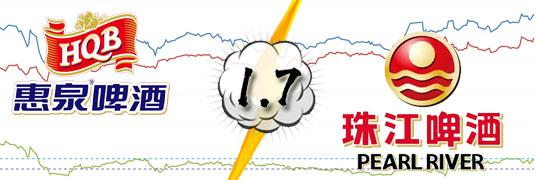
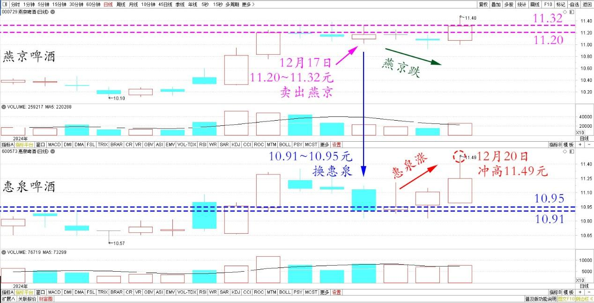
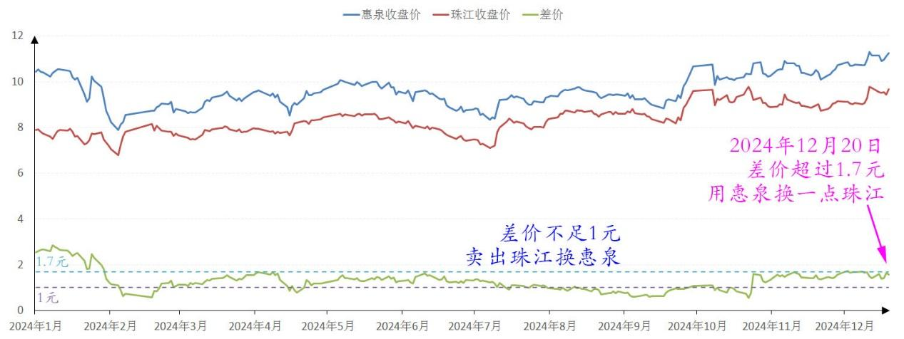
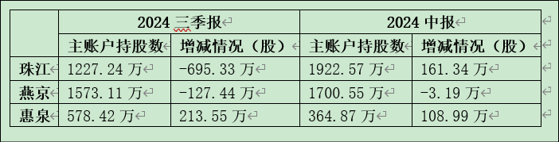
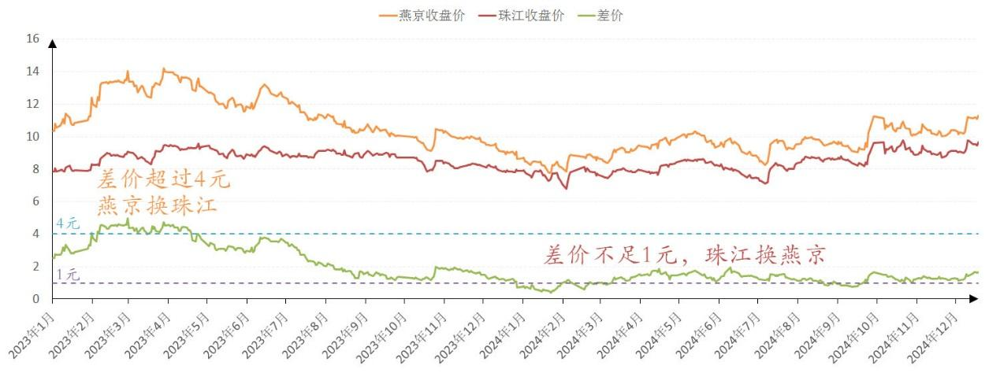

127篇.差价1.7元，惠泉换珠江

清一山长2024年12月20日

前两天，刚把养老账户的燕京出清换了惠泉，11.20～11.32元卖出燕京，10.91～10.95元换惠泉，原因就是我认为**只要惠泉低于燕京，就是包赚不赔的换股机会，无脑换就行**。没想到昨天、今天惠泉就涨了，燕京还跌了。导致惠泉的价格再度高于燕京，看起来恢复常态了。今天早上，惠泉居然还冲高11.49元，说明这次换股的收益还行，按按键盘轻松换股，三天就赚了几个打工人一年的工钱。

燕京、惠泉啤酒2024年12月日线图

不过现在惠泉价格涨高了，我还不想换回来。如果惠泉高于燕京的差价，只是在一元以内，我还没有换股的冲动。不过还是用惠泉换了一点点珠江回来，两个股的价差超过1.7元了，我认为还是可以考虑的：毕竟——现在几个账户特别是主账户的惠泉，就是原来卖出珠江来换的股，当时惠泉和燕京与珠江的价差都不足一元了。所以我认为换入惠泉、燕京都更划算，就卖出珠江换了惠泉和燕京。

惠泉、珠江啤酒2024年收盘价

大家从主账户三季度的股东报表中，已经看到了我有大幅减仓珠江的动作。

其实总体的啤酒仓位并没有减，只是全换了燕京和惠泉而已。**现在他们的价差又拉大了，超过1.7元，我就慢慢的换一些珠江回来。如果超过两元，就更加积极的换。超过五元，能换多少就换多少。**上次就是燕京居然超过了4元多，我就把养老账户的燕京全都清了换珠江。主账户把珠江也重新换回十大！燕京也退出了十大。

燕京、珠江2023～2024年收盘价

之前已经几年没有碰珠江了！反正三只股我手上都有货，谁高谁低我都高兴。谁跟不上大队了，我就去补一点，尽力帮助三个股齐头并进！平衡三只股的关系。

（标题、图片为编者所加）

**文章音频**：

[521篇.差价1.7元，惠泉换珠江](http://link.zhihu.com/?target=https%3A//www.ximalaya.com/sound/788644788)

**参考链接：**

[121篇.差价0.58元，买回燕京](https://zhuanlan.zhihu.com/p/7362533088)

[122篇.差价0.65元，补仓燕京](https://zhuanlan.zhihu.com/p/8710118230)

[123篇.养老账户半仓惠泉换珠江](https://zhuanlan.zhihu.com/p/9240529106) [124篇.差价1.7元，燕京换珠江](https://zhuanlan.zhihu.com/p/12627844392)

[124篇.差价1.7元，燕京换珠江](https://zhuanlan.zhihu.com/p/12627844392)

[125篇.卖出燕京、珠江，买入百威亚太](https://zhuanlan.zhihu.com/p/13640234438)

[126篇.卖出快涨的燕京，买入惠泉和百威](https://zhuanlan.zhihu.com/p/14007881655)

