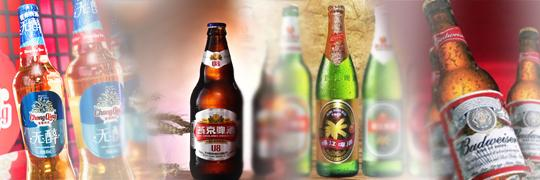
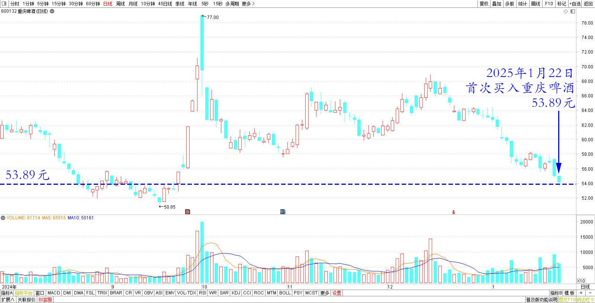
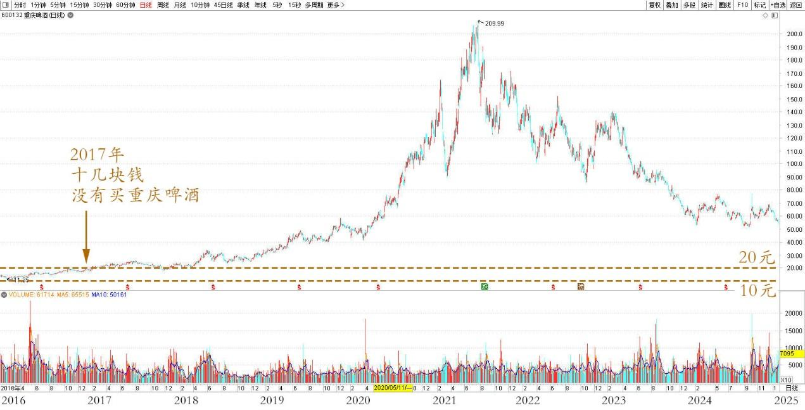
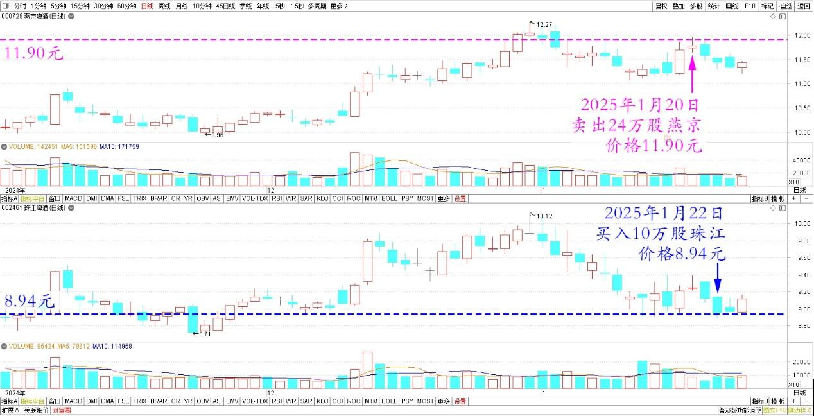
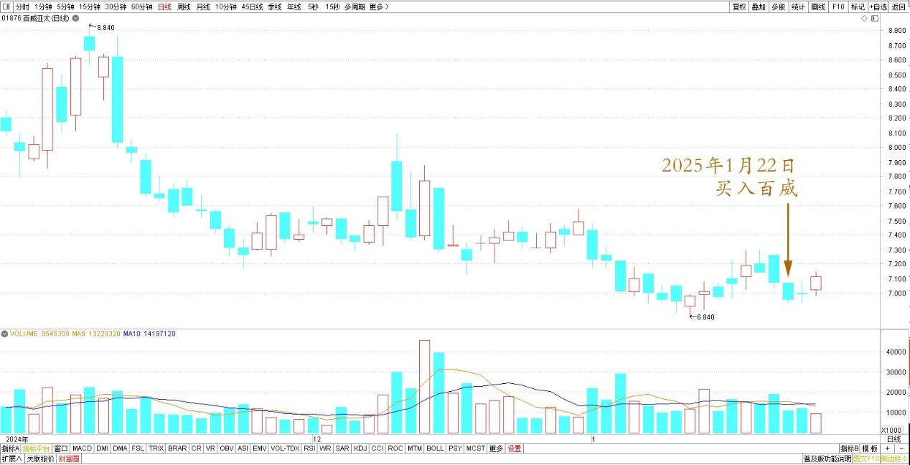

**

**

129篇.啤酒切换——买跌不买涨，卖涨不卖跌

清一山长[2025年1月22日14:51](https://www.zhihu.com/pin/1865411211698499586)

今天首次买入重庆啤酒一万股，买入价格：53.89元！很遗憾2017年十几块没有买它，错过一波好大的行情。

重庆啤酒2024年8月～2025年1月日线图

重庆啤酒2016年～2025年日线图

买入资金，来源于三天前卖出24万股燕京。最高几单的成交价11.90元！当时只是简单地想：**虽然趋势看涨，但涨高了就卖一点出去，大家都高兴。真没想到这两天居然连跌，跌了就再度买入呗**！所以今天还买入了10万股珠江，算是补回来燕京三天前的卖出头寸。珠江跌破9元，今天挂单8.94元买入。两股的差价3元左右到手，我觉得值了！等两股的差价减少，我再换入燕京。

燕京、珠江啤酒2024年11月～2025年1月日线图

还有剩余的钱，就买点百威吧！**反正我就是买跌不买涨，卖涨不卖跌。我这样玩下去，股票只会越玩越多的**。

百威亚太2024年11月～2025年1月日线图

昨天拒绝了亲朋的宴席邀请，出去自己买饭吃。一份饭加上一个红豆汤、番茄鸡蛋，总共花了14元饭钱。觉得国内会过日子的话，其实不费力气就能活好了！

（标题、图片为编者所加）

**文章音频**：

[529篇.啤酒切换——买跌不买涨，卖涨不卖跌](http://link.zhihu.com/?target=https%3A//www.ximalaya.com/sound/799716476)

**参考链接：**

[124篇.差价1.7元，燕京换珠江](https://zhuanlan.zhihu.com/p/12627844392)

[125篇.卖出燕京、珠江，买入百威亚太](https://zhuanlan.zhihu.com/p/13640234438)

[126篇.卖出快涨的燕京，买入惠泉和百威](https://zhuanlan.zhihu.com/p/14007881655)

[127篇.差价1.7元，惠泉换珠江](https://zhuanlan.zhihu.com/p/15010761184)

[128篇.大多数散户都出局了！](https://zhuanlan.zhihu.com/p/19370680113)

