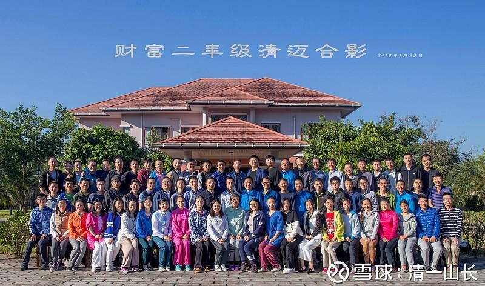
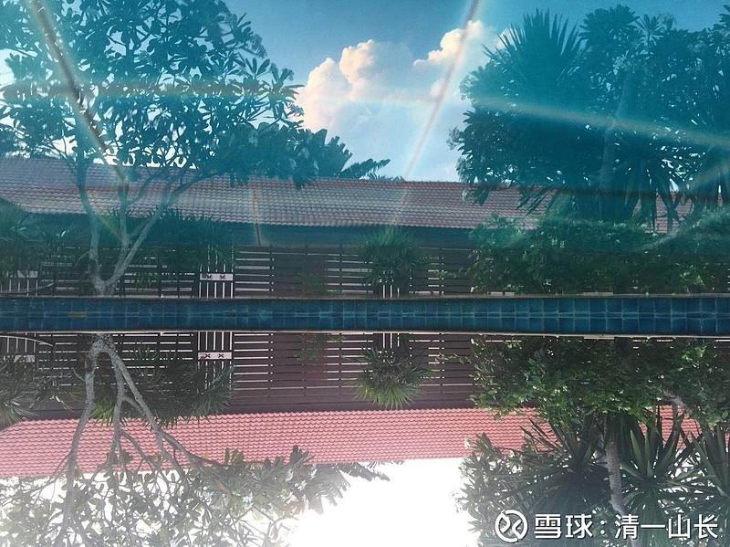
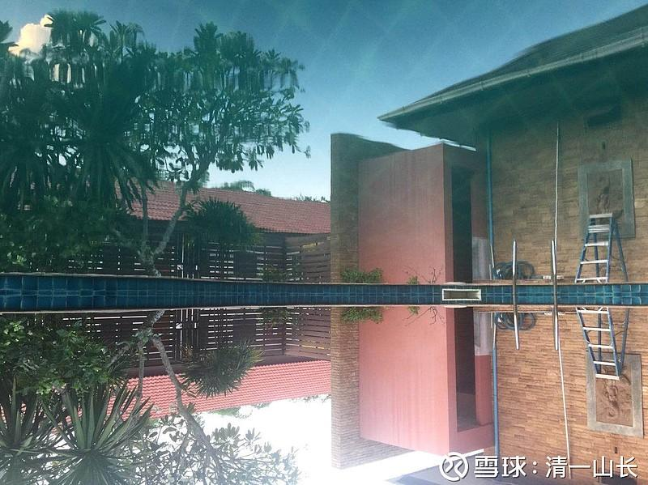
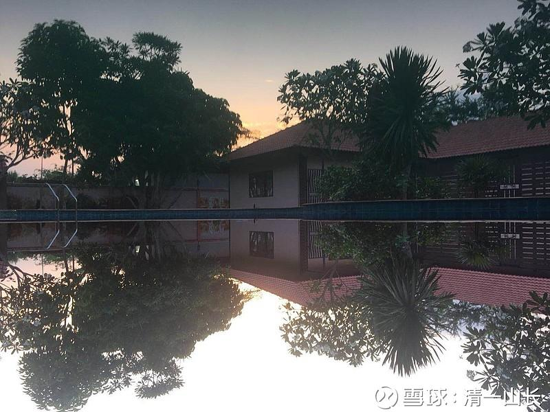

原专栏21篇.清迈的【财富二年级】讲什么？

清一山长 2018年5月17日

**合影的地方是前院，正对大门的地方。后院的图片在文章最后。**

**我在清迈购买用于养老的私宅太大了，有二三十间房子。最大的几间房子每间都接近一百平方，大多数是40平方左右一间。还有两个游泳池及两个花园。我们一家人，实在是用不完。就在2018年的春节期间，邀请国内的朋友们来泰国度假，我负责全免费招待大家。就是“住宿费、伙食费”全免，接待国内来的朋友们，广交天下朋友。主要就是想在寒冷的冬日，给国内的朋友们送一点阳光和温暖。我们中国人节俭，好东西都不愿意浪费，买下来的房子只有尽可能多住，才划算。所以，虽然条件差一点，主要是来的人太多了，居然来了上百人，虽然房子大，还是有点拥挤,但由于大家忍耐的功夫都还不错，所以都没提意见。主要还是泰国的功劳——泰国人很友好，加上阳光灿烂的气候，温暖的环境，地道的泰国食物，就让大家忘了计较住宿条件不够好的问题了。**

**我上课讲什么？**

**财富一年级11天，就讲四个字: 不要炒股！**

**财富二年级9天，就讲8 个字？为什么要当个傻猫？**

**当然，我估计，大家都认为我传授了什么“好标的”给这些内部学员。很关心我这个财富二年级上了什么秘密的课？标的倒是有的，主题就是：拿住银行股等国家标的不放松。不是秘密，我早就在公布在我的组合里面了。今年以来开市20来天，这个组合就涨了18%还多。**

**为啥这些学生明明已经知道了标的，该买什么，还要跑来听课？就算我全免费招待，这国际机票钱也是不老少的？划算吗？**

**好像真正的秘密就是：如果他们不来上课，就不会买我推荐的这些标的，就会错过这样轻松赚钱的好机会。因为他们不是像大家一样的“聪明猫”，而是“傻猫”。2014年、2015年，我们的学员自称“招财猫”——就是“招商银行的财猫”的意思。因为我当年是让他们买招商银行后，就啥也别管了。买了之后等着“天天招财”就行了，别看盘，也别学什么技术了。现在招商涨了这么多。我就让大家改成新的，九只标的组合而成的【国家担保标的】组合了，因为我不想让我的朋友，去给人继续抬招商的轿子。虽然招商拿十年也很不错。但考虑到安全第一，我更愿意把最安全的【国家标的】送给大家，虽然可能涨不了太多，但绝对跌不下去多少的。**

**我估计二年级学员中有隐藏的超级大鳄，不然我刚上完课，他们就把长期不涨的这个组合，全都买涨了这么多。如果你原来看过却没去买我推荐的这个组合，原因肯定是你没有来上课[大笑] [大笑]。当然，聪明的你，老老实实地买入这些股票，持有十年，然后再看看会发生什么[加油]。**

