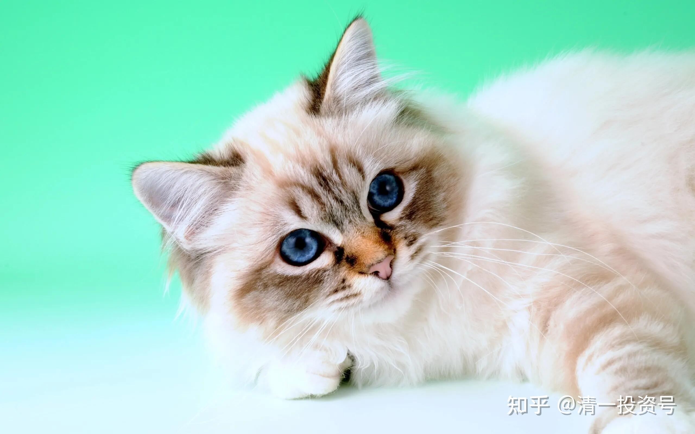

12篇.财富课旧事：病猫、死猫

[金陵后厨](http://link.zhihu.com/?target=https%3A//xueqiu.com/1364172920)回复球友甲2020-12-28 04:20

你这个王八蛋，肯定是山长曾经的学生，这样说是忘了本，既使你被山长清理出门户，也不应该这样黑山长，都是凡人，谁能无过，要记住山长给大家带来太多太多的福报了，你这个忘恩负义的家伙，到哪里也不会混好到哪里去的……

**[清一山长](http://link.zhihu.com/?target=https%3A//xueqiu.com/9310099567)**[2020-12-28 09:03](http://link.zhihu.com/?target=https%3A//xueqiu.com/9310099567/166863665)回复[金陵后厨](http://link.zhihu.com/?target=https%3A//xueqiu.com/n/%25E9%2587%2591%25E9%2599%25B5%25E5%2590%258E%25E5%258E%25A8)：

这人不像是当过我学生的样子，我的学生有“类型”的。就算是“清黑”，素质也没这么弱智的。他更像个底层混混，说话方式很奇怪，说的话也很离谱，完全道听途说，甚至自己想象的。

不过，如果是财富课，可能会有一些混混跑过来。财富课的目的是送财结缘，是2013年年底，到2014年年初，我看股市在底部，机会特别好，大蓝筹的红利就可以覆盖融资利率了，就专门送给有缘人，鼓励他们买绩优股长期持有。结果到2014年底，这些人全都赚了100%以上的收益，别人当年是“满仓踏空”，他们却成为中国一批赚钱最多的人。后来很多人都要跑来上财富课，2015年有一千多人要申请，我认为市场太热，动机不纯，就拒绝了一千人，只收了三百人上课。还特别警告所有的学员：现在很危险，去年赚钱最轻松的人可能2015年赔钱最多。但他们都不相信，因为2015年上半年赚钱还是很容易，还笑话我太胆小，后来才发现老师原来是对的。

我发现这些急急忙忙上财富课的人，会有一些混混跑过来，素质极其低下，投机意识很重，给他最好的东西都看不懂。来上课的目的，不是好好理解财富，就是要你给个代码，包赚不赔的。我就算给了也不满意（我给你们包赚不赔的中国建筑了，破五就买，您认为这些人会满意吗？）。

其实我的**财富课是讲财富思维，讲金钱的原理的。**可是这些人就是想按自己的想法赚钱，还要你给代码。就像各位看的惠泉啤酒，其实听话照做的人都赚钱。但这么好的股，居然还是有人不赚钱，还赔钱。赚了，是他有本事；赔了，他怪你分享惠泉买卖，害他“跟买”了惠泉。其实每次我卖出他们买进。前段时间珠江回调，这个我赚钱最多的啤酒股，不也有人出来骂骂咧咧的吗？可惊奇的是：燕京他顶部就赚钱走了，拿来高价追珠江赔钱了，总体来说还是赚钱的，赚了不少，可他就跑出来骂我，还要拉人来黑我。这种人，估计就是疯狗投生的，连正常的狗都不是。

所以，后来财富课我就停上了，不再给外人来上课。只给清心二年级以上的优秀学员上了。**高级的财富思维，只教给认真学习的人。我教的，是顶尖层次的东西，下根之人，听不懂的，只能让上根之人听**。下根之人，让他们自己玩自己的游戏吧！**市场需要韭菜，建筑也需要地基。**

至于喜欢出来乱咬人的疯狗，唯一的办法，就是拿个棒子打。我支持大家拉黑或者投诉！

我分享的内容，不排除你认为是垃圾，也许你是对的。就算是垃圾，没强迫你看，你拉黑我就算了。偏要跑来看，看了还要拉屎来恶心人，就只能打扫一下了！

//[@舒缓](http://link.zhihu.com/?target=http%3A//xueqiu.com/n/%25E8%2588%2592%25E7%25BC%2593):回复[@清一山长](http://link.zhihu.com/?target=http%3A//xueqiu.com/n/%25E6%25B8%2585%25E4%25B8%2580%25E5%25B1%25B1%25E9%2595%25BF):

现实生活中，说起巴菲特所有买卖股票的都知道，但是彻底学习执行的基本没有碰到。巴老只是教人做怎么投资，可是他感叹：对于价值投资来说，你要么是5分钟之内就会接受它，要么可能一辈子也很难接受它。在网上碰到的接受价值投资的分两类，一是，五分钟就接受了；二是，投机赔得破产清零后。

山长影响了一批原本不认同投资，也不认同巴菲特的“清粉”，（变得）认同投资，认同巴菲特，让一辈子有可能都不接受价值投资的人接受了价值投资，这个影响大得我不知如何形容。

[清一山长](http://link.zhihu.com/?target=https%3A//xueqiu.com/9310099567)[2020-12-28 10:03](http://link.zhihu.com/?target=https%3A//xueqiu.com/9310099567/166875087)回复[@舒缓](http://link.zhihu.com/?target=http%3A//xueqiu.com/n/%25E8%2588%2592%25E7%25BC%2593):

对：我支持大家都学巴菲特，但不支持学索罗斯。不是索罗斯不好，而是索罗斯不适合一般人学。巴菲特就像现代格斗，只要努力，就能学会。索罗斯就像太极，更好看，效果也更好，但一般人学不会的。自以为是地乱学，就变雷雷、马保国了。

**一般人来股市，想要赚钱，就学巴菲特，做价值投资，基本上是亏不了的。**为啥这么多散户都亏钱？因为他们认为自己是索罗斯！都瞧不起巴菲特。结果证明自己谁都不是，就是一颗韭菜！

买中国建筑，死扛到底，肯定不会赔。这就是巴菲特模式。有几个愿意老实照做的？

买惠泉就是索罗斯模式。我在惠泉上的收益，今年已经接近200%了。从年初当绩优股死拿到现在，也不过70～80%而已。可是有几个人实现这个收益了？

看不懂的就别做。没人愿听，就只能当韭菜了。

//[@searness](http://link.zhihu.com/?target=http%3A//xueqiu.com/n/searness):回复[@清一山长](http://link.zhihu.com/?target=http%3A//xueqiu.com/n/%25E6%25B8%2585%25E4%25B8%2580%25E5%25B1%25B1%25E9%2595%25BF):

巴菲特更难，老巴只是站在他那个位置做出的最合理选择方式，资金量小照样投机玩得贼溜，索罗斯的方式才是现代搏击，老巴是不是太极不知道，不了解太极。

[清一山长](http://link.zhihu.com/?target=https%3A//xueqiu.com/9310099567)[2020-12-28](http://link.zhihu.com/?target=https%3A//xueqiu.com/9310099567/166880374)回复[@searness](http://link.zhihu.com/?target=http%3A//xueqiu.com/n/searness):

巴菲特是左侧，索罗斯是典型的右侧。你不要把巴菲特年轻时候的投机模式拿出来说，误导人不好。不是投机不好，而是巴菲特有投机的本事，都放弃了投机，专注于格雷厄姆和费雪模式。

大多数人，连“机”都不知道，如何“投机”？我的财富课程，就是教“财富机”在何处的底层逻辑的。恐怕听懂的人也很少。听懂了，大多数人，一定老老实实地做巴菲特。要能听懂我的另一个课程的人，才会去做索罗斯。这个课程是:鬼谷子股经。很少有人听过这个课程，不是这类人，我都不教的。教也白教！

我的投资模式，就是巴菲特的投资逻辑加鬼谷子的手法技术！两者结合，就是“价值投机术”。你们自信看得懂鬼谷子的，再来谈投机。

惠泉庄家看不看鬼谷子我不知道，但他们的确会用鬼谷子，成功的庄家都会用。索罗斯等于是鬼谷子的金融界战例的最佳体现，他们都用而不言。不会像我傻乎乎地告诉你们，等于砸自己的饭碗！

//[@质真如渝](http://link.zhihu.com/?target=http%3A//xueqiu.com/n/%25E8%25B4%25A8%25E7%259C%259F%25E5%25A6%2582%25E6%25B8%259D):回复[@清一山长](http://link.zhihu.com/?target=http%3A//xueqiu.com/n/%25E6%25B8%2585%25E4%25B8%2580%25E5%25B1%25B1%25E9%2595%25BF):

山长还原了真实的历史。

2014年跟着三元多的中建赚了不少，我2015年上的财富课，也跟着赚了不少，只是后面大家觉得山长太保守，有几个投机比较成功的出来成立了投机群（名字就叫某某投机群），他们的收益是山长的好几倍，而且我们跟着也赚了很多，山长4500卸掉融资时，我们还在满仓满融，然后股灾来了，重仓的小盘股全跌了，死了一片。

我印象很深，山长当时在课上对我们说过：你们五年内基本上变病猫、死猫。第二年大医课山长知道了我们一些人死得很惨，还说没想到你们一年时间都变病猫、死猫了。我是全程跟下来的，绝对的事实，经历过那种千股跌停、熔断，开盘十几分钟就休息的交易，才会知道山长教的方法有多珍贵，希望看到的球友珍惜。

[清一山长](http://link.zhihu.com/?target=https%3A//xueqiu.com/9310099567)[2020-12-28 13:37](http://link.zhihu.com/?target=https%3A//xueqiu.com/9310099567/166902556)回复[@质真如渝](http://link.zhihu.com/?target=http%3A//xueqiu.com/n/%25E8%25B4%25A8%25E7%259C%259F%25E5%25A6%2582%25E6%25B8%259D):

**人性的贪婪，是理性和原则无法战胜的！**

当年让你们买招商守着当招财猫，有人真做到了。你们一些人就是要去当死猫。你们都要跟老师来比个高低，不是不让你们比，我鼓励学生超过老师。但你们要先活下来再比。“不敬其师，不爱其资，虽智大迷！”

[惠钢伟_质真如渝](http://link.zhihu.com/?target=https%3A//xueqiu.com/7624164650)2020-12-28 13:48 [@清一山长](http://link.zhihu.com/?target=https%3A//xueqiu.com/9310099567)

感谢山长一直孜孜不倦的教导，那种投机赚快钱的速度太过瘾了，很少有人能拒绝，不过还好，大部分人都已经醒悟过来，都在回归正道。希望球友万万以我们的经历为戒，错误犯一次可能就会很难翻身。

参考链接：

[清一投资号：37篇.跨年演讲：亿万富翁的思维模式与人生顶层设计](https://zhuanlan.zhihu.com/p/464260540)

[95篇 跨年演讲：亿万富翁的思维模式与人生顶层设计](http://link.zhihu.com/?target=https%3A//www.ximalaya.com/shangye/52603303/472020062)（音频）

[哔哩哔哩：跨年演讲：亿万富翁的思维模式与人生顶层设计](http://link.zhihu.com/?target=https%3A//www.bilibili.com/audio/au2667860)（音频）

[哔哩哔哩：清一山长雪球专栏](http://link.zhihu.com/?target=https%3A//www.bilibili.com/audio/am32848405)（音频）
