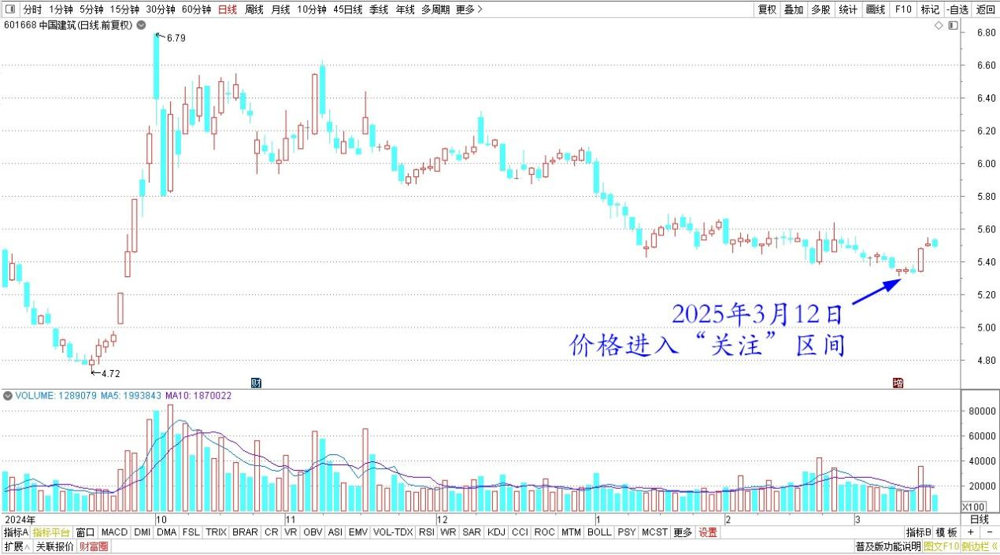
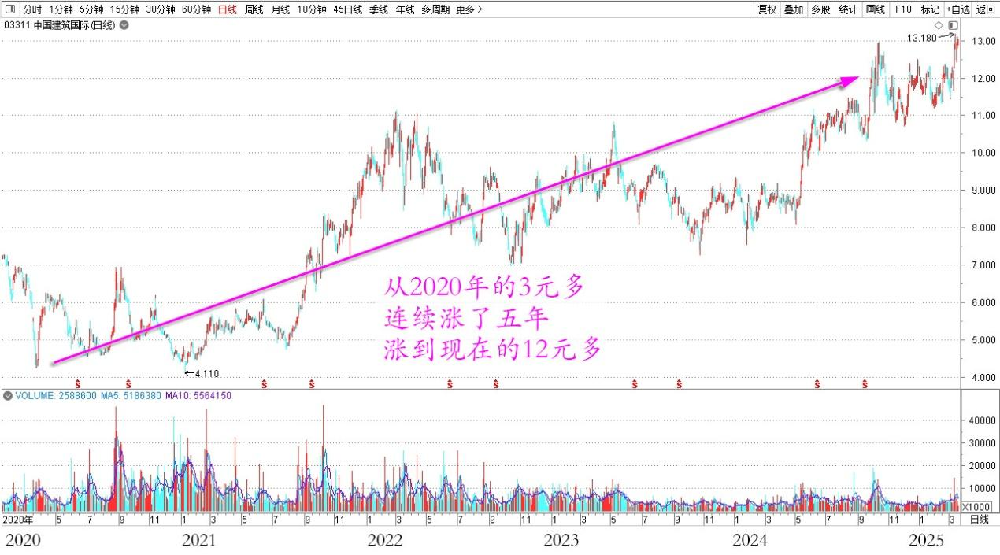
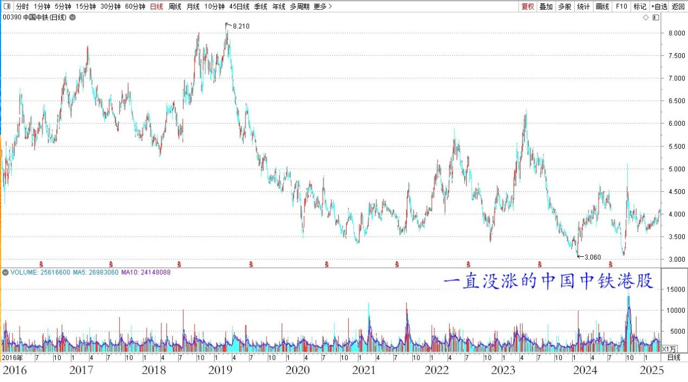

**137篇.中国建筑价格进入“关注”区间**

清一山长[2025年3月12日10:52](https://www.zhihu.com/pin/1883108172471968249)

中国建筑抛掉换啤酒很久了。现在它的价格已经进入“关注”区间，是不是该抛一点啤酒，换回中国建筑呢？原来的中国建筑，从我原来的单股盈利第一的位置，已经降位让给几只啤酒了。

中国建筑2024年9月～2025年3月日线图

注意到东方资产最近增资入股中国建筑国际，耗资29.9亿港元，基本是市价入股！再看看港股建筑国际，从2020年的3元多连续涨了五年，涨到现在的12元多，市值已经是中国建筑的三分之一，总盈利大概是四分之一！说明中国建筑的子孙公司都很有竞争力！

中国建筑国际 2020～2025年日线图

从这个资产标的来看的话，显然把中国建筑列为“危险资产”是不对的。香港的地产发展这么多年，也没有说就不发展了。中国房地产出现调整，也不会说将来就不盖房子了，不需要建筑公司了。只是存量少了，谁来盖的问题。

去年的中国建筑营业额、利润、订单都是增加的。说明目前发展依然是健康和良性的。不必担忧未来中国建筑会垮掉的问题。就看什么时候释放利润了！大量的贷款，以及PPP项目，占用了大量的现金流和利润。如果将来发展的速度降下来了，就应该是收获的时候了。到时候增加分红，降低负债，中国建筑就会成为一个典型的蓝筹股了！

只是不知道这一天还要等多久！它会像中国建筑国际一样，连续涨五年吗？

另外——我还纳闷：东方资产现在来入股，这么高的价格。几年前三四元钱的时候干嘛不来入股呢？这群金融专家，只会高位入股吗？如果我有30亿，我认为买中国建筑，都比买涨了三倍的中国建筑国际更好吧？或者我拿这30个亿来买一直没涨的中国中铁的港股，不就是便宜到家了吗？为啥要入股估值比A股中国建筑更高的“中建国际”港股呢？我真的搞不懂！

中国中铁H 2016～2025年日线

不懂，就慢慢看吧！如果手上原来用中国建筑换来的啤酒继续涨上去，不排除我就换一些出来，买点分红高的“长期债券”，拿着在手上吃利息！跟随国家一起慢慢走，慢慢变富！当年中国建筑我持仓最多的时候，居然超过两千万股。现在都换到啤酒上了，还剩下一万股！

（标题、图片为编者所加）

**文章音频**：

[545篇.中国建筑价格进入“关注”区间](http://link.zhihu.com/?target=https%3A//www.ximalaya.com/sound/823963422)

**参考链接：**
[130篇.无意中发现原来证券系统还有这个功能](https://zhuanlan.zhihu.com/p/23675222317)

[131篇.跌破11元买燕京，差价两元换珠江](https://zhuanlan.zhihu.com/p/24939243244)

[132篇.盈亏数百万都是假的，啤酒切换才是真的](https://zhuanlan.zhihu.com/p/26380209616)

[133篇.燕京跌了又涨，我没买也没卖](https://zhuanlan.zhihu.com/p/27431147176)

[134篇.重仓华菱钢铁的原因](https://zhuanlan.zhihu.com/p/28286645670)

[135篇.主升浪快来了，但我不贪心](https://zhuanlan.zhihu.com/p/30186294319)

[136篇.港股投资重点考虑国企红筹股](https://zhuanlan.zhihu.com/p/30187716852)

