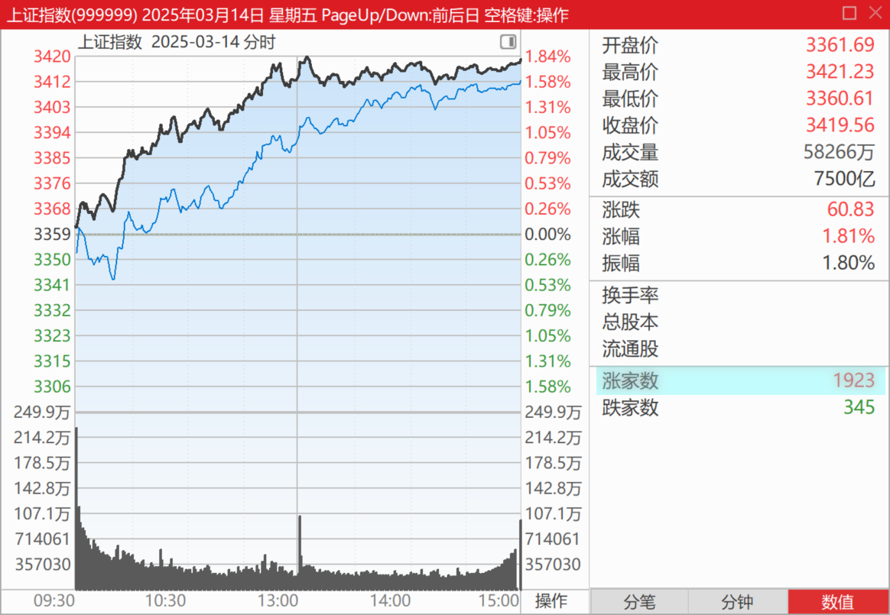
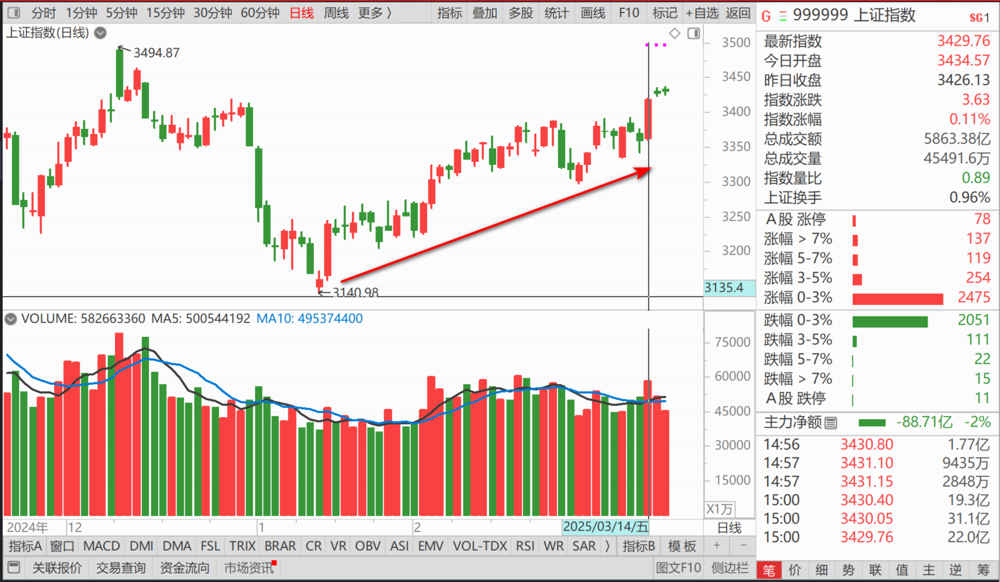
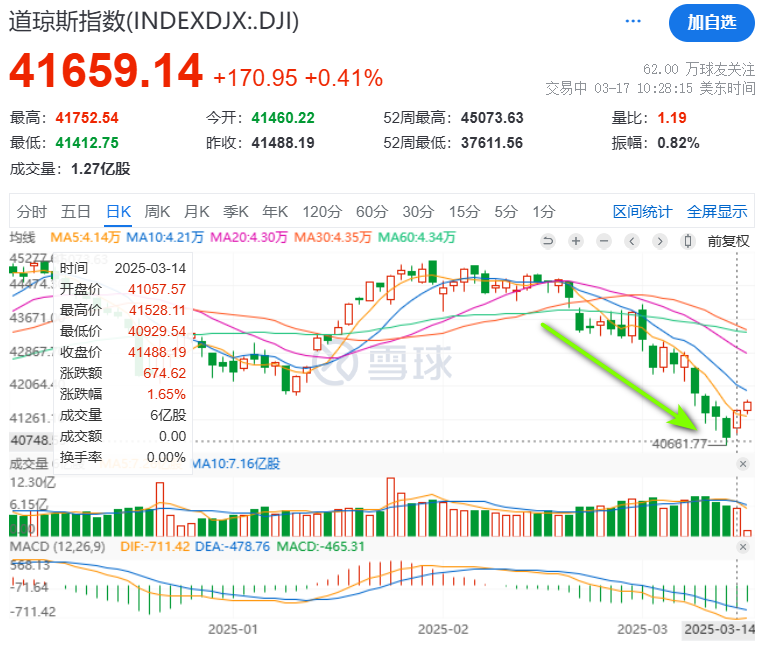
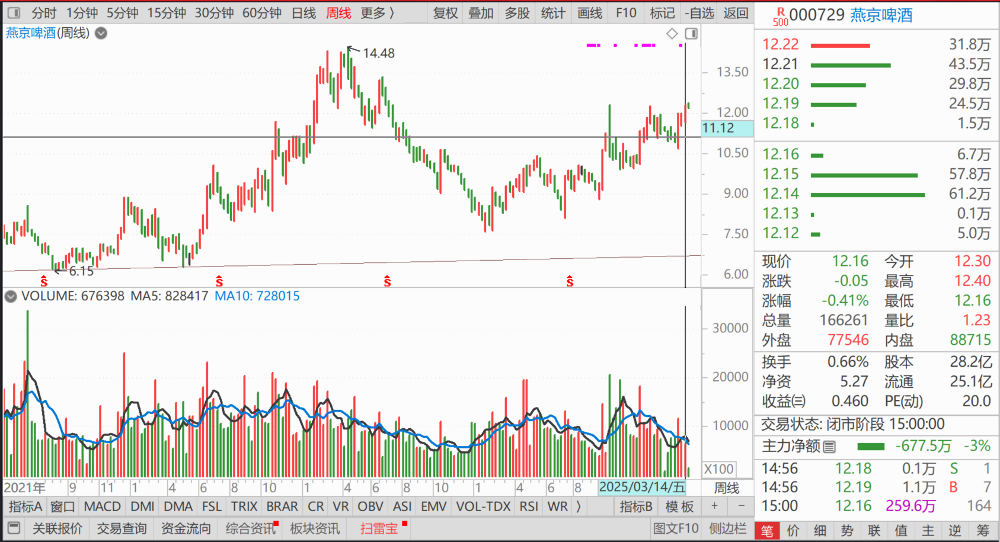
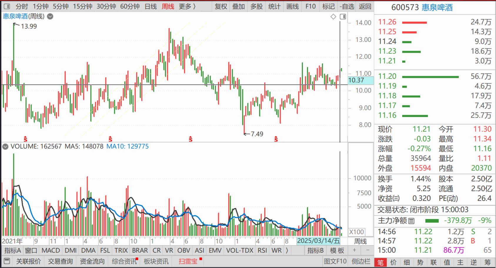
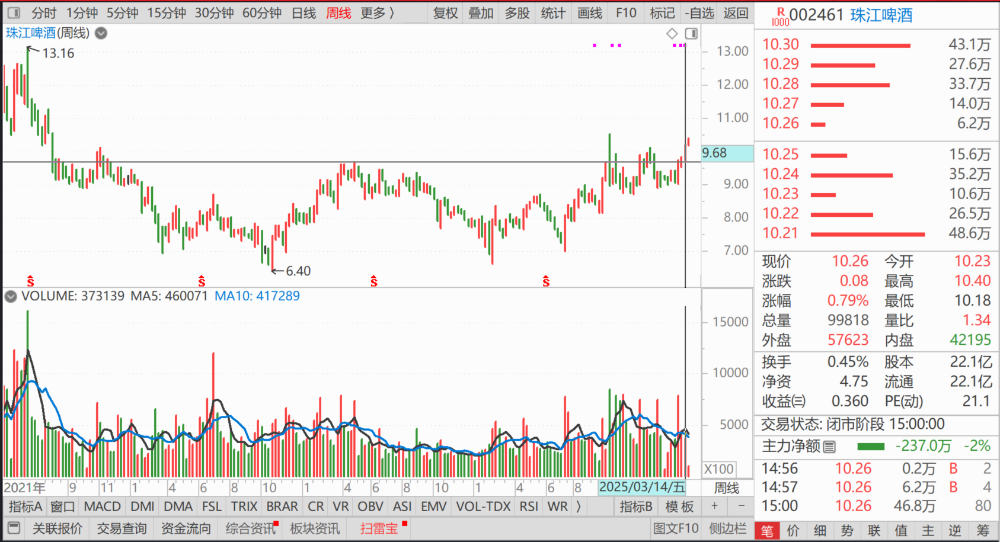

138篇.目前燕京、珠江、惠泉啤酒持仓处于历史高位

清一山长[2025年3月14日13:57](https://www.zhihu.com/pin/1883879524237832741)

刚刚看到股票普涨，心想有点不正常呀！就看了一下美股——原来美股这几天都在跌，还说股神但斌高位买多，现在亏惨了，美股跌了4000多点了。我一直说：**中国要涨，必须等美股跌。A股长牛的基础，建立在美股长熊的基础上。**这就是金融战。

所以美国这几年拼命维护美股，一直高高在上的，现在撑不住了。目前的走势，就正在验证这个逻辑。不过——美股是否还会继续跌就不知道了，是否会反弹？还会拉回来一波？我也不知道了。继续观察吧！如果下午继续涨，我计划减掉一点融资，然后等待。如果飞了，就算了。反正我绝对不会高位追涨的！

**目前燕京我的持仓处于历史高位**，跟主力的状态很相似——**主力现在的持仓肯定是8年来最高位。历史高价，叠加历史高位持仓，意味着未来创新高是肯定的！**我很满意现在这种状态，比我上一轮做得还好。感谢燕京主力拉到14元之后的大幅打压，给了我低位重新介入的机会，不然就踏空了！**珠江、惠泉，持仓也是历史高位，**会在上涨中减下来的。尽量把啤酒减到零成本来做十大股东，这样的炒股持仓的目标，也算是比较励志吧？惠泉已经实现了这个目标，珠江和燕京还要加油，但肯定也会实现的！它们都正在实现目标的路上。

（标题、图片为编者所加）

**文章音频**：

[546篇.目前燕京、珠江、惠泉啤酒持仓处于历史高位](http://link.zhihu.com/?target=https%3A//www.ximalaya.com/sound/826255005)

**参考链接：**
[130篇.无意中发现原来证券系统还有这个功能](https://zhuanlan.zhihu.com/p/23675222317)

[131篇.跌破11元买燕京，差价两元换珠江](https://zhuanlan.zhihu.com/p/24939243244)

[132篇.盈亏数百万都是假的，啤酒切换才是真的](https://zhuanlan.zhihu.com/p/26380209616)

[133篇.燕京跌了又涨，我没买也没卖](https://zhuanlan.zhihu.com/p/27431147176)

[134篇.重仓华菱钢铁的原因](https://zhuanlan.zhihu.com/p/28286645670)

[135篇.主升浪快来了，但我不贪心](https://zhuanlan.zhihu.com/p/30186294319)

[136篇.港股投资重点考虑国企红筹股](https://zhuanlan.zhihu.com/p/30187716852)

[137篇.中国建筑价格进入“关注”区间](https://zhuanlan.zhihu.com/p/32238604025)
