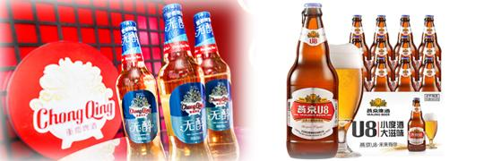
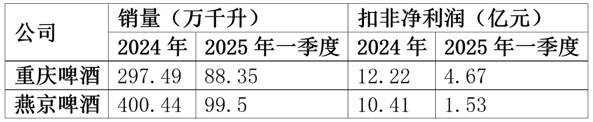
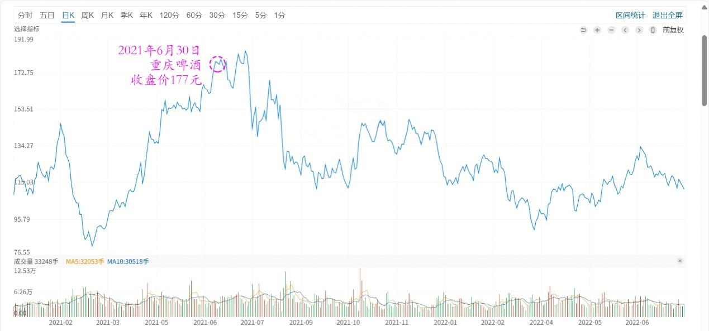
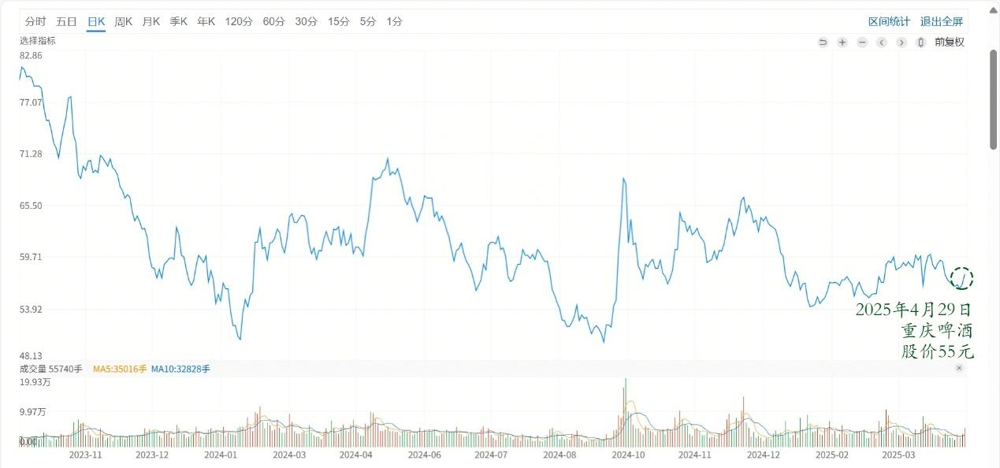
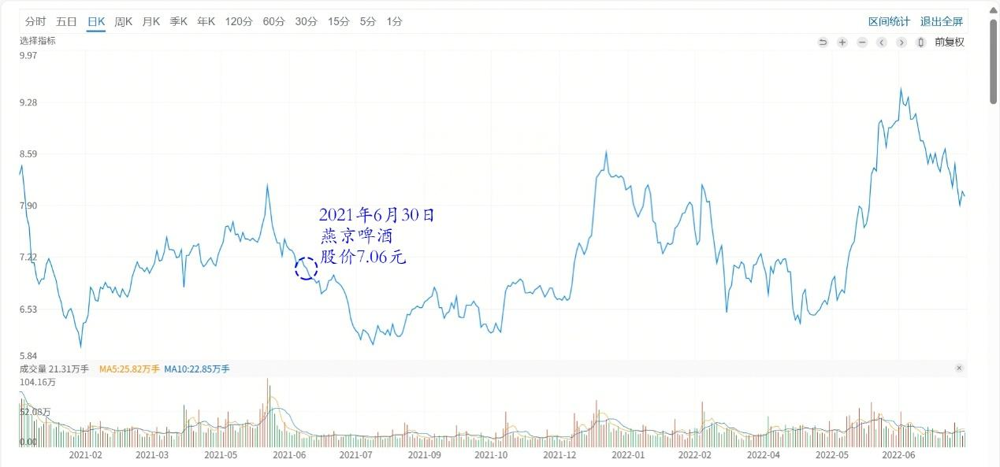
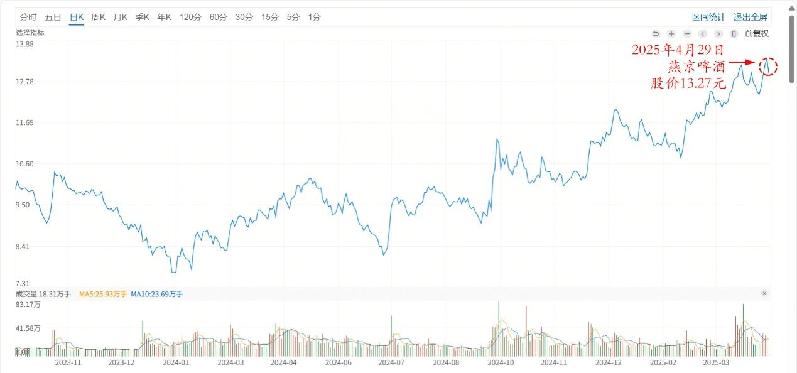

145篇.重庆啤酒和燕京啤酒的比较很有意思

清一山长[2025年4月29日11:14](https://www.zhihu.com/pin/1900508322924311740)

重庆啤酒和燕京啤酒两家公司的比较很有意思，销量上，两家公司差不多。利润上，现在两家公司还是差不多！但两家的股价差距还是比较大的！

重庆啤酒、燕京啤酒销量和扣非净利润

2021年6月30日，重庆啤酒的收盘价是177元，市值接近800亿！当时的燕京啤酒市值是200亿，股价是7.06元！重庆啤酒市值相当于燕京的四倍之多！妥妥的明星股，号称“啤酒茅”！

四年以后的今天，重庆啤酒的股价是55元，总市值是269亿元！燕京啤酒的股价是13.27元，市值是374亿，居然被燕京反超了100多亿！从投资者的角度来看，这四年投资重庆啤酒和燕京的差距，是6倍！意思就是：如果当年买了燕京而不是重庆啤酒的话，现在换重庆可以得到六倍之多的筹码。相反——当年买了重庆，今天想要来追燕京的话，只能得到4年前换筹码的六分之一！

重庆啤酒2021～2022年日线图

重庆啤酒2024～2025年日线图

燕京啤酒2021～2022年日线图

燕京啤酒2024～2025年日线图

市场真是有效的吗？是什么决定了，四年前的重庆啤酒，就比燕京值钱四倍？

是什么决定了，用现在的燕京去换重庆，就可以换到比4年前多六倍的股权？

我同意巴菲特的观点：**市场先生本质上就是疯子。我们不需去理解疯子，我们只需要利用疯子。**那么，你应该怎样利用燕京和重庆啤酒这样的市场先生疯子呢？拿出你们的判断，去行动吧！做对了，你有奖赏；做错了，你为自己的判断失误埋单！

（标题、图片为编者所加）

**文章音频**：

[557篇.重庆啤酒和燕京啤酒的比较很有意思](http://link.zhihu.com/?target=https%3A//www.ximalaya.com/sound/847073432)

**参考链接：**

[137篇.中国建筑价格进入“关注”区间](https://zhuanlan.zhihu.com/p/32238604025)

[138篇.目前燕京、珠江、惠泉啤酒持仓处于历史高位](https://zhuanlan.zhihu.com/p/32731653546)

[139篇.养老账户啤酒股只有惠泉了](https://zhuanlan.zhihu.com/p/1889669208637420823)

[140篇.美股大跌，买中国建筑](https://zhuanlan.zhihu.com/p/1892305962292991549)

[141篇. 对美国涨税的应对与分析](https://zhuanlan.zhihu.com/p/1894809673506485390)

[142篇.燕京换“其他”，新持仓冠农](https://zhuanlan.zhihu.com/p/1894809225684824644)

[143篇.融资大跌终爆仓，绩优股也套死人](https://zhuanlan.zhihu.com/p/1897413479624856474)

[144篇.啤酒突破性上涨，再涨就慢慢退出](https://zhuanlan.zhihu.com/p/1899847714302310085)

