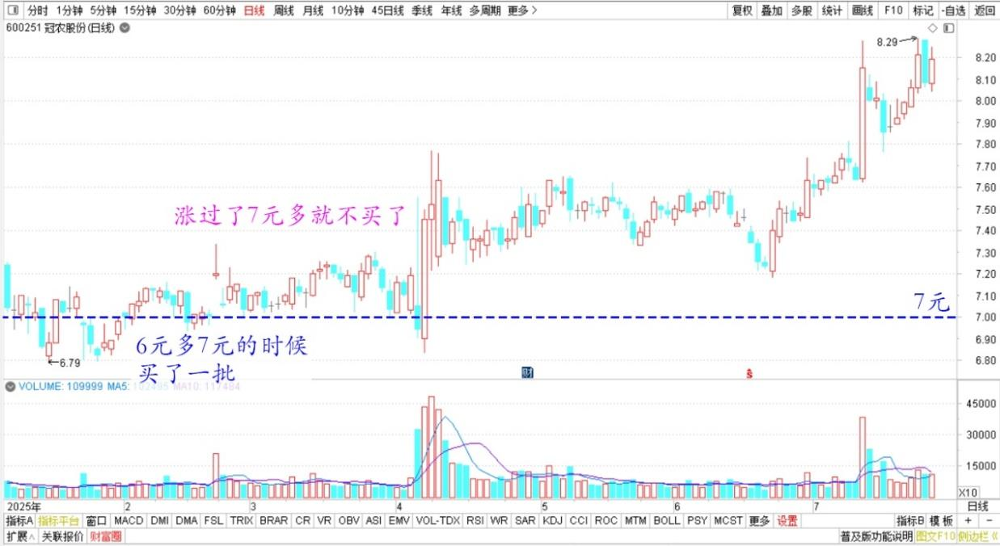
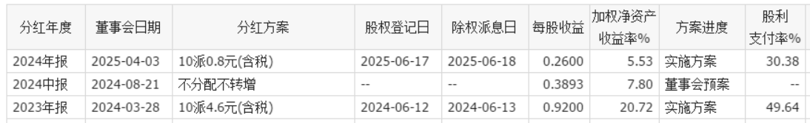
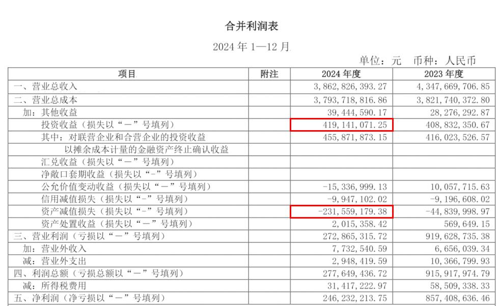
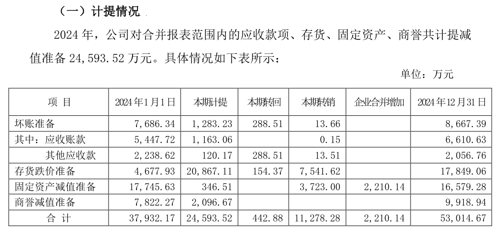
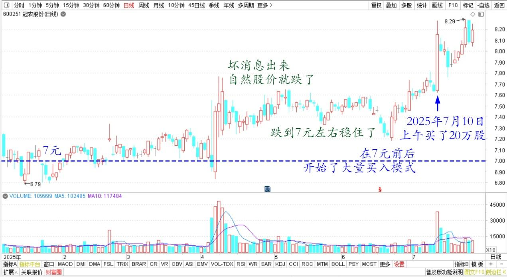
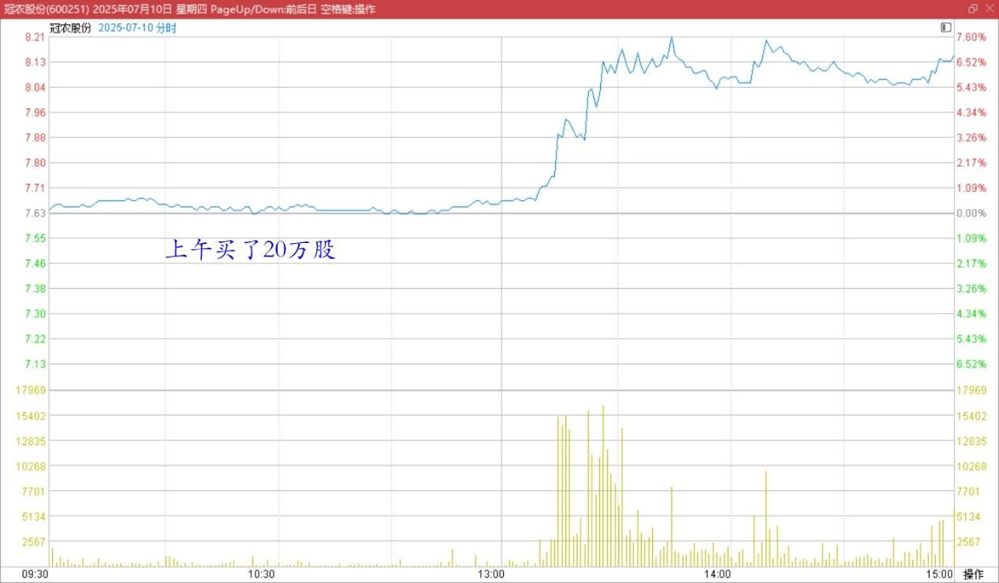

**165篇.反身性理论看冠农**

清一山长[2025年7月10日17:08](https://www.zhihu.com/pin/1926689326672123663)

冠农其实我不太懂。基本面东西资料很少！我在6元多7元的时候，我买了一批。因为不确定，所以不敢大买！后来涨过了7元多，我就不买了。

冠农股份2025年日线图

冠农的股息去年挺高的，是4.6元（10股），今年就突然崩溃大跌，只有0.8元了。

冠农股份2023～2024年分红方案

年初有消息出来：冠农业绩大降，惨淡至极。除了罗钾的分红，其他都亏了。而且，几个亿的亏损，计算原因是**“库存跌价损失”，俗称“我的存货肯定赔钱，提前算赔钱的账”。**

冠农股份2024年年报合并利润表

《新疆冠农股份有限公司 关于计提减值准备的公告》2025年4月3日

这个坏消息出来，自然股价就跌了，跌到7元左右稳住了。我看到坏消息出来，没发现本质上公司有啥变化。我认为：光靠罗钾的分红收入，冠农就值现在的市值。万一它别的有好消息，水电，以及糖、棉花、番茄等有业绩，我不就白赚了吗？我认为这是确定性的。

而且，这个坏消息，让我更加确定有资本要进入，盘面上，我也看到了资本进入的迹象，大鱼潜入进来了！也许我没有看到的好消息，他们知道。

**这两个确定性，让我知道：这就是索罗斯的反身性投资时刻到来了。**

**如果你确定知道自己不会输，输的空间不大（最多下跌30%），但上升空间比较大。你为什么不多买一点？**

因此我就在7元前后，开始了大量买入模式，一直在悄悄地买。甚至今天上午也买了20万股！各位也看到了，我在一季报进入十大了。

冠农股份2025年日线图

冠农股份2025年7月10日分时图

甚至，我很调皮，好几次把大鱼压盘的大仓位股票，一口气就吃掉了。但我不拉，吃完就不动了，不能影响主力的计划！

所以，其实我也挺坏的，悄悄地把主力鱼钩上的饵料吃掉，把钩子放回去。这个过程一直悄悄地在进行。冠农的股价，也慢慢的越走越高！

——现在跳涨，说明主力吸货已经完成了，不需要压盘了。但股价已经8元多了，我不会再买了。谁想买，自己买去。

我是左侧，我的时代已经过去了。

现在是右侧投资者进入的时候了，他们比我聪明，才能吃右侧的饭。

我不行，只能吃左侧，只敢吃左侧！我也愿意卖在左侧，不怕吃亏。卖了股价会更高，我也不追。

我已经开始买入别的一只股了，正好还是左侧期间，一样是符合反身性原理的好股票，符合“巴菲特模式（内在价值投资），加上索罗斯估值（反身性估值优势）”。

这只新股，也是“下跌20%都难，上涨两倍都可能”的股票。

我认为不比冠农差，不是中粮，大家别猜了。

也许将来十大出了，你会看到。但我应该不会进十大，因为有点贵！

**中国股市，永远有这样的好股等你买。所以不用急，每天研究，有机会就左侧卖出，然后左侧买入（不同的股）！**

**（标题、图片为编者所加）** **文章音频**：

[582篇.反身性理论看冠农](http://link.zhihu.com/?target=https%3A//www.ximalaya.com/sound/893732611)

**参考链接：**

[157篇.“不要股，只要价”看住自己的人品](https://zhuanlan.zhihu.com/p/1917575063177258074)

[158篇.涨了卖，不指望更高。跌了买，不指望更低！](https://zhuanlan.zhihu.com/p/1920256327327942427)

[159篇.差价6毛，惠泉值得拥有，差价3～4元，珠江更划算](https://zhuanlan.zhihu.com/p/1922686829653661294)

[160篇.贬低巴菲特，并不能让自己赚钱！](https://zhuanlan.zhihu.com/p/1925299829367608333)

[161篇.7年10倍利润增长](https://zhuanlan.zhihu.com/p/1927944535373247107)

[162篇.只想拿股息，没想赚快钱](https://zhuanlan.zhihu.com/p/1928066355866861887)

[163篇.比亚迪的对手，应该是丰田](https://zhuanlan.zhihu.com/p/1927780975305266754)

[164篇.如果德隆能坚持到今天](https://zhuanlan.zhihu.com/p/1932814644625510702)

