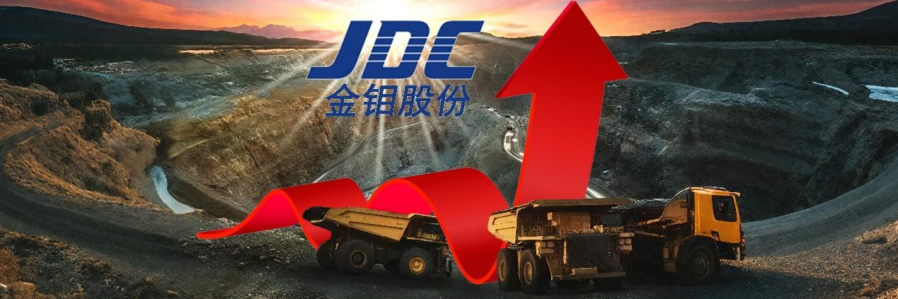
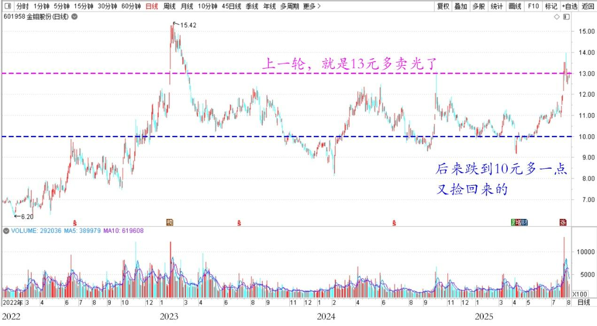
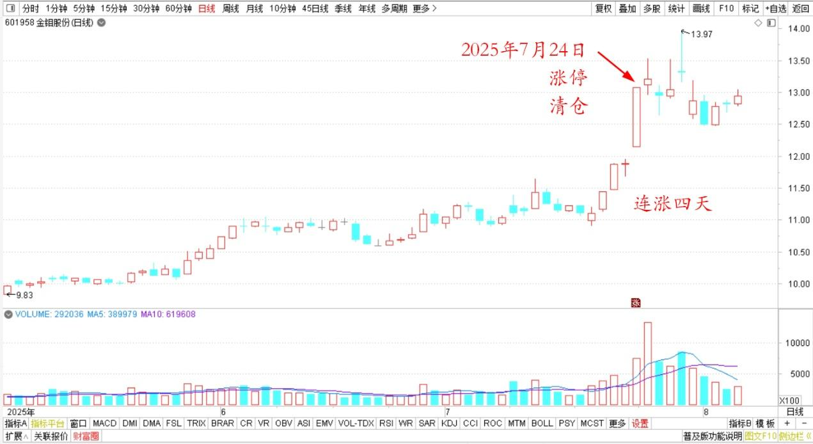
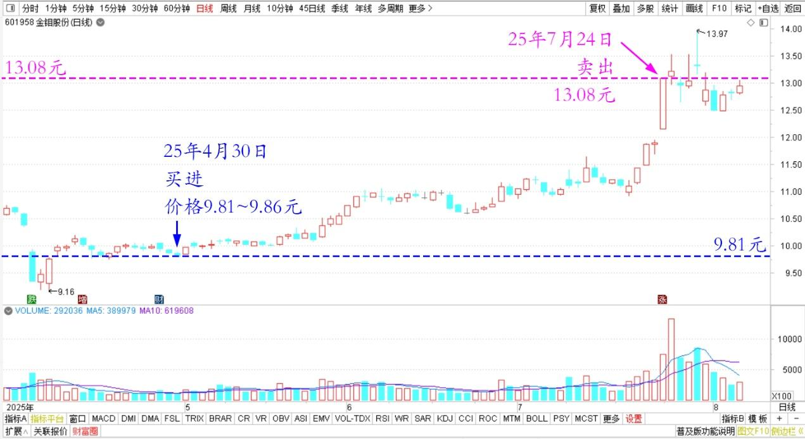
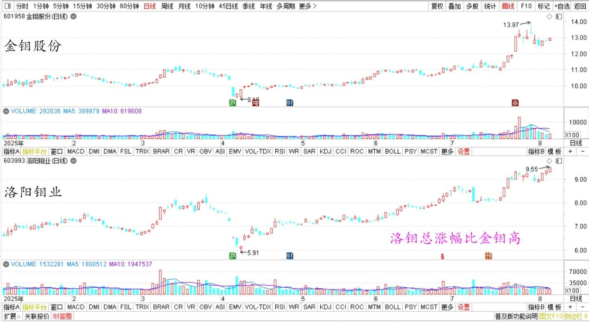
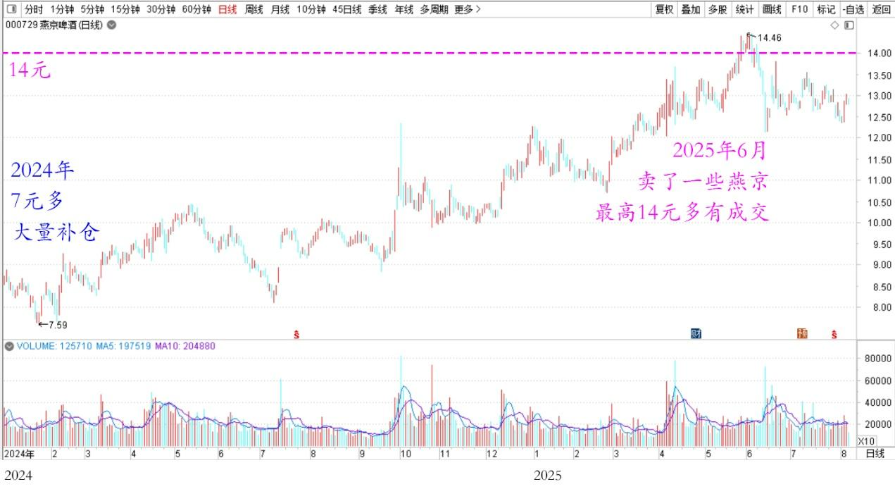

169篇.金钼股份涨停卖出

**清一山长[2025年7月24日14:09](https://www.zhihu.com/pin/1931717575680700541)**

**主帖：**

涨停了？好吧！我卖、我卖，我给你！

刚刚送刘老师去机场。回来睡了一觉，醒来还没去吃饭。小女儿中午去食堂打好饭了，我不想吃就放着了，吃了个水果就去休息了！

刚去看看股票的行情，怎么回事？突然就发现金钼股份上午就涨停了？上一轮，我就是13元多卖光了，后来跌到10元多一点，我又捡回来的，心想拿股息也成，今天涨停？连涨了四天？

算了，你们都想要，我就给你们吧！今天就全清仓了，不过手上持仓也不多，也就一百多万股，我两笔就全卖完了。我看了，两笔下去，对价格一点影响也没有。

金钼股份2022～2025年日线图

金钼股份2025年5～8月日线图

我还是用融资买的这一笔持仓。看看金钼的账面锁定的利润，这一只的利润，已经把我全部股票融资利息全都赚回来了。我就放心了，现有融资类持仓相当于零利息买股了。我没有融资利息压力，每笔分红，就算白赚的！

**我换个没涨的去，最好利息高一点。这个金钼股份，是战略物资。看样子还会涨，未来的远大钱程，就都送你们了，我不抠门，该大方的就大方。该放弃就放弃！我去收个你们不要的垃圾股去。**正好看到我想要的股票还没有涨，就是有点不好收。需要我慢慢地买，不能干扰市场，对吧？

**清一山长跟评主帖：**

刚刚看到我有本次金钼股份的交易明细：这批货，我是4月30日买进的，成交价格是9.81元～9.86元，融资买入。卖出价格是13.08元！我持仓周期很短，才两个多月呢！都还没焐热，就被你们的涨停热情骗走了[捂脸]。买入的时候，我算的是分红大致上相当于我的融资利息，准备零利润锁定十年不放的。战略金属，不怕长期拿，现在这么快我就被迫放手了，谁让你们给的太高、才两个多月就送了我超过30%的利润。我只想要2%的确定利润就满足了，这笔买入连1%都没有，你们却给了超过30%。[捂脸][捂脸]

金钼股份2025年4～8月日线图

郑*芳2025-07-24跟评主帖

山长总是这么慷慨，别人排队抢股票时，您就大大方方的让出去。分享盈利，收获更多的盈利！感恩山长示范！随喜赞叹山长盈利多多！[拜托][赞][感谢]金钼上一轮高位我只留100股做纪念，后来注意力放在洛钼了，这100股就收藏着吧！[大笑]

清一山长回复郑*芳

洛钼的收益也不错的，总涨幅比金钼高[赞]。我也大仓位持有，比金钼多多了，依然拿着不放手。

我的观点就是——涨停就是出来秀的。我不喜欢秀，所以就卖了算了。卖错也认了！洛钼没有秀身材，我就继续持有。[感谢]

金钼股份、洛阳钼业2025年日线图

一年呀2025-07-24跟评主贴

恭喜山长[庆祝][庆祝][庆祝]，全仓燕京一个多月了，期待下次山长亮燕京的肌肉。

清一山长2025-07-24回复一年呀

**一个月前，我刚卖了一些燕京，最高14元多有成交。我的燕京持仓成本才1.1元！[飙泪哭]去年7元多的时候，干嘛不买？现在来买？我就是去年大量补仓的！**

燕京啤酒2024～2025年日线图

[海燕](https://www.zhihu.com/people/hai-yan-80-58-42)2025-07-24广东

山长收的啥？透露点滴[感谢]

[山长 清一](https://www.zhihu.com/people/shan-chang-qing-yi)2025-07-24泰国回复[海燕](https://www.zhihu.com/people/hai-yan-80-58-42)

我当被告，你陪我吗？清黑正想抓我操纵市场的把柄呢[捂脸]

[abei](https://www.zhihu.com/people/liu-li-li-2-76)2025-07-24北京回复[山长 清一](https://www.zhihu.com/people/shan-chang-qing-yi)

估计清黑也没挣到钱，看到山长挣钱，他们就生气。不像我们傻财猫，傻啦吧唧的还很能赚钱。

[山长 清一](https://www.zhihu.com/people/shan-chang-qing-yi)2025-07-24泰国回复[abei](https://www.zhihu.com/people/liu-li-li-2-76)

估计清黑就是高位追涨，被套了，看我卖出了，他认为亏了，就怪我操纵市场了。下跌的时候，清黑吓坏了就卖掉，想等跌得更惨。但看我买了，股价回升了，踏空了，因此恨我抢了他的筹码！现在我就只好不说了。[捂脸]

**（标题、图片为编者所加）** **文章音频**：

[586篇. 金钼股份涨停卖出](http://link.zhihu.com/?target=https%3A//www.ximalaya.com/sound/897728292)

**参考链接：**

[163篇.比亚迪的对手，应该是丰田](https://zhuanlan.zhihu.com/p/1927780975305266754)

[164篇.如果德隆能坚持到今天](https://zhuanlan.zhihu.com/p/1932814644625510702)

[165篇.反身性理论看冠农](https://zhuanlan.zhihu.com/p/1932822111392621569)

[166篇.什么是匮乏之心？什么是富足之心？](https://zhuanlan.zhihu.com/p/1933972314027984331)

[167篇.一年20倍，是怎样做到的？](https://zhuanlan.zhihu.com/p/1936417228665881673)

[168篇.卖出10万股燕京还融资](https://zhuanlan.zhihu.com/p/1937126670973776622)

