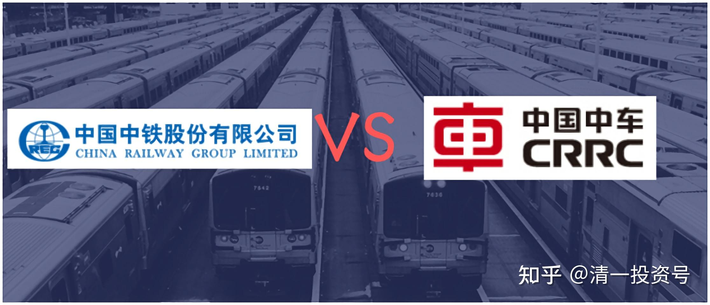
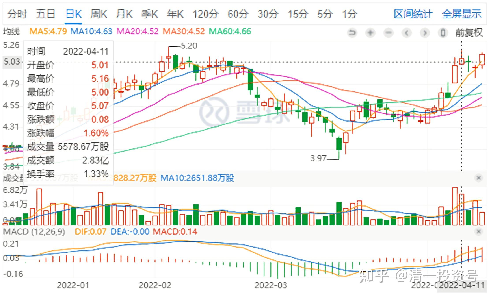
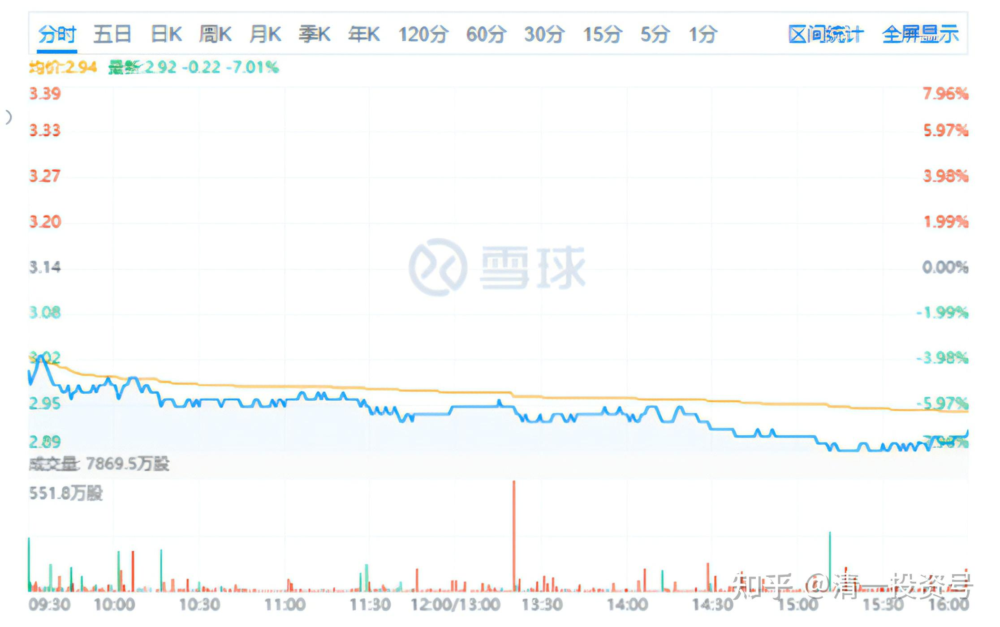
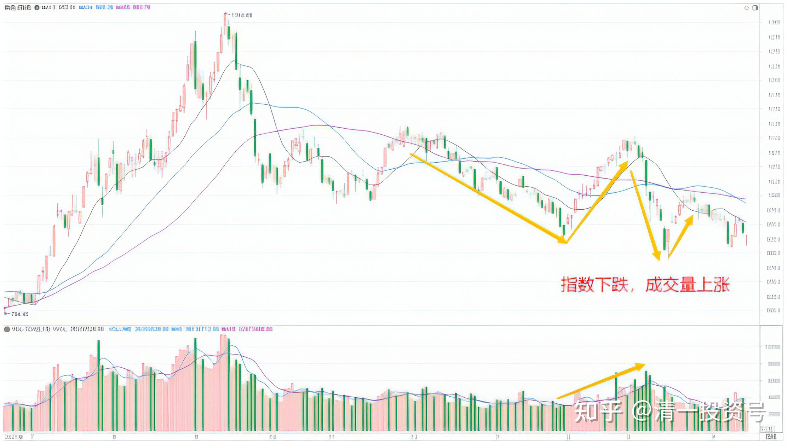
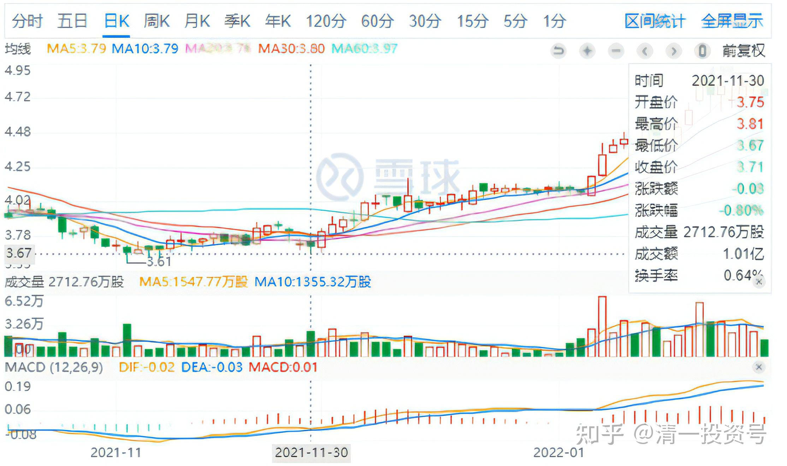

16篇.中国中车与中国中铁

清一山长2022年4月13日

**一、现在：中铁换中车**

今天有色涨了不少，大家应该有收获，其实前天我都还在买有色的。昨天就停手了，没开账户。今天有色继续大涨。可是，也很意外地看到中国中车大跌。据说一季度利润少赚了90%。吓坏场内资金，都往外跑掉了，H股跌得比A股还凶。

我上一次，买入中国中车是美国制裁中车，导致跌破3港币，2元多的“大国重器”。像话吗？于是，我“为国护盘”，勇敢买入中车H股，不套我套谁？买了大约200万股左右，结果没多久，中车又跌了一点之后开始反弹。虽然涨的不多，我3.8元左右，手上缺钱就卖掉了。因为当时觉得才3.6港币的中国中铁很有吸引力，**看股价像是要破产的样子，惨极了，但看成长，比中车好多了，**除非分红差一点。所以，我基本上就用了涨的中车，以及后来的宏桥等股票，一路上换了不少中国中铁进来。前两天，4月11日，中国中铁冲5.16元，我基于获利就收一点钱回来的态度，卖掉了20万股（只占我持仓很少的比例）。今天看账上的钱还没用掉，就正好用来买中车了。刚才，花了2.90元，买了三十多万股中车进来，也算“拯救老相好”。2014年首次开仓中车，就帮我赚了不少，一直沉寂到现在，真的是风水轮流转。可见**，在中国，不能完全坚持巴菲特的方式，而要学会让利——也要学会“买亏”，**中车这笔买入，将来赚不赚不说了，起码把原来的利润（约200M港币的总利润）再买入，维护我们的大国重器吧!

**跟随国运，我相信不会太差。这样换股，我手上持有的股票只会越来越多，虽然账面上也没涨多少。这就是赚股的原理。**

*（中国中铁H 2022-4-11）*

*（中国中车H 2022-04-13）*

我相信一旦港股，A股大涨，重新回到2015年的样子，我的会比市值要比2015高很多的，因为这两年我持仓的股票多了很多。很多股票，我是用高于2015峰值一倍多的总资金，买入了相当于2013年价格的股票。你说未来不是很明确的吧？我差的就是一个“中国牛市”，**现在看，中国牛市已经跃跃欲试了。**（**最近的有色走势很怪异，大幅杀跌，大幅拉涨，大资金已经进入了，正在折腾，你们耐心等待。别做反了**）。

*（有色板块2021年7月至今 日K线图）*

对于股价下跌：中国中车管理层申明：股价受多种因素影响，目前，公司基本面未发生重大变化，生产经营稳定。我选择相信中国中车不会垮，这就是我买入的理由。**今年分红50多亿元，像是要垮的样子吗？**

说明：4月11日，中国中铁冲5.16元，我的成交价是5.09元，没卖到最高价，也很满足了。但大仓位，我依然没卖。只是我喜欢随时换点零钱用。**我认为中国中铁不是5元的命，没找到可以完全替换她的股票，我是不会出光的。**不像中国中车，我认为当时才3.6元左右的中国中铁，与3.8元的中国中车相比，中车的价值不如中铁，所以这个价格，几乎完全卖掉了中车，账上面只剩了5万多股。**但现在5元的中国中铁，是不是真的不如2.90元的中国中车？**需要全部换过来吗？我还没有做出这个判断，不然也全换了。虽然红利上，中国中车很大方。中铁如果继续涨，中车继续跌的话，不排除我继续换。

二、**记录——中车换中铁**

山长 清一2021/12/27

对了：宣布一下，原来美国制裁的时候，投机买入的中国中车H股，这笔持仓，已经在前段时间卖掉了，账面利润赚得不多，就几百万港币。我换了3.6元多的中国中铁。

*（中国中铁在2021年11月处于3.6-3.8元区间)*

因为我认为中国中铁的成长性超过中国中车，它们也算一家子人，都是吃中国铁路这一碗饭的。既然我是买股票的人，当然就买入更低估，更有成长性的中国中铁H股了。后来是中国中车股票下跌了10%左右，中国中铁上涨了10%左右，看样子，这一次我换对了[大笑]。以后对不对就不知道了。这种持仓是长期持股，拿红利过日常的。所以就是闭眼买的。涨不涨我不太关心。

**附1：**中国中车一季度业绩预减公告

链接[https://stockn.xueqiu.com/01766/20220412180879.pdf](http://link.zhihu.com/?target=https%3A//stockn.xueqiu.com/01766/20220412180879.pdf)

**附2：**中国中车2021年派息公告

链接：**[https://stockn.xueqiu.com/01766/20220330145302.pdf](http://link.zhihu.com/?target=https%3A//stockn.xueqiu.com/01766/20220330145302.pdf)）**

**附录3：**相关文章《30篇.投资中国中车的理由（一）》

链接：[https://zhuanlan.zhihu.com/p/500463886](https://zhuanlan.zhihu.com/p/500463886)

（标题为编者所加）

参考链接：

[清一投资号：30篇.投资中国中车的理由（一）](https://zhuanlan.zhihu.com/p/562828027)（整理文）

[清一投资号：31篇.投资中国中车的理由（二）](https://zhuanlan.zhihu.com/p/504483885)（整理文）

[清一投资号：32篇.中国中车：敢于融资持有](https://zhuanlan.zhihu.com/p/508326510)（整理文）

[清一投资号：33篇.关于中车的换股操作](https://zhuanlan.zhihu.com/p/514998133)（整理文）

[清一投资号：34篇.中国中车的技术分析](https://zhuanlan.zhihu.com/p/521835261)（整理文）

[清一投资号：35篇.评论几个关于中车的观点](https://zhuanlan.zhihu.com/p/524719401)（整理文）

[清一投资号：37篇.在美国制裁之前关于中车的操作](https://zhuanlan.zhihu.com/p/527206511)（整理文）

