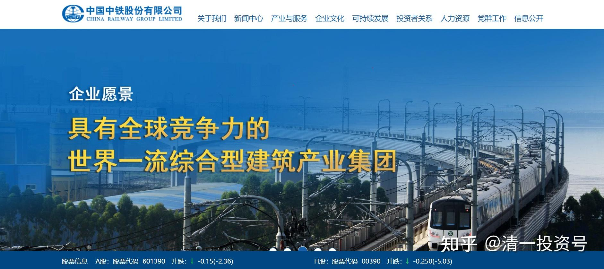
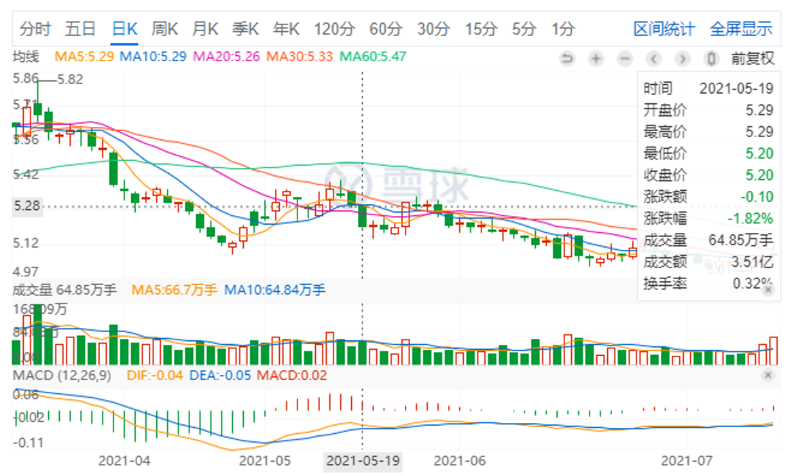
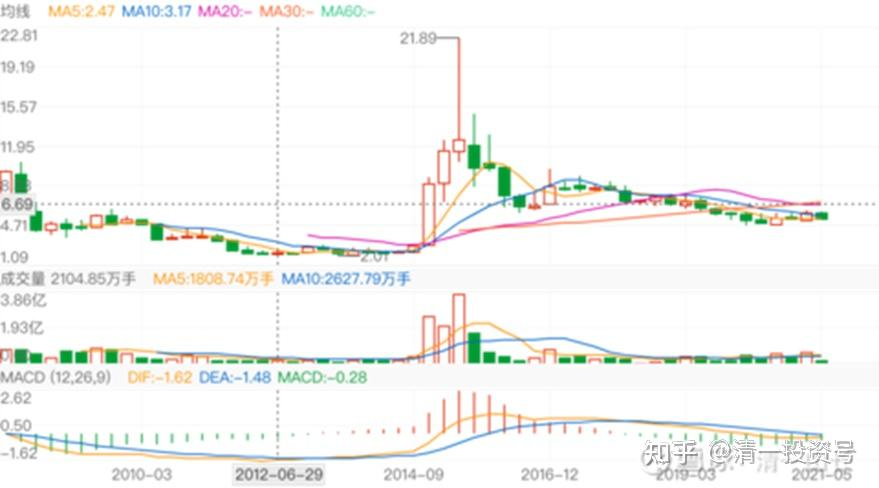
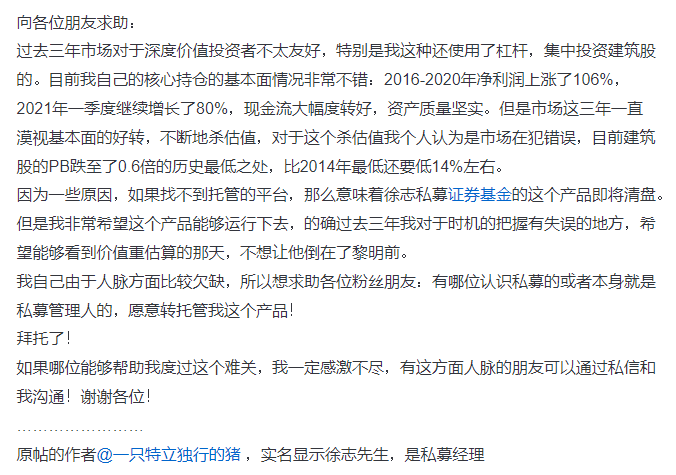
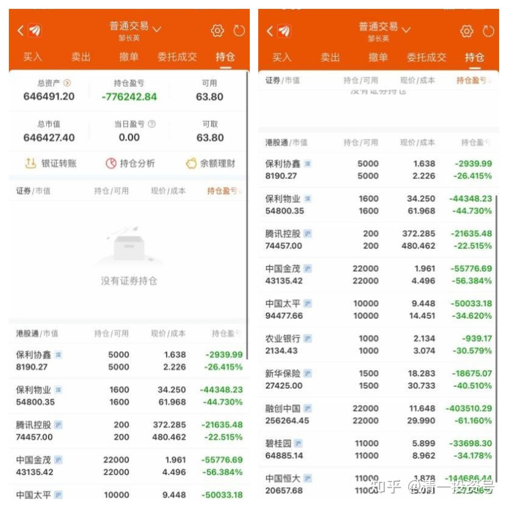
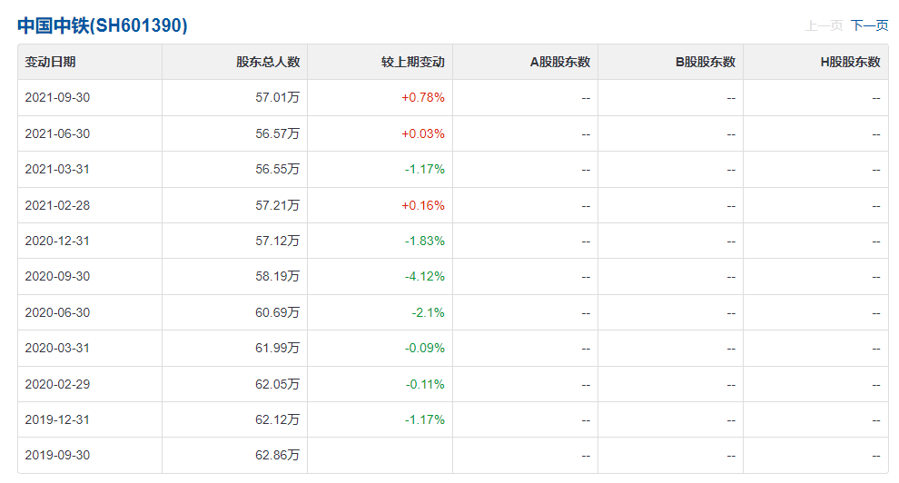
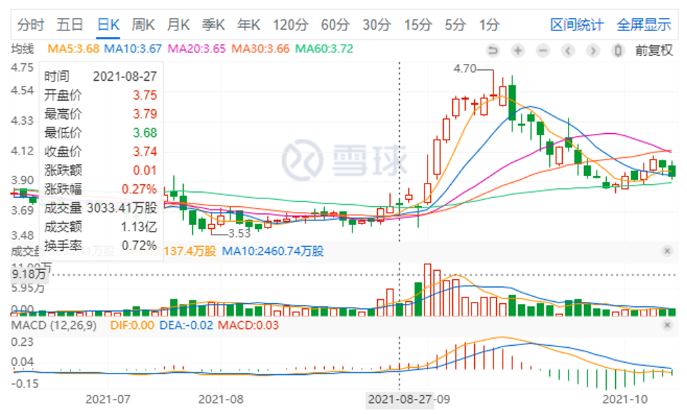
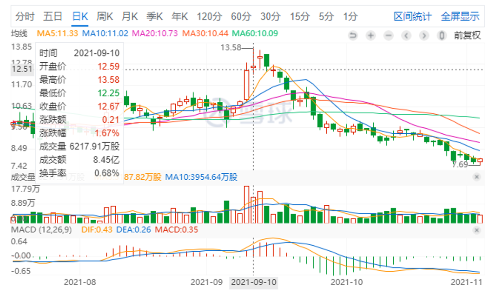
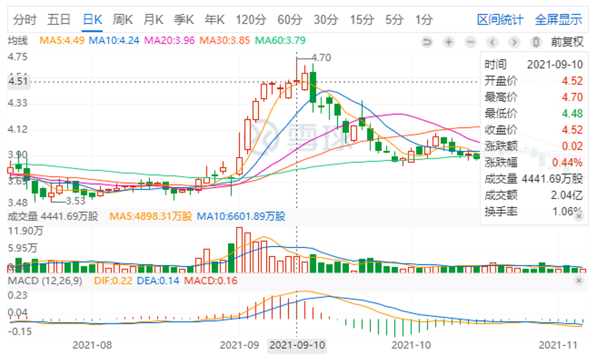

16篇.重仓中国中铁——中铁相关的九个提示

清一山长 2021年5月~10月

1.不买赛道股

[清一山长](http://link.zhihu.com/?target=https%3A//xueqiu.com/9310099567) 2021-05-19 19:19

*中国中铁5月19日的股价和交易情况*

[$中国中铁(SH601390)$](http://link.zhihu.com/?target=http%3A//xueqiu.com/S/SH601390)

当年的赛道股，当年疯狂上涨，现在年年下跌，中国的股市，就是这样的不可思议。中国中铁，2014年从2元直接冲到9元，上涨四倍多，第二年冲高到21元，涨了十倍。当年的中铁，其实风光不亚于现在的茅台。冲涨的幅度，比茅台还高。2015年之后，很不幸就是一路的向下，走势比中国建筑惨多了。其实我2014年与中国建筑一起买了中国中铁的，我记得买入理由，是比尔·盖茨的基金也买了她。价格2元多一点点。但后来上涨，我过早卖出，没有赚到大钱。直到今天都没有重新买进。

**但现在，有了一点点买入的冲动-----因为跌得太惨了！**实际上，现价买入，已经低于2014年的估值了。特别是港股。才3倍多的市盈率，我认为比银行的估值都低了。但她的经营风险，显然不如银行高。而且-----每股利润1元多。2014到今天，7年了，股票价格才涨了3元。赚的都不止3元了。我不相信她未来七年都不涨。

当年的赛道股，今天是这幅模样，他每年照样赚钱，甚至赚钱更多了。资金却离开了她。今天的赛道股，您认为“不一样”吗？**您可以不买中国建筑，不买中国中铁不买中国铁建，但我提醒您:有钱也别去买赛道股，当心拿了之后跟你玩【七年跌】。[笑]**

*中国中铁2014年高位*

**2. 别乱用杠杆**

[十一面](http://link.zhihu.com/?target=http%3A//xueqiu.com/n/%25E5%258D%2581%25E4%25B8%2580%25E9%259D%25A2):回复[清一山长](http://link.zhihu.com/?target=http%3A//xueqiu.com/n/%25E6%25B8%2585%25E4%25B8%2580%25E5%25B1%25B1%25E9%2595%25BF):

山长，如何看有私募加杠杆拿了中国建筑三年左右最近要清盘结算了，网上寻找接盘方。

[清一山长](http://link.zhihu.com/?target=https%3A//xueqiu.com/9310099567) 2021-05-24 17:24 回复[十一面](http://link.zhihu.com/?target=http%3A//xueqiu.com/n/%25E5%258D%2581%25E4%25B8%2580%25E9%259D%25A2):

他买的主要是中铁吧？

中建最近三年没赚钱，但赔钱也难！

杠杆使用要小心！什么好东西，都会跟玩破产的。

记得几年前，香港一批人，把比亚迪疯狂打低。因为内地一商人，40多元买了几十亿的比亚迪。结果这群狼打压到18元。我当时看了其实很想买，可惜没买。现在看比亚迪多少价了？

但当年，这个几十亿的主儿，全仓比亚迪的，就爆仓了。

今天看这个价，他会咋想？

这些都是别人经历的故事。**所以---真的别乱用杠杆！**

**3. 别持有现金，请持有资产**

**[清一山长](http://link.zhihu.com/?target=https%3A//xueqiu.com/9310099567)** 2021-05-30 20:41

**[中国放弃汇率目标：资产价格上升时代的投资策略](http://link.zhihu.com/?target=https%3A//xueqiu.com/2684655177/181252586)**

中国宣布放弃汇率目标，金融之争迎来大变局

我不知道是否未来真的这样走。但中国人显然不想继续为美国人打低端工了。未来全世界物价上涨，几乎是必然的，便宜的资产会到处争抢的。钱会多得你想象不到，流动性泛滥。

楼市现在不让资金进去，资金会买很多东西，估计珠宝啥的也会大涨吧？当然，教育资源、[医疗](http://link.zhihu.com/?target=https%3A//xueqiu.com/S/SZ159891%3Ffrom%3Dstatus_stock_match)资源也会涨的。我认为：现在大家如果手上有钱，可以去买点矿存起来。**（[中国中铁](http://link.zhihu.com/?target=https%3A//xueqiu.com/S/SH601390%3Ffrom%3Dstatus_stock_match)）家里就有矿，建议买便宜的H股。**

这种资源股，也许是下一波资源和资本价格狂涨的标的。可惜去年的[中国宏桥](http://link.zhihu.com/?target=https%3A//xueqiu.com/S/01378%3Ffrom%3Dstatus_stock_match)持有少了一点，这就是家里有矿的好处，宏桥涨幅明显大于[中国铝业](http://link.zhihu.com/?target=https%3A//xueqiu.com/S/SH601600%3Ffrom%3Dstatus_stock_match)。现在国外矿价狂涨，中国输入性通胀是必然的。为了压制，中国减产，会让世界的通胀更加严重。有钱买不到货的时候，中国的产品未来价格大涨是必然的。

**一句话：别持有现金了，请持有资产！**

守一不移168:回复清一山长:

山长，为何你只拿中建，不建仓中铁？它也被严重低估。

**[清一山长](http://link.zhihu.com/?target=https%3A//xueqiu.com/9310099567)** [2021-06-09 16:11](http://link.zhihu.com/?target=https%3A//xueqiu.com/9310099567/182276991)**回复[守一不移168](http://link.zhihu.com/?target=http%3A//xueqiu.com/n/%25E5%25AE%2588%25E4%25B8%2580%25E4%25B8%258D%25E7%25A7%25BB168):**

我有中铁。2014年就买过中铁，赚了不少（比率）。现在港币4元，也买了一些拿着。

**不推荐的原因是：中铁一贯大起大落。一般人不容易掌控。 **

**4. 徐志清盘事件：别人看到的是笑话，我看到的是大好机会**

[撬动一个地球](http://link.zhihu.com/?target=https%3A//xueqiu.com/1463802293) 来自雪球[发布于2021-07-10 21:50](http://link.zhihu.com/?target=https%3A//xueqiu.com/1463802293/190033758)

《大结局：在牛市里亏到清盘的雪球私募大佬最终怎么样了？》

[https://xueqiu.com/1463802293/190033758](http://link.zhihu.com/?target=https%3A//xueqiu.com/1463802293/190033758)

[清一山长](http://link.zhihu.com/?target=https%3A//xueqiu.com/9310099567) [2021-07-13 15:09](http://link.zhihu.com/?target=https%3A//xueqiu.com/9310099567/190283134)

【向各位朋友求助:过去三年市场对于深度价值投资者不太友好，特别是我这种还使用了杠杆，集中投资建筑股的。目前我自己的核心持仓的基本面情况非常不错: 2016-2020年净利润上涨了106%，2021年一季度继续增长了80%，现金流大幅度转好，资产质量坚实。但是市场这三年一直漠视基本面的好转，不断地杀估值，对于这个杀估值我个人认为是市场在犯错误，目前建筑股的PB跌至了0.6倍的历史最低之处，比2014年最低还要低14%左右。】

你们为什么非要把徐志清盘的标的，跟中国建筑捆在一起？别人明明说的是另一只建筑股。看徐志的原贴：中国建筑今年一季度涨了80%吗？我咋不知道？2016-2020年净利润涨了106%，我咋不知道？

你们对对号，就知道他说的是中国中铁。

2018年的8元，跌到现在的5元。中国建筑18年收盘价6元多，跌到现在接近5元。跌幅上，的确中国中铁更残酷。如果他真买了中国建筑，还不会这么惨的。（其实我相信中国中铁会涨回来的，需要一点时间。这个股的弹性特别好，比中国建筑弹性好---也意味着风险回报比较高）

虽然中国建筑也不咋的，但不要把这种明显不是事实的事情到处传播。

[清一山长](http://link.zhihu.com/?target=https%3A//xueqiu.com/9310099567) [2021-8-10 17:01](http://link.zhihu.com/?target=https%3A//xueqiu.com/9310099567/193758557)

**对于很多就没赚过大钱的小人物来说，能够出来批评一下成功人物，可以充分满足自己的成就感。也是一个廉价的精神鸦片，何乐不为[俏皮]。**

巴菲特买了可口可乐，15年没涨。买了IBM，就是不买微软，十年后亏本退出，同期微软涨到天上，也没人说他不会价值投资。但邱总的基金三年没涨，就被无名小卒嘲弄成这样。我们这个社会是不是太浮躁了一点？

徐志的基金清盘，一堆人看他的笑话。找理由说他买错了。干嘛不反向思考一下:徐志敢拿一生信用单吊一只中国中铁直到清盘，你干嘛不敢现在抄底？当年董宝珍单吊贵州茅台差点破产，打赌贵州茅台不会跌破150而裸奔，被人嘲笑的时候，你不笑，而去买入，今天不赚大发了吗[为什么]。干嘛要嘲笑别人呢？记得当年茅台170元时还做空茅台的人，媒体上接受采访得意洋洋，今天又如何了？影子都不见了。

当年我没买茅台，我顶住嘲笑的压力，买了14元的五粮液，16元的泸州老窖。现在吹白酒赛道好的大V，当时何在？股市不要用一两年看得失。三年，五年的寂寞耐不住，别来股市玩。

**徐志的中国中铁，我现在买入了，就因为看到他清盘，我开始研究，认为他没错，只是运气不好。**我买入再等四年，看你会让我破产不。我用港股通买入，无杠杠。3元多价位，分红7%，不比茅台更香吗？M级仓位求爆仓，就要跟市场反作**，死也死在不随大众的路上[加油][加油][加油]。**

[清一山长](http://link.zhihu.com/?target=https%3A//xueqiu.com/9310099567) [2021-08-13 16:45](http://link.zhihu.com/?target=https%3A//xueqiu.com/9310099567/194167029)

[$中国中铁(SH601390)$](http://link.zhihu.com/?target=http%3A//xueqiu.com/S/SH601390)

今天干了一件笨事：卖掉涨了的中国宏桥，买入六年都不涨的、还让徐志清盘的中国中铁。卖了接近100万股01378，收盘价11.64元。买入00390，3.63—3.65元买入。这种卖掉强势股，买入弱势股的举动，基本上会被人认为是弱智才干的事情。

我查了一下：三年前00390的收盘价是6.26元。01378的收盘价是3.61元，都是前复权价。一股00390，几乎可以换快两股的01378，去年01378最低才2.88元。今天我用一股01378，就可以换3.5股中国中铁，如果有一天，市场回到2018年的估值，我不就多赚了6—7倍吗？

三年前，徐志看好中国中铁，我看好中国宏桥，我们都有各自看好的理由，市场也给出市场的合理价，其实这三年，中国中铁都在高成长，反而宏桥的成长模式被卡死了，合规产能从800多万砍到616万。可中国中铁这几年反而开辟了更大的成长空间，却一直跌跌不休。现在是我运气好，我死守的股涨了，他看好的却跌了。万一未来三年该我倒霉，市场先生翻过来定价咋办？所以我今天转投倒霉的一方， **丢掉一百万股强势股，换3M多的弱势股，**看未来三年游戏又咋玩[想一下]。现在宏桥持仓不足2M了，最高5.58M。我边涨边换吧。

各位，我换股有啥毛病不[为什么]？

请指点[献花花]。

[大股爱好者](http://link.zhihu.com/?target=https%3A//xueqiu.com/u/3150370447)2 回复 清一山长:

中国中铁月均线基本走平了，中国铁建和中国交建还是下降趋势，所以买中国中铁，对吗？

[清一山长](http://link.zhihu.com/?target=https%3A//xueqiu.com/9310099567) [2021-08-13 17:46](http://link.zhihu.com/?target=https%3A//xueqiu.com/9310099567/194174683) 回复 大股爱好者2

**换股，我没当它是基建股，是当有色股换的，长持股。**用来抵消货币放水的。基建部分算是白送的[加油]。

[清一山长](http://link.zhihu.com/?target=https%3A//xueqiu.com/9310099567) [2021-09-01 10:40](http://link.zhihu.com/?target=https%3A//xueqiu.com/9310099567/196293796)

[$中国建筑(SH601668)$](http://link.zhihu.com/?target=http%3A//xueqiu.com/S/SH601668)

跌了几个月，一天就涨回来了。所以，做左侧，其实很安全。跌一点就叫，太沉不住气了。左侧看上去很傻，买了就跌，卖了还涨，但这种人很难输掉的。**左侧唯一不好的，很需要耐心，还要放弃贪心。两心不到，做不了左侧的**[加油][加油][加油]。

今天中国中铁也大涨，刚买成重仓的。是我最短时间的左侧。有时，左侧必须以年为单位买入，当最看好的人都守不住了，基本上就到底了。徐志的基金坚持几年买中国中铁清盘了，**你们都在看他的笑话，我看到的，是大好的、难得的机会，让我看到了中国建筑外更好的机会。**所以，**多一点恭敬心，多尊重别人，多去理解别人，是有好处的。**徐志当初是看好中国建筑的，研究中国建筑也很多。最后居然重仓的是中铁，一定是他看到了我没看到的东西。所以，我在找他看到了啥？**最后我看到了，所以也大仓位买入了**。今天赚得比中国建筑的还多多了。毕竟正好在底部买进，中国建筑5元就买还套牢。所以中铁的运气好[加油][加油][加油]。

**这段时间，我也不怕忌讳，示范买这两个建筑股。就因为我认为跌不下去了，超级安全，才鼓励大家买的。**似乎跟进的人不多。可能多去买贵州茅台了，成交量这么大。中国建筑比贵州茅台赚钱还多，十年成长也不比贵州茅台差，你非要去买贵20倍市值的，我看有点傻[大笑]。原来就公开发帖说过的，估计有人就是看不懂。

**5. 重仓两大建筑**

[yimeiwp7](http://link.zhihu.com/?target=http%3A//xueqiu.com/n/yimeiwp7):回复[清一山长](http://link.zhihu.com/?target=http%3A//xueqiu.com/n/%25E6%25B8%2585%25E4%25B8%2580%25E5%25B1%25B1%25E9%2595%25BF):

就是不知道我老公死抱中石油对不对？[大笑][大笑]

[清一山长](http://link.zhihu.com/?target=https%3A//xueqiu.com/9310099567) [2021-09-01 10:55](http://link.zhihu.com/?target=https%3A//xueqiu.com/9310099567/196298347)回复[yimeiwp7](http://link.zhihu.com/?target=http%3A//xueqiu.com/n/yimeiwp7):

股市没有对错，只有输赢[俏皮]。**在我的逻辑里面，是几只建筑赢面最高，所以押宝中国建筑，中国中铁。**

[晕娜](http://link.zhihu.com/?target=https%3A//xueqiu.com/u/1845773477) 回复[清一山长](http://link.zhihu.com/?target=http%3A//xueqiu.com/n/%25E6%25B8%2585%25E4%25B8%2580%25E5%25B1%25B1%25E9%2595%25BF)：

三个股友共同点：都看好中建，历史上都在中建赚的盆满钵满，各有自己的心得。

一个股友今年刀枪入库，马放南山，逍遥自在去了。

一个股友今年看好啤酒，其他两个股友不为所动，无动于衷。

一个股友今年新开仓平煤，其他两个股友不为所动，没兴趣。

这就是股市，共同点之外，萝卜白菜，各有所爱，求同存异，取长补短。

[清一山长](http://link.zhihu.com/?target=https%3A//xueqiu.com/9310099567) [2021-09-06 16:41](http://link.zhihu.com/?target=https%3A//xueqiu.com/9310099567/196855841)回复晕娜：

我的建筑仓位比啤酒的更多好吧[滴汗]。啤酒看起来多，是因为把珠江、惠泉两个十大，以及白酒的钱，连本带利，都转燕京上了。一大半是赚的酒钱，**以酒养酒**。运气还行。

建筑，这一年多一直在净投入。**只是徐志爆仓之后，就只投中国中铁了。**原来的中国建筑也没减仓，晕兄别拿我当外人[笑]，依然在坚守中国建筑。我喜欢分散投资，相对集中。原来重仓有色的退出资金，**正在重仓两大建筑中[加油]。**

[欲速则不达--](http://link.zhihu.com/?target=http%3A//xueqiu.com/n/%25E6%25AC%25B2%25E9%2580%259F%25E5%2588%2599%25E4%25B8%258D%25E8%25BE%25BE--)回复[清一山长](http://link.zhihu.com/?target=http%3A//xueqiu.com/n/%25E6%25B8%2585%25E4%25B8%2580%25E5%25B1%25B1%25E9%2595%25BF):

山长啥时候建仓新股，记得知会下，亏了后果自负。

[清一山长](http://link.zhihu.com/?target=https%3A//xueqiu.com/9310099567) [2021-09-08 15:14](http://link.zhihu.com/?target=https%3A//xueqiu.com/9310099567/196485070)回复[欲速则不达--](http://link.zhihu.com/?target=http%3A//xueqiu.com/n/%25E6%25AC%25B2%25E9%2580%259F%25E5%2588%2599%25E4%25B8%258D%25E8%25BE%25BE--):

真知道风险自负，就不会找我要标的了[大笑]。

只分享非常有把握、几乎不会亏的股

**我只把自己认为非常有把握，几乎不会亏的股，买进时候才告诉大家。如果判断会亏的，我就自己买，不分享出来。**

我原来底部，不断分享我买入中国中铁，3.60元前后，你们买了吗？

跌破3元的中国中车，我一直买，你们买了吗？

现在，涨了不少的，我就不分享了。

就算我自己会悄悄买一些涨了的股，我也不说。怕跌了一下就有人骂我。高位，我只分享我的卖出。不分享买进。怕误导人----

**你们大多数都亏不起，只赢得起。我盈亏都可以，都自己负责。**

[NeoKJ](http://link.zhihu.com/?target=http%3A//xueqiu.com/n/NeoKJ)回复[清一山长](http://link.zhihu.com/?target=http%3A//xueqiu.com/n/%25E6%25B8%2585%25E4%25B8%2580%25E5%25B1%25B1%25E9%2595%25BF):

美股崩了a股能不崩？

[清一山长](http://link.zhihu.com/?target=http%3A//xueqiu.com/n/%25E6%25B8%2585%25E4%25B8%2580%25E5%25B1%25B1%25E9%2595%25BF) [2021-09-10 10:19](http://link.zhihu.com/?target=https%3A//xueqiu.com/9310099567/197314828) 回复[NeoKJ](http://link.zhihu.com/?target=http%3A//xueqiu.com/n/NeoKJ):

【美股崩了A股能不崩？】

当然A股也要崩了，全世界都要崩，谁说A股就不崩[哭泣]。

正因为要崩，所以政府才要救市。当然要救就救中国，不可能去救美国吧（我发现美股大跌也有人救市的，跌700多点，第二天就拉上去了）。

正因为A股要救市，就要救中国的面子。您认为：换了您，去救贵州茅台呢？救赛道股呢？还是来救趴在地上的中国建筑？中国银行？前段时间，证金卖掉了很多股，干啥？准备资金救市呢！

**我就是为了躲股灾，才躲在中国建筑，中国中铁后面的。**早知道现在才涨，我应该两周前，再进货的，原来进早了！[大笑][大笑][大笑]

6. 守住核心中国资产

[长大当英雄](http://link.zhihu.com/?target=https%3A//xueqiu.com/9064976233) [@清一山长\[¥200.00\]](http://link.zhihu.com/?target=http%3A//xueqiu.com/n/%25E6%25B8%2585%25E4%25B8%2580%25E5%25B1%25B1%25E9%2595%25BF%3Fpaid_mention%3D1)

请老师帮我看看我的港股。全部是自有资金，还在持续下跌中，现在这个样子割肉也不对，雪球上越来越多人唱衰港股，说港股交易税高是价值投资的杀手，说港股是赌场，被边缘化等等，说得我竟然也迷糊了不知道如何是好。这些股票是19-20年所谓价格洼地低估的时候买的。想着躺平等个两三年或者牛市看看呢，现在真是迷糊了，请教。[抱拳]

[清一山长](http://link.zhihu.com/?target=http%3A//xueqiu.com/n/%25E6%25B8%2585%25E4%25B8%2580%25E5%25B1%25B1%25E9%2595%25BF) [2021-09-22 17:31](http://link.zhihu.com/?target=https%3A//xueqiu.com/9310099567/198446779)

我看你虽然腰斩了，但最主要的损失，来自于恒大和融创这两只大雷。你居然在18-19元港币买恒大，35-36元左右买融创中国，还买了很多。你胆子这么大，思考力这么弱，涨了这么多，你都敢入手。肯定是被当时的大V忽悠进去的，肯定不是你自己的思考。贪心想赚大钱杀进去的，导致账户亏成这样，也就不奇怪了。

至于别人说港股种种弊端，你别理这些人。港股、A股，都一样吃人。你如果买了A股的华夏幸福，买了乐视，也一样亏成狗。选错了垃圾股，都要吃亏的。跟你在港股、A股没关系，我港股也一样赚大钱的，比如中国宏桥，涨了就慢慢卖掉。

**你们这种不懂研究企业基本面的人，其实买港股，有个基本的安全线：就是只买国企，红筹股，只买分红高，收入稳定的大盘国企。**而且只在低位、很久不涨的时候买。这样保证就没人会骗得了你了，亏不了啥钱的。就像我最近一直在大仓买入的中国中铁，还有10元以内不断买中国建材一样。民营企业，你们都别买。港股、A股的民企都别买。赚钱，是别人的运气，但不是你的本事，就别碰。民企并不是都是坏人，而是你没有眼力识别他们谁好谁坏。比如我买了中国宏桥，是民企，帮我赚了很多钱。但你没有能力去鉴别的话，只买国企红筹股，就很安全。你的股票，一看就是港股通。好处就是没有杠杆，不怕爆仓，只在低价买入，就别操心涨跌了。**现在的四大行，交行，以及我说的中国中铁，长期持有肯定不会亏的。反正别去追涨了的股，没本事就死拿底部的股。**

中国宏桥，我只在3-4元买，12元以上，我死活就是不买。也许我会错过冲到20元的机会，但我也可以避免跌到3元的机会。所以：**如果不贪心，每年稳稳的拿股息，港股很好，还有10%股息的、不会破产的大型国企的股票给你拿；如果你贪心，港股就很坏！你哪里都不能去。**

至于你现在如何调仓，融创、恒大如何处理？我真不知道。我不知道他们未来会涨会跌，恒大是否真的会破产？还是会起死回生？融创中国能够安然度过？会不会涨？这些我都不知道。我原来买过这两只股，都是最低价的时候我才买的，我买入也就当赌博的。我赌赢了，涨了，走了，再也没进来。如果输了，我也认输。但我现在胆子越来越小，你看我买的股就知道了。**一直不涨，但也不跌，不跌价我已满意了，不期待涨。反正躺在底部，我拿股息吃就够了，涨不涨我不关心！**

**还有：未来趋势在中国，美元以后会大跌（印太多了），港股肯定会大涨的。但时间不知道，现在忍着不死就行。守住核心的中国资产就不怕。**

7. 我无法影响市场，只能利用市场

[清一山长](http://link.zhihu.com/?target=https%3A//xueqiu.com/9310099567)[2021-8-06 17:55](http://link.zhihu.com/?target=https%3A//xueqiu.com/9310099567/193429299)·

**[$燕京啤酒(SZ000729)$](http://link.zhihu.com/?target=http%3A//xueqiu.com/S/SZ000729)**今天继续买入燕京啤酒，6.19元。仓位超1500万股，中报你们会看到我进入十大的，希望唐建华还在。重仓深度套牢持有中[大笑]。如果加上绝望，巨幅字样，就有点元神体的风格了[俏皮]。**今天还买了30万股中国中铁h股。**死拿五年看结果会怎样。试仓买了一万股兴业，2018年19元卖出后首次买入。有点抵抗不了17元的诱惑力[笑]。今天持有的两个矿业股涨停。可惜仓位不重，几十万股。不分享了，我也不追。等机会卖的。

[清一山长](http://link.zhihu.com/?target=https%3A//xueqiu.com/9310099567) [2021-08-19 15:56](http://link.zhihu.com/?target=https%3A//xueqiu.com/9310099567/194778504)

$惠泉啤酒(SH600573)$今天没开盘，就有人点名骂我，非污蔑我昨天发帖看空惠泉，是想压价到七元买入。这小太太干嘛不等等，看会儿今天走势再说话？想拉仇恨吗[大笑][为什么]。今天打脸不？难道今天大跌，是怪我在做空吗[大笑]。好个阴谋论。

惠泉高位，股东数也新高，我不觉得这是好事，高位吹票的人，我也不觉得是好心。现在惠泉价格不高也不低，你来吹票是啥心，我不知道，人心难测[俏皮]。

**我只喜欢买股价新低，股东新低的股，不跟你们抢人多多的惠泉**。比如一年多前才一万多股东的惠泉就符合我这个标准，我才敢买到十大。现在[为什么]。惠泉股东快四万了，我嫌人多，不想来。还是让你们先买吧。等股东数降低下来了，我再入场。现在的惠泉，该你们发财，我就算了，找其他食物吃去。

说一句：**中国中铁现在符合股东数新低，股价新低的标准。我也在买中国中铁，你们随意吧！我不认为我需要你们抬轿，你们，包括我，都没这本事。我无法影响市场，只能利用市场。**可就是有人想影响市场[滴汗][滴汗][滴汗]。请放心，我不会跟你们抢惠泉的，女人喜欢抢购，喜欢血拼。我一爷们，何必跟个女人计较长短[俏皮][俏皮][俏皮]。

*中国中铁股东数*

8. 用好股跑接力赛

[清一山长](http://link.zhihu.com/?target=https%3A//xueqiu.com/9310099567) 2021-08-27 20:08

[$中国建材(03323)$](http://link.zhihu.com/?target=http%3A//xueqiu.com/S/03323) 我前期一直在用涨过10元的中国宏桥换03323，虽然最高价有用13元换10元的03323，但换股以后，账面上其实一直没占便宜，甚至还吃亏。因为前段时间03323居然跌过换股价。我一直认为03323在藏利润。从净现金流量上看出来的。还有各种扣除。一旦有一天释放利润，这股就是一个现金奶牛。她就该走上牛途了，我认为她比海螺的价值更高，值得长期持有。今天中报利润大涨47%，下周肯定要大涨了。只能停手了[哭泣]。（难道说见利好就跌？哪我再多换一点[笑]）。

**幸亏现在还有中国中铁可以换。用一系列的好股来跑接力赛，比（一股作气）要好得多[大笑]。**现在的中国中铁，比2013—2014的最低估值还低。**用涨了几倍的其他股去换，肯定不吃亏[加油]。**感谢伟大的中国和伟大的中国人民。奇迹创造者[加油]。

*中国中铁H 8月27股价及交易情况*

[清一山长](http://link.zhihu.com/?target=http%3A//xueqiu.com/n/%25E6%25B8%2585%25E4%25B8%2580%25E5%25B1%25B1%25E9%2595%25BF) [2021-09-10 10:26](http://link.zhihu.com/?target=https%3A//xueqiu.com/9310099567/197316625)

[$中国宏桥(01378)$](http://link.zhihu.com/?target=http%3A//xueqiu.com/S/01378)

我一股换三股半中铁，涨起来的涨幅，是不是也算三股半加起来的涨幅？不然就吃亏了。今天中铁涨幅只有宏桥的一半[大笑]。

*中国宏桥*

*中国中铁H*

清一山长[2021-10-18 17:00](http://link.zhihu.com/?target=https%3A//xueqiu.com/9310099567/200421307)

[$俄罗斯铝业(00486)$](http://link.zhihu.com/?target=http%3A//xueqiu.com/S/00486) 两个交易日前，我打开账户看到的是8.18元，赚了很多。但心中没有想卖出。才两个交易日，就涨了1元了。当天看到赚钱了，就赶快走了，岂不是笑话？

现在的俄铝，已经是11年来的新高。该走了吗？现在她的市值是1394亿。跟中国铝业相比，倒不是算贵。A股1269亿的市值。不过港股的市值，还不到一千亿港币。产出方面，显然不值得换中铝。

但跟中国宏桥相比，俄铝是不是更值得拥有？宏桥现在居然才900亿港币市值，跟中铝，俄铝比都实在是没法比-----她是世界第一产能的铝业企业呢。

不过，俄铝市值超过1500亿的时候，我就想要减仓了。这是我的国际企业投资仓位，其实很舍不得换掉的。如果拿来换中国中铁，价格上，倒是一个好生意。当年俄铝2元的时候，中国中铁还6元多呢。**现在她过10元了，换3元多的中国中铁多好？**都是国家级重要企业。不过，俄铝是我【国际企业布局】的一只股票，希望她是世界企业，不然我的投资过于集中到中国，似乎不太好。其他有无有竞争力的世界级企业呢？也许港股的1号仔，可以考虑换一换？据说是跨国企业。主要的业务在英国。

**另外，我还看中一只在非洲投资基础建设产能的企业。我觉得：似乎这只股票更有潜力一些。而且这个股的分红，还特别的大方，可以收到10%的股息。已经买了一堆了，看是否要继续换进来？**

**9.商票贴现率高低传递的信息**

票宜贴 发布于 [2021-09-25 11:38](http://link.zhihu.com/?target=https%3A//xueqiu.com/1917566613/198450747)

《商票贴现利率汇总（2021-9-22）》

[https://xueqiu.com/1917566613/198450747](http://link.zhihu.com/?target=https%3A//xueqiu.com/1917566613/198450747)

清一山长[2021-10-19 22:15](http://link.zhihu.com/?target=https%3A//xueqiu.com/9310099567/200553482)

今天看看，我原来赚过钱走了的富力地产，以及雅居乐，价格早就跌破我的买入价了。现在的分红利息，都到16%了。跌了惨不忍睹：心想是不是买一点回来？当年就是跌惨了，股息超过9%买的，居然不久就涨了不少，赚了钱就跑了。现在有机会了吗？

**但看看这个商票贴现率，发现不能买：富力的贴现率36%。高到吓人。雅居乐22%，也很高。说明市场上对他们有违约的担心，属于赌博性质的。**
**但看看中铁，中建，都只有4%左右。也就是市场根本不担心这些票的兑现问题，基本上等同于银行存单。**

所以，要补库，也只能补入中国海外宏洋，这种商票贴现极低的公司，没有任何会垮掉的迹象。今天在市场上，我挂单3.99元买了一点，才几万股，居然就涨了。以后还会给我机会买入吗？
