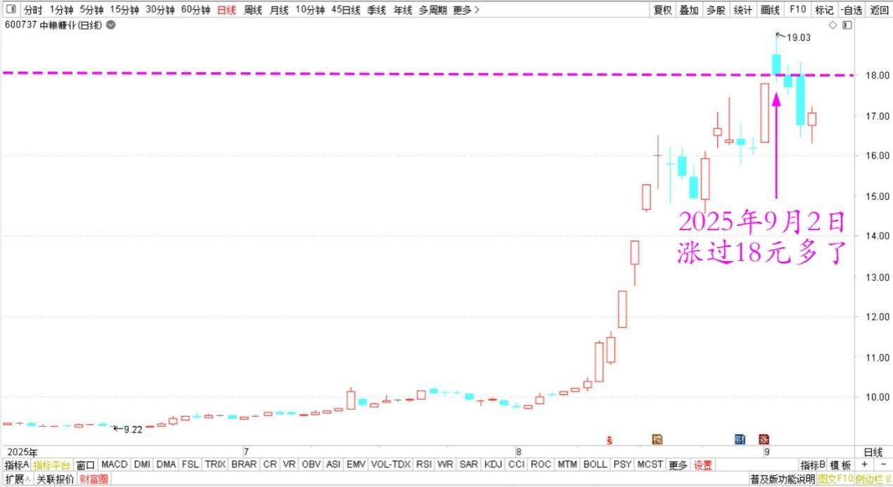
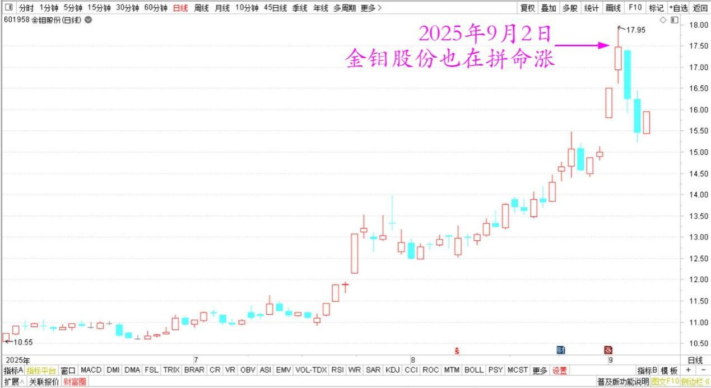

**178篇.张清一是傻瓜？**

**清一山长**[2025年9月2日10:11](https://www.zhihu.com/pin/1946153363721938381)

我卖出的股票，这段时间都拼命涨。中粮糖业都涨过18元多了，金钼股份等也在拼命涨，虽然我的账户也创新高，但看起来少赚了不少钱！

中粮糖业2025年6月～9月日线图

金钼股份2025年6月～9月日线图

这个事实说明：

第一、张清一是个笨蛋。明明可以多赚大几千万却赚不到！

第二、主力很可怜，出货不顺利，被散户套住了。只能网上继续拉，用时间换空间，高位站队。

第三、你说是啥就是啥！

好吧！你们认为以上三种，是哪一种答案才正确？我选“张清一是傻瓜”这个答案是标准答案。

**（标题、图片为编者所加）** **文章音频**：

[595篇. 张清一是傻瓜？](http://link.zhihu.com/?target=https%3A//www.ximalaya.com/sound/911273686)

**参考链接：**

[174篇.珠江再次突破千万级持仓](https://zhuanlan.zhihu.com/p/1945617387413021286)

[175篇.中粮糖业涨停，卖出退出十大](https://zhuanlan.zhihu.com/p/1946518083939336830)

[176篇.只拿本分的本金仓位，只赚本分的利息钱](https://zhuanlan.zhihu.com/p/1948022731460314408)

[177篇.只能赚认知范围内的利润](https://zhuanlan.zhihu.com/p/1948065037659910791)

[链接汇总（截止2025年8月12日）](https://zhuanlan.zhihu.com/p/621215591)

