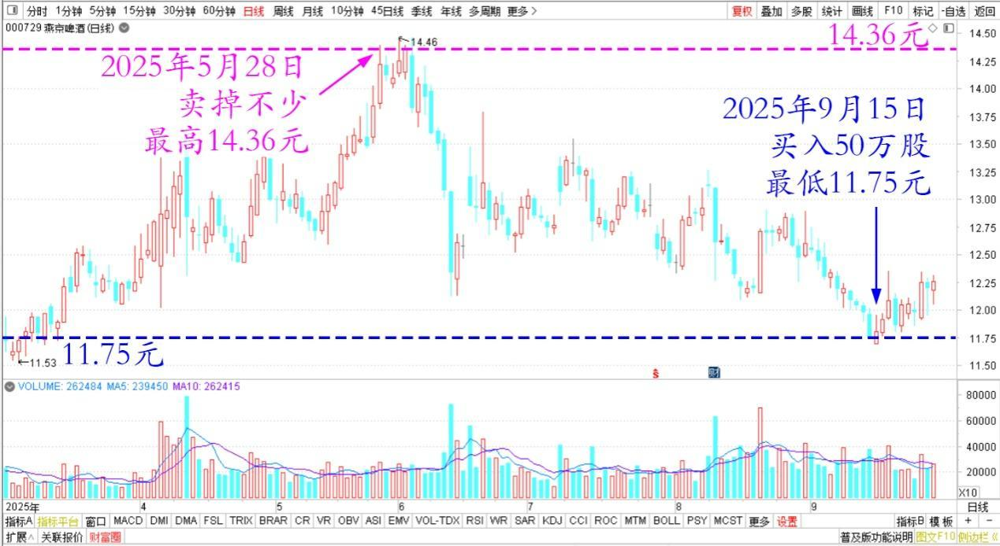
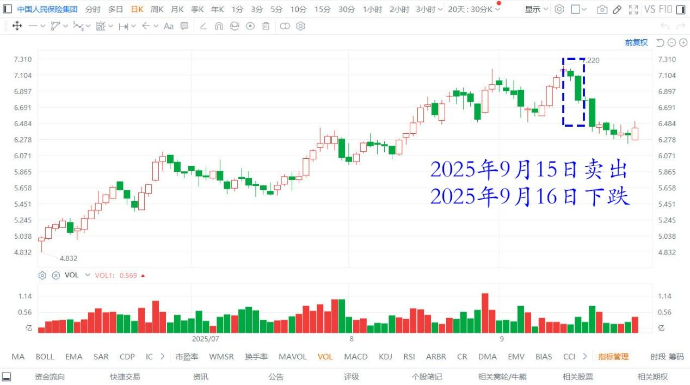
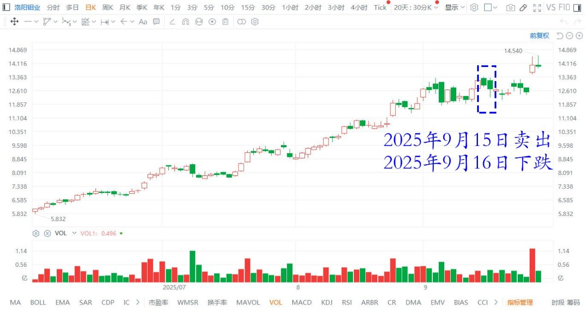

183篇.抢钱游戏，傻人有傻福

**[清一山长](https://www.zhihu.com/people/shan-chang-qing-yi)**[2025年9月16日14:33](https://www.zhihu.com/pin/1951292659390982030)

昨天买了50万股燕京啤酒。是补充5月28-29日前后我卖出燕京仓位的。我看到软件上都有交易记录，上一轮我卖掉不少燕京，最高是14.36元卖掉了。大多数是13元多卖掉的。我昨天买入的价格，最低是11.75元。这几个月，我啥事没干，一出一进，键盘上做做功课。总的仓位没有增加，但我的资产账上多了100多万，这全是抢来的钱，真不好意思！

燕京啤酒2025年3月~9月 日线图

中国自以为是的人太多了。高了就喜欢冲进来抢筹码，低了就喜欢逃跑，低价甩卖。中国人，一个个都是超级聪明人。

我是笨蛋，就傻傻地赚钱好了，然后用来养冠军。

昨天卖掉的股票，今天全都跌了。我真是运气好。继续收一点进来吧！

中国人民保险集团 港股 2025年6月~9月 日线图

洛阳钼业港股2025年6月~9月 日线图

**（标题、图片为编者所加）** **文章音频**：

[600篇.抢钱游戏，傻人有傻福](http://link.zhihu.com/?target=https%3A//www.ximalaya.com/sound/916396212)

**参考链接：**

[180篇.听券商的话，会不会赔死？](https://zhuanlan.zhihu.com/p/1953143141692605509)

[181篇.白银有色：中国股民真蠢！](https://zhuanlan.zhihu.com/p/1954398004627894953?utm_psn=1956920188550230942)

[182篇.投资就是认错的艺术和技术](https://zhuanlan.zhihu.com/p/1955773035073210008?utm_psn=1956920040768139542)

[链接汇总（截止2025年9月12日）](https://zhuanlan.zhihu.com/p/621215591)

