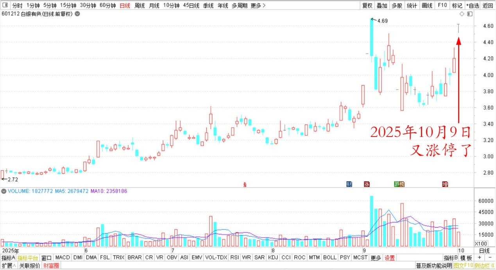
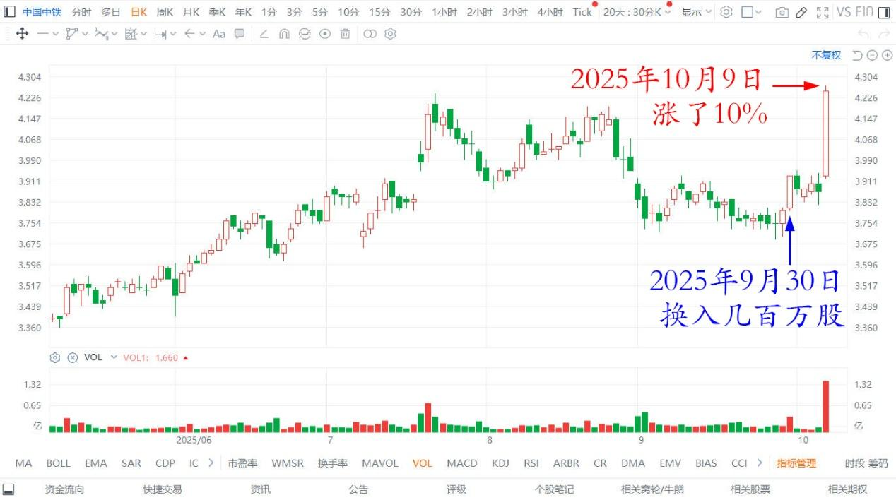
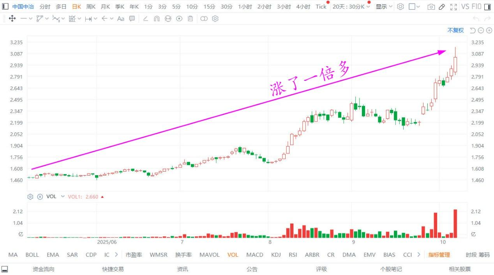
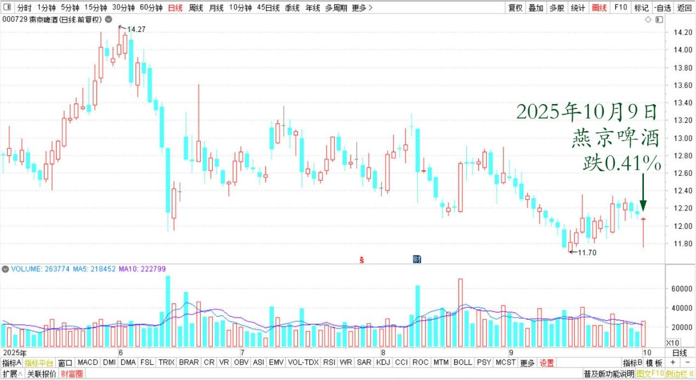
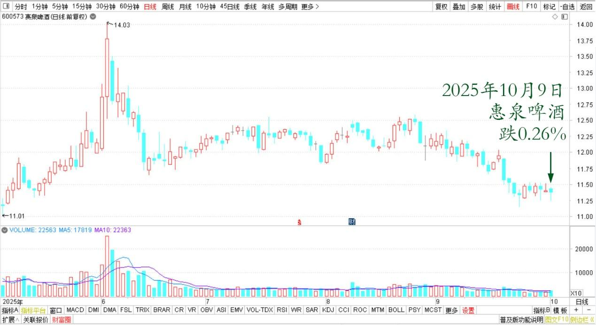
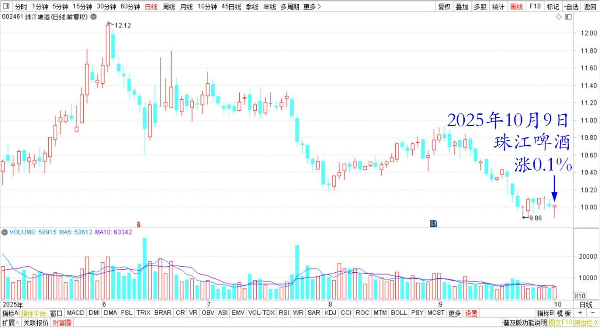

187篇.在绝望的时候进场，随欢呼的浪潮退场

清一山长[2025年10月9日10:13](https://www.zhihu.com/pin/1959562033885340074)

股票——节日的庆典！

今天有色继续大涨，白银今天又涨停了！

白银有色2025年5月～10月日线图

国庆前的最后一个交易日，我换入了几百万股中国中铁。就因为它还没有涨，我就用涨了五倍的有色来换它。

今天我想继续换中铁，结果涨了10%了？我还下不下手呢？

中国中铁港股2025年5月～10月日线图

中冶也大涨了，涨了一倍多了。

中国中冶港股2025年5月～10月日线图

可是，今天重仓的酒股票都在跌？应该是有人抛出酒股，去追热点了。

燕京啤酒2025年5月～10月日线图

惠泉啤酒2025年5月～10月日线图

珠江啤酒2025年5月～10月日线图

**人永远是追热点，可惜永远追不上！**

一个今日学堂教师三年的收益超过550%了，比我的收益还高。因为它在我的港股账户亏损累累的时候买入的。

**收益，就是在绝望的时候入场才是正确的选择。**

**然后在欢呼的浪潮中默默地退场。**

我的港股持仓，已经涨了四倍多了。我该退场吗？

我多想想！

**（标题、图片为编者所加）** **文章音频**：

[604篇.在绝望的时候进场，随欢呼的浪潮退场](http://link.zhihu.com/?target=https%3A//www.ximalaya.com/sound/922622218)

**参考链接：**

[180篇.听券商的话，会不会赔死？](https://zhuanlan.zhihu.com/p/1953143141692605509)

[181篇.白银有色：中国股民真蠢！](https://zhuanlan.zhihu.com/p/1954398004627894953?utm_psn=1956920188550230942)

[182篇.投资就是认错的艺术和技术](https://zhuanlan.zhihu.com/p/1955773035073210008?utm_psn=1956920040768139542)

[183篇.抢钱游戏，傻人有傻福](https://zhuanlan.zhihu.com/p/1956918511621345947)

[184篇.卖矿买啤酒，啤酒也是矿](https://zhuanlan.zhihu.com/p/1958174319248152048)

[185篇.有色逻辑得验证，和大家反过来走](https://zhuanlan.zhihu.com/p/1958220089020097164)

[186篇.用涨了的矿，换低位的矿](https://zhuanlan.zhihu.com/p/1960840960616399003)

[链接汇总（截止2025年9月12日）](https://zhuanlan.zhihu.com/p/621215591)

