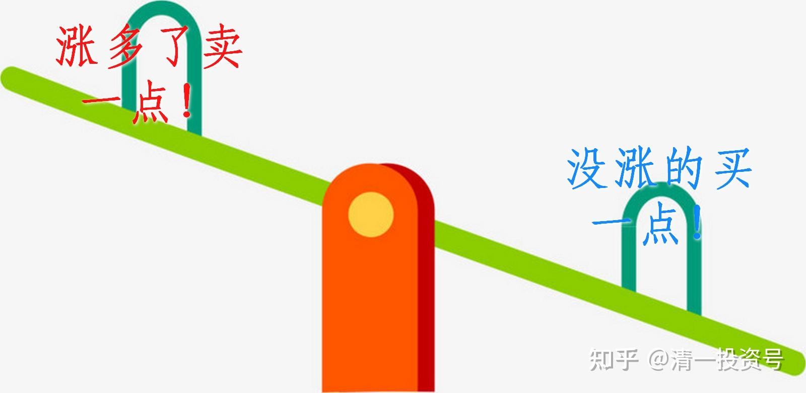
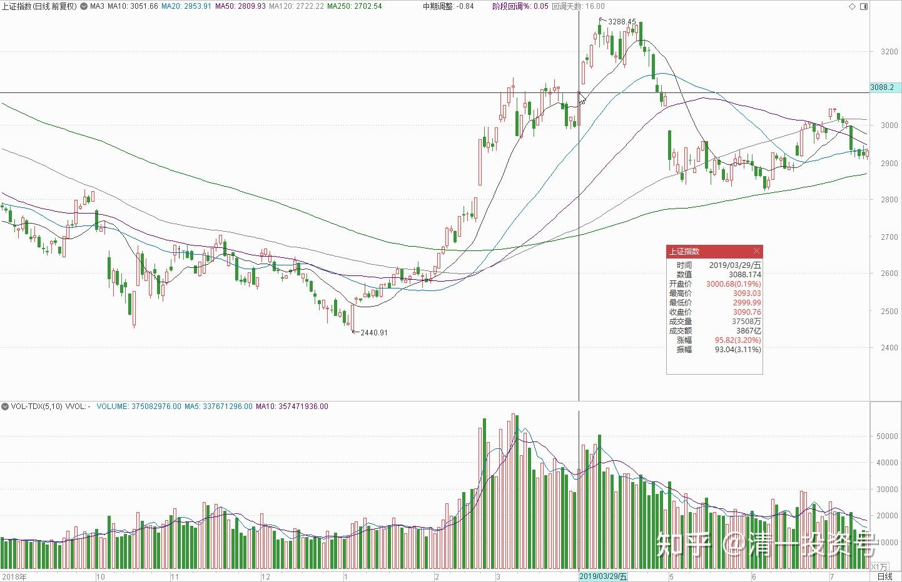
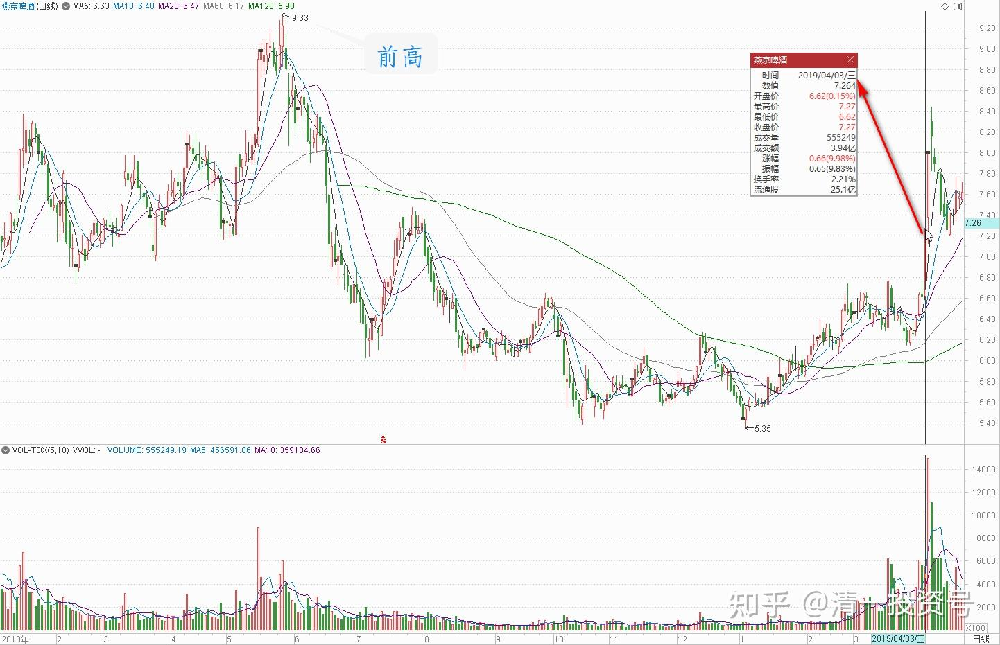
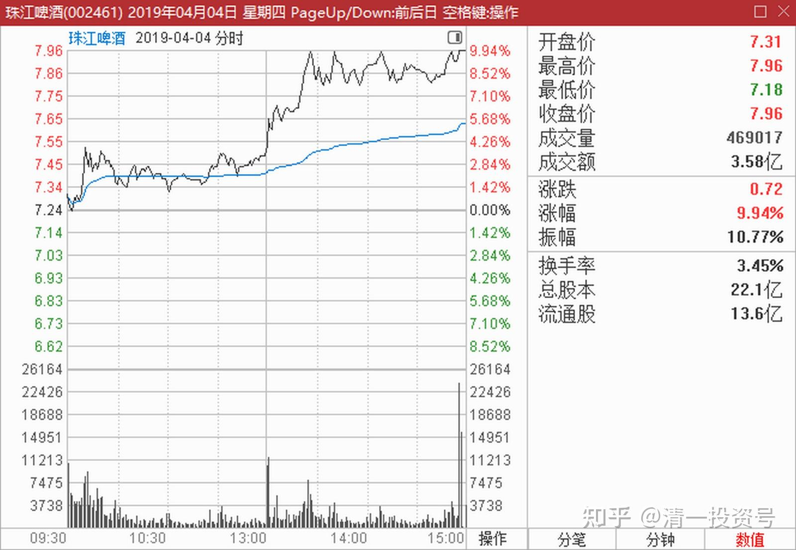
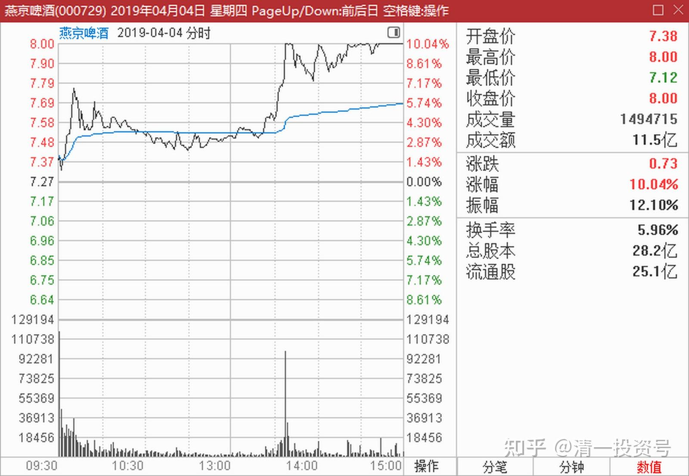
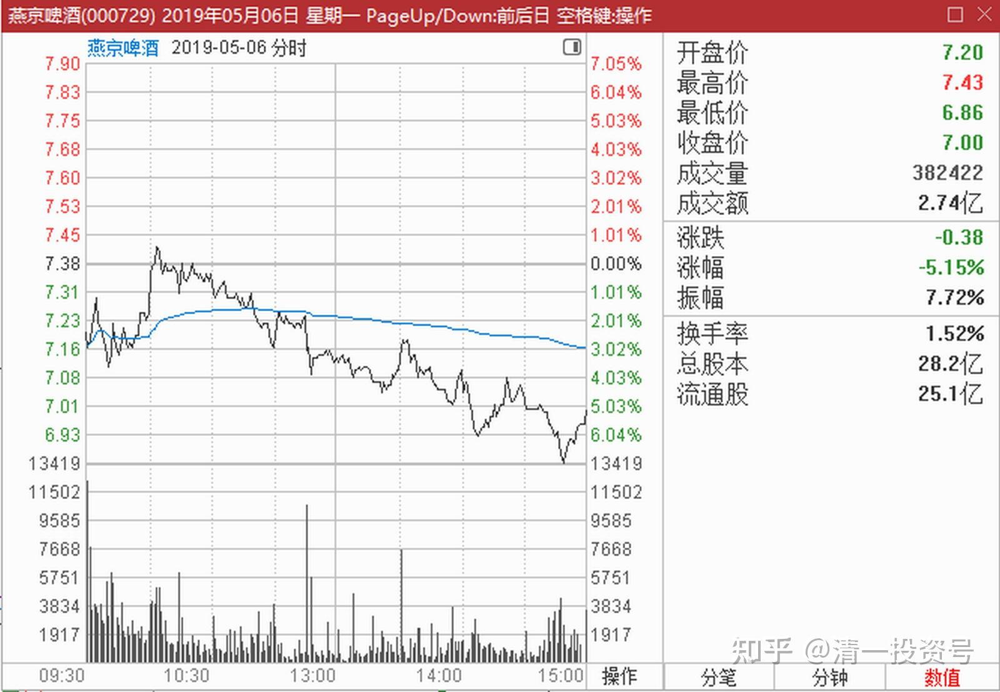
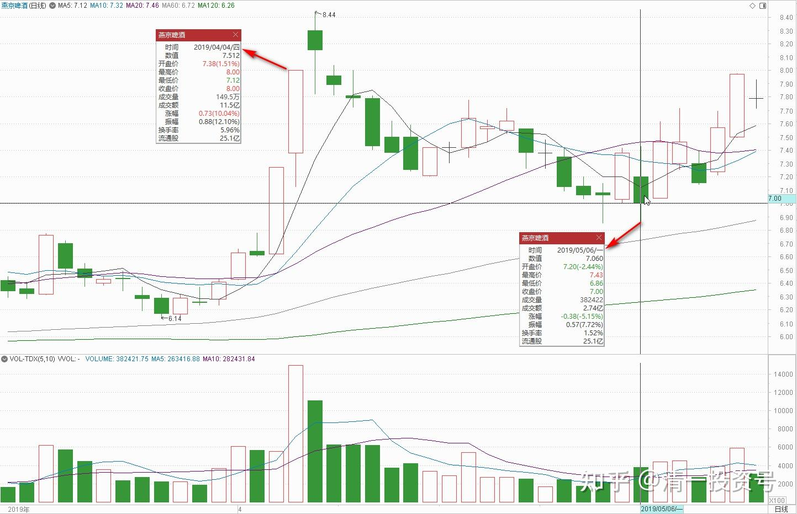
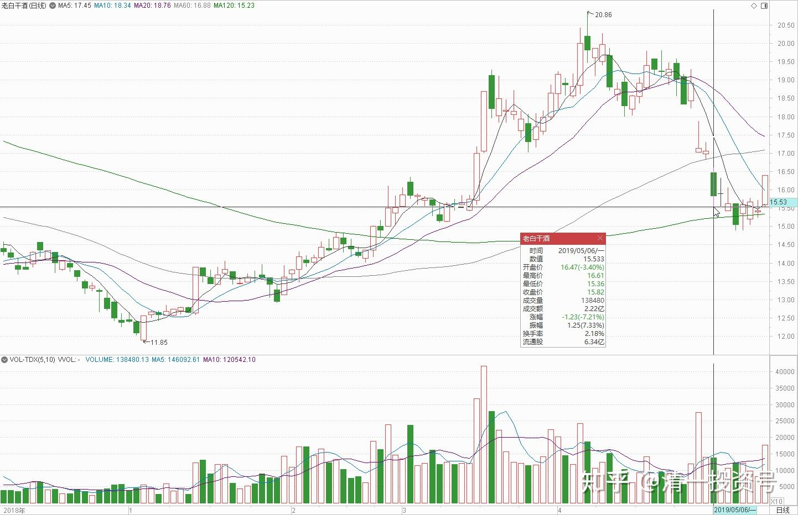

18篇.炒股美德——亏赚两相宜

清一山长2019年4月1日～4日

**一、涨多了的卖掉一点，没涨的买一点**

清一山长 2019-04-01 10:14:15

$上证指数(SH000001)$ 春节后，我只打开过两次账户。节后资产浮盈的大量增加，没有让我很兴奋。就像是节前的半年，账户总资产额度的慢慢下滑，也没有影响我心情一样。因为我账上资产，按照我的算法，**是一股没多，也一股没少。**没啥好高兴和不高兴的。

如我所料：现在白酒起来了。我今天准备卖掉一些。顺鑫创新高，超过60元了，挺好的，感谢顺鑫，为我创造了白酒业第一个赚8位数利润的股票。酒业的第二个记录，应该就是珠江啤酒了，这个八位数利润，来得有点慢。不过目前来看，显然是一笔不算太成功的投资。如果把这笔资金，继续留在顺鑫上面，31元的时候继续买入全部的顺鑫，赚到的钱会更多一些。我重新买回的数量，看来还是太小了。当然，我就这个命了。**胆小的人，发不了大财，也亏不了大本。**

这两天的大盘，让我很不安。**因为涨太快了，应该不符合正常的走势。快牛会让中央政府不愉快的，会被金融利益集团收割的**。所以——我还是小心一点。本周我正好有空，我就来打理一下账户吧！**该收的庄稼，就收一点；该种的种子，就种一点。**现在当然不宜空仓，但似乎也不敢满仓满融的干。我胆小！**把涨多了的卖掉一点，把没涨的买一点进来，这样安全度高一点。**股票也可以多一点。

我觉得：也许我想要的“中国资本利润”，会比我原来预想的快一点到来。**但如果真的来了，我也该比较长期一点的时段，要远离中国金融市场了。**我预期这个暂时分别的时间，是明年，最好是后年。我可不希望今年一年就把行情走完了。真的走完了，就很多年就没得玩了。

**二、封盘不坚定，继续观望**

清一山长 2019-04-03 10:05:06

$燕京啤酒(SZ000729)$ 一早上看居然涨停了。早就该涨了，要这样子拖下去，再不涨的话，我就越买越多了，气死庄家。

不过，燕京从一直以来的死气沉沉的样子，到今天几乎没有征兆的一拉就起，与珠江相比，磨磨唧唧好久了，摆出一副冲涨停的架势，可就是不涨停。两个股相比还是差异巨大。我怀疑燕京出什么消息了，抢盘？**我啤酒股持仓甚重，A股就买了酒和药了——都是给别人吃的。**这半年拖累净值比较严重。现在看样子，有补回来的征兆，就坐在车上继续等等再说[大笑]。

清一山长 2019-04-03 12:12:52

$燕京啤酒(SZ000729)$ 揭秘：**看了封单，居然只有14万手，有意思。这么点资金就封死了吗？给人感觉封盘并不坚定的感觉。不过且慢，也许有人是故意让你这样想的，催你赶快卖出。**因为这个价格，其实也只是长期平均价而已，跟裘国根买入的平均价格差不多。我也是今天账面才变红的，没道理今天就走。只有最近半年低价买入的小散们账面会好看一点（勉强有20%的收益）。珠江涨停，我会开始走路的。但燕京——还早呢！起码得过前高呀！对大家的建议：就是继续观望。（不支持各位现价买入，被套责任自付。我已经放弃继续买燕京了，我去买别的没涨的股。我不喜欢追高）

**三、炒股美德：亏赚两相宜**

清一山长 2019-04-04 11:37:26

$珠江啤酒(SZ002461)$ 刚刚以7.49元卖出2000手珠江啤酒，虽然觉得它明显是还要涨的，但我们总得分点利润给别人吧！别从鱼头吃到鱼尾的，吃相太难看了也不好[大笑]。成交后，立马看到我这个古老的25年老账户上，珠江的持仓成本降到了3.9713元，觉得很幸福。几个月前珠江还是一片绿油油的青草地，浮亏数百万元。我还在想——什么时候再回到7元多，我一定要卖出一些珠江。去年我7.7附近由于卖出珠江的愉快，让我在后来的下跌中越跌越买，结果买成了第一重仓。长期趴在4-5元，让7元多成了一个“遥不可及的记忆”。没想到短短几个月后，账上“亏本最多”的珠江，就变成了酒股中赚钱最多的股票（刚刚超过顺鑫的盈利记录）。另外一个与本次账面亏损数百万相匹配的股市记忆，就是2014年，我把武汉的房子都卖掉来大买股票，还上了满仓的融资。2014年年中，账户也是绿油油的一大片，也没想到几个月后就赚到了入市20年最多的利润。所以，说明**世事无恒**，老子的话真好。**账面亏的时候，不要太担忧和焦虑；涨的时候，也不要得意忘形。别人赔钱的时候，主动买套，陪人一起熬，不要抱怨；自己赚钱的时候，别忘了分享一点机会给别人。这是炒股的美德，可以让你在残酷的股市里面活得更长久，也更快乐**。祝福大家！

沐年之夏回复清一山长: 评论上贴

哈哈！你这卖出。买入的人套住了咋办？

清一山长 2019-04-04 12:19:20 回复沐年之夏:

我看我的本次成交单，都是大单吃进的。一单子就吃了十万股。这种主力，有钱，太有钱。您就别替他们操心套不套的了，还是操心您的账户好了。

还有，我操作的时候，你们最好别跟我反向操作，虽然我常常卖掉后股票就上涨，买入后股票就下跌。典型的反指。但长期走下来，我还是正常的正指。短期看我是笨蛋，长期看也没这么笨。买入珠江，万一被套了，就跟我一样熬呗。我90%以上的仓位都还没走呢！等我走完了，会吱一声的。不过我怀疑啤酒我会持有较长的时间。

还有：现在买入股票的风险，已经比去年大了。我一般在我认为绝对安全的时候叫几声。鼓动大家来买股票，比如5元多的珠江。但没想到叫完了，还是跌到四元去了。雪球上还一直有人对我的珠江持仓嘲笑问候一下的，看着自己数百万的赤字，也觉得挺对不住大家的，只能默默的继续买。所以，我对自己的判断也没信心，特别是现在。比如，我卖出的股票现在买了啥，就不叫了。因为肯定比5元的珠江风险大[赚大了] 。不过话有说回来，如果真是牛市，买啥都行。牛市是出股神的时代，谁都可以当[很赞]。比如您就可以！

质真如渝回复清一山长:

刚减了三分之一仓，比山长成本低了，这次得跟紧，上次没跟让我坐了电梯[大笑]

清一山长 2019-04-04 14：51：11 回复质真如渝:

[滴汗]。我卖出的仓位还不到5%，你们就减掉这么多，还说是跟我——不是消遣我吧！没看见我说还要涨吗？这不，快涨停了，该骂我“反指”了。刚才接待两个泰国朋友，刚走，就涨了。为了对燕京的主力表示敬意，我再卖2000手燕京表示一下支持，7.99元卖出。盘面看极其强势，明明是不该卖的，因为压盘8.00元主力故意一直不吃，就在下方吃货。就是“老板”示弱，表示吃不起。让你们投机尽快卖出的。我看主力这么矫情，这么急于要货，我就给他一点吧！谁让俺买多了呢[大笑]！啤酒实在仓位太重了，资金紧张，我这就卖券还款去。昨天买了两个酒股，融资买的，花了近千万。今天赶快把钱还掉，安心过夜去。你们有钱的主，别学我这“负资产”的玩法。

（刚看了，燕京总算勉强涨停了，我少卖了一分，说不定明天还涨停）

[清一投资号：1篇.涨停之际，谈我的啤酒股投资逻辑](https://zhuanlan.zhihu.com/p/477911616)

明达野老 2019-04-04 18:48

$珠江啤酒(SZ002461)$ $燕京啤酒(SZ000729)$

今天按照原定计划（涨的越快越卖）在尾盘成功出掉了10%的珠江仓位，挂单成交价7.96元。这些都是2500点左右吃进的筹码，今天算是送出去了，到现在为止，我在去年买入的所有底部筹码几乎都出掉了或者换股了。不过这10%对我来说，不算多，因为珠江一直跌，我就一直吃进，吃的有点过多了，所以今天的操作算是回归珠江原定计划的主仓持仓量。

原文链接：[https://xueqiu.com/2029742712/124542973?page=3](http://link.zhihu.com/?target=https%3A//xueqiu.com/2029742712/124542973%3Fpage%3D3)

[读盘如对弈--珠江、燕京盘口解读 $珠江啤酒(SZ002461)$ $燕京啤酒(SZ000729)$ 今天按照原定计划（涨的越快越卖）在尾盘成功出掉了10...](http://link.zhihu.com/?target=https%3A//xueqiu.com/2029742712/124542973%3Fpage%3D3)

清一山长 2019-04-04 22:01:31 评论上文

我们的操作手法真的很相似[赞成] ，怪不得有人说我们互为小号[大笑]。你今天居然也减了10%。我比你多了两个点。主要就是减珠江多余仓位，不是减燕京（燕京我三天前，还刚融资买了几十万股，今天减掉其中的一部分，还掉融资）。珠江只有最后几分钟能够涨停减掉，之前我们都是看他怎样玩——看他装怂。

基本同意你我看法：看样子这一轮啤酒，不是短期的行情。未来的高度难以想象。突破历史新高也是有可能的，看主力怎样玩了。所以，我们不急，慢慢的陪他。

清一山长 2019-05-06 14:28:11

刚才以6.20元，6.21元分别买入4000手珠江。好像把珠江从跌停板上“拉起来”了。我主账户上的持仓成本，上升到了4.7359元。**国人真是不可思议——8元的时候抢着买，6元的时候抢着卖。既然大家这么不想要珠江，我就把珠江捡回来吧！好歹算是买回原来的持仓[捂脸]。**另外，白酒股我也在买买买。市场意外地给了这么好的机会，大跌，干嘛不买[加油]。今天还买了一个股息率超过10%的A股，刚公布的年报是18%的增长率，企业经营良好。居然市场还是给了个接近超过9%的价格，快跌停了[大笑]，我当然买了放着算了。

安康正骨推拿回复清一山长:

白酒是伊力特吗？

清一山长 2019-05-06 14:39:44回复安康正骨推拿：

15.54元，买了十几万股老白干。就是因为它跌得太惨了。我还是第一次买入老白干呢！

家养大v回复清一山长：

太服你卖泸州老窖了，这是二十几年的盘感吗？

清一山长 2019-05-06 14:50:41 回复家养大v：

泸州老窖死拿在手上，啥都不用操心，过百元不是梦。我穷折腾罢了，别学这些。

(标题、图片为编者所加)

**参考链接：**

[YJ走势果然神鬼难料\[表情\]](https://www.zhihu.com/pin/1604810289215668226)

[发表今天的想法，就是非常的感谢，感谢这…](https://www.zhihu.com/pin/1604504352521158656)

[8篇.初谈燕京](https://zhuanlan.zhihu.com/p/594537053)

[9篇.起码十年不涨就值得一起守候了](https://zhuanlan.zhihu.com/p/596134341)

[11篇.啤酒系列4：连连出台的质疑文让我加紧了买啤酒的行动](https://zhuanlan.zhihu.com/p/598382916)

[12篇.啤早期珠江啤酒、燕京啤酒的换仓记录](https://zhuanlan.zhihu.com/p/602033762)?

[13篇.买卖操作后的富足之心](https://zhuanlan.zhihu.com/p/604162057)

[14篇.珠江的破位急跌，名曰跌停进货法](https://zhuanlan.zhihu.com/p/606062514)

[15篇.金融市场是考验心态和修为的地方](https://zhuanlan.zhihu.com/p/608010478)

[16篇.啤酒系列9：买入的理由不是因为要涨，而是因为没有多少下跌空间](https://zhuanlan.zhihu.com/p/609653689)

[17篇.只记住一件事：低价不卖，高价不买](https://zhuanlan.zhihu.com/p/611574943)

