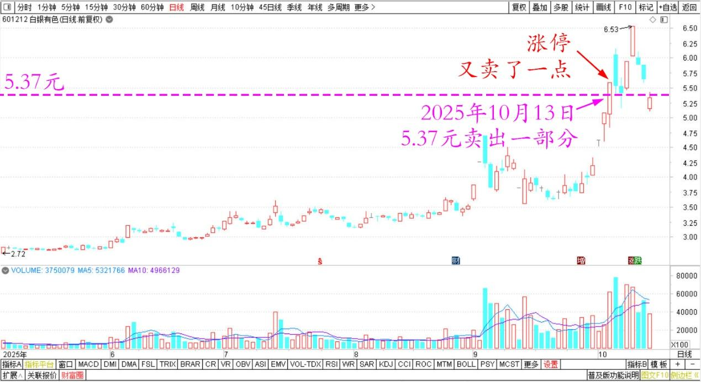
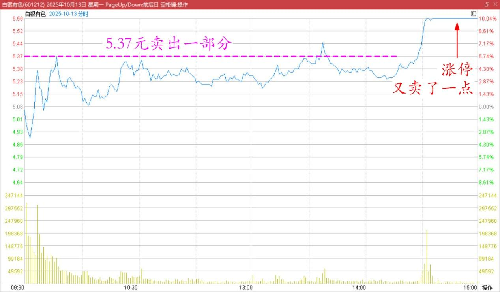
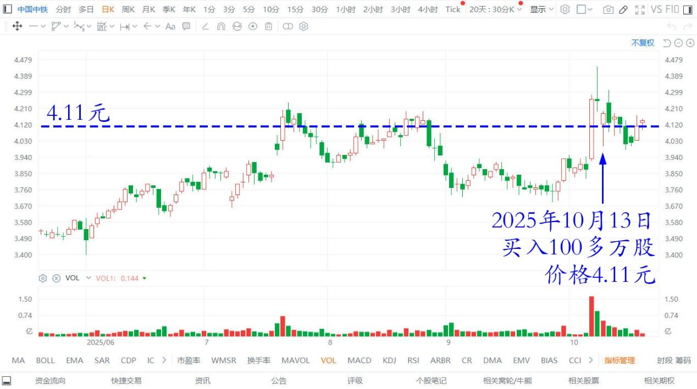

191篇.今天上了白银主力的当

清一山长**[2025年10月13日19:41](https://www.zhihu.com/pin/1961154523834855678)**

今天，我终于开始卖出一点白银有色的股份了！

上午，我看连续涨停的白银，盘面上看有点涨不动了，就开始卖一部分出去。5.37元成交一部分，每单丢十万股。似乎接手很快，筹码没多久就被吃掉了！

因为信号不好（我坐火车），就没看盘。更没想到尾盘白银又涨停了！非常的强势，我一高兴，又卖了一点出去，总共卖了一百多万股白银。突然我一想——不对呀？不能再卖了！我上当了。主力把我的筹码骗走了，就像中糖一样，我被主力耍了！

白银有色 2025年5月~10月 日线图

白银有色 2025年10月13日 分时图

盘后仔细复盘思考：

确定这次肯定是我错了：大量的筹码被主力抢走了！今天30亿的成交，背后操弄的人，绝非凡品！根本就不是燕京这档主力能比的！

今天显然是洗盘，大量的爆量，就是让我这种“自以为聪明”的老股民，以为主力开始出货了，一看这种高位放量，涨停破板的主力出货图形，就会赶快的逃走！

因此今天的主力，故意来一个破板爆量，引诱我们逃走的！其实她没有逃走，反而在大量的收货！未来的空间还比较大！

小散户没有脑子，也不会估值，过去几天，一看上涨就高兴，马上就卖了。缴枪给了主力！

其他胆小的散户，抢消息抢进来的人，看到上次白银被证券会公开谴责，股价跌停，早就吓跑了。这些涨停和跌停的筹码，其实都到了主力的手里！

只有类似我这种江湖闯荡很多年的老鸟，才不为涨停诱惑，我就是不走，也不为跌停恐惧，就是坚定持有（其实跌停的时候，我的脑子里面冒出的想法，是应该趁机抢货。我认为是主力的利空洗盘手段！可惜我没有真的去执行）。

——主要是手头的货已经不少了，关键是白银有色，我是第一次做。根本不熟悉这只股，当初进入，我就是赌博的，赌它会上涨！

现在虽然感觉跌停趋势应该买入，但终究不敢赌的太大，就放弃了这个机会，但我原来的数百万股持仓，我一股都不卖，稳稳地拿着不放！

我认为：

主力的目标，绝对不是这三块五块的价格。你敢抛，他敢要。有多少他要多少，这个主力似乎资金非常的充沛！难道是白酒主力转战有色了？

这只股，涨停跌停，就是用来戏弄小股民，愚弄傻瓜散户的，我可不上当！

如果白银有色，今天还是继续涨停的话，我们这种老股民，肯定更死死地抱着不放。但一旦出现放量破板，我们认为主力要跑，我们就会抢跑！

结果：主力洞察了我们的心意，把这群“聪明人”的筹码就抢走了。我也被抢走了20%的筹码。

我真傻，真的！

不过我也不吃亏，我一看被骗了，反手就赶快去买了100多万股中铁补仓，才4.11元到手！比白银便宜多了。因此，我的有色持仓，依然是只增加，不减少！我绝对不会错过这轮资产重估行情的！

哼！我才不投降呢！我要“奋斗到底”！坚决捍卫有色！

中国中铁港股2025年5月～10月日线图

**（标题、图片为编者所加）**

文章音频：

[608篇. 今天上了白银主力的当](http://link.zhihu.com/?target=https%3A//www.ximalaya.com/sound/924986143)

**参考链接：**

[185篇.有色逻辑得验证，和大家反过来走](https://zhuanlan.zhihu.com/p/1958220089020097164)

[186篇.用涨了的矿，换低位的矿](https://zhuanlan.zhihu.com/p/1960840960616399003)

[187篇.在绝望的时候进场，随欢呼的浪潮退场](https://zhuanlan.zhihu.com/p/1961858710361047662)

[188篇.冠农的技术图形与走势](https://zhuanlan.zhihu.com/p/1963456936990204416)

[189篇.白银涨停，冠农不涨停](https://zhuanlan.zhihu.com/p/82013845894)

[190篇.是狼还是羊？](https://zhuanlan.zhihu.com/p/1965856208259900157)

[链接汇总（截止2025年10月10日）](https://zhuanlan.zhihu.com/p/621215591?utm_psn=1967007144831350474)

