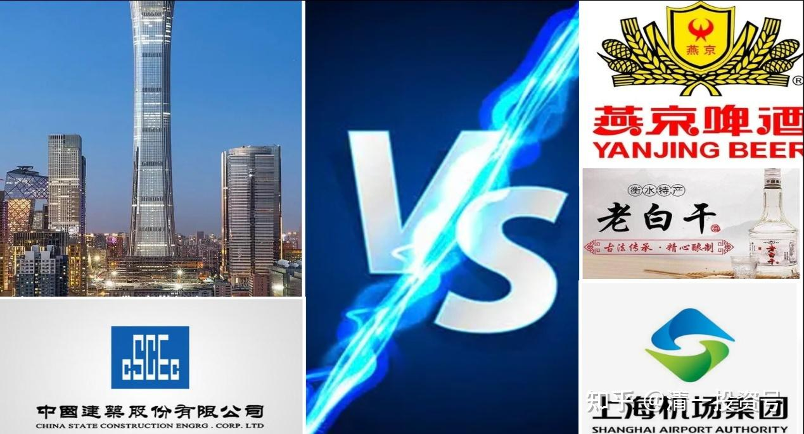
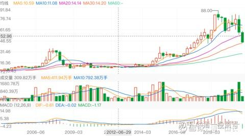

19篇.中国建筑系列之十七：通过对比发现中国建筑的价值

清一山长2021年05月01日～2021年05月10日

**导读：**

一、用巴菲特的方式守好中国建筑

二、中建VS燕京，哪个回报高？

三、戒看盘毛病，学作者的持股心态

四、投机——老白干，投资——看中建

五、中建对比上机，谁的价值更高？

**正文：**

**一、用巴菲特的方式守好中国建筑**

宇宙特斯拉2021-05-01 12:08

《巴菲特的投资体系的变迁》

原文链接：[https://xueqiu.com/9132882841/178838960](http://link.zhihu.com/?target=https%3A//xueqiu.com/9132882841/178838960)

清一山长[2021-05-01 19:20评论上贴：](http://link.zhihu.com/?target=https%3A//xueqiu.com/9310099567/178850034)

巴菲特连续二十年收益百分之十多一点点，连续十年不到百分之十，特别是这十年完全是科技股的天下，美国已经彻底进入互联网时代，传统行业不断遭到中国这些发展中国家的冲击，美国的传统行业外流是一个必然趋势，而美国的优势是层出不穷的颠覆性创新，巴菲特需要再一次进化，这次很难，因为需要否定自己以前成功的投资理念。

巴菲特现在业绩增长真的很慢，那还是买了苹果亚马逊的情况下，说明其他股票上涨真的很少，迪士尼遭到奈飞的竞争；保险行业增长很慢；可口可乐基本上不上涨；富国银行股价也是长期横盘

我的结论：倒不是巴菲特不行了，而是，我好幸运，生在中国，超过巴菲特（的业绩表现），真的不难。只要认真地学巴菲特的思维模式，就超过他了。因为中国还有类似美国的机会，而美国就没有类似中国的机会。在中国，要等到传统行业“停滞”的时间，大约还需要20年吧？我们依然有稳定赚钱的机会，起码——中国建筑就能提供超过他平均收益率的机会，用巴式的方式守股就行了。还有其他的很多类似的。美国的公司的确找不出几家可以放心持有十年，保证能够增值三倍以上的股。中国有一堆这样的股。

我依然不敢投资所谓新新产业：我真的看不准！不懂的，就不做！

**二、中建VS燕京，哪个回报高？**

清一山长[2021-05-02 15:15](http://link.zhihu.com/?target=https%3A//xueqiu.com/9310099567/178874105)

[$燕京啤酒(SZ000729)$](http://link.zhihu.com/?target=http%3A//xueqiu.com/S/SZ000729)燕京牌啤酒连续11年位居全国销量榜首[网页链接](http://link.zhihu.com/?target=http%3A//www.zgnjw.com.cn/magazine/info1061.html)（[https://www.zgnjw.com.cn//magazine2.asp?id=1061](http://link.zhihu.com/?target=https%3A//www.zgnjw.com.cn//magazine2.asp%3Fid%3D1061)）

曾经的燕京，并不像现在一样灰溜溜的。它是连续11年全国排名第一的啤酒公司。现在的燕京，全国销量第三，甚至第四了。

市值——更是远远地落后于这些啤酒大腕，连珠江都比不过。今天的燕京，实在是倒霉透了。也许，燕京有一天会再度辉煌。赌赢了，我们可以获取超额的收益，赌输了，我们无非是现在的价格停滞不动。现在的价格。就是输家的价格。所以，我的基本判断是：未来除了赢，燕京别无出路！[笑]也许，未来11年，燕京重整辉煌的时刻到来。长期持有燕京，是我的中期投资的目标。看与中国建筑相比，谁的回报会更高（现在两个股，都是怂货）[滴汗]

**三、戒看盘毛病，学作者的持股心态**

[格子读财报](http://link.zhihu.com/?target=https%3A//xueqiu.com/6395937573)2021-05-25 23:12

《中国建筑2020年财报分析》

原文链接：[https://xueqiu.com/6395937573/179130599](http://link.zhihu.com/?target=https%3A//xueqiu.com/6395937573/179130599)

清一山长2021-[05-07 13:45](http://link.zhihu.com/?target=https%3A//xueqiu.com/9310099567/179175698)评论上贴：

我刚打赏了这篇帖子¥100.00，也推荐给你。感谢作者的写作与分享。作者的持股心态真好。就应该这样来持有中国建筑，最烦涨了几个点，或者跌了几个点，就跑出来问中建该怎么办的傻瓜。【最近想明白一件事，如果股价大幅上涨，即使翻倍我也不会卖掉，即使股价大幅下跌，我也没有钱加仓，干脆就这样吧！顺便把看盘的毛病戒掉了】。

**四、投机——老白干，投资——看中建**

清一山长[2021-05-07 14:34](http://link.zhihu.com/?target=https%3A//xueqiu.com/9310099567/179183620)

[$老白干酒(SH600559)$](http://link.zhihu.com/?target=http%3A//xueqiu.com/S/SH600559)今天20.74元首次买回原来卖掉的老白干，今天开仓买了第一笔。这个价格，是低于4月15日的收盘价20.75元的，第二天老白干来了一个涨停，连续五天放量上涨超过25元。我觉得：低于起涨点的这个价格，起码感觉安全系数高一点。如果被套牢，就当原来没有卖好了。目前的成本，是负的400多元一股，持仓5位数级别。

有趣的是：老白干的年报公布前，前一天大涨6.67%。20亿资金抢进去了。收盘价25.28元。第二天跌停，估计聪明的狐狸们脸肿的不行。然后连续四天下跌，应该是抢年报消息的投资资金认输退出的结果。今天买入，纯粹是好玩。判断老白干跌破20元，应该是很正常的。茅台都跌，你不跌不够意思。

股价是中国建筑的4倍，分红还不如中国建筑。才一毛多钱。这世道，真说不清楚。投机股，玩的。别跟我学。

**五、中建对比上机，谁的价值更高？**

清一山长[2021-05-10 12:35](http://link.zhihu.com/?target=https%3A//xueqiu.com/9310099567/179361635)

[$上海机场(SH600009)$](http://link.zhihu.com/?target=http%3A//xueqiu.com/S/SH600009)假如不用啥虚不拉几的免税概念（我根本弄不清这与上机的核心竞争力有啥必然的关联），只用企业的观点来看，上海机场的价值，就是一个交通枢纽。也许会有餐饮和购物服务等，但显然不能叠加餐饮估值，外加购物估值。你不能拿它跟中国中免去比。就算是中免，其实我也不会买。我看不懂他的长期经营，永续发展的企业价值。这些是很虚的，不太靠谱。我认为上海机场应该享受的是公共服务资产的价格。不是啥高速成长股的价格。上机的区位和市场地位，应该和上海在中国的城市价值匹配才对。

如果这样来看，其实就很简单了：北上广深的机场，应该是差不多一个档次的投资品。如果要我来评估未来的发展空间，我认为深圳应该排第一的。因为深圳的经济活力，中国是第一。或者应该排北京首都机场第一。因为北京是中国的政治经济文化中心。怎么都轮不到上海来排第一呀？

但事实上，深圳机场的市值排名，是最差的，才100多个亿。北京首都机场，才200多个亿。凭啥上海机场应该有1000亿，甚至有人叫出了目标——要实现万亿市值呢？真的因为是“机场茅”吗？

我无法理解这种逻辑。所以，我的逻辑，肯定是不买上机的。但可以考虑买深圳机场。但是——深圳机场肯定没有中国建筑有成长性。有点像是周期股。严重受到经济周期的冷热制约。ROE也谈不上优秀，远远达不到稳定的15%收益。所以，机场我一个都不要。

我认为：中国建筑的PPP，大约就有点像机场的公共产品属性。是属于无脑稳稳收钱的事情。但机场不能无限扩大，中国建筑的PPP还在外延扩张，收入会快速增加。真正的“机场茅”，应该给中建才对——特别是中国建筑每年的利润，以及最近十年，以及未来十年的成长率，真的跟茅台是高度接近的。

呵呵，虽然如此，我说了不算。市场先生说了才算，但是它很疯，我们就不理它。**只管买最便宜的。涨不涨，是天意了。**

**这就是价值投资的真意**。虽然我其实是投机派的，不是正宗的价值派。但既然号称价值投机，总要算算价值账，再谈投机的事情吧？

从投机的概念来说：有人说买了上海机场就准备了拿五年不涨。好吧！既然你判断五年内都不会涨，现在急乎乎地买入，是不是有点找抽？你珍惜资金的使用效率了吗？这是投资，还是投机？别拿巴菲特买股要拿十年来说事。就算您真的喜欢上海机场，就是要买的话，是不是等等再说，等飞刀先落地？——起码等基本面有好转迹象。比如疫情，显然2023年都未必好转（我判断我明年都回不了国），机场不就一直亏下去吗？就算疫情开始恢复了。也不可能一下子就恢复到2019年的状态。就算恢复到2019年的状况了（不知道五年够不够？），上海机场一年也不过赚区区50个亿。能匹配多少市值？20PE也就1000亿。当然，您希望她是60PE的货色。抱团股都这样——哪我只能祝福你吉祥如意了。我可不敢有这么自恋的想法：我买啥股，机构都来捧我的小脚。我只想提醒你：上海机场是反抱团股——机构正在离开，遭遇的是双杀，杀业绩，也杀逻辑。小散户正在涌进来。机构原来长期投资的上海机场，成本大约是25元上下。从价格上看，现在依然是盈利的。你小散户一个，接飞刀干嘛？真以为自己是蜘蛛侠呀？

[@林不媛](http://link.zhihu.com/?target=http%3A//xueqiu.com/n/%25E6%259E%2597%25E4%25B8%258D%25E5%25AA%259B)回复[@清一山长](http://link.zhihu.com/?target=http%3A//xueqiu.com/n/%25E6%25B8%2585%25E4%25B8%2580%25E5%25B1%25B1%25E9%2595%25BF)：

山长为什么做空上机？

清一山长2021-[05-10 16:54](http://link.zhihu.com/?target=https%3A//xueqiu.com/9310099567/179403922)回复[@林不媛](http://link.zhihu.com/?target=http%3A//xueqiu.com/n/%25E6%259E%2597%25E4%25B8%258D%25E5%25AA%259B)：

谁说我做空上海机场了？你才做空上机呢！你们全家都做空上机[笑]。

我只是表达观察和思考罢了！

我不做空，也不唱空，更不唱多。我管不了市场先生的定价。涨了不关我事，再跌，我也不买上机的。我就买中国建筑，就买燕京啤酒。上机就算跌到10元我也不买，恐怕会把中国建筑带崩，要跌到2元了。燕京啤酒难说要跌到4元。我还是买中国建筑，燕京啤酒。我才不要上机呢！[俏皮]

清一山长[2021-05-10 17:32](http://link.zhihu.com/?target=https%3A//xueqiu.com/9310099567/179408405)

[$上海机场(SH600009)$](http://link.zhihu.com/?target=http%3A//xueqiu.com/S/SH600009)以下是上机的季线图。用它来做上机的走势分析：持有上机，其实满煎熬的。2005年价格11元左右，2007年冲了一下顶，30多元，2008年很快就跌下来，拿它十年都原地踏步，比拿中国建筑还惨（没见过拿中国建筑十年还原地踏步的人，除非再过五年，中国建筑依然不涨，但这种可能性，几乎没有。这时候市盈率就只剩2倍多了。

但拿了上海机场，就是十年不涨，是不是要气死你了？分红也不高。但有意思的是十年后，它终于涨了。2015涨起来之后，居然没回调。2015年和2016年的股灾，也没有伤害到它，一路的上涨，从11元一直没有抛压地涨到了2019年最高的80多元。它十年不涨，一涨就八倍！我相信持有上机的人，终于扬眉吐气了。这期间，股票越来越集中，散户越来越少。现在，开始反转了：机构派发。你以为它要很快反弹了吗？我不知道。万一机构真走了，我看——再像原来一样趴着就是不动，你咋办？

所以，**我买股，股息率很看重。就算不涨也算了，股息拿着，想买啥就买啥，不至于生活艰难。也不需要变卖资产。没股息，日子就难过了**[俏皮]

上机未来怎么走？不知道。只知道：这个股其实很磨人的。而且：您是上涨之后，才听说它有多好的。2014年之前，难道上海机场就不是中国的系统性重要机场吗？这些逻辑为啥就无效呢？偏偏今天来保证她不会跌？我看靠不住。还是机构才有权力来这样说：它说的有道理就该涨，我们小民，说啥都没用。

参考链接：

[清一投资号：1篇.中建背后的神秘大手](https://zhuanlan.zhihu.com/p/481078141)（整理文）

[清一投资号：3篇.中国建筑系列之一：就算是好股，也别谈恋爱](https://zhuanlan.zhihu.com/p/512602669)（整理文）

[清一投资号：4篇.中国建筑系列之二：大A股的稳定器](https://zhuanlan.zhihu.com/p/519506160)（整理文）

[清一投资号：5篇.中国建筑系列之三：发现投资机会的方法](https://zhuanlan.zhihu.com/p/522851722)（整理文）

[清一投资号：6篇.中国建筑系列之四：只有少数人才知道正确的通道](https://zhuanlan.zhihu.com/p/522882446)（整理文）

[清一投资号：7篇.中国建筑系列之五：投资中建的核心逻辑和理由](https://zhuanlan.zhihu.com/p/528942534)（整理文）

[清一投资号：8篇.中国建筑系列之六：熊市布局，牛市收获](https://zhuanlan.zhihu.com/p/534585889)（整理文）

[清一投资号：9篇.中国建筑系列之七：每个人都应有自己的投资逻辑](https://zhuanlan.zhihu.com/p/538090859)（整理文）

[清一投资号：10篇.中国建筑系列之八：为自己的投资负完全的责任](https://zhuanlan.zhihu.com/p/549316895)（整理文）

[清一投资号：11篇.中国建筑系列之九：如何用融资投资中国建筑？](https://zhuanlan.zhihu.com/p/559571938)（整理文）

[清一投资号：12篇.中国建筑系列之十：综合对比下中建的长远价值](https://zhuanlan.zhihu.com/p/564749726)（整理文）

[清一投资号：13篇.中国建筑系列之十一：多年不涨的中建，值得坚守](https://zhuanlan.zhihu.com/p/566546633)[（整理文）](https://zhuanlan.zhihu.com/p/568853074)

[清一投资号：14篇.中国建筑系列之十二：长持股的价值投机操作及未来畅想](https://zhuanlan.zhihu.com/p/568853074)（整理文）

[清一投资号：15篇.中国建筑系列之十三：从年报的角度再次解读超低估的中建盘面](https://zhuanlan.zhihu.com/p/572007510)（整理文）

[清一投资号：16篇.中国建筑系列之十四：买中国建筑的好处就是可以安心睡觉](https://zhuanlan.zhihu.com/p/574936145)（整理文）

[清一投资号：17篇.中国建筑系列之十五：千万不要无原则的在股市中“赌”](https://zhuanlan.zhihu.com/p/577278058)（整理文）

[清一投资号：18篇.中国建筑系列之十六：中建置顶文](https://zhuanlan.zhihu.com/p/578823434)（整理文）

[清一投资号：8篇．建筑的股性正在激活中](https://zhuanlan.zhihu.com/p/476832159)（整理文）

[清一投资号：13篇.中国建筑对话录：不养独子](https://zhuanlan.zhihu.com/p/463971765) （整理文）

[清一投资号：17篇.中建股东数历史新低](https://zhuanlan.zhihu.com/p/505901339)（整理文）

