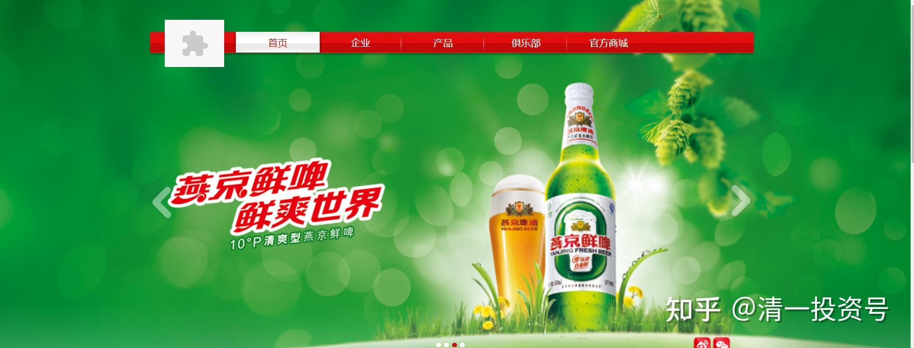

**原专栏36篇.反者道之动：投资要学会反看文章才能赢**

清一山长 2018年5月16日

**[业绩三连降 燕京啤酒根据地市场承压](http://link.zhihu.com/?target=http%3A//www.cb.com.cn/index/show/gs/cv/cv12526409219)**

**[燕京啤酒净利三连降 高端化受挫业绩承压](http://link.zhihu.com/?target=http%3A//www.redsh.com/ppnews/20180507/204502.shtml)**

[http://www.redsh.com/ppnews/20180507/204502.shtml](http://link.zhihu.com/?target=http%3A//www.redsh.com/ppnews/20180507/204502.shtml)

看到这样的文章，明显有很刻意的写作目的，我一看就知道作者就是专业的写手，“托儿”,拿钱写文章，有人拿钱登上权威媒体，专门让持有者心慌意乱，抛出手上持仓的。花点小钱，几万元，就可以拿到数百万股，数千万股。本小利大。我看到这种文章最近连连出台**，表面上很“关心”啤酒业的发展，写的文章却狗屁不通**，连基本的行业逻辑和方向都狗屁不通，专门拿一些忽悠外行的“客观数据”来冒充专家，胡乱黑啤酒企业。**我看到后，本能的反应就是：啤酒快涨了，一定要坐稳。**[燕京啤酒净利三连降 高端化受挫业绩承压](http://link.zhihu.com/?target=http%3A//finance.sina.com.cn/roll/2018-05-05/doc-ifzfkmth9041384.shtml)看到这样的文章，明显有很刻意的写作目的，我一看就知道作者就是专业的写手，“托儿”,拿钱写文章，有人拿钱登上权威媒体，专门让持有者心慌意乱，抛出手上持仓的。花点小钱，几万元，就可以拿到数百万股，数千万股。本小利大。我看到这种文章最近连连出台**，表面上很“关心”啤酒业的发展，写的文章却狗屁不通**，连基本的行业逻辑和方向都狗屁不通，专门拿一些忽悠外行的“客观数据”来冒充专家，胡乱黑啤酒企业。**我看到后，本能的反应就是：啤酒快涨了，一定要坐稳。**

**其实我应该等看到这些消息满天飞的时候再入场，可以节省很多的时间成本，不至于傻傻的拿燕京这么久的时间，导致燕京账户不断的红绿变换多次。**甚至今年有几天时间居然还翻绿了一次。感谢作者的文章，让我持有燕京更坚定。现在我手上持有燕京M（百万）级仓位，等待跟随主力一起冲锋陷阵[大笑]。但我绝对不跟“自作多情”、故作姿态的本文作者共舞。拿你做反向指标了。

其实，最近几个月，类似这种文章的连连出台，质疑啤酒业，这让我加紧了买啤酒的行动。既然燕京提前涨了，我就买珠江，因为有写手专门黑珠江，说珠江利润是政府补贴出来的。我就知道珠江已经被主力盯上了，正在进货中。结果真的珠江还打出一个几年来的最低价黄金坑。我一直买买买，导致珠江的持仓，比燕京要多不少。现在两个都涨了，我就挂眼科好了。慢慢看戏。

股市赚钱，真的好容易。有一双慧眼就够了。实体赚钱，坦率说我觉得太不容易了，要做很多事情，还不一定赚到钱。

附录：

[业绩三连降 燕京啤酒根据地市场承压](http://link.zhihu.com/?target=http%3A//www.cb.com.cn/index/show/gs/cv/cv12526409219)

[http://www.cb.com.cn/index/show/gs/cv/cv12526409219](http://link.zhihu.com/?target=http%3A//www.cb.com.cn/index/show/gs/cv/cv12526409219)

[燕京啤酒净利三连降 高端化受挫业绩承压](http://link.zhihu.com/?target=http%3A//finance.sina.com.cn/roll/2018-05-05/doc-ifzfkmth9041384.shtml)

2018-05-05 09:42 来源：中国经营网《中国经营报》李向磊、蒋政

　　北京燕京啤酒股份有限公司（以下简称“燕京啤酒”，[000729.SZ](http://link.zhihu.com/?target=https%3A//xueqiu.com/S/SZ000729)）净利润再次出现大幅下滑。日前，燕京啤酒发布的2017年年报显示，报告期内，归属于上市公司股东的净利润为1.61亿元，同比下滑48.3%，同期，公司营收也下滑3.26%，为111.96亿元。

　　《中国经营报》记者梳理燕京啤酒近3年年报时注意到，公司营收由125.38亿元下降至111.96亿元，降幅约10%；净利润的下滑幅度则超70%，由5.88亿元下降至1.61亿元。燕京啤酒不断下滑的业绩显然无法令市场满意，在2016~2017年大盘不断上涨的背景下，公司的股价长时间徘徊在8元/股以下。

　　“燕京啤酒不仅整体业绩在不断下滑，主品牌也不断受到其他品牌的挤压。”啤酒营销专家方刚对记者分析指出，在品牌方面，燕京啤酒存在一定程度的老化，产品方面，其仍以中低端为主，新推出的中高端产品还难以成为业绩的增长点。此外，华北地区作为燕京啤酒的“主战场”近年来也受到青岛啤酒等行业巨头的挤压，且已经形成多方竞争的格局。

　　《中国经营报》记者就华北地区营收下滑的具体原因，以及公司将采取何种措施扭转下滑态势等问题，致电燕京啤酒并发去采访函，但截至发稿仍未收到回复。

　高端化受挫

2018年4月28日，燕京啤酒发布2017年年报显示，公司营收和净利润均出现不同程度下滑。

　　这是自2014年之后，燕京啤酒业绩已经连续3年出现下滑。记者梳理其2015~2017年年报时注意到，营收由125.38亿元下滑至111.96亿元，同期净利润则下降幅度更大，由5.88亿元下滑至1.61亿元。

　　对于业绩下滑的原因，燕京啤酒并未在年报中披露具体原因，仅表示，受市场竞争激烈、需求动力不足、劳动力成本上升等多种因素影响，公司面临的经营压力仍较大。

　　在酒水营销专家蔡学飞看来，燕京啤酒作为国内啤酒行业寡头之一，业绩下滑原因之一是其产品高端化受挫。

　　“燕京啤酒一直在推广白啤等高端产品，但我们在走访市场时发现，其高端化做得还不太成功，没能推出像华润‘超级勇闯天涯’这样的明星产品，而高端化产品的生产成本较高，侵蚀了企业利润。”蔡学飞说，中国啤酒企业已经完成了资本布局，进入寡头时代，在这种背景下更考验企业的资源调度能力，而以中低端产品起家的燕京啤酒并不占优势。此外，随着消费升级的持续，高端啤酒逐渐多元化发展，精酿啤酒、黑啤等进口啤酒抢占了原本就不多的高端啤酒消费人群。

　　据了解，近年来燕京啤酒在不断对产品结构进行优化，确立了“以清爽酒为基础、以中档酒为主突破、以高档酒提升品牌价值”的优化方向，并推出11°P尚选红啤酒、惠泉10°P小鲜啤酒等新品，以及以燕京白啤为代表的个性化产品。

　　在2017年年报中，燕京啤酒披露燕京白啤销量同比增长37.8%。记者就燕京白啤和新产品销量占总营收比重分别是多少等问题联系燕京啤酒并发去采访函，截至发稿亦未收到回复。

　　与此同时，在燕京啤酒传统中低端产品方面，利润空间也在压缩。河南地区一名啤酒行业资深从业人员告诉记者，当前啤酒的中低端产品竞争十分激烈，利润空间被严重压缩，燕京啤酒在河南地区仍以中低端为主，其价格并不具有优势，市场空间也受到当地品牌金星啤酒，以及青岛啤酒、雪花啤酒等大品牌的挤压。

　　方刚表示，在产品结构方面，燕京啤酒仍以中低端产品为主，虽然其推出了白啤、原浆等中高端产品，但这些产品目前仍未能成为企业的业绩支撑点。此外，在品牌方面，华润啤酒、青岛啤酒纷纷进行品牌升级，而燕京啤酒鲜见相关动作。“可以看到燕京啤酒的品牌形象与品牌元素已经多年没变，其并没有随着新生代消费群体的崛起为品牌注入新的内涵，反观青岛啤酒，不断为品牌注入青春、时尚的原素，活化品牌吸引年轻消费者。”

　“主战场”承压

　　业内普遍认为，当前啤酒行业仍处于调整之中。据国家统计局数据显示，2016年中国啤酒产量为4506万千升，同比下降0.1%；2017年中国啤酒产量为4401.5万千升，同比下降0.7%。

　　作为国内啤酒行业巨头之一的燕京啤酒除了要面对品牌老化等问题外，还需要应对华润啤酒、青岛啤酒、嘉士伯等国内外啤酒巨头的竞争。

　　与燕京啤酒业绩下滑相对应的是华润啤酒、青岛啤酒业绩的增长。据二者披露的2017年年报显示，2017年华润啤酒营收为297.33亿元，同比增长3.6%；同期青岛啤酒营收为262.77亿元，同比增长0.65%。与此同时，华北地区作为燕京啤酒的“主战场”也受到青岛啤酒等行业巨头的挤压。

　　记者梳理燕京啤酒近3年年报时注意到，营收占比约50%的华北地区营收呈现连年下滑的状态。具体来看，2015~2017年，华北地区营收分别为52.65亿元、51.79亿元、51.49亿元。此外，华东地区、华南地区营收也出现了不同程度下滑。

　　与之相对应的是，青岛啤酒、华润雪花在华北地区的数据营收则处于增长态势。以青岛啤酒为例，根据公司年报显示，2015~2017年，华北地区营收分别为53.91亿元、42.03亿元、55.72亿元。毛利率方面，青岛啤酒也略高于燕京啤酒。而华润啤酒也在华北地区通过投资建厂、并购等方式渗透华北市场。

　　“华北地区作为燕京啤酒的‘主战场’，在渠道上，相比青岛啤酒、华润啤酒或有一定优势，但当前啤酒行业的中高端产品消费群体越来越多 ，燕京啤酒产品升级节奏相对青岛啤酒还是慢了一拍。” 清华顶层设计和快营销专家孙巍表示，从中高端产品的品类数量方面看，青岛啤酒多于燕京啤酒；在品牌方面，华润啤酒、青岛啤酒更关注中高端产品的年轻化，对产品进行升级或推出细分产品，而燕京啤酒在这方面明显有些乏力。

　　面对激烈的竞争，燕京啤酒提升公司竞争力的另一个方式是关厂。2017年7月，燕京啤酒在接受外界调研时称，为提升公司整体竞争力，对个别没有存在价值的企业会做关厂处理。对此，国金证券在一份研报中指出，目前燕京啤酒总产能在800万千升上下，但整体产能利用率仅为55%左右，因此关厂动作若实施将极大地利好于利润端，但由于行业关厂高峰已过，2017年以来行业实际关厂动作较前期已相对较少，因此关厂与否对于燕京而言仍是不确定项，市场份额和利润仍是两难抉择。

　　“当前，包括燕京啤酒在内的啤酒企业产能利用率普遍不高，企业优化力度不会小。”方刚表示，对燕京啤酒而言，北京及周边地区虽然是其根据地市场，但就整个华北地区而言，已经形成了多方竞争的格局。

　　蔡学飞在接受记者采访时也提到了类似的看法。他表示，当前啤酒行业的核心竞争要素已经由原来的规模和成本优势之争变成品牌的竞争，燕京啤酒以中低端产品为主的产品结构使得其在竞争中并不占优势，且啤酒行业和白酒行业一样，中低端市场在萎缩，这将进一步影响其品牌形象和盈利能力。
