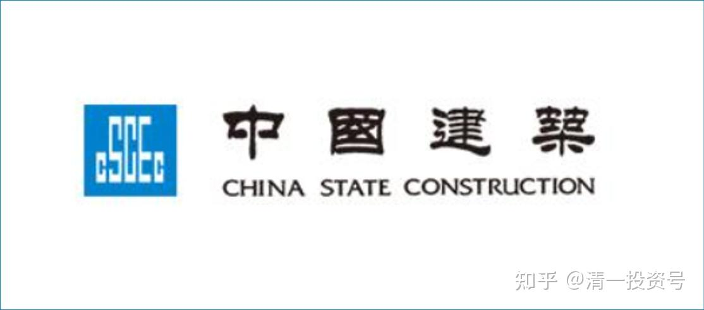
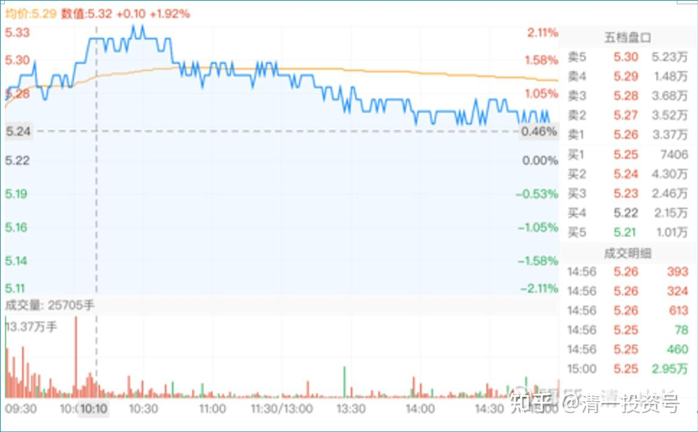
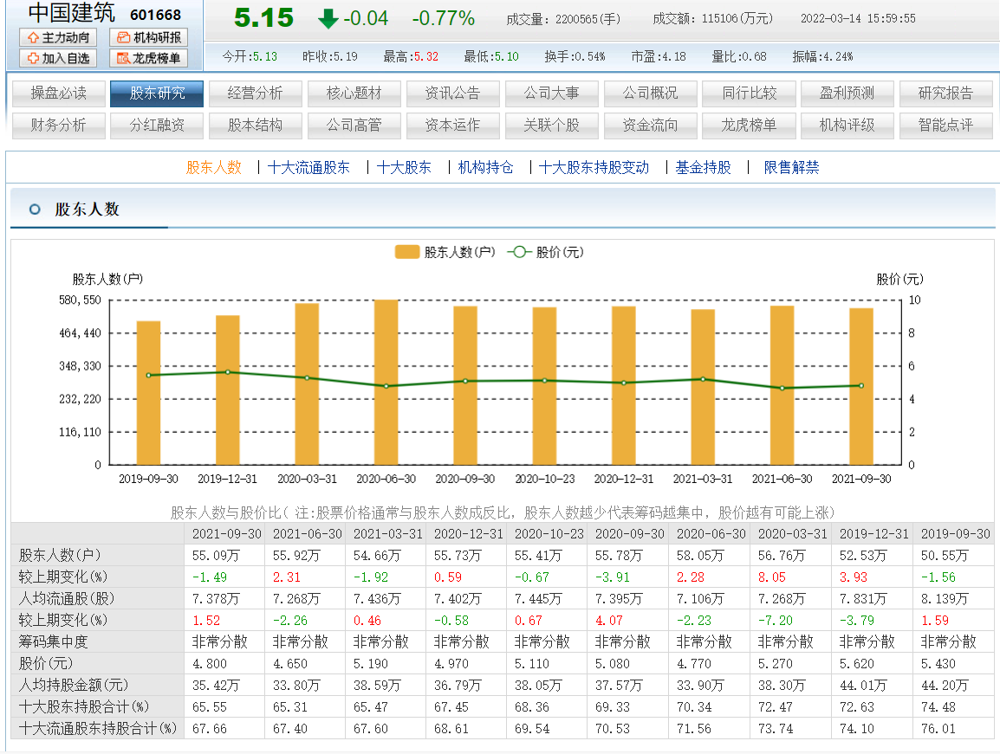
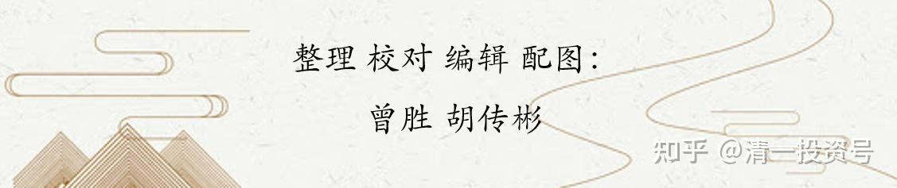

1篇.中建背后的神秘大手

[清一山长](http://link.zhihu.com/?target=https%3A//xueqiu.com/9310099567) [2021-4-19](http://link.zhihu.com/?target=https%3A//xueqiu.com/9310099567/177548969%2522%2520%255Ct%2520%2522_blank)

[$中国建筑(SH601668)$](http://link.zhihu.com/?target=http%3A//xueqiu.com/S/SH601668)

没啥事，惠泉、珠江都不能说了。就拿中国建筑来解析一下盘面吧！

上周末，中国建筑其实是交出了一份很棒的年报，利润很实在。增长很真实，其实应该藏了一些利润。特别是PPP项目，提供了很详尽的说明。未来PPP可能会是中建的大蛋糕，分红率也提升到了20%。与去年相比红利增加了16.7%。

看懂了这份年报，这是一份很亮丽的年报。特别是稳定增长可期，2020年实现营业总额1.6万亿，新签合同总额3万亿。今年预计完成3.5万亿合同金额。这些金额，就意味着3至5年后保证了中国建筑的发展是稳定的、可靠的。中国建筑的营业额，3～5年后营业额翻番，利润也翻番，中建股价翻番，也是很正常的事情。特别是全球通货膨胀下的资金，继续买入可靠的权益资产来保值，所以，中建一看就是符合要求的。不抢才怪！

我想正常人都会想买中国建筑的，今天多涨一点是很正常的，结果：就涨了三分钱。

我只好猜想：**有人一定很邪恶的不希望中国建筑上涨。因为上涨对他们不利。**中建利好不涨，肯定有阴谋。就像燕京利空，就是不跌一样，都有阴谋。不是正常的市场。

有啥阴谋？我也不知道，我知道就不是阴谋了。只是盘面上看，今天抢业绩，看好中建买入的人，被套住了。估计明天还得跌，让这些人骂中建：碰一次，死一次。这样，中建才有今天的走势K线：**放量，但不涨。**从分时走势图来看，今天是有人故意出货打压。当然，同时一大批新人被套牢。开盘一小时后，一路上根本不给希望，就是不断的送筹码，让想买中建的都买入，然后——继续阴跌，开骂！

我猜，**这就是今天走势要达到的目的。让人失望。**

不过**，谁故意的要让你失望？**这个问题，你们自己思考吧！我没啥失望的，我一股未少，上周还增加了100万股。赚了钱的。但我已经预备好重新跌破我的买入价格了。

**[清一山长](http://link.zhihu.com/?target=https%3A//xueqiu.com/9310099567) 2021-[04-20 10:37](http://link.zhihu.com/?target=https%3A//xueqiu.com/9310099567/177614719)**

[$中国建筑(SH601668)$](http://link.zhihu.com/?target=http%3A//xueqiu.com/S/SH601668)

**中建背后的神秘大手。**这两年，中建的股价一直不涨。聪明人就说：是AB的几十亿股要卖，所以涨不起来。去年2020，中建不但没有涨，还跌了。聪明人说：是AB减持，加上美国制裁中建，美资被动减持。今年一季度，也没涨。聪明人说：是美资的减持压制的。

好吧！我就勉强相信算了。不过，我想：这么多人减持，中建比五年前的价格还低。五年前收盘价是5.61元（前复权）。这五年，中建赚的新钱，都赚了超过4元了吧？中建五年，已经多赚了4元，股价比五年前还低，这是啥概念？主力不断的出逃，散户不断的接盘吗？价值不断地升高。而且——大量囤积了利润在研发费用和PPP里面。这些都不算了。一旦释放利润出来，超过茅台的总利润，应该是妥妥的。

不过，看股东数据，却令人傻眼：2019年，股东数55万。现在2021年的最新数据，是54万。这几年的几十亿股，显然不是散户接盘接走了。**是谁偷偷地的拿走了可能高达60亿～100亿的中建股份？（AB加上美资？）**。

**想到这里，不禁不寒而栗——不——是无限惊喜！有一双实力超过AB的神秘大手，已经悄然接盘中建了**。不这样想，实在对不起散户数量没有增加的客观数据。中建不像燕京啤酒，重阳只是卖了一点，股东户数就增加了一倍。中建按道理，第二大股东全面退出，股东数应该大幅增长，才是正常的。如果没有？就是不正常的。

如果不正常，公司的业绩一直很好，就是说：中建会涨的，就是不知道什么时候涨。有可能涨疯掉都难说。毕竟，中建的利润和贵州茅台是差不多的，成长性也差不多。如果有一天，主力非说中建是“建筑茅”，变成了赛道股，就难说会涨到什么价格了[大笑]

臆想一下，供大家娱乐！[俏皮]

**[SevenYearUP](http://link.zhihu.com/?target=http%3A//xueqiu.com/n/SevenYearUP):回复 [晕娜](http://link.zhihu.com/?target=http%3A//xueqiu.com/n/%25E6%2599%2595%25E5%25A8%259C):**

60亿股，15%的股份。如果一个或几个大户接了的话，按道理说应该出现在十大股东里面。

[清一山长](http://link.zhihu.com/?target=https%3A//xueqiu.com/9310099567) 2021-[04-20 11:30](http://link.zhihu.com/?target=https%3A//xueqiu.com/9310099567/177623096%2522%2520%255Ct%2520%2522_blank) 回复[@SevenYearUP](http://link.zhihu.com/?target=http%3A//xueqiu.com/n/SevenYearUP):

阿布达比投资局，才9千多万股，就进了十大股东**。想要拿走这60多亿股（其实不止，还有美资卖出的），按道理得有60多个十大股东实力的超级大户才行。这是啥概念？所以我才说是“神秘大手”，显然超级的神秘，超级的低调，不愿意为人所知。**而且，这双大手，是用市场行为买进的，不知不觉。如果是机构转让，就会暴露身份了。所以，“神秘大手”显然是不愿意暴露身份的，只愿意在场内，用很多的账户低调买入，每个账户都不超过十大股东的最低入门限量，这也需要上百个账户才能完成这么多的股份持有，肯定是分散持有的。实控人是谁？还是一个集团？
也许，这群人，就是AB的对手盘？瞎猜的！

**在赚一亿的道路上:回复 清一山长:**

山长，有没有比中国建筑更好的股。虽然我重仓中建，也赚钱了。三年期投资的话。我之所以这么问，因为我发现你眼里就只有中建

**[清一山长](http://link.zhihu.com/?target=https%3A//xueqiu.com/9310099567) 2021-[04-23 16:12](http://link.zhihu.com/?target=https%3A//xueqiu.com/9310099567/178008584) 回复 [在赚一亿的道路上](http://link.zhihu.com/?target=http%3A//xueqiu.com/n/%25E5%259C%25A8%25E8%25B5%259A%25E4%25B8%2580%25E4%25BA%25BF%25E7%259A%2584%25E9%2581%2593%25E8%25B7%25AF%25E4%25B8%258A):**

“有没有比中国建筑更好的股？”
您这句话，就是没有受过教育训练的问话，因为没有内容。没有细节、内涵。“好”只是一个价值判断，怎么说，都是对的。
我可以说：就没有比中国建筑更好的股。因为12345.等等。不信你去找一个世界第一的建筑企业给我？中国300米以上高楼90%都是中建盖的，还有第二家吗？
但我猜：你想问的，其实是：难道就没有未来会比中建涨得更多的股票吗？

答案也很简单：当然有，还很多。我相信未来三年，很多股票都可能比中建涨得多。甚至华侨城都有可能比中建涨得多。
问题是：我不知道是谁，肯定会比中建涨得多。除非我穿越到2024年，看看股票报价，再穿越回来买股。
如果我没有时空穿梭机的话，我就用最老实的方式来买股：未来涨的可靠性最高的股。确定性最高的股。基于我的认识能力，目前只有中建。其他是“可能性”，中建我赌确定性。
正因为有确定性，我才公开宣扬一下。其他没确定性的，我自己买。比如9.22元的珠江，我也没大肆宣扬。但我买的时候，认为这个价，技术上来说，是安全的。中建是：技术上不知道怎么看，但基本面是安全的。[俏皮]

**在赚一亿的道路上:回复 清一山长:**

山长，之前我有个朋友说中顺洁柔很好。我也是对应市盈率，增速确定的中建。我觉得中建安全，确定性高。中顺洁柔当时市盈30多了。但他有句话点醒了我。他说确定性是最重要的，但确定性高增长比确定性低增长要更安全，只要估值合理。虽然我还是持中国建筑，但我觉得有些东西正在悄悄改变，但能力圈有限路会越走越窄。

**[清一山长](http://link.zhihu.com/?target=https%3A//xueqiu.com/9310099567) 2021-[04-23 20:13 · 来自雪球](http://link.zhihu.com/?target=https%3A//xueqiu.com/9310099567/178035750) 回复 [在赚一亿的道路上](http://link.zhihu.com/?target=http%3A//xueqiu.com/n/%25E5%259C%25A8%25E8%25B5%259A%25E4%25B8%2580%25E4%25BA%25BF%25E7%259A%2584%25E9%2581%2593%25E8%25B7%25AF%25E4%25B8%258A):**

每个人都只能赚能力圈之内的钱。您能弄懂中顺洁柔的上涨逻辑，当然可以去买它。涨了，不一定就是“对了”。赛道股有投资逻辑吗？有。但不是我的逻辑，是我弄不懂的逻辑。
您看来是“有效市场理论”的拥护者。可惜我不是。所以，我们俩，是没法讨论啥好，啥不好的。基础的投资逻辑不一样。
晕娜和我的投资持股逻辑不一样，我们能相互了解。

你和我们两人的投资逻辑都不一样，我们能够了解你。但你却不了解我们的逻辑。我们三人都持有中建，但持有的逻辑，其实完全不一样。心态自然也不一样[大笑]。我相信，您原来认为中建“最好”才买入，现在有点觉得“不太好”，因为它就是不涨。所以你才来问我它好不好？其实真问错人了。我根本不在乎它涨不涨，因为我不用涨跌来判断它好不好。

附：参考文章

[清一投资号：3篇.中国建筑系列之一：就算是好股，也别谈恋爱](https://zhuanlan.zhihu.com/p/512602669)（整理文）

[清一投资号：4篇.中国建筑系列之二：大A股的稳定器](https://zhuanlan.zhihu.com/p/519506160)（整理文）

[清一投资号：5篇.中国建筑系列之三：发现投资机会的方法](https://zhuanlan.zhihu.com/p/522851722)（整理文）

[清一投资号：6篇.中国建筑系列之四：只有少数人才知道正确的通道](https://zhuanlan.zhihu.com/p/522882446)（整理文）

[清一投资号：8篇．建筑的股性正在激活中](https://zhuanlan.zhihu.com/p/476832159)（整理文）

[清一投资号：13篇.中国建筑对话录：不养独子](https://zhuanlan.zhihu.com/p/463971765) （整理文）

[清一投资号：17篇.中建股东数历史新低](https://zhuanlan.zhihu.com/p/505901339)（整理文）

