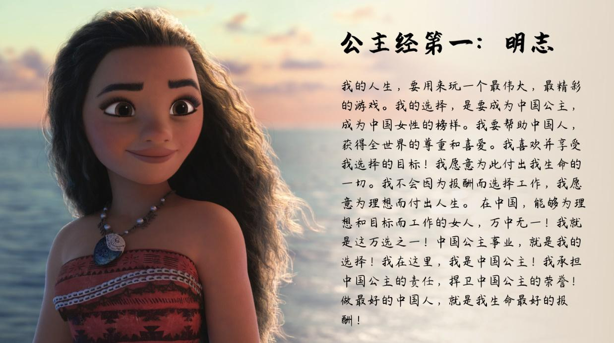
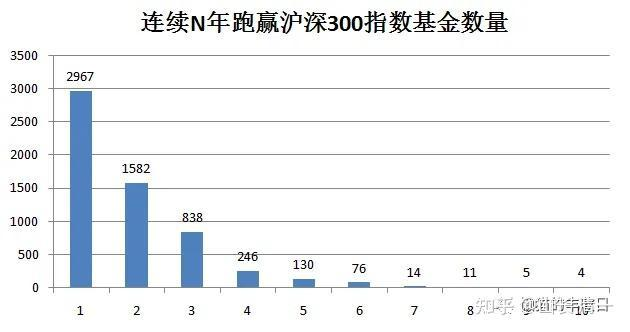
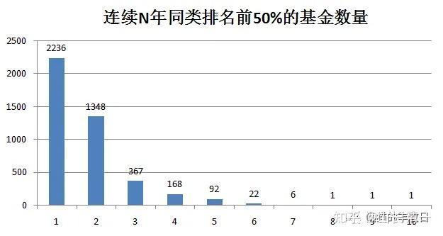

202篇.金融专业人员的投资水平也就7926选4？

**清一山长** [2025年11月9日11:47](https://zhuanlan.zhihu.com/p/1970815654249629060)

巴菲特说：普通人，就买指数基金算了。这个道理，我觉得对！

不过所有投资的人都觉得自己不普通，都是天生赢家，因此才进入股市！

专业的基金投资人，当然更不普通了。这些专业人员，天天研究市场和金融，每天操心的就是怎样买到最有潜力的股票。他们的战绩如何呢？看起来比大猩猩随意投飞镖的概率，也高不到哪里去！

**市面上，股票基金+混合基金一共7926只。2020年，一共有2967只基金跑赢了沪深300指数。但连续10年，都跑赢沪深300指数的基金，总共只有4家！**

**博时主题行业，作为其中两个主动性基金（其他两个是被动基金），它连续10年，每年都能跑赢沪深300指数。**涨了310%。

不过相比我的业绩，还是差一点。可见我的运气还是超级好！2011到2020年，正好是我财富增长最快的期间，这个考评周期的前五年就增长了10倍。

基金资料的原文链接

[连续十年跑赢沪深300的基金，全市场只有4只](http://link.zhihu.com/?target=https%3A//mp.weixin.qq.com/s/zI8Z214cbWefrFUZNKb9Yg)

[https://mp.weixin.qq.com/s/zI8Z214cbWefrFUZNKb9Yg](http://link.zhihu.com/?target=https%3A//mp.weixin.qq.com/s/zI8Z214cbWefrFUZNKb9Yg)

（**巴菲特**：“普通人最好的投资，就是买标普500指数基金。”1996年，他在股东信中写道：“通过定期投资指数基金，一无所知的投资者实际上能够战胜大多数投资专业人士。但奇怪的是，当‘傻钱’承认自己的局限，它就不再傻了。”

2004年股东大会上，他直白地建议：“如果普通人不懂投资，就应该一直持有标普500指数基金。不要试图挑选个股或判断市场时机，只需要定期投资一个低成本的标普500指数基金就好。”

2017年访谈，他再次说：“持续买入标普500指数基金，然后坚持持有几十年，别管新闻怎么说。在很长一段时间内，你会比那些买入又卖出、听信各种消息的人做得更好……只需购买一部分美国经济，然后坚守下去。”

2021年股东大会中巴菲特又明确表示：“大多数投资者从长期来看会受益于标普500指数基金，而不是挑选个股。我推荐标普500指数基金，但我从未向任何人推荐伯克希尔（伯克希尔·哈撒韦公司），因为我不希望人们因为觉得我在引导他们买入而购买它。”他进一步说明，自己去世后，其遗产的90%资产将配置于标普500指数基金。）

**（标题、图片为编者所加）**

文章音频：

[619篇.金融专业人员的投资水平也就7926选4？](http://link.zhihu.com/?target=https%3A//www.ximalaya.com/sound/934307118)

**参考链接：**

[195篇.今天尝试新股](https://zhuanlan.zhihu.com/p/1971965825603866634)

[196篇.清一公社：为何绩优股10年不赚钱?（配图版）](https://zhuanlan.zhihu.com/p/1971985927011284250)

[197篇.不要相信现金](https://zhuanlan.zhihu.com/p/1974035759771174478?utm_psn=1974210802497132044)

[198篇.赚快钱的人，正在快速被消灭](https://zhuanlan.zhihu.com/p/1974199886363779424)

[199篇.白银又涨停，西部换中冶](https://zhuanlan.zhihu.com/p/1974448126355072939)

[200篇.金融有风险](https://zhuanlan.zhihu.com/p/1974442465772736597)

[链接汇总（截止2025年10月20日）](https://zhuanlan.zhihu.com/p/621215591?utm_psn=1967007144831350474)
