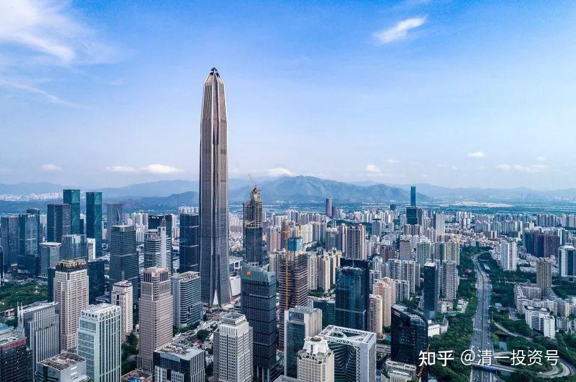
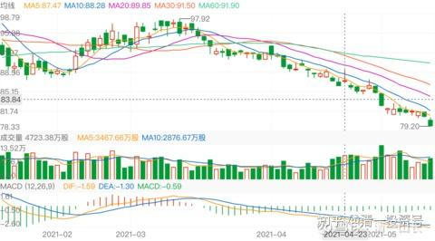
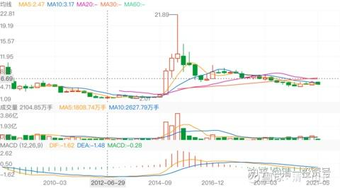

20篇.中国建筑系列之十八：中国建筑可能是最安全的投资标的

清一山长 2021年05月13日～2021年05月19日

**导读：**

一、中字头和美股玩的是跷跷板游戏

二、不懂平安不买，看懂中建重仓

三、理性工科人只取一瓢饮

四、可以不买中建，但也别去追赛道股

五、低位说一说，高位就闭嘴

**正文：**

**一、中字头和美股玩的是跷跷板游戏**

清一山长[2021-05-13 08:56](http://link.zhihu.com/?target=https%3A//xueqiu.com/9310099567/179685483)

[$道琼斯指数(.DJI)$](http://link.zhihu.com/?target=http%3A//xueqiu.com/S/.DJI)美股已经连跌两日，超过千点。中国建筑，中国银行等股票，一向是美股涨就跌的。这一回，会有帮助吗？可能要看美股是假摔还是真摔吧？

**二、不懂平安不买，看懂中建重仓**

清一山长[2021-05-13 16:45](http://link.zhihu.com/?target=https%3A//xueqiu.com/9310099567/179751382)

[$中国平安(02318)$](http://link.zhihu.com/?target=http%3A//xueqiu.com/S/02318)平安，是我一直想买，却一直没买的一个标的。很久以前买过一点。但因为后来想买的时候就涨了，我不肯追涨，所以一直没买。

没想到这两年，平安走势很难看。套住了很多资深的价投。

其实我不懂保险，看懂保险太难了。我没买平安的一个原因，是有人做过比较，平安的保单比别家都贵。我想：优点是头部超额利润？但缺点是：信息时代，保单有啥差异化？能维持吗？没弄懂，就没买！

我连中国建筑都是最近一年才勉强看懂的。所以就重仓了。有个朋友说：从中建换到平安，被套了20%。其实看年线图，中国建筑5年都没赚钱。平安最近五年中，三年都是上涨的，就两年跌了。所以，不能说明选中建就好。当然，未来就说不清楚了。

不管怎样，平安下跌后，风险肯定少了一点。我唯一不安的就是：最近从88元跌下来，成交量一路大增。这个让我意外。看下面这个图，是底部放量的图形。刚开始从97元跌到88元，其实持仓这很稳定，成交并不大。但88元往下这一轮跌势，成交不断放大。肯定发生了一些不同寻常的事情，原来的持有者在不断离开。新人也积极进入。但目前为止，似乎空方占上风。到底发生了什么呢？绝对不仅仅是华夏幸福的失败。上一波投资某外资的巨大失败，也是让平安股价压制了很久。

[逆向思维大队长](http://link.zhihu.com/?target=http%3A//xueqiu.com/n/%25E9%2580%2586%25E5%2590%2591%25E6%2580%259D%25E7%25BB%25B4%25E5%25A4%25A7%25E9%2598%259F%25E9%2595%25BF)回复[清一山长](http://link.zhihu.com/?target=http%3A//xueqiu.com/n/%25E6%25B8%2585%25E4%25B8%2580%25E5%25B1%25B1%25E9%2595%25BF)：

学校在哪？叫什么名字？如果是国内，我想去看看，顺便捐点款，如果在泰国，我朋友会代替我送上捐款。

清一山长[2021-05-16 07:35](http://link.zhihu.com/?target=https%3A//xueqiu.com/9310099567/179948760)回复[逆向思维大队长](http://link.zhihu.com/?target=http%3A//xueqiu.com/n/%25E9%2580%2586%25E5%2590%2591%25E6%2580%259D%25E7%25BB%25B4%25E5%25A4%25A7%25E9%2598%259F%25E9%2595%25BF)：

多谢好意。我的基金，叫清**一新教育基金会**。目前我是唯一的捐款人，不接受其他人的捐款。我已经拒绝了很多家长的捐款。我教的商学院的学生，今年毕业了。家长觉得孩子学到了别处学不到的东西。特别的感恩，要捐款2000万给我，还被我拒绝了。现在我有钱，就不需要到处要钱。等我没钱了，再让大家来做做好事吧！

BTW：我不接受家长捐款的原因，是我的私人大学——【**清一商学院**】的学生，本来就是付费上学的。这些学生，家庭条件都很好，原来都是计划出国留学的。还有从国外上学，转学来商学院上学的。为了不丢中国人的人格，因为我不认为我的商学院是不如美国的，所以我收取的商学院学费，是按照美国学费标准来收的：生活费加上学费一共7万美金！学了四年毕业了，尽管家长很感恩，认为物超所值，愿意捐款给我，但我认为：家长不欠我的，所以没必要给我钱。

而且——我现在拿钱来也没用，不需要这么多开支的。所以，我让家长把这钱去买中国建筑，5年10年后，赚了多少，可以捐多少，本金不需要动！[笑]到时候，我再考虑是否帮他做好事。也许可以送他一栋教学楼“英东楼”之类的，或者帮他成立家族基金。这是最大的功德！

**三、理性工科人只取一瓢饮**

可爱SongSong2回复清一山长：

清一山长 之前在武大上学的时候看了山长讲《道德经》的整理版，当时觉得能把《道德经》讲这么通俗易懂，而且有很多需要高悟性才能掌握理解，真是“天人”(可能有的球友觉得我这又是宗教崇拜，被洗脑了，告诉大家我没有见过山长，只读过他讲课的记录，觉得非常有用才感叹不已，而且我是武大工科研究生毕业，要被人骗，需要那人至少有能上清华的智商才可以)，但当时自己人生经历有限，有些觉得很有用的智慧但自己用不出来。现在工作了5、6年，也有钱做了点小投资，重读山长讲的《道德经》、《六祖坛经》，对自己工作、生活、投资(**我只学山长中建的呆坐法，像惠泉这种手法我自认为学不会，就看个热闹**)，刚出生的小孩教育规划都能从中找到一些方向和指导原则。自己以为学习山长智慧最好的就是读懂山长的《道德经》讲解，读懂了，啥都能做，且能做好；无聊的空虚的、郁闷的也能找到人生的意义。山长讲的《六祖坛经》和《道德经》算是同一级别的智慧讲解。这两个在喜马拉雅上都有，我现在每天都在听，受用无穷。这里希望能和山长结个缘，我小孩1岁半，以后希望能做您小女儿的学生[笑]。

清一山长回复[可爱SongSong2](http://link.zhihu.com/?target=http%3A//xueqiu.com/n/%25E5%258F%25AF%25E7%2588%25B1SongSong2)：

[献花花]工科人，其实相对比较有理性，有科学思维，有鉴别真假的习惯。很多愤青，脑子坏了。啥都分辨不出来。完全没思维方式，估计是学了烂文科。真文科没人教。祝福你们家小女儿健康成长。我家小女的目标，是做3.0教师，就是教外国人的教师，超越2.0。她和伙伴的目标，是征服泰国的教育界[笑]

**四、可以不买中建，但也别去追赛道股**

清一山长[2021-05-19 19:19](http://link.zhihu.com/?target=https%3A//xueqiu.com/9310099567/180300632)

[$中国中铁(SH601390)$](http://link.zhihu.com/?target=http%3A//xueqiu.com/S/SH601390)当年的赛道股，当年疯狂上涨，现在年年下跌，中国的股市，就是这样的不可思议。中国中铁，2014年从2元直接冲到9元，上涨四倍多，第二年冲高到21元，涨了十倍。当年的中铁，其实风光不亚于现在的茅台。冲涨的幅度，比茅台还高。2015年之后，很不幸就是一路的向下，走势比中国建筑惨多了。其实我2014年与中国建筑一起买了中国中铁的，我记得买入理由，是比尔·盖茨的基金也买了它。价格2元多一点点。但后来上涨，我过早卖出，没有赚到大钱。直到今天都没有重新买进。

但现在，有了一点点买入的冲动——因为跌得太惨了！实际上，现价买入，已经低于2014年的估值了。特别是港股，才3倍多的市盈率，我认为比银行的估值都低了。但它的经营风险，显然不如银行高。而且——每股利润1元多。2014到今天，7年了，股票价格才涨了3元。赚的都不止3元了。我不相信它未来七年都不涨。

当年的赛道股，今天是这幅模样，它每年照样赚钱，甚至赚钱更多了。资金却离开了它。今天的赛道股，您认为“不一样”吗？您可以不买中国建筑，不买中国中铁不买中国铁建，但我提醒您：有钱也别去买赛道股，当心拿了之后跟你玩**“七年跌”**。[笑]

**五、低位说一说，高位就闭嘴**

华尔街见闻2021-05-19 18:30

《叶飞：“如果以后有事就是但斌害的”，但斌：我根本不认识他》

原文链接：[https://xueqiu.com/1107854878/180297142](http://link.zhihu.com/?target=https%3A//xueqiu.com/1107854878/180297142)

清一山长[2021-05-19 22:39](http://link.zhihu.com/?target=https%3A//xueqiu.com/9310099567/180317502)评论上贴：

但斌写的：庄家的背后有什么？很有道理。

庄家从5元拉到10元，未必赚钱。你跟到10元，就赚了一倍。但是——跟错了就赔钱。同样，庄家为啥要制造震荡？因为直接拉，绝对赔钱。制造震荡，弄得好，拉到10元、15元，他赚的比一倍要多。

但斌知道不知道股市有庄家？肯定知道。不然市场不会这么怪异，该涨的不涨。我认为中国建筑不涨就是有人故意压盘呢[笑]！有些不该涨的涨飞天。但他肯定不想趟这趟浑水，不想多谈这种事情。叶飞拉他站队，他肯定不干，这里面水太深了。我认为他的态度其实很明智。离远点，**看破别说破**。啤酒10元以上我不说话，也是怕犯忌。低位多说说，给大家一点赚钱的机会就够了。高位你们玩抢钱游戏，我就不吭气了。我尽量离双方都远点，避免误伤！

这个叶飞，不知道哪股筋出问题了。我看他有点不正常！好像现在谁都咬。

参考链接：

[1篇.中建背后的神秘大手](https://zhuanlan.zhihu.com/p/481078141)

[2篇.赚钱王道：在低估的前提下轮动](https://zhuanlan.zhihu.com/p/509053673)

[3篇.中国建筑系列之一：就算是好股，也别谈恋爱](https://zhuanlan.zhihu.com/p/512602669)

[4篇.中国建筑系列之二：大A股的稳定器](https://zhuanlan.zhihu.com/p/519506160)

[5篇.中国建筑系列之三：发现投资机会的方法](https://zhuanlan.zhihu.com/p/565361369)

[6篇.中国建筑系列之四：只有少数人才知道正确的通道](https://zhuanlan.zhihu.com/p/522882446)

[7篇.中国建筑系列之五：投资中建的核心逻辑和理由](https://zhuanlan.zhihu.com/p/528942534)

[8篇.中国建筑系列之六：熊市布局，牛市收获](https://zhuanlan.zhihu.com/p/534585889)

[9篇.中国建筑系列之七：每个人都应有自己的投资逻辑](https://zhuanlan.zhihu.com/p/538090859)

[10篇.中国建筑系列之八：为自己的投资负完全的责任](https://zhuanlan.zhihu.com/p/549316895)

[11篇.中国建筑系列之九：如何用融资投资中国建筑？](https://zhuanlan.zhihu.com/p/559571938)

[12篇.中国建筑系列之十：综合对比下中建的长远价值](https://zhuanlan.zhihu.com/p/564749726)

[13篇.中国建筑系列之十一：多年不涨的中建，值得坚守](https://zhuanlan.zhihu.com/p/566546633)

[14篇.中国建筑系列十二：长持股的价值投机操作及未来畅想](https://zhuanlan.zhihu.com/p/568853074)

[15篇.中国建筑系列之十三：从年报的角度再次解读超低估的中建盘面](https://zhuanlan.zhihu.com/p/572007510)

[16篇.中国建筑系列之十四：买中国建筑的好处就是可以安心睡觉](https://zhuanlan.zhihu.com/p/574936145)

[17篇.中国建筑系列之十五：千万不要无原则的在股市中“赌”](https://zhuanlan.zhihu.com/p/577278058)

[18篇.中国建筑系列之十六：中建置顶文被删触动了谁的利益？](https://zhuanlan.zhihu.com/p/578823434)

[19篇.中国建筑系列之十七：通过对比发现中国建筑的价值](https://zhuanlan.zhihu.com/p/581419744)

[20篇.中国建筑系列之十八：中国建筑可能是最安全的投资标的](https://zhuanlan.zhihu.com/p/583777334)

[21篇.中国建筑系列之十九：做优质股权收集者，别对天叫穷卖惨](https://zhuanlan.zhihu.com/p/585173888)

[22篇.中国建筑系列之二十：如何超过杨百万？看到价值，坚定持有](https://zhuanlan.zhihu.com/p/589745640)

[清一投资号：8篇．建筑的股性正在激活中](https://zhuanlan.zhihu.com/p/476832159)（整理文）

[清一投资号：13篇.中国建筑对话录：不养独子](https://zhuanlan.zhihu.com/p/463971765) （整理文）

[清一投资号：17篇.中建股东数历史新低](https://zhuanlan.zhihu.com/p/505901339)（整理文）

