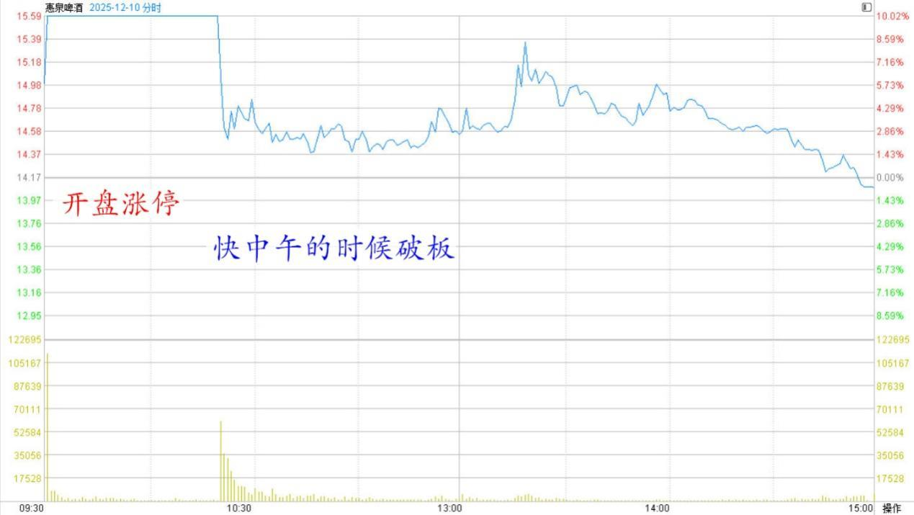
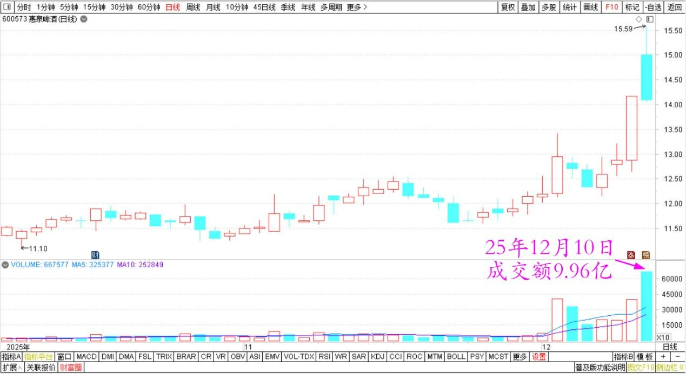
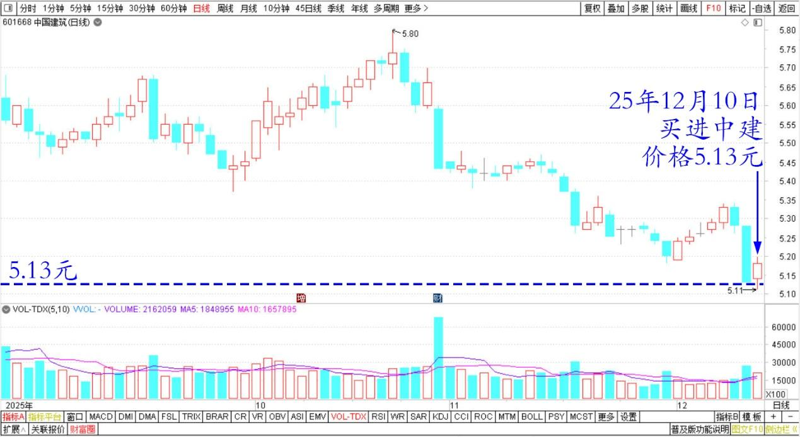

212篇.惠泉主力已经成功撤退了

[清一山长](https://www.zhihu.com/people/shan-chang-qing-yi)[2025年12月10日19:31](https://www.zhihu.com/pin/1982160166314075805)

惠泉今天走完了吗？

今天早上，我应邀去我的证劵公司见老总。出发前我猜想今天惠泉会有冲高回落的动作，就挂了两个单子，比涨停低了几分钱卖出80万股。

回来看：惠泉开盘就涨停，然后快中午的时候破板，成交9.8个亿，相当于今天流通盘的三分之二，已经换手了。这是一个超级高的换手率。

惠泉啤酒2025年12月10日分时图

惠泉啤酒2025年10月～12月日线图

这样说起来，主力已经成功地把大部分筹码都卖给散户了。我好奇——难道现在，还有人看不穿？今天这么多人来追涨停的？

不管什么理由吧！事实上：就是惠泉主力已经成功撤退了。未来不一定下跌，但再涨停，似乎没有理由了。没有大善人想来解放今天套牢的散户吧？

ε=(´ο｀*)))唉！没想到惠泉会是这个结局，这么快就被弃用了！

如果今天我在现场盯盘的话，会把手上的货多卖一点出去的。

现在虽然还是十大，不过仓位都大幅降低了。今天还挂单5.13元买进中国建筑，晚上回来查看都已经成交。

中国建筑2025年10月～12月日线

感谢主力的拉升，我的惠泉持有的成本，已经低到不需要在意的地步了！

剩下的，随市场波动即可。高了卖，低了买。长期坚持持有就行了。

**（标题、图片为编者所加）**

文章音频：

[629篇.惠泉主力已经成功撤退了](http://link.zhihu.com/?target=https%3A//www.ximalaya.com/sound/941719393)

**参考链接：**

[205篇.惠泉涨停卖出300万股](https://zhuanlan.zhihu.com/p/1979518999168571200)

[206篇.燕京快涨了，12月的啤酒行情也许有惊喜](https://zhuanlan.zhihu.com/p/1981117920756142902)

[207篇.买回几十万股惠泉，比2天前卖价低了1元多](https://zhuanlan.zhihu.com/p/1982146009615333147)

[208篇.股市案例分析——主力操盘的周期有多长（配图版）](https://zhuanlan.zhihu.com/p/1982798321073533837)

[209篇.中粮糖业主力走势猜想](https://zhuanlan.zhihu.com/p/1983556072204703566)

[210篇.茅台换什么？](https://zhuanlan.zhihu.com/p/1984033552149545369)

[211篇.惠泉逆势上涨突破涨停价](https://zhuanlan.zhihu.com/p/1984031933164955450)

[链接汇总（截止2025年12月3日）](https://zhuanlan.zhihu.com/p/621215591?utm_psn=1967007144831350474)

