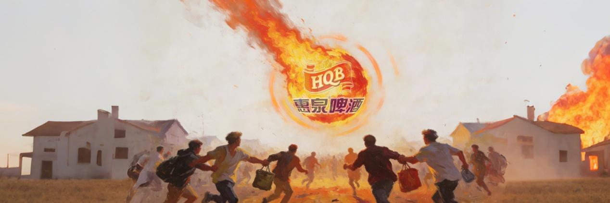
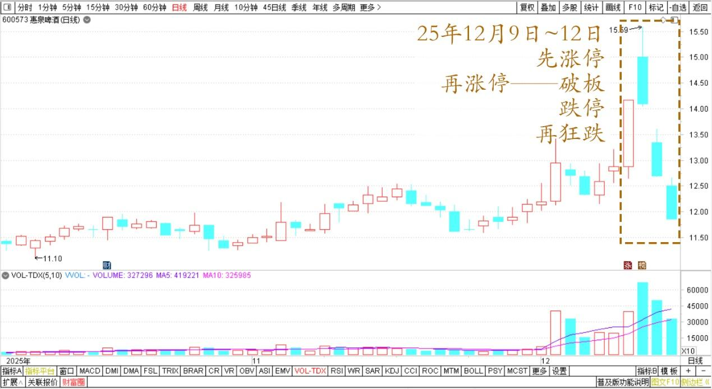
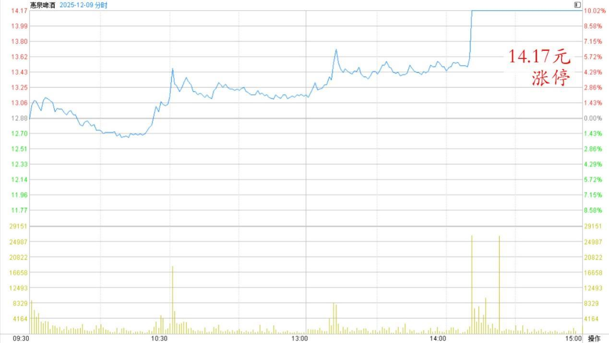
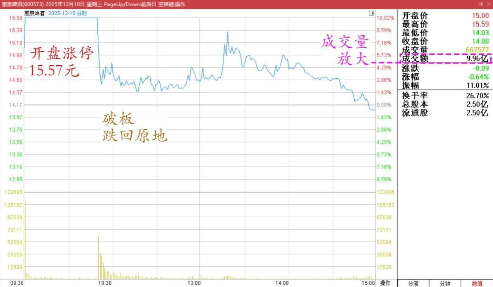
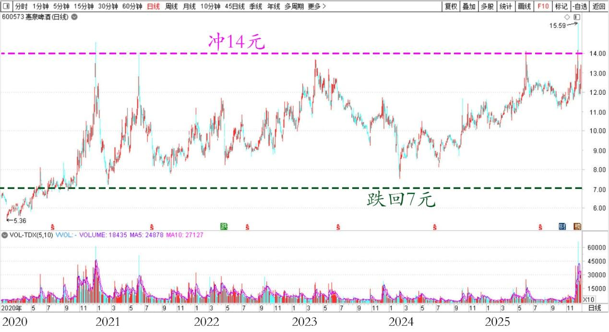
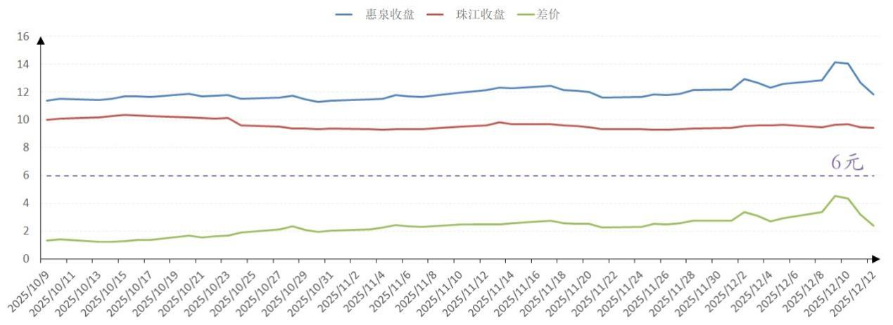

213篇.惠泉如此下跌，恐慌局面彰显

清一山长[2025年12月12日22:19](https://www.zhihu.com/pin/1982935643714786932)

惠泉先涨停，再涨停——破板——跌停——再狂跌！

惠泉啤酒2025年10月～12月日线图

连续几日，惠泉的表演特别精彩，上蹿下跳，让人目瞪口呆。都搞不清主力在玩啥表演了！

14.17元涨停，然后破板。不过跌幅不深。

惠泉啤酒2025年12月9日分时图

接着就玩开盘涨停，封板，纹丝不动。15.57元，成为一个靓丽的高峰。吸引足够跟风盘之后，破板，跌回原地。成交量放大到流通盘的三分之二！我一看——成交这么大，显然大势已去，筹码基本上换手了！

惠泉啤酒12月10日分时图

我的主账户卖得只剩200多万股了。14元左右，心想还出一点算了。幸亏上次两次涨停都出了货，现在这个跌法，大批的货，还真不好卖？

不过我不用操心了，第二天没想到——这票跳空下跌，直接奔跌停去了！

第三天，继续大跌接近7%，居然打破了12元的“底”。

这几天跟风的散户，全被套住了！这一套，不知道多久了，因为惠泉的这种表演，几年前就玩过的，当年最高冲14元多，也是这种冲法。但之后，跌回了7元，腰斩。而且很多年都没有再恢复雄风。

惠泉啤酒2020～2025年日线图

这次回调的目标是多少呢？会不会又到7元区？

不知道了！

今天看大跌，实在忍不住，12.02元入手开始重新买入。按道理是不应该买的，毕竟有更便宜的珠江在，差价两元多呢！几天前的差价是快6元了，我卖出的部分补充进来，就算是赚了六元的差价！

惠泉啤酒、珠江啤酒2025年10月～12月收盘价

重新买入惠泉，无非是赚了3.5元的差价！因此，还是买珠江，才符合我的价值投资换股公式。**目前珠江已经成为我的啤酒第一重仓股了。**

不过——考虑到恋旧的感情。毕竟原来高位卖出了不少**。惠泉现在的报价，如此下跌，恐慌局面彰显。**既然主力如此有诚意，跌了这么多，完全跌回原来的整理平台！实在不好意思不买入一点，也就一点而已。

今天就买了一些回来，再跌，就继续买吧！无非是把涨停卖出的头寸买回来而已，只是收回原来的筹码罢了，还多了30%的筹码！不过多的部分不算，**我最多买回原位**，不会再增加了。

惠泉不小心成为二大，是因为燕京、珠江原来涨了很多，钱没地方去。现在——要用钱的地方还多，不需要消耗在惠泉上。

**要想收回全部筹码，也不现实，低价根本没有太多卖出的！**

我的判断：看不懂。我认为主力疯了，乱玩的！因为我想不出来这种玩法怎么赚钱？

中粮糖业的玩法，主力才是赚钱的。我被洗了筹码，心服口服！

惠泉的玩法，我赚了钱，但莫名奇妙，**完全得益于我的“看多不做多，反而做空”的平淡心。**这套法则，在中糖上就没有赚取更多利润，丢了一半的可能盈利。

当然，还有第二种可能：某种智能算法，可以让主力赚钱！这个就超过了我的大脑计算能力，我认输。

**（标题、图片为编者所加）**

文章音频：

[630篇.惠泉如此下跌，恐慌局面彰显](http://link.zhihu.com/?target=https%3A//www.ximalaya.com/sound/942514115)

**参考链接：**

[205篇.惠泉涨停卖出300万股](https://zhuanlan.zhihu.com/p/1979518999168571200)

[206篇.燕京快涨了，12月的啤酒行情也许有惊喜](https://zhuanlan.zhihu.com/p/1981117920756142902)

[207篇.买回几十万股惠泉，比2天前卖价低了1元多](https://zhuanlan.zhihu.com/p/1982146009615333147)

[208篇.股市案例分析——主力操盘的周期有多长（配图版）](https://zhuanlan.zhihu.com/p/1982798321073533837)

[209篇.中粮糖业主力走势猜想](https://zhuanlan.zhihu.com/p/1983556072204703566)

[210篇.茅台换什么？](https://zhuanlan.zhihu.com/p/1984033552149545369)

[211篇.惠泉逆势上涨突破涨停价](https://zhuanlan.zhihu.com/p/1984031933164955450)

[212篇.惠泉主力已经成功撤退了](https://zhuanlan.zhihu.com/p/1985014426399691858)

[链接汇总（截止2025年12月3日）](https://zhuanlan.zhihu.com/p/621215591?utm_psn=1967007144831350474)

