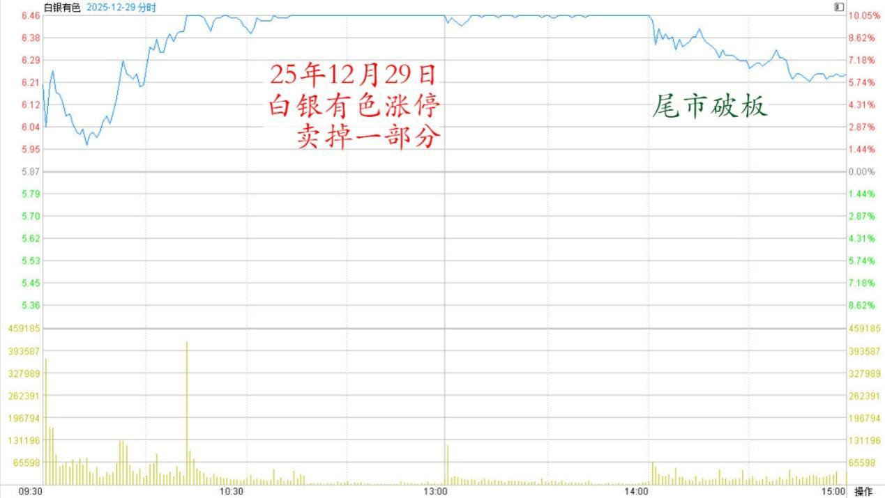
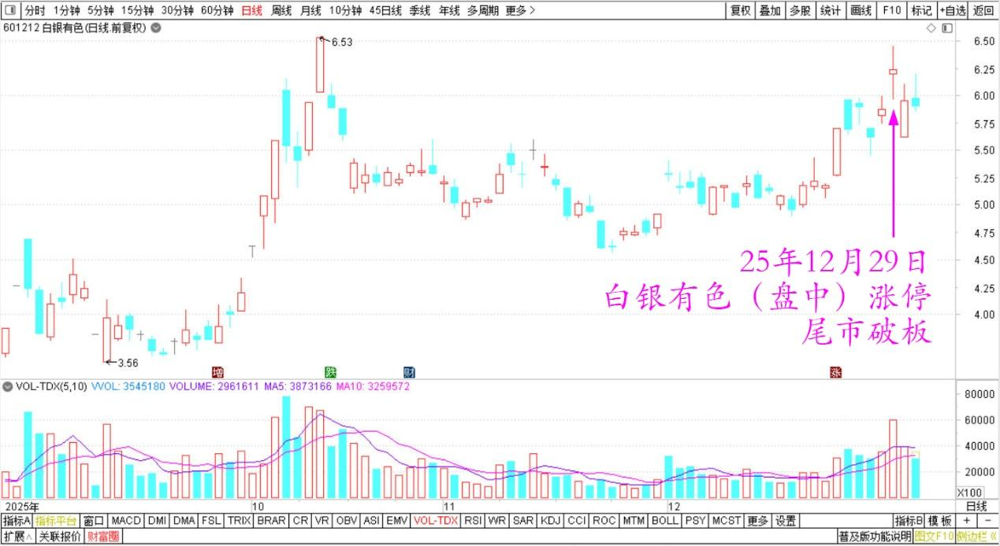
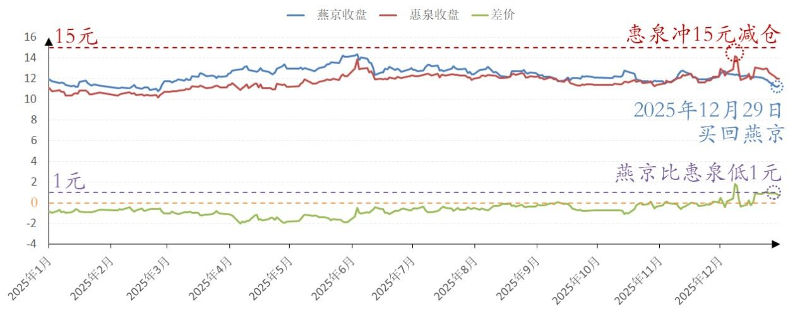

216篇.白银换铜业，惠泉换燕京

[清一山长](https://www.zhihu.com/people/shan-chang-qing-yi)[2025年12月30日08:57](https://www.zhihu.com/pin/1989257592816554941)

昨天白银有色涨停。我在高铁上看到了，就卖掉一部分，全部换仓持有还在下跌的铜业。

没想到尾市破板了。早知道，我全仓卖掉白银股份好了，不贪心就好办。这么好的机会没有卖完，可惜了。持仓成本已经接近零了。

白银有色2025年12月29日分时图

白银有色2025年9月～12月日线图

下跌是买入好股票的机会，也把惠泉冲15元的时候减仓的数百万股啤酒买回来，不过买的实际是燕京。因为燕京比惠泉低一元了。我认为买燕京更划算[感谢]。珠江也不错。感谢上次惠泉涨停让我有机会调仓，现在继续买套。

燕京啤酒、惠泉啤酒2025年收盘价

**（标题、图片为编者所加）**

文章音频：

[633篇.白银换铜业，惠泉换燕京](http://link.zhihu.com/?target=https%3A//www.ximalaya.com/sound/946070842)

**参考链接：**

[208篇.股市案例分析——主力操盘的周期有多长（配图版）](https://zhuanlan.zhihu.com/p/1982798321073533837)

[209篇.中粮糖业主力走势猜想](https://zhuanlan.zhihu.com/p/1983556072204703566)

[210篇.茅台换什么？](https://zhuanlan.zhihu.com/p/1984033552149545369)

[211篇.惠泉逆势上涨突破涨停价](https://zhuanlan.zhihu.com/p/1984031933164955450)

[212篇.惠泉主力已经成功撤退了](https://zhuanlan.zhihu.com/p/1985014426399691858)

[213篇.惠泉如此下跌，恐慌局面彰显](https://zhuanlan.zhihu.com/p/1986167584551356371)

[214篇.中国中冶下跌21%，买入600万股](https://zhuanlan.zhihu.com/p/1988364880248602866)

[215篇.差价3.14元卖出燕京买入珠江](https://zhuanlan.zhihu.com/p/1988669857282140083)

[链接汇总（截止2025年12月3日）](https://zhuanlan.zhihu.com/p/621215591?utm_psn=1967007144831350474)

