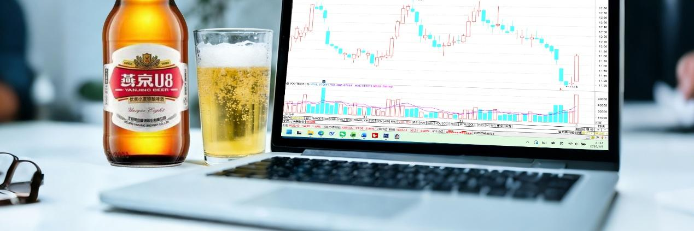
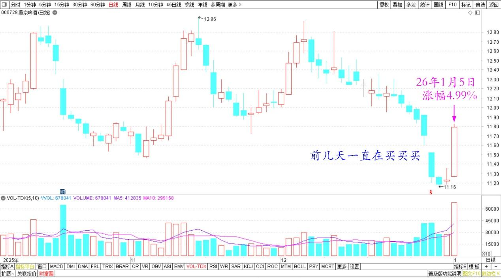
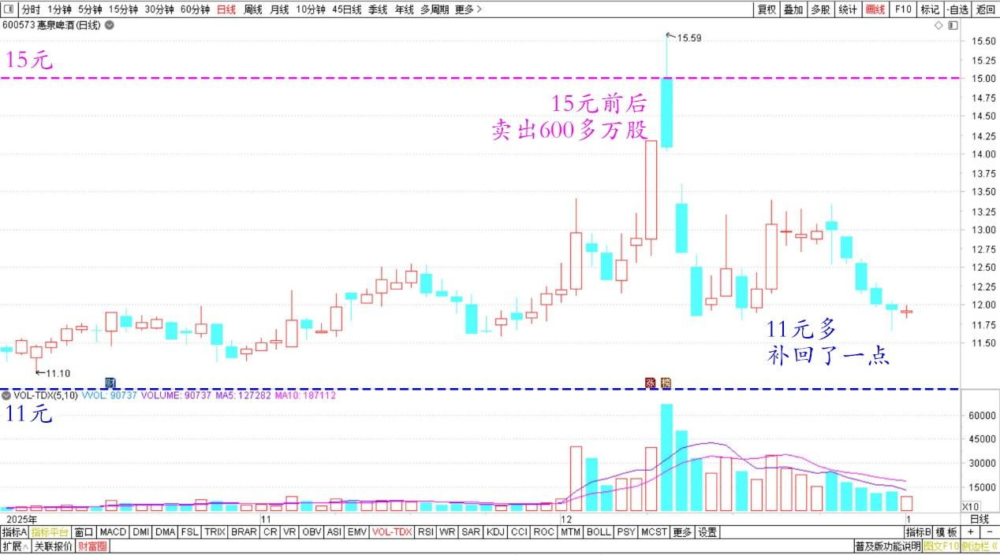
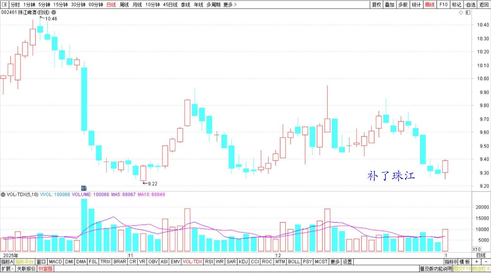

218篇.今天的燕京总算涨了

清一山长 [2026年1月5日12:54](https://www.zhihu.com/pin/1991455167468553971)

今天的燕京总算涨了。涨幅还不小。前几天我的燕京一直在买买买。

燕京啤酒 2025年10月~2026年1月 日线图

因为惠泉我15元前后，已经卖出了600多万股，我需要慢慢补回来，我补了燕京和珠江。但现在看来，燕京不打算给我机会补仓了。本来我买惠泉的钱，就是燕京上一轮大涨后卖出换的钱，现在重新换回来理所应该。

查看了三季报我的账上惠泉是——卖出后这个名字的账上你们看年报就知道了！不过在惠泉11元多的时候，由于有三块多的差价，我做了一点补回动作，有可能会比卖掉的当下多一点点！

惠泉啤酒 2025年10月~2026年1月 日线图

珠江啤酒 2025年10月~2026年1月 日线图

提醒各位：以后我进入十大的股，会成为庄家的忌讳。因为有很多人跟风，因此庄家没做头，就会放弃。可能长期不涨，或者涨幅不高。大家别指望跟我赚钱了，也许我连自己都赚不到钱了。带你们没啥好处，反而让我自己也走不动了。特别是小股票，更没力量了。

因此，以后我的分享会越来越少。将来我进入十大的股也会越来越少，不是我不赚钱了，而是我的钱会拿到清一公社去，因此以后就不在我的名下了。以后你们看我的东西来跟庄，赚大钱，这条路走不通的！不现实。

另外，清一公社的持仓，是不会对外公布的。甚至连社员都不会知道持仓状态，因为这不是投资理财，不需要公布净值。但公社的操盘机构和监督人员，会监督公社的资金是否正常运行，他们知道持仓结构和整个的调仓换股的过程。如果公社基金赔钱了，我作为担保人，会用我的个人资产来补上损失的。

**（标题、图片为编者所加）**

文章音频：

[635篇.今天的燕京总算涨了](http://link.zhihu.com/?target=https%3A//www.ximalaya.com/sound/948207314)

**参考链接：**

[208篇.股市案例分析——主力操盘的周期有多长（配图版）](https://zhuanlan.zhihu.com/p/1982798321073533837)

[209篇.中粮糖业主力走势猜想](https://zhuanlan.zhihu.com/p/1983556072204703566)

[210篇.茅台换什么？](https://zhuanlan.zhihu.com/p/1984033552149545369)

[211篇.惠泉逆势上涨突破涨停价](https://zhuanlan.zhihu.com/p/1984031933164955450)

[212篇.惠泉主力已经成功撤退了](https://zhuanlan.zhihu.com/p/1985014426399691858)

[213篇.惠泉如此下跌，恐慌局面彰显](https://zhuanlan.zhihu.com/p/1986167584551356371)

[214篇.中国中冶下跌21%，买入600万股](https://zhuanlan.zhihu.com/p/1988364880248602866)

[215篇.差价3.14元卖出燕京买入珠江](https://zhuanlan.zhihu.com/p/1988669857282140083)

[链接汇总（截止2025年12月3日）](https://zhuanlan.zhihu.com/p/621215591?utm_psn=1967007144831350474)
