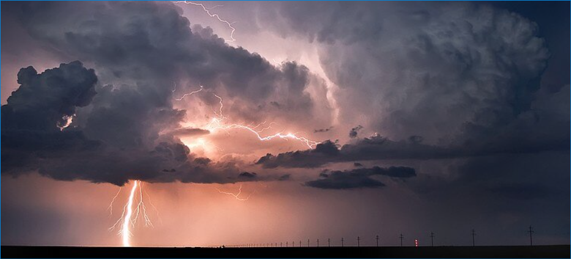

**

**

**21篇.【股灾来了怎么办】系列之一**

**清一山长 2020年**

**一、节省子弹，涨了就腾出资金来**

清一山长 2020-02-07 14:46

应付美股崩盘的最好办法是上所有资金加上融资买爱国票。

**所以现在要节省子弹，涨了就腾出资金来。特别是把融资省出来**。

**清一山长 2020-02-28 12:19**

$道琼斯指数(.DJI)$

美股这几天都是千点大跌，够精彩的。虽然我一直认为美股最终会大跌的，但现在似乎还不到美股大跌的时候。因为中国正自顾不暇，还没到底。**我认为要中国都惨透了，美股都笑死了，才会轮到美股真正的大跌开始呢。**难道时光机提前启动了？

**清一山长 2020-03-03 10:12**

@小小小娄，你比我卖得高很赞。不过美股涨了一千多点，中建应该不会这么不给面子的，应该跟涨十个点才对。你们别下午中建涨破6元了，你们又来骂我反向指标滴汗。现在涨跌我都喜欢。@小小小娄回复@清一山长:感恩山长，看到山长昨天卖了中国建筑，今天开盘5.93就赶紧卖掉了，一直跟着山长做傻猫。祝福山长！

**清一山长 2020-03-09 17:12**

其实我也知道今天不是买股的时候，美股晚上要崩盘的，明天的港股，A股要跟跌的。所以，我只是尾盘没事干，才买了一点最安全的品种。预备队的零头资金买进。

**我担心明天会闹“股灾”的。所以，上周一直叫大家卸掉融资。没有融资再跌也不怕，等几年，就满血复活了。用了融资，可能就死了。**我融资全清了，还有不少货币资金在手。但年后这段时间忙死了，都在操心卖货。

**清一山长 2020-03-09 17:43**

周末全是坏消息，欧洲期市今天就跌了10%。美股不跟跌，实在不够意思。美国政府似乎没有证金这样的公司来救市吧？美股高位，谁敢去救？谁救谁站岗

**清一山长 2020-03-13 09:53**

$道琼斯指数(.DJI)$

昨天再次跌了两千多点，我看不会有人出来救市了。过去两年每次千点大跌，都有人来救，还创新高。明显是操纵的痕迹，让我想不通——美股原来有人护盘的？现在，美股从29568点最高点，最近的短短几天，就跌了快9000点了。我两年前就在预备的美股狂跌开始了。**我一直不敢买美股的原因就在这里------美股注定要狂跌，**只是不知道会是什么时候，更不知道会因为疫情而跌（**其实前两周我就预感美股要完了，世界金融危机模式要开展了，所以大叫要小心，要卖股票**）。未来一两年内，世界经济将受到重创。金融将不可避免地引起一轮大跌，世界金融危机模式已经开启。

**现在要保住你的本金，现在千万别乱买，会出现各种不可思议的低价。买入后就不再看价格，死守即可，不赚钱就是不走。现在投资不要进取，要超级保守。**要选择一些绝对不会破产的企业买入，有抵抗金融风险的硬资产的企业和股票才敢买入。很多原来成功的企业，可能短期就会破产。一批新的，避过了风险的企业，又会站起来。形成洗牌。股市也一样，原来靠精明赚小钱的投机客，敢于大比例借款上杠杆的人，会在这种大级别的资本狂潮中倒下。相反，一贯谨慎，特别是持有现金的人，可以在这个时候捡到破产价，很多价格是因为杠杆客爆仓被迫卖出的，相当于一只羊，现在的市场可能只用一对羊腿的价格出售，有眼力的人可以大赚钱了。

**现在是现金为王的时候。**巴菲特这两年，一直有巨量的现金，就在等这个机会。**但大家要管住手，别觉得便宜就进去了**。便宜之后，可能还有超级便宜。所以我计划下周再等机会出手。这两天都没动。最近以最低价买入的股票，已套牢哭泣。所以你们不需要知道我的买入股，不然跟买就一样倒霉。但我只动用了不到一成的现金。你们可能会全仓跟入，套牢就要骂我了。**现在我不敢高告诉你们任何标的，就是任何标的都可能出现非理性的大跌。**就像原来理性上就不值钱的股也会狂涨一样。

**清一山长 2020-03-14 14:12**

$道琼斯指数(.DJI)$

尾盘20多分钟，从21747直拉到23185。“大涨”一千多点。颇有点大A股的妖股架势。典型的护盘行为。要我是美股的持有人，第一直觉，不是忙于庆祝，而是觉得感谢给了一个逃命的机会。就像是2月3日之后，A股居然大涨，很多股涨会了年前的价格，甚至更高。卷商也大涨。大V们在叫：牛市来了。**可对我来说，就是逃命的机会。不赶快溜，算是对不起主力的好意俏皮。**我真正的开溜，就是在2月份开启的跑跑跑模式。我才不像小散户跌了哭，涨了就笑，一点不知道该干什么（跌了买，涨了卖就对了）

**二、 巨大恐慌时才开始买入**

**清一山长 2020-03-17 12:31**

美股昨天大跌近3000点，创了一个历史记录哭泣。

港股也非理性下跌很严重。

A股看起来好像稳住了，不少人在抢反弹。

**但要记住：这是假的，底部还没有来。现在是“无形的手”在维护市场，维护信心。**现在，还不到进场捡漏的时刻。我认为后续的恐慌，还会继续蔓延一段时间。包括国家队，现在也只是小心地维护而已，他们也不敢进场救市的，只想让中国的市场不要崩盘。要等空头的力量减弱了，他们才敢出手。前天看到某人言之凿凿的说：美股的基金仓位都清零了，做空力量已经消失，未来只有一个可能了。我想这种能够看清美股基金账户的“聪明人”，怎样解释昨天的巨量下跌呢？我对美股的尾盘拉升，明显觉得不对劲，空头的势力远远超过想象，却被一些人冷嘲热讽。**我认为看目前的下跌架势，美股恐怕要回到15000到16000一线，才会开始真正的稳住阵脚。**由于客户的恐慌，续回现金，导致大蓝筹也会被动卖出。**由于现在的资金都持观望的态度，少量的卖出就会造成大跌。这种上杀伤力是很强的！**这一波世界级羊群的恐慌踩踏，将对全世界的金融系统，都会造成巨大的打击---金融危机已经开启了，一些银行和金融机构会破产（我认为主要是国外的银行）。最终的结局如何，我不知道。

**所以，虽然看到满地的便宜股，我还是不敢现在出手就买。**但我正在积极的准备和观察，大量的现金（国外）和货币基金（国内）储备，正在厉兵秣马，**将在未来空头势头最强的时候，给市场造成巨大恐慌的时候，开始买入。**特别是泰国的股票，泰国人由于金融危机叠加疫情危机，股市不断创造新低。我上周试探性买入了的3%的仓位的高息股（都是泰国市场的大蓝筹股），没几天就被套了25%以上。这让我深感荣幸------我认为，我投资人生历史上又一个历史性大波段时刻来临了。我手持资金，等了好几年美股的大跌，一直不敢大买A股。现在会大干一场，未来会全仓买入，然后装死！

现在的大跌行情，我相信手中只是持股，没借钱买股的人，虽然心中难过，但还可以用“等几年就都回来了”来安慰自己。但如果用了大把融资杠杠的人，心中的难过，是难以用语言来描述的。内心的恐慌无助，不断计算清仓的比例的人，心中的难过无以言说。大家就知道一个月前我就大叫**大家一定要清掉融资，安全第一的意义了**（我不敢叫你清掉全部的仓位，因为我也不清楚是不是真的会发生股灾，但两年前，我就提醒大家注意美股股灾的影响，去年在深圳的演讲，也提到了**只有美股崩盘之后，大A股才会有机会真正的上涨，所以我的融资一直极其保守，不敢动用，买的股也不敢追高，都只敢追十年的历史低价。就是防范股灾**）

美股每创一次新高，我就不安一次。但现在，说什么都晚了，世界上没有后悔药吃。再度提醒朋友们：**现在一定要管住手，别看现在便宜了，就大买特买。甚至加融资大买。未来的底部，我也会加融资买股的。但我只敢加国家队一定会出来护盘的股。**其他的股，我绝对不敢加融资去买。那是找死！**没有融资，也没钱加仓的，只有一招了---睡觉去！别看账户了，看了烦人。一股没少，过几年又满血复活了（条件是你买入的公司，是不会垮的）。**

参考链接：

[清一投资号：22篇.【股灾来了怎么办】系列之二](https://zhuanlan.zhihu.com/p/482419070)（整理文）

[清一投资号：23篇.【股灾来了怎么办】系列之三](https://zhuanlan.zhihu.com/p/483024400)（整理文）

[清一投资号：24篇.【股灾来了怎么办】系列之四](https://zhuanlan.zhihu.com/p/484791228)（整理文）

[清一投资号：25篇.【股灾来了怎么办】系列之五](https://zhuanlan.zhihu.com/p/487164089)（整理文）
