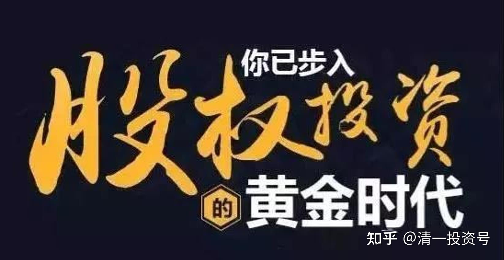
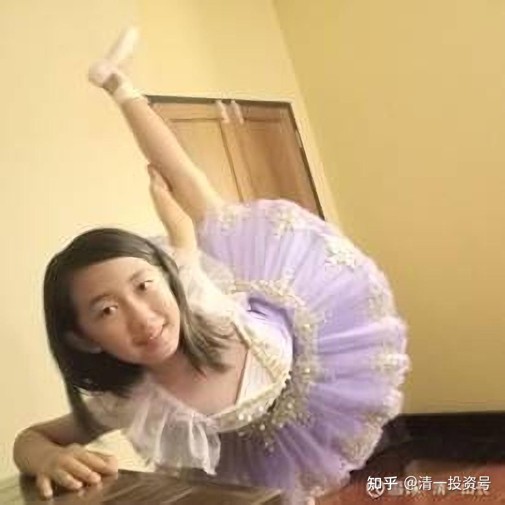

21篇.中国建筑系列之十九：做优质股权收集者，别对天叫穷卖惨

清一山长2021年05月21日～2021年05月22日

**导读：**

一、收集优质股权、做喜欢的事情，成为心灵富裕的二代

二、元卫南，卖惨可能会真惨、叫穷可能会真穷

**正文：**

**一、收集优质股权、做喜欢的事情，成为心灵富裕的二代**

清一山长2021-05-21 21:02

$惠泉啤酒(SH600573)$今天小女带来了一张一年半以前我写给她的股权证书给我看，秀她的财富。我一看，是2019年年底，她拿了619元，让我帮买了100股的惠泉啤酒。我又送了她100股。总共两百股惠泉股票。我当时收了她的钱，写了一张爸爸担保兑现的【**手写签字股权证书**】给她，告诉她将来任何想要用钱的时候，可以拿这个证书，找我按照当时的市场行情兑现现金去用。当然，我送的这部分，要等她18岁才能动用。她18岁就可以有自己的账户，可以开户头，我把这些纸条全部兑现给她，真正地买入自己的股票。她把我写的纸条，一直小心翼翼的放在她的钱包里面，珍藏起来，准备18岁被父母“赶出家门”的时候，不担心自己会没钱用[笑]。

今天我看到惠泉的这张股权证书，发现就是当时我正在买惠泉啤酒，买成10大的这时候顺手帮她确认了一张100股的多仓。今天我让小女看惠泉的上涨情况，让她算这张纸，现在可以换回去多少钱。她费了一点力气，算来是2110元（按收盘价结算的）。惊喜得不得了。说原来她才给了我619元，今天就变成了2110元。太划算了。再看她有一张是一年多前，帮她以1元多一点点买的中广核新能源股票。今天去看看，居然涨了一倍，她的这只股的持仓本金比较大，她正好挣了一万元左右打工钱（为学员做服务，买东西等），现在直接股市上赚了一万元。我告诉她：比泰国的工人要富裕多了，而且她啥也没干。这就是食利阶层。

小家伙发现惠泉涨了这么多，挺懊悔的，觉得当时应该把自己的零用钱全部压上的。当年她为了留点钱，藏了大约1500元的私房钱没动用，就跑去找出来，全都拿来给我。要求我帮她继续买股，继续买一送一，给她股权证书。今天就帮她买了燕京啤酒。7.61元，买一送一，把惠泉啤酒换成燕京啤酒。重新写了纸条给她，成为她的长期财富收藏品。她还把她赚到的泰铢给我买股，我就写了一张按照今天行情价格确认的几百股泰国泰京银行的【**股票字条**】给她，让她长期持有，分红。现在，小女也是【**跨国资本投资者**】了。我相信她长大后，不会是追涨杀跌的一代，甚至根本就不去看盘。她是真正的富二代——**心灵富裕的二代。我不用给她钱，我只需要教她来钱的路径就行了**。她甚至不关心她买的是啥股票，无脑跟投，分散风险，自己去做自己喜欢的事情，钱的事情交给上帝去解决，这样就行了。

我今天为了帮小女找泰国股票的行情，也去看了一下我半年都没有看的泰国股票行情。发现我持有几百万股的一家泰国十大房地产公司，居然这半年涨了一倍了。实在不可思议，这种疫情情况下，还会涨。再看其他地产公司，都涨了一倍的样子，比中国的地产公司好过了。真是说不出道理来。但我现在也不想卖，依然准备继续放在账上，持股吃息，涨跌都不管。作为我长期持有的泰国优质资产。因为我看不懂泰国股，不知道如何投机，庄家也看不见进出的痕迹，所以——被迫当长期股权持有者了。

我家三个小孩，现在全都在我的影响下，成为了股权收集者。她哥哥已经24岁了，自己掌握打理上千万的资金。也是基本不看盘的长期持股者。收益还比较稳定。全家就只有我一个人是股权投机者，交易者[大笑]。为了不误导孩子，我没有告诉孩子的我的炒股独家秘诀，不让她们学我的样子来炒股，避免走入歧途。我只教她们根本就不用看盘。买入优质公司的股权，坐等就行了。建议你们也别学我投机取巧！这话，真的是为了你好！[俏皮]

[@时刻敬畏市场](http://link.zhihu.com/?target=http%3A//xueqiu.com/n/%25E6%2597%25B6%25E5%2588%25BB%25E6%2595%25AC%25E7%2595%258F%25E5%25B8%2582%25E5%259C%25BA)回复[@清一山长](http://link.zhihu.com/?target=http%3A//xueqiu.com/n/%25E6%25B8%2585%25E4%25B8%2580%25E5%25B1%25B1%25E9%2595%25BF)：

真不错！还好山长没买中国建筑，要不然就不好交待了[大笑]。

清一山长[2021-05-22 07:56](http://link.zhihu.com/?target=https%3A//xueqiu.com/9310099567/180560376)回复[@时刻敬畏市场](http://link.zhihu.com/?target=http%3A//xueqiu.com/n/%25E6%2597%25B6%25E5%2588%25BB%25E6%2595%25AC%25E7%2595%258F%25E5%25B8%2582%25E5%259C%25BA)：

小女原来也买了200股中国建筑！她是【优质股权收集者】。高高兴兴地知道自己“拥有”全世界最大的建筑公司。你们是一群炒股的人，成天想赚不赚钱！赔不赔钱。她心里没有这概念的。我的帖子你们居然都看不懂，真可怜[哭泣]。我告诉你们的股权投资者的信念，你们完全不了解，只会乱猜。**你们是涨了就高兴，跌了就[哭泣]。她是涨了觉得好幸运，跌了也无所谓，因为一股未少！另外——小女喜欢股票跌。因为跌了可以买股票。涨了就不能买了，**比如赚了钱的惠泉，她就不想买了。所以给她换了燕京啤酒。这才是正常人。你们往往都是看看谁涨了，就去追买，小女不是！

**二、元卫南，卖惨可能会真惨、叫穷可能会真穷**

元卫南2021-05-21 15:03

《老天爷！这样对我公平吗？！》

原文链接：[https://xueqiu.com/2227798650/180508947](http://link.zhihu.com/?target=https%3A//xueqiu.com/2227798650/180508947)

老天爷为什么非要逼死我？！

太不公平了！我没吃喝嫖赌，没乱花钱，每一分都投在了股市上！

我辛苦努力了三年四个月，为什么要落得净负债几百万的境况？！

我才45岁，为什么非要逼得我走投无路？！

为什么我努力！勤奋！有志气！却落得还不如吃喝玩乐享受人生？！为什么？！！为什么？！老天爷！东阿阿胶！股市！这样对我公平吗！！！我努力了！！！！

$东阿阿胶(SZ00042) [$](http://link.zhihu.com/?target=http%3A//xueqiu.com/S/SZ000423)[$贵州茅台(SH600519)$](http://link.zhihu.com/?target=http%3A//xueqiu.com/S/SH600519)

清一山长[2021-05-22 19:16](http://link.zhihu.com/?target=https%3A//xueqiu.com/9310099567/180586513)评论上贴：

如果元卫南这些话是真的。我看他现在已经顶不住了，原来的信仰已经面临彻底崩溃了。或者是再次濒临崩溃。去年跌破25元，他还没有崩溃。为啥现在才跌到35，就要死要活的了？都找老天爷叫板了？

因为去年25到48元这一波，他没走。其实涨一倍了，老天爷给他机会脱身，但他就是不走，反而更强化了他的信念：阿胶就是他的茅台，会涨到天上去的。结果，再度来到35元，他就受不了。

再跌下去，也许他就会消失了。留下一个阿胶传奇的故事。可叹，可惜！一个大叫老天爷不公的人，表面上是身份低微，敬畏老天爷。其实他才是想当老天爷的家，做老天爷的主人。他想让老天爷按照他的旨意去行事。一旦走得不对，就怪、就骂老天爷。以为骂骂老天爷不公，老天爷就会不好意思，改掉脾气，他的股票就会涨了。

可惜，老天爷不在乎你骂不骂，也不在乎你捧不捧。老天爷按照自己的规则在走，你愿意就跟随，你抵抗就灭亡。

一句话：**尊重市场先生。它也许是疯的，但你不能不尊重它。**

**最终总结：根据秘密法则，元卫南不管是真，是假，是表演，还是真苦情。但他的命运一样是注定的：他赚不到钱的。因为他给宇宙发出的身份信息，是：“我很努力，但我好苦，好穷，我已经快不行了，我活在地狱的边缘。”**

**宇宙的回答是：“好的，收到订单，给你发货：你好苦，你好穷！你很努力！你不行了。”**

**看他笑话的人，也要当心：也许你会收到一份一样的订单。只因你表达出来的真实身份，与他是一样，你就是一样的结果。因为，厌即是恋，恋也是厌。**

**如果看他破产，你就瞎高兴。宇宙给你发的订单，就是：“收到，你要的真实身份是：你是一个喜欢破产的人。给你发货，请查收！”[捂脸]**

**希望元兄弟明白一个道理：卖惨，可能就会真的惨；叫穷，你会真的穷。**

还有，**坚持不一定就是胜利。除非你真的确定，你的坚持是正确的。**

我唯一坚持的信仰，就是我相信我的教育，是走在正确的道路上。至于股票？我真的不敢确定我坚持任何一支股，就100%是正确的。**连中国建筑这样的股，我都只敢确信只有7成的把握，所以，我坚持分散。而不是集中！我认为我随时可能犯错，所以，我随时准备认错。而且，就算我错了，也不会让我的错误把我灭掉！**

这就是安全边际！

元兄弟——你真的没有安全边际的概念。您只是赌博罢了！而且是拿出全部身家，全部信誉，透支一切，不顾一切的赌。也许你会赢的。赢了，你当然光彩万分，成为英雄。万一输了怎办？想好了吗？也许你早就想好了，我几乎知道你是咋想的。太不幸了！**祝福一切想赚钱的人，学会向宇宙发射正确的订单。学会表达自己的真实身份！[献花花]**

参考链接：

[1篇.中建背后的神秘大手](https://zhuanlan.zhihu.com/p/481078141)

[2篇.赚钱王道：在低估的前提下轮动](https://zhuanlan.zhihu.com/p/509053673)

[3篇.中国建筑系列之一：就算是好股，也别谈恋爱](https://zhuanlan.zhihu.com/p/512602669)

[4篇.中国建筑系列之二：大A股的稳定器](https://zhuanlan.zhihu.com/p/519506160)

[5篇.中国建筑系列之三：发现投资机会的方法](https://zhuanlan.zhihu.com/p/565361369)

[6篇.中国建筑系列之四：只有少数人才知道正确的通道](https://zhuanlan.zhihu.com/p/522882446)

[7篇.中国建筑系列之五：投资中建的核心逻辑和理由](https://zhuanlan.zhihu.com/p/528942534)

[8篇.中国建筑系列之六：熊市布局，牛市收获](https://zhuanlan.zhihu.com/p/534585889)

[9篇.中国建筑系列之七：每个人都应有自己的投资逻辑](https://zhuanlan.zhihu.com/p/538090859)

[10篇.中国建筑系列之八：为自己的投资负完全的责任](https://zhuanlan.zhihu.com/p/549316895)

[11篇.中国建筑系列之九：如何用融资投资中国建筑？](https://zhuanlan.zhihu.com/p/559571938)

[12篇.中国建筑系列之十：综合对比下中建的长远价值](https://zhuanlan.zhihu.com/p/564749726)

[13篇.中国建筑系列之十一：多年不涨的中建，值得坚守](https://zhuanlan.zhihu.com/p/566546633)

[14篇.中国建筑系列十二：长持股的价值投机操作及未来畅想](https://zhuanlan.zhihu.com/p/568853074)

[15篇.中国建筑系列之十三：从年报的角度再次解读超低估的中建盘面](https://zhuanlan.zhihu.com/p/572007510)

[16篇.中国建筑系列之十四：买中国建筑的好处就是可以安心睡觉](https://zhuanlan.zhihu.com/p/574936145)

[17篇.中国建筑系列之十五：千万不要无原则的在股市中“赌”](https://zhuanlan.zhihu.com/p/577278058)

[18篇.中国建筑系列之十六：中建置顶文被删触动了谁的利益？](https://zhuanlan.zhihu.com/p/578823434)

[19篇.中国建筑系列之十七：通过对比发现中国建筑的价值](https://zhuanlan.zhihu.com/p/581419744)

[20篇.中国建筑系列之十八：中国建筑可能是最安全的投资标的](https://zhuanlan.zhihu.com/p/583777334)

[21篇.中国建筑系列之十九：做优质股权收集者，别对天叫穷卖惨](https://zhuanlan.zhihu.com/p/585173888)

[22篇.中国建筑系列之二十：如何超过杨百万？看到价值，坚定持有](https://zhuanlan.zhihu.com/p/589745640)

