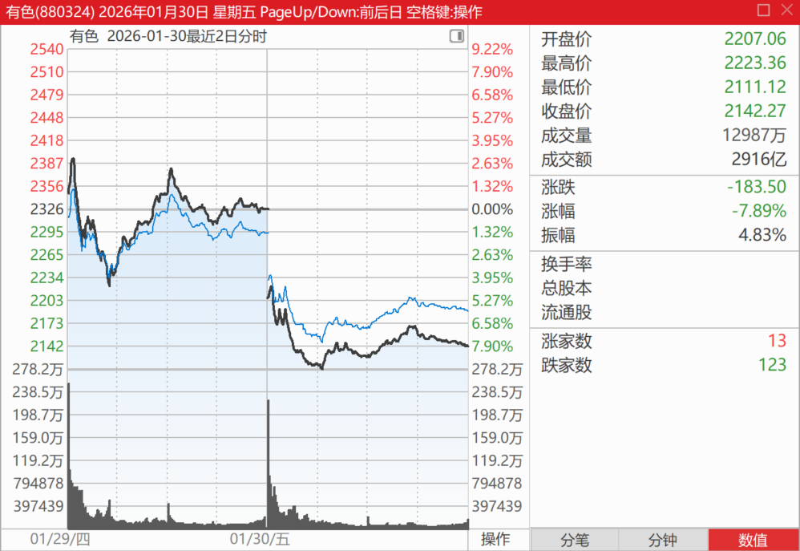
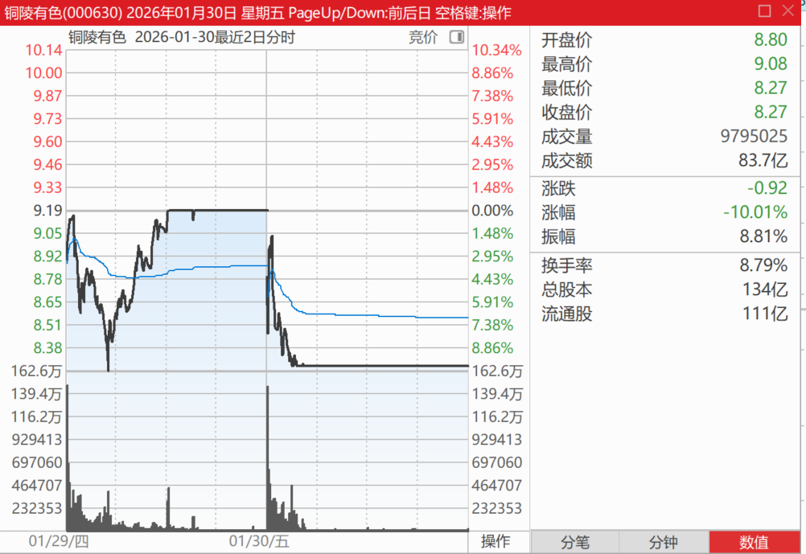
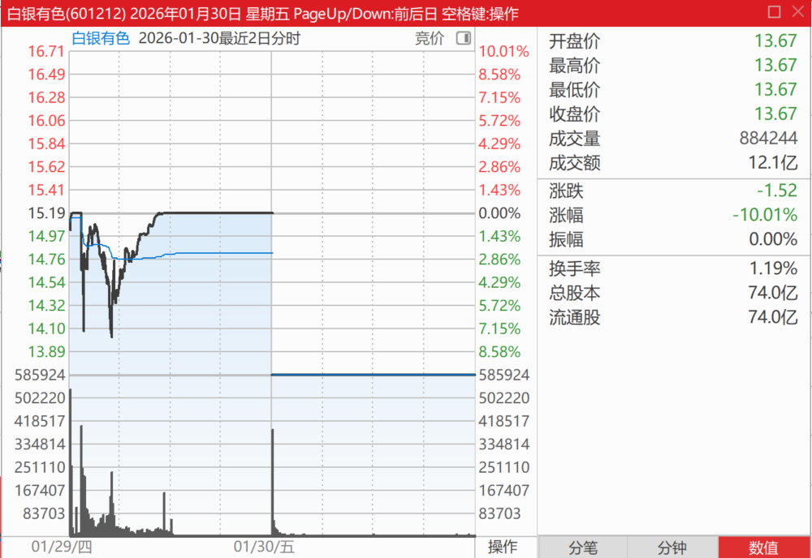
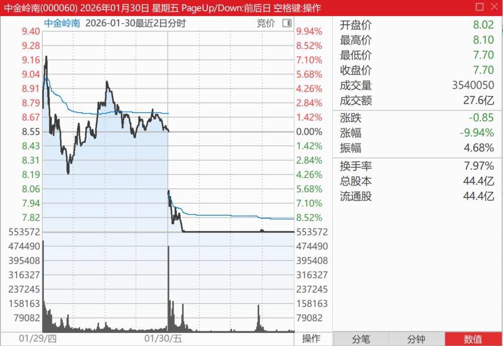
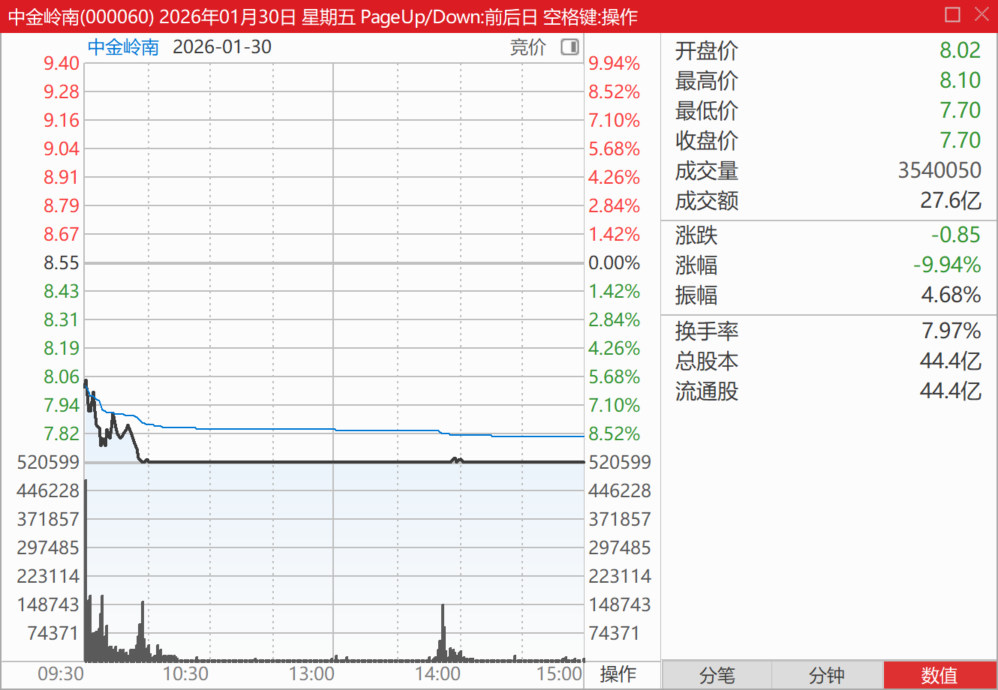
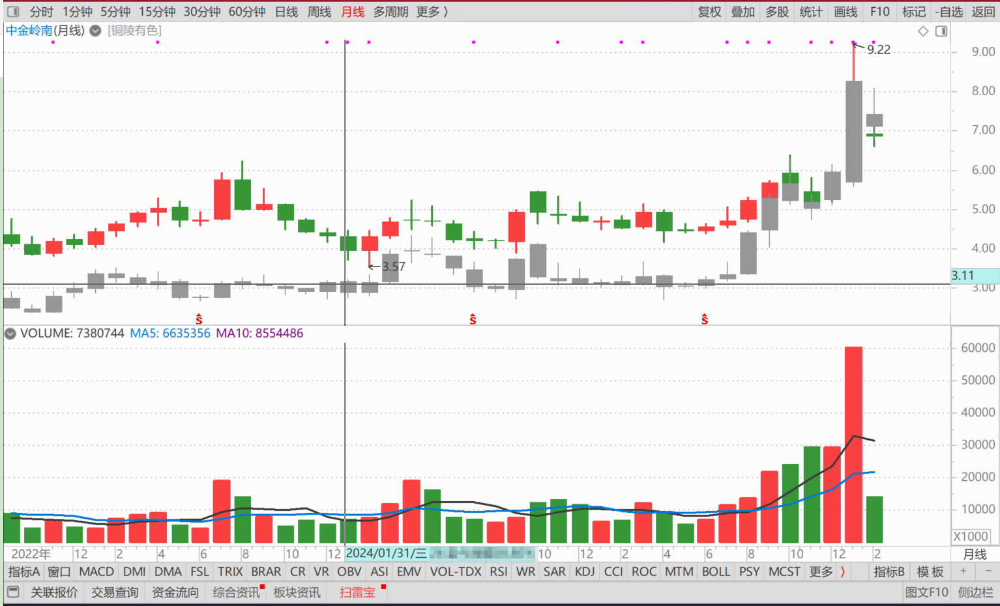
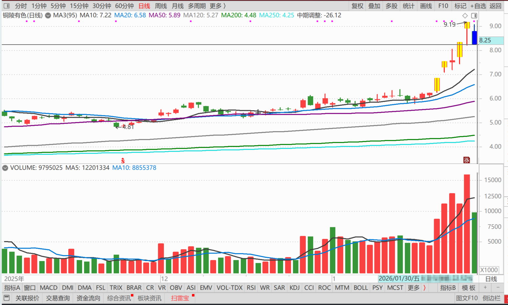
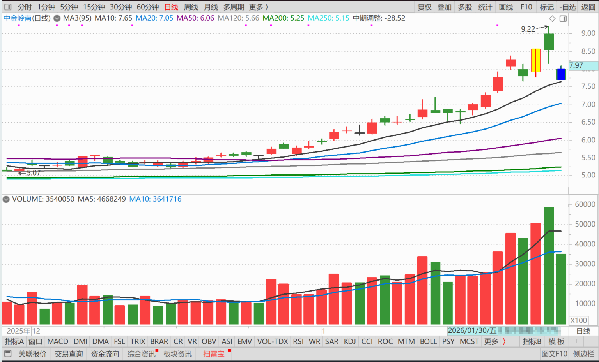

234篇.我认为有色还没有走完

清一山长**[2026年1月30日10:39](https://www.zhihu.com/pin/2000518521642321030)**

**一、我认为有色还没有走完**

[伦铜单日飙涨10%突破1.44万美元，与沪银齐创新高，大宗商品是否面临巨大流动性危机或逼仓风险？](https://www.zhihu.com/question/2000330938584933849/answer/2000489602935460130)

评论上贴

刚刚早锻炼回来。看到有色全跌停了。有趣！

看样子，我昨天看多不做多，反而做空成功了，抢了一百万股的好处，要不今天补回来？或者明天再补？

我肯定要补回这一百万股的，不然对不起我昨天卖出的单子。**我认为有色还没有走完，这只是震荡罢了。**

如果补回来，我大概率会补回中金岭南，而不是铜陵。因为它涨的时候拖后，跌的时候不含糊。因此，谁跌得多，就补回谁算了。

用9元多卖掉的铜陵，去换7元多的中金，大概率是不吃亏的吧？就算吃亏也认了[捂脸]

**二、不换铜陵换中金的理由**

刚去看了上海有色金属网。期货铜，在29日放量大涨之后，今天放量大跌。但现货铜的价格，就完全不一样：已经突破10万元一吨了。今天一天，长江现货铜的价格，就涨了1420元！所有的现货铜，都在涨价！

是不是可以理解：期货空头已经逼急了？昨天一看快爆仓了，今天赶快急救，想要杀回来一点减少损失！

空头不死，多头不止。现在的市场，显然是对多头有利。一旦空方被迫空翻多，期货铜又会继续大涨的！

这一波，我看有人要跳楼，有公司要破产，主要是美国想要控盘的公司，一辈子的财富就会被洗光！

中国很早就限制实物交割了，不允许美国拿中国的实物铜金来交割。我们买的铜业股票，本质是“现货”，按道理应该跟随现货铜价走。

反着走，我认为是故意配合期货的，未来还是要反过来的。因此，我下午就准备把昨天涨停卖掉的一百万股买回来！

算了一下，这样做，大概一进一出，赚了13%以上。昨天卖出补仓的股票今天涨了3个点。

真的够了！感谢！

记录：**下午已经在跌停板买入了中金岭南。100万股一单买入，**比较轻松！

没有补仓昨天9.19元卖出的铜陵有色的理由是：

1、一两年前的铜陵，股票的价格比中金岭南要低不少！一股一换地换股，当然换中金更划算！

2、铜陵五天涨了四个涨停。今天也才第一个跌停，不需要去抢。而中金岭南就涨停了一次，而且是尾盘偷袭的涨停。昨天也没有涨，今天已经跌回了差不多五天前的价格。所以，理论上应该买中金更划算！

以后我会继续坚持原有的风格，会在涨停的时候不贪心，会卖出一些涨停的股票，来满足市场的需求。然后市场会用意外的方式让我补回来的！比如都抢着卖，我就买一点回来！

**（标题、图片为编者所加）**

文章音频：

[651篇.我认为有色还没有走完](http://link.zhihu.com/?target=https%3A//www.ximalaya.com/sound/956550279)

**参考链接：**

[225篇.燕京的猜想](https://zhuanlan.zhihu.com/p/2001294008115287766)

[226篇. 设定“止赚线”](https://zhuanlan.zhihu.com/p/2001908287390650417)

[227篇.昨天补仓的铜陵今天涨停](https://zhuanlan.zhihu.com/p/2002022964682568534)

[228篇.白银第四个涨停，铜业第一个涨停](https://zhuanlan.zhihu.com/p/2002506915129880752)

[229篇.观察两年之后，再买白酒](https://zhuanlan.zhihu.com/p/2002828781535118919)

[230篇.白银继续涨停，中金岭南涨一倍](https://zhuanlan.zhihu.com/p/2002834813908963593)

[231篇.1499元的茅台酒与1360元的茅台股票](https://zhuanlan.zhihu.com/p/2002832147816413177)

[232篇.连续两天重仓大涨的复盘思考！(配图版)](https://zhuanlan.zhihu.com/p/2004623291822932869)

[链接汇总（截止2026年1月30日）](https://zhuanlan.zhihu.com/p/621215591?utm_psn=1967007144831350474)
