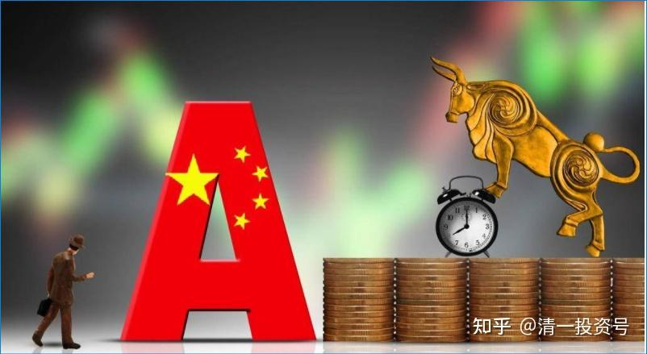
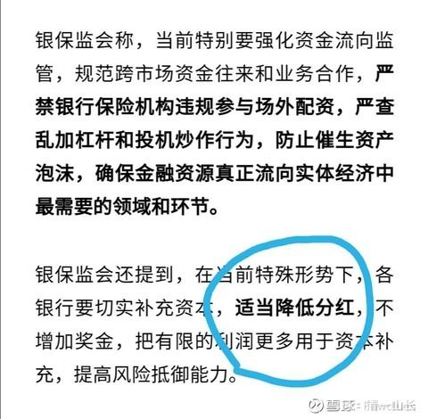

24篇.【股灾来了怎么办】系列之四

清一山长 2020年

思维导图：

七、中国金融人开始金融独立

八、买中建，就是进退两方便的准备

九、荒诞的美国——最糟糕的财务记录对应最高的估值

十、中国牛，只会在美股崩盘后才会开启

**七、中国金融人开始金融独立**

清一山长 2020-07-06 22:41

兴业银行(SH601166)招商银行(SH600036)

全世界零利率时代，货币大放水的时代，中国银行和大蓝筹的息率，对国际资金是很有吸引力的。只要能够维持住汇率和人民币的信用，就有望代替美国、美元、美股，成为全球资金的避险地。要这样做，香港是必经之路。所以，美国一定要破坏香港的社会稳定，希望国际资金不敢进入香港。**稳住香港，就稳住了中国的金融窗口，金融业，也是香港维持繁荣的唯一机会了。**

最近强行推动香港的国安法先出台，目标就是要稳定香港，让美国乱港拖住中国后腿的规划无法实施。再推制造地区牛市的金融手段，拉动A股上涨。这样国际资金才愿意进香港，转道进入A股。妙棋一步！

**人民币的信用能否维持？如何维持？疫情时代的国际生产力，保障了人民币的资产价值不会贬值。**这样，国际资金就放心了。这样子的世界越乱，中国越有机会。所以，央视新闻特别强调A股涨的原因是：疫情防控良好，背后大有深意[大笑] 政府印票子，把钱拿来人人发消费券，会造成货币贬值。不如印的钱用来买股票，解放套住的小股民。拉涨大盘。将来再把手中先买的股票拿来卖给外资，收获外汇。成功退出市场，还不会造成通胀。这一招真高明，中国金融人再也不是被华尔街牵着鼻子走的小跟班了。开始金融独立了。很棒！[主力][主力]

**八、买中建，就是进退两方便的准备**

清一山长 2020-07-07 12:50

这个帖子（上述帖子）阅读率蛮高的，20多万了。大家似乎都很乐观。

说明：我只是看客，看懂了中方正在玩的逻辑，也很幸运地没有被刷下车。但——我没有各位这么乐观，因为——如果真按照我推演的路径走下去，美国就完了。中国就会取代美国，当老大了。你们跟着我们的老大，当然好处多多。

不过，美国人肯让中国实现这个目标吗？显然不！美国会怎么走？我就不知道了。我还搞不清过美国人的套路。我知道现在的美国股市上升，是美联储“无限量买入债券，供应货币”的结果，让金融机构遇到实体危机，也不需要卖掉股票来还账。还发了很多钱给中小企业发工资，维持住了经济的正常运转，也维持了美股的强势。但能够持续多久呢？

**美元和美股的强势，靠的是收割“国际羊毛”得来的价值，靠的是美国的服务业、文化产业等收割全世界劳动者带来的价值。**如美国一部电影，可能就比一家中国最大的电视机企业十年赚的钱更多。美国从留学生身上收获了最多的国际教育利润。其实这种并不值钱的软产品，比中国制造的利润更丰富，价值更高，所以维持了美国人优越的生活。来自全世界的文化利润，维持了美元的信用和价值。但是，如果疫情把美国的利润来源干掉了，人民也不去电影院了，留学生不来美国了，连中国的影视企业也倒了一大批。现在印刷出来的美元，靠什么去支付实在的价值？没有价值支持的美元，就是一张纸罢了。

我没算清楚未来怎么收场。但我知道：美国的金融人都是一帮人精，恐怕比中国政府的金融高参还厉害，他们最善于收割别的国家，特别是别人最乐观的时候下手，一个月就可以把别国几十年的价值抢走（如1997年的泰国）。说不定他们也会想出什么我们根本想不到的好办法来打击中国的。所以——未来未必这么容易。**你热情追涨，想去套美国人，可能反过来被美国人剪了羊毛。难说随时会被美国人坑一把（例如2015年）。**

**中国的人民币价值，最终是要制造业的产品来支持。只要全世界还需要中国的产品，就能支持这种价值。**制造业一旦不行了，人民币狂贬值不是没可能的。但中国疫情控制良好，制造业恢复良好（央视说的），因此，按道理中国的棋要比美国的好下一些。但是，疫情也影响了全世界的物质产品的需求，甚至会带来各国的贸易保护措施。中国的制造业真的能够担起这个全世界价值中枢的地位吗？还真的不容易。除非我们有别国非买不可的产品。

所以，昨天正式上演的这场金融战，到底会走向何方呢？多思考吧！特别是美国人会怎样收拾中国？会不会对你造成影响？你做好了准备没有？**我买中建，就是进退两方便的准备。一方面，它最简单，容易得出结论，靠国内市场就可以活下去，其他企业就说不清了。**如果谁能够掌握中美博弈的节奏，谁就会成为大赢家！

目前我押注中国赢。但我也做好了输的准备——无非就是回到原点。**我不贪心，不在高位补仓，就没事，少赚一点钱没关系。**但千万别亏本才是大事。如果快速涨到高位，我会卖出兑现一部分现金，然后坐等。防止高位上杠杆被高手秒杀（2015年我就是因为老实，高位减掉了融资，被人笑话也不改。最后才逃过一难的。当时最聪明、最自信的人，相信这一把一定赢的人，的确是先赚了很多，比我还多得多的人，最后居然爆仓破产了。如果死拿底部仓筹码，高位不加仓，更不用融资，2015年这样的危机，其实就一点事都没有，没啥感觉就过去.）

**九、荒诞的美国——最糟糕的财务记录对应最高的估值**

清一山长 2020-7-09 14:51

荒诞的美国：金融危机以来最糟糕的财务记录，对应美股历史上最高估值！

看了下面的记录，我相信企业的基本面和估值之间，有一个疯了。而美国疫情正在扩散，世界各国都互相封闭。但股民却在狂欢，在嚷嚷“牛市来了”。牛市的基础在哪里？你们能告诉我吗？

英为财情Investing.com-距华尔街第二季度财报季的非正式启动只有不到一周的时间，投资者已准备迎接2008-2009年全球金融危机以来最糟糕的一个财报季。

FactSet的数据显示，分析师预计标普500指数第二季度的盈利将比去年同期大幅下降43.8%。如果预期成真，这将是自2008年第四季度以来最大的同比跌幅，当时标普500指数下跌了69.1%。

预计所有11个行业的盈利都将同比下降，其中能源(NYSE:XLE)、非必需消费品(NYSE:XLY)、工业(NYSE:XLI)和金融行业(NYSE:XLF)的降幅料将居前。

收入预期同样令人担忧，销售增长预计将同比下滑11.1%，这将是自2009年第三季度以来的最大跌幅。预计11个行业中有9个行业的收入将同比下降，其中能源、工业、和非必需消费品仍然领跌。

下面我们将进一步分析预计受打击最严重的三个行业：

1、能源行业：低油价挫伤业绩

第二季度每股收益预期：同比下降148.3%

第二季度收入预期：同比下降42.2%

2、非必需消费品：新冠疫情冲击盈利

第二季度每股收益预期：同比下降119.0%

第二季度收入预期：同比下降19.6%

非必需消费品行业预计将录得第二大同比降幅，为-119%。

预计该领域的11个子行业中，有10个的盈利将同比下降，其中有7个子行业的跌幅将超过60%。汽车股领跌，每股收益料将同比大降319%。同时，预计酒店、餐馆和休闲度假集团的盈利将比去年同期下降192%。

3、工业：航空公司将令行业承压

第二季度每股收益预期：同比下降89.0%

第二季度收入预期：同比下降27.4%

工业板块预计将录得第三大同比下滑幅度，达到惊人的89%。

在该行业的12个子行业中，预计有11个的盈利将下降。其中4个的下降幅度将超过50%：航空公司（-351%）、工业集团（-71%）、机械（-66%）和电气设备（-51%）。

工业板块的收入同比降幅预计在11个板块中高居第二，为27.4%，这将是自2008年第三季度以来最大的收入降幅。航空业再次领跌，料为-87%。

十、中国牛，只会在美股崩盘后才会开启

清一山长 2020-07-12 18:42

浦发银行(SH600000) XD建设银(SH601939)

中央出政策了，不许资金流向股市，大V们宣称的牛市完结[俏皮]。

本来现在就没有与牛市配合的基本面，周一大涨就是莫名其妙。下周银行、蓝筹等，估计要继续跌了，跌回原地不奇怪。幸亏有纪律，没有去追涨。上周追涨的，准备割肉吧！这一轮是上面不愿意涨，行情完结了。我预计下半年会出现最低点，一直在做防御措施，看来思路是对的。现在涨，对中国没好处。**美股不跌，A股就不能涨。**失去这张战略牌，未来的金融战不好打，不能浪费资源了，可能今年都没行情了。我用中建赌疫情不受影响股。赌赢了可能不跌，也未必会涨太多。但起码留下了战略机动的资金，转换的余地。

我还是会奇怪：上周一突破万亿的资金，现在看显然不是来自国家队。但大拉银行蓝筹等，给人“国家队支持的牛市开启”的感觉。既然现在已经证明，上涨不是国家队的思路，这波大涨，是谁干的呢？幕后推手是谁？美国人吗？在海外期权在最低迷的时候做多，加上大买一气，引动中国股市向上冲击一次，多仓期货大赚钱。然后把手中买进的筹码大量卖出，同时做空期指盈利，套牢一批小股民们，资金成功撤退。股市上，这笔资金没捞到多少好处，一点点而已。但是期货上赚钱，就多得多了。

2013-2014年，国内一批人也在低迷市场上这样玩。我还利用这种沉浮每轮赚到了10%左右做T的差价。2014年年中以后果断停止了做T，持股等涨。2015年通美的这批人，也用这种手法来对付国家救市资金，大肆收割救市资金。气死证金了，所以，后来国家就取消了这种游戏，但海外的资金开期货，国家就管不着了。是这些人在干吗？如果查看本周的外资流向是大量流出的，周一和上周五是大量流入的，显然就是他们干的。不过，至少说明了一件事**：人心思涨。我们好好等政府的“中国牛”吧！不要听大V吹的牛。中国政府支持的“中国牛”，只会在美股崩盘后才会开启。我一直这样认为。现在依然不改变。**

清一山长 2020-07-13 00:26

此贴（上述帖子）帮我集中拉黑了十几个（几十个人），没数。真畅快！

发现了一个道理：在雪
球上说股市要涨，大家都高兴，管他真涨假涨。说可能会跌的，就会被一拨人骂死。这么怕跌，进股市干甚？

**首先，我是满仓。**

**第二：跌了我也不卖。**

**第三：我就是觉得牛市不可能。**

**第四：真继续涨，我会卖一些。**

你们不相信会跌，认为会涨，就自己多买一点就行了。认为我不对的发言，其实也没事。看空看多，都正常。就是讨厌一些人，根本就不是观点、看法不一样，而是人格扭曲，只会说一些怪话、酸话，攻击人的话。基本的做人就有问题。当然要拉黑。

还有一条很奇怪：对我看不顺眼，就拉黑好了。但我的帖子是只有关注了我，才能留言的——就是讨厌一些游客，到处乱喷的，依然挡不住这些喷子。哪里冒出来的怪物？不喜欢，取关就行了。出来说怪话？不拉黑你拉黑谁？连一元赏钱都懒得给了。

清一山长 2020-07-14 14:17

我这个帖子（上方7月12日帖子）出来，一堆的人跑来骂。昨天周一开盘，看样子没有跌，有些还正好涨了一点，更是出来笑话我打脸了。今天呢？大蓝筹跌得——现在这种走势更恐怖，周一都等着跌，它维持不跌，给你“肯定是牛市，利空都不跌”。反而抓紧时机入场。今天就都套牢了。其实我的珠江等今天还在涨。但是——这个已经完全控盘，不算数的。

**大趋势不支持牛市，大家继续熬吧！别想赚快钱了。**

清一山长 2020-07-20 11:55

$富国银行(WFC)$ 研究一下历史，觉得很有意思。

世界是2008年发生的金融危机，富国2007年四季度股价开始下跌（先知先觉者开始退出）。2008年一季度，二季度，富国都在下跌，总共跌了40%左右。

很奇怪的是，金融危机最强的2008年第三季度，富国却涨了，跟上季度相比，大涨了70%，还创了新高。2008年第四季度开始跌了，把三季度的涨幅全部回吐了。巴菲特开始唱多，买进富国。告诫周围的人：持有现金是不对的。但没人理他，股神出来说话都没用的。美股随后加速崩盘。二季度，富国疯狂下跌，从2008年三季度的最高价44.69元，跌倒了创纪录的7.8元，跌掉了80%之多。真够凄惨的。

如果你等富国从最高点跌了50%进场，22元买入富国，你买入后不久，就腰斩了还有多的。如果你没有动用融资，持有10年，到2019年的高点，你赚了三倍以上。即使到了现在，你依然赚了一倍（复权）。如果你敢于动用融资，一倍的杠杠，你还有钱补仓，没爆仓的话，到了高点，你就赚了6倍以上，跌到现在，你也有两倍的收益。如果你用了2倍以上的融资？就完了，今天你赚到的是零元。

所以——巴菲特劝告是有用的，**千万别借钱炒股。**就算买到富国这样的长期看好的公司，你也有可能一夜清零！更别说坏公司了。如用杠杠，本金都会亏光的，比如乐视。我记得巴菲特金融危机期间，是在30元左右开始买进的富国。但是没查到他在10元左右继续买入的记录，估计钱已经用完了？如果历史会重复，是不是意味着。**今年开启的危机，美股现在居然创新高，是正常的，符合美国历史惯性的。美股和政府机构，都习惯用“大幅上涨”，甚至“创新高”来“抵抗世界经济危机”**。**如果抵抗无效，就一年后彻底跌一回，彻底洗盘。**到2021年才会出现最恐怖的一跌？看了这段历史，各位是不是认为我国的领导很英明？现在就压住A股不让涨。不然到了今年下半年，或者明年，美股开始像2009年一样大跌的时候，A股也跟着一地鸡毛（正如2008年-2009年的中国A股），然后跟随美股慢慢的恢复，十年也恢复不了元气，就太没劲了。**不如在美股大跌的时候，中国股市反向而行，稳定上涨，就把全世界的眼球都吸引过来了。这比啥宣传和广告，都能说明：中国变强了，美国要衰落了**！而美国人面对节节下跌的美股，一句话都说不出来！呵呵，想象的未来情节！

清一山长 2020-07-20 11:49

**《暴跌8000亿！巴菲特懵了：重仓30年的白马股"爆雷"！比金融危机更惨烈》**

链接：[https://xueqiu.com/9396125131/154135204](http://link.zhihu.com/?target=https%3A//xueqiu.com/9396125131/154135204)

【高盛甚至认为，在2021年四季度之前，美国经济都很难恢复到疫情之前的水平】

【摩根大通董事长兼首席执行官戴蒙(Jamie Dimon)表示，这并不是一场普通的经济衰退。我们为最坏的情况做好了准备，不知道未来会发生什么】

**盲目相信美股会一直牛的国人，看看这些华尔街精英的态度吧，他们可一点也不乐观！**

这些人，跟特朗普和美股的政客不一样。他们说的才是美国的现状和实情。我相信现在美股高涨中，是热情的糊涂蛋赚到了“美国强大”的感觉。但冷静的投资人悄然撤出，等低点再度大买一把。资本从笨蛋手中换手到更有理性的人手中。

**每一次的所谓金融危机，就是一次大洗盘，金钱的大换手。市场会用金钱来奖励和处罚判断正确和失败的人。股市，是智商税的最佳收割机器。**

清一山长 2020-07-20 12:55

强调一下：别以为我现在是卖掉股票，甚至会去做空的。**我的A股，是看空不做空，我是满仓。啤酒和中建是主仓（只有泰国账户是空仓在等待）**。A股下跌后，如果满仓怎样买入呢？别担心，我计算的极限低价，中建可能会破4元。万一真的如果出现了，就是天上撒钱，干嘛不要？我就上融资买中建就行了。融资额度，是我一直留着备用的总“预备队”。所以，下跌的时候，我永远有钱来补仓的，因为我不动用只在紧急状况下才出动的“预备队”。但现在我就担心金融危机，全部卖掉股票持有现金，万一A股涨上去，我就踏空了。**我宁愿套牢也不想踏空——因为这么便宜的股，干嘛放过？长期来看，A股长牛是必然。所以别做空A股，选择最保险的，肯定有未来的股票买入，才是你最应该做的事情。**

清一山长 2020-10-08 10:11

$兴业银行(SH601166)$ 兴业银行在历史最低PB估值附近徘徊，比2013年启动之前的估值还低。这几年，硬是靠每年的盈利勉强拉动了股价没跌。算是只有【戴维斯单杀】——杀估值。假如遭到双杀，不知道会有多惨。未来如果兴业的业绩能够维持，双击时刻应该会到来。我就等美股崩了，再介入吧。避免黑天鹅。

晕娜 回复 清一山长：

山兄：您的话，我听进去了！

实话说，我也一大把的年纪了，这次融资盘撤掉后，以后不会再动用融资盘了。加杠杆，不利于身心健康……

清一山长 2020-10-23 21:40 回复 晕娜：

[献花花]。其实，很难得有中建这样5元买入后，确定性可以达到年化20%收益率的股票，关键是它很稳定，可靠性高。这种股票，如果我们加上5%多一点利率的融资盘，等于是白送的利润，不要白不要。犯不着一定拒绝资本市场的好意。**只是杠杠率低一点，就没心理负担了、不惧跌。**我的杠杆2014-2015年上半年很高，一直满仓满融，一倍还多一点。虽然拿的是银行股，而且股灾前卸掉了融资。我自己没受啥影响。但看到当时的惨相，还是后怕的。很多混了几十年的老手，一下子就消失了，记得有个叫“93老股民”的，8月份就爆仓了，看了他写的最后退出雪球的信息，还有逍遥刘强的死。太多了。让我发现自己的运气太好了，毫发无伤度过股灾，真不是靠个人判断力可以躲过的。所以，经历2015后，别人的教训也让我现在变得更胆小。**融资也会用，但比例一直很低，不敢放开搞，一直担心美股崩跌。一般勉强上上融资，也就在20-30%左右。**这种比率的融资盘，不影响睡觉质量的。今天惠泉涨停，正好卖掉还了一部分融资盘，比例降到10%多一点了。

**十一、想象的未来情节：美国跌，中国涨**

清一山长 2020-10-29 09:16

道琼斯指数(.DJI)

昨晚美股千点大跌，今天A股起码要跟跌一点意思意思吧？A股我一直不敢动用融资买股票，自有资金倒是拿满了股票。原因就是美股一直高高在上，我担心带崩了A股。上次泰股高位卖出后，一直在等机会。现价已经跌破我第一次的买价，我都不敢买。因为上次是年初，美股崩了，泰股跌出来的低价。现在美股依然高高的。但泰股低迷，我也想买不敢买。就等美股跌。今天看看A股和泰股有无机会买入一些心仪的股。跟不跟美股，都有机会赚钱的。恭喜各位耐心的等待者。

清一山长 2020-2020-11-17 11:44

A股今天趴窝[滴汗]，被我不幸言中了。很多人还不明白这个道理，为啥A股要跟美股反着做？

道理其实很简单：如果A股跟着美国嗨，将来美股崩了，你要不要跟着崩？不崩是没可能的。所以，我们就成了美狗、跟班。中国的独特形象，如何树立？

如果相反，A股就是在底部趴着玩，就是不涨。美股的压力就太大了，高处不胜寒。还可以吸引美股高位退出的聪明资金来买低估的A股、港股。将来，一旦美股崩了，我们的大蓝筹却一路向上，中国是不是很得意？资本市场上又是一枝独秀，引领世界。

你以为美国资本家喜欢看见这种局面吗？才不，他们最喜欢看中国A股疯涨，然后大家一起往死里砸，美国好不了，你中国也别想一枝独秀。所以，如果我是美国人，巴不得A股现在就嗨起来，甚至弄钱进来帮中国嗨都行的！但中国人绝不再干这种笨事了（2015年干过一回，把自己嗨死了）。中国人现在连外国钱，都不能随便进入中国，不信你们去问外汇管理部门，不让出，也不让进的，审查极其严格。正常的贸易可以有，但金融资本，是不能随便进入中国的，盯得特别的严。

所以，你们要知道，大蓝筹是国家的筹码，完全可以控制的。**现在不涨的原因只有一条，就是不能涨。谁要涨，就有人会负责打下来。**你们没看到，国家队居然低位减持银行等吗？比如社保减持交通银行？你认为他缺钱到这份儿了？要讨饭了，这么低的价格跑来减持，早干啥去了！

多方其实发动了几次上冲，但都被打下来，就是这个道理：**美股不崩，大蓝筹不能涨。**

相反，各位手持大蓝筹的人，你就只能耐心等美股崩了，你手上的股才会涨。至于什么时候才长？我也不知道。我等了两年了，都没等来。但也不敢扔了去追垃圾。**以后美股崩，垃圾股会一起崩的。国家队就只有拉大蓝筹来护盘的。我相信：总有一天会出现这种局面的！**

[清一山长](http://link.zhihu.com/?target=https%3A//xueqiu.com/9310099567) [11-27 15:32 · 来自雪球](http://link.zhihu.com/?target=https%3A//xueqiu.com/9310099567/164377316)

[中国建筑(SH601668)](http://link.zhihu.com/?target=http%3A//xueqiu.com/S/SH601668)

涨了也别高兴，预备过几天就跌的。因为今天涨，是因为昨天美股跌了，这些带“中国”字号的，今天就要普涨一下，气气美国人。等美国股一涨了，这些中国股，又要跌一跌，再度气死美国人。因为这样，就把美国人故意地晾在高高的台子上，根本就下不来。这样是最恶心美国人的。所以，无论涨和跌，目标都是美国！[大笑]

不过，我就不做T了。因为我也不知道今晚美国跌还是涨。我希望美国涨，大涨特涨。我有钱就继续买。买到美股破4万点为止！我就不相信美股会涨到天上去。**反正中建每年15%稳增长，足够冲抵持仓融资利息。够我跟美国人玩到底了。**

清一山长 2020-11-30 14:24

中国建筑(SH601668)周末我就说了，中建上涨是为了下跌的。别高兴。今天一早看，怎么打脸了？直冲5.6元？摆出一副冲6元的架势？难道我看错了盘子？刚才，有空再瞄了一眼，原来真跌了。放心，这也跌不到哪去的，5元，是破不了的。我看空不做空，继续拿着睡觉去。估计是今天晚上美股又要涨了吧？我大A要给美国面子，不跟别人争！好脾气！

清一山长 2020-12-05 10:57

道琼斯指数(.DJI)美股再创历史新高，让美国再次伟大。为了庆祝美股新高，下周一我大A股国资代表队，将集体鞠躬致敬！

小股继续自己玩自己的。[大笑]

了不起的美国人[很赞].

[清一山长](http://link.zhihu.com/?target=https%3A//xueqiu.com/9310099567) [2020-12-18 16:00 · 来自雪球](http://link.zhihu.com/?target=https%3A//xueqiu.com/9310099567/166114551)

中国建筑(SH601668)午盘结束前的走势令人惊讶！一把拉高了1毛钱。今天最低5.09.这一把拉到了5.20。成交一个多亿。这是咋了？

下午看看，了解了。这不是拉升,而是要来砸盘的。昨天美股收盘又是新高，我A股怎么也不能跟着起哄呀？所以下午当然就弄下来,又不想多砸，丢筹码，怎么办？先拉一把再砸盘。从上证的K线上，也基本看不出来。只看到下午“压力大”，股指节节走低。

看懂了今天就架势，就知道我原来说过的“美股不死，中建不涨”的道理了。中建就是国家队手上的一个工具，控盘用的。我们就慢慢的等吧！**聪明的人，就跟着国家队玩玩站队。**比如今天，弄好了，可以做个5分钱的T[俏皮]。

[清一山长](http://link.zhihu.com/?target=https%3A//xueqiu.com/9310099567)[2020-12-29 09:35 · 来自雪球](http://link.zhihu.com/?target=https%3A//xueqiu.com/9310099567/166983065)

[道琼斯指数(.DJI)](http://link.zhihu.com/?target=http%3A//xueqiu.com/S/.DJI) 美股再创新高，我大A继续盘整吧！怪不得中建都破五了[吐血]。盘得越久，动力越大。

**时间是站在中国一边的。**

[清一山长](http://link.zhihu.com/?target=https%3A//xueqiu.com/9310099567)[2020-12-30 13:02 · 来自雪球](http://link.zhihu.com/?target=https%3A//xueqiu.com/9310099567/167120231)

[道琼斯指数(.DJI)](http://link.zhihu.com/?target=http%3A//xueqiu.com/S/.DJI) 美股昨天跌了，大A今天可以涨一点点了，因为美股跌的也不多。所以不能多涨，想多涨的，就要用大蓝筹压下来。因为小股乱涨也控不住。只有美股大跌，我们的国字头才能扬眉吐气！各位拿了大蓝筹的，就耐心等等看。估计要等拜登即位才行了[俏皮]。

各位拿了酒股的没关系，今天可以继续玩，多涨一点没事的。反正国家队作风廉洁，不喝酒，只卖酒。没见到贵州国资委卖酒卖了几百亿吗？卖了酒，有了钱，等以后拉大蓝筹，就更有底气了！国家有了钱，以后可以给国民多发点养老金[大笑]，大家加油！

参考链接：

[清一投资号：21篇.【股灾来了怎么办】系列之一](https://zhuanlan.zhihu.com/p/481788728)（整理文）

[清一投资号：22篇.【股灾来了怎么办】系列之二](https://zhuanlan.zhihu.com/p/482419070)（整理文）

[清一投资号：23篇.【股灾来了怎么办】系列之三](https://zhuanlan.zhihu.com/p/483024400)（整理文）

[清一投资号：25篇.【股灾来了怎么办】系列之五](https://zhuanlan.zhihu.com/p/487164089)（整理文）
