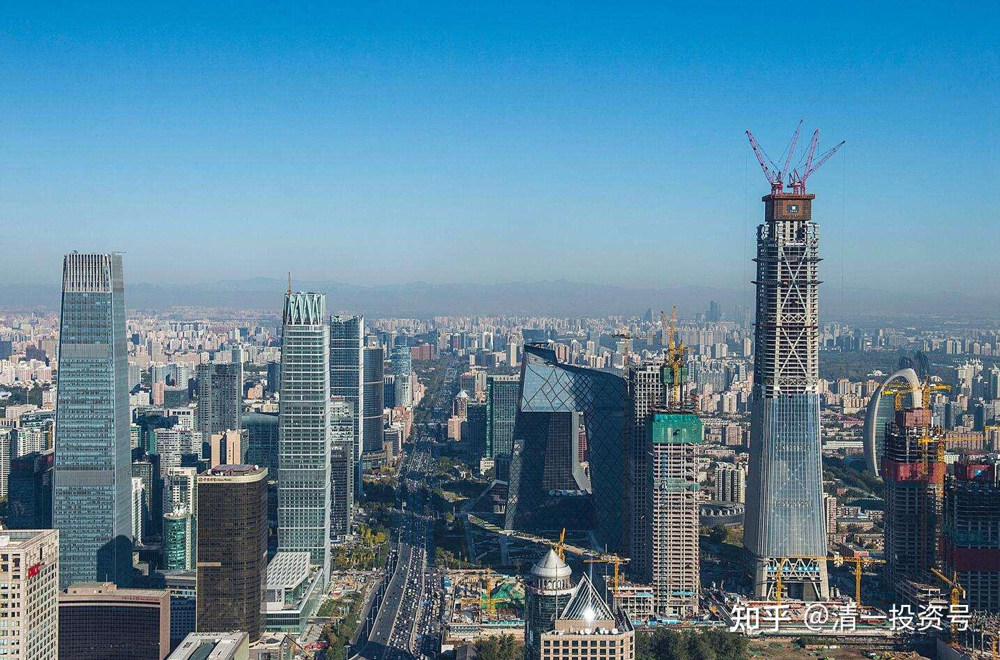

**

**

24篇.中国建筑系列之二十二：长期投资中国建筑具有稳定收益

清一山长 2021年07月10日～09月02日

**导读：**

一、中国建筑的长期稳定性凸显

二、中国建筑基本面良好，不涨就再给十年比耐心

三、左侧交易的要点：有耐心，无贪心

四、底部做T是跟自己的账户过不去

**正文：**

**一、中国建筑的长期稳定性凸显**

[51nxp](http://link.zhihu.com/?target=http%3A//xueqiu.com/n/51nxp)回复[清一山长](http://link.zhihu.com/?target=http%3A//xueqiu.com/n/%25E6%25B8%2585%25E4%25B8%2580%25E5%25B1%25B1%25E9%2595%25BF):

天士力的基本面在中药股中应该是最好的，有大单品，有研发创新药，投资的天境生物的新药获得知名药企的巨资海外授权。我可能已经out了，根本想不到市场连广誉远都能炒，对天士力则是一跌再跌。信立泰我不会换仓了。三月份涨到39我都一股没有动，当时天士力只有12.5元，我想实践长期投资。山长，您是有大智慧的人，你觉得我坚持长期投资好呢？还是像我以前做大波段轮动好？这个不仅仅是赢利问题，还有就是我生命质量问题。轮动错的时候内心不能安宁。

**[清一山长](http://link.zhihu.com/?target=https%3A//xueqiu.com/9310099567)**[2021-07-10 21:38](http://link.zhihu.com/?target=https%3A//xueqiu.com/9310099567/190033235)回复[51nxp](http://link.zhihu.com/?target=http%3A//xueqiu.com/n/51nxp):

您太抬举了。您的问题太复杂，恐怕连佛祖都答不上来吧？[笑]。

关键看您喜欢什么样的体验了。**关于【坚持长期投资好呢？还是像我以前做大波段轮动好？】。我认为两个都好。**这不是忽悠人的说法，我真心这样认为的，也是这样做的。两种模式我同时采用，我用惠泉啤酒和珠江啤酒做大波段，以及一些白酒。我用燕京啤酒和中国建筑做长期投资。我选择不会输掉的底部的股票长持，拿股息也不犯愁的股，或者市场占有率高，傻瓜也会做的企业。这种股，拿上十年也不愁的。不指望它会涨。如果做大波段，我会选择看得懂K线的股介入。现在信立泰和天士力，都超出了我的能力圈，我不知道拿来干啥好。从目前趋势看，也许13元天士力，已经达到了下跌的极限位置。也许可以拿来做大波段。至于长持，我就不确定了。我更愿意选择18元左右的白云山来长期持有（上次跌回来已经买了）。我勉强能看懂白云山的模式，股息也不错。医疗股，坑太多，特别是创新药。买对了发大财，买错了亏大本。我绝对不敢说能看得懂谁胜谁负。只敢买最保守的企业。发不了财没啥的，别亏了才是正事。

晕娜2021-07-06 21:37

[中国建筑](http://link.zhihu.com/?target=https%3A//xueqiu.com/S/SH601668%3Ffrom%3Dstatus_stock_match)：强化刚性退出 员工能进能出（转发）

原文链接： [https://finance.sina.com.cn/roll/2021-07-06/doc-ikqcfnca5305066.shtml](http://link.zhihu.com/?target=https%3A//finance.sina.com.cn/roll/2021-07-06/doc-ikqcfnca5305066.shtml)

**[清一山长](http://link.zhihu.com/?target=https%3A//xueqiu.com/9310099567)**[2021-07-10 23:02](http://link.zhihu.com/?target=https%3A//xueqiu.com/9310099567/190036946)评论上贴：

末等调整、不胜任退出，今年以来与考核不佳的7252名员工主动解除了劳动合同 ，在内卷化严重的竞争市场上，肯定要求越来越高。**这种力度执行的国企，会越来越有竞争力的。**

红星新闻2021-07-05 23:49

[银行行长辞职创业失败转做外卖骑手：一月成“单王”四月升站长](http://link.zhihu.com/?target=https%3A//baijiahao.baidu.com/s%3Fid%3D1704548956820449895%26wfr%3Dspider%26for%3Dpc)

原文链接：[https://www.sohu.com/a/475722346_116237](http://link.zhihu.com/?target=https%3A//www.sohu.com/a/475722346_116237)

**[清一山长](http://link.zhihu.com/?target=https%3A//xueqiu.com/9310099567)**[2021-07-11 09:01](http://link.zhihu.com/?target=https%3A//xueqiu.com/9310099567/190046404)评论上贴：

50岁的前银行支行行长当美团骑手送餐：不会理财，不懂市场，不懂风险控制，50岁破产的代价有多高？（我一直说实业的风险很大，很容易直接爆仓，很多人不信。**这人如果老老实实地买四大行，买中国建筑。**拿分红都可以过得很好了。偏想多赚钱、赚大钱，跟进入股市后、拼命上杠杆想要赚大钱的人一样，结果50岁爆仓，人生从头再来。真心不容易）。想起来去年12月，有个人13元多加杠杆，买了500万元的惠泉啤酒。后来下跌到7元，不知道爆仓了没有？这就是贪心惹的祸。如果是自有资金，半年后惠泉又回到13.99元，解套还给了一点点利息。但如果是杠杆资金，是拿不住的，13元多跌到7元，就爆仓了。所以，**学会基本的理财思维很重要。学会简单朴实的生活，降低欲望太重要了**。不然一夜回到解放前。

二**、中国建筑基本面良好，不涨就再给十年比耐心**

**[清一山长](http://link.zhihu.com/?target=https%3A//xueqiu.com/9310099567)**[2021-07-14 22:27](http://link.zhihu.com/?target=https%3A//xueqiu.com/9310099567/190469009)

[$中国建筑(SH601668)$](http://link.zhihu.com/?target=http%3A//xueqiu.com/S/SH601668) 业绩预报：地产业务方面，1-6 月累计合约销售额、销售面积分别同比增减21.5%、-0.2%。说明：地产部门的盈利大增。面积没有增加，但收入增加了，就是说地产销售价格是涨价了21.5%。中建的报表，依然很良好。股价依然很难看。继续维持吧，希望能够维持一年这个价。我就有机会不断买了。

[@逍遥战歌](http://link.zhihu.com/?target=http%3A//xueqiu.com/n/%25E9%2580%258D%25E9%2581%25A5%25E6%2588%2598%25E6%25AD%258C)回复[@清一山长](http://link.zhihu.com/?target=http%3A//xueqiu.com/n/%25E6%25B8%2585%25E4%25B8%2580%25E5%25B1%25B1%25E9%2595%25BF):

中国建筑已经5年没有动过，还要再拿10年，这你也说的出来[笑]

清一山长[2021-7-20 16:00](http://link.zhihu.com/?target=https%3A//xueqiu.com/9310099567/191207566)回复[@逍遥战歌](http://link.zhihu.com/?target=http%3A//xueqiu.com/n/%25E9%2580%258D%25E9%2581%25A5%25E6%2588%2598%25E6%25AD%258C):

中国建筑五年不涨怕啥呢？就怕连跌5年吧？再给10年，允许他10N年不涨。总共15年。燕京啤酒已经10年不涨了，再多给五年不行吗？也是允许它15年不涨。只要不跌就是赢。总比买了恒大，天天操心不知道什么时候完蛋好吧？等你有这些不涨的心，万一明年就涨了，你会很幸福。如果你天天问明天涨不涨，就算涨停了，就肯定跑了。最终你赚了多少钱呢？也许你把燕京啤酒的账号密码忘掉，5年后再打开，也许涨到你都不相信。要涨的话，肯定不止10%。[笑]

@速隐刀 回复@清一山长:

燕京算重仓吧？都十大了[为什么]

[清一山长](http://link.zhihu.com/?target=https%3A//xueqiu.com/9310099567)[2021-08-29 17:55](http://link.zhihu.com/?target=https%3A//xueqiu.com/9310099567/195910515)回复[@速隐刀](http://link.zhihu.com/?target=http%3A//xueqiu.com/n/%25E9%2580%259F%25E9%259A%2590%25E5%2588%2580):

中国建筑比燕京还多，谁更重？[加油]

**三、左侧交易的要点：有耐心，无贪心**

[清一山长](http://link.zhihu.com/?target=https%3A//xueqiu.com/9310099567)[2021-09-01 10:40](http://link.zhihu.com/?target=https%3A//xueqiu.com/9310099567/196293796)

[$中国建筑(SH601668)$](http://link.zhihu.com/?target=http%3A//xueqiu.com/S/SH601668) 跌了几个月，一天就涨回来了。所以，做左侧，其实很安全。跌一点就叫，太沉不住气了。左侧看上去很傻，买了就跌，卖了还涨，但这种人很难输掉的。**左侧唯一不好的，很需要耐心，还要放弃贪心。两心不到，做不了左侧的**[加油][加油][加油]。

今天中国中铁也大涨，刚买成重仓的。是我最短时间的左侧。有时，左侧必须以年为单位买入，当最看好的人都守不住了，基本上就到底了。徐志的基金坚持几年买中国中铁清盘了，你们都在看他的笑话，我看到的，是大好的，难得的机会，让我看到了中国建筑外更好的机会。所以，多一点恭敬心，多尊重别人，多去理解别人，是有好处的。

徐志当初是看好中国建筑的，研究中国建筑也很多。最后居然重仓的是中铁，一定是他看到了我没看到的东西。所以，我在找他看到了啥？最后我看到了，所以也大仓位买入了。今天赚得比中国建筑的还多多了。毕竟正好在底部买进中国建筑5元就买还套牢。所以中铁的运气好[加油][加油][加油]。

这段时间，我也不怕忌讳，示范买这两个建筑股。就因为我认为跌不下去了，超级安全，才鼓励大家买的。似乎跟进的人不多。可能多去买贵州茅台了，成交量这么大。中国建筑比贵州茅台赚钱还多，十年成长比，不比贵州茅台差，你非要去买贵20倍市值的，我看有点傻[大笑]。原来就公开发帖说过的，估计有人就是看不懂。

[@yimeiwp7](http://link.zhihu.com/?target=http%3A//xueqiu.com/n/yimeiwp7)回复[@清一山长](http://link.zhihu.com/?target=http%3A//xueqiu.com/n/%25E6%25B8%2585%25E4%25B8%2580%25E5%25B1%25B1%25E9%2595%25BF):

就是不知道我老公死抱中石油对不对？[大笑][大笑]

[清一山长](http://link.zhihu.com/?target=https%3A//xueqiu.com/9310099567)[2021-09-01 10:55](http://link.zhihu.com/?target=https%3A//xueqiu.com/9310099567/196298347)回复[@yimeiwp7](http://link.zhihu.com/?target=http%3A//xueqiu.com/n/yimeiwp7):

股市没有对错，只有输赢[俏皮]。在我的逻辑里面，是几只建筑赢面最高，所以押宝中国建筑、中国中铁。

**四、底部做T是跟自己的账户过不去**

晕娜2021-09-02 10:30

[$中国建筑(SH601668)$](http://link.zhihu.com/?target=http%3A//xueqiu.com/S/SH601668) 喜欢做T的球友，最近收益如何？方便说吗？

山兄是交易者，我是股权投资……两回事。我常年满仓，不做高抛低吸这种投机的事。山兄是高抛低吸的高手……我没这个高难度的水准……

[清一山长](http://link.zhihu.com/?target=https%3A//xueqiu.com/9310099567)[2021-09-02 14:25](http://link.zhihu.com/?target=https%3A//xueqiu.com/9310099567/196472595)回复晕娜：

原来中国建筑做大T，大波段，最近这一轮，中国建筑这一年多，我很老实，都不做T了，光坐一年多的电梯了。看不懂的时候，我装股权投资者。看懂了，赢面概率高，我就做交易者。不好意思了。

[清一山长](http://link.zhihu.com/?target=https%3A//xueqiu.com/9310099567)[2021-09-02 14:35](http://link.zhihu.com/?target=https%3A//xueqiu.com/9310099567/196474605)

做T的人，都是自认比市场聪明的人。直到有一天发现原来真不是[哭泣]。中国建筑，我不敢做T，只好傻傻地坐电梯。底部做T，是跟自己的账户过不去。高位做T，才放心。因为高位T飞了，你找得到换的品种。底部T，T飞咋办？干瞪眼吗？所以，这段时间做中国建筑T的，要不是太聪明了，要不就是聪明太过头了[俏皮][俏皮][俏皮]

参考链接：

[1篇.中建背后的神秘大手](https://zhuanlan.zhihu.com/p/481078141)

[2篇.赚钱王道：在低估的前提下轮动](https://zhuanlan.zhihu.com/p/509053673)

[3篇.中国建筑系列之一：就算是好股，也别谈恋爱](https://zhuanlan.zhihu.com/p/512602669)

[4篇.中国建筑系列之二：大A股的稳定器](https://zhuanlan.zhihu.com/p/519506160)

[5篇.中国建筑系列之三：发现投资机会的方法](https://zhuanlan.zhihu.com/p/565361369)

[6篇.中国建筑系列之四：只有少数人才知道正确的通道](https://zhuanlan.zhihu.com/p/522882446)

[7篇.中国建筑系列之五：投资中建的核心逻辑和理由](https://zhuanlan.zhihu.com/p/528942534)

[8篇.中国建筑系列之六：熊市布局，牛市收获](https://zhuanlan.zhihu.com/p/534585889)

[9篇.中国建筑系列之七：每个人都应有自己的投资逻辑](https://zhuanlan.zhihu.com/p/538090859)

[10篇.中国建筑系列之八：为自己的投资负完全的责任](https://zhuanlan.zhihu.com/p/549316895)

[11篇.中国建筑系列之九：如何用融资投资中国建筑？](https://zhuanlan.zhihu.com/p/559571938)

[12篇.中国建筑系列之十：综合对比下中建的长远价值](https://zhuanlan.zhihu.com/p/564749726)

[13篇.中国建筑系列之十一：多年不涨的中建，值得坚守](https://zhuanlan.zhihu.com/p/566546633)

[14篇.中国建筑系列十二：长持股的价值投机操作及未来畅想](https://zhuanlan.zhihu.com/p/568853074)

[15篇.中国建筑系列之十三：从年报的角度再次解读超低估的中建盘面](https://zhuanlan.zhihu.com/p/572007510)

[16篇.中国建筑系列之十四：买中国建筑的好处就是可以安心睡觉](https://zhuanlan.zhihu.com/p/574936145)

[17篇.中国建筑系列之十五：千万不要无原则的在股市中“赌”](https://zhuanlan.zhihu.com/p/577278058)

[18篇.中国建筑系列之十六：中建置顶文被删触动了谁的利益？](https://zhuanlan.zhihu.com/p/578823434)

[19篇.中国建筑系列之十七：通过对比发现中国建筑的价值](https://zhuanlan.zhihu.com/p/581419744)

[20篇.中国建筑系列之十八：中国建筑可能是最安全的投资标的](https://zhuanlan.zhihu.com/p/583777334)

[21篇.中国建筑系列之十九：做优质股权收集者，别对天叫穷卖惨](https://zhuanlan.zhihu.com/p/585173888)

[22篇.中国建筑系列之二十：如何超过杨百万？看到价值，坚定持有](https://zhuanlan.zhihu.com/p/589745640)

[23篇.中国建筑系列之二十一：未来房地产往代建转移，中建绝对实力超群](https://zhuanlan.zhihu.com/p/591659501)

