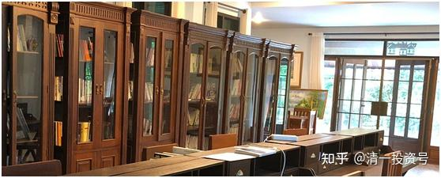

**原专栏57篇.人无远虑，必有近忧！人生和投资皆然！**

[清一山长](http://link.zhihu.com/?target=https%3A//xueqiu.com/9310099567/column) 2020年2月19日

*(说明 文中图片是我清迈的书房内景）*

**人无远虑，必有近忧！**

查理·芒格2020年Daily Journal 每日新闻股东会：**“多数人再努力也是底层。”**

这说明：**仅仅努力是不够的，你还需要一些机会，努力才有作用。还需要方法！**可惜**中国人不太喜欢研究方法，只喜欢行动。以为行动多了，就自动升级。**就像是股市上，以为动作越多，越可能赚钱，虽然实际上是相反的。

这个世界上，**只有抱着10年，甚至100年的远见卓识去做事，你才能得到最好的结果。**

我提出的问题：**如果有轮回，我们唯一值得做的事是什么？**

其实就是希望大家从更长远的眼光来思考现实的生活。

我看了大家的答案，很多过于高大上了，甚至很虚无。很多人只是把佛学的话，拿来重复一遍。还有更多人的答案，就是不知所云！更不知道如何执行下去。我真的佩服体制教育教出来的人，不会思考，只会服从命令。我相信对于工业流水线是很需要的，但对于个人的幸福和成功，还差得很远。

这个问题，有适合所有人的答案？有吗？真的有！因为，我们每个人，每天在努力追求的事情，总结下来也就一句话，无非就是“想要更好的生活”而已！

我们每一天做的事情，都是希望明天、明年，比今天、今年更好！我们喜欢“步步高升”，这应该就是“务实”的中国人全体最期待的追求了。我们甚至可以从小压抑自己去苦学十年，二十年，就是为了拿一个文凭，为的就是找个好点的工作。这都是我们在每个当下对未来投资的表现。

因此，**如果有轮回，我们现在唯一值得做的事情，就是“每天，都要做让自己的下一世比这一世更好的事情”！**我猜想，你应该不会反对这个答案。我认为没有任何人，来世界活一回的目的，就是“专门来找抽”的。虽然**事实上，很多人正在挨抽！因他们无知而被抽。**

如果用雪球人的思维习惯来说，就是：我们参与股市的唯一目的，当然都是为了赚钱！我猜想：没有任何一个人来股市的目的，是来做善事，专门来做散财童子的。虽然**事实上，90%的人来股市上，最终就是赔钱的！赔钱的原因是什么？主要就是因为眼光太短浅。**

一个人，如果眼光长远一点，不要每天追涨杀跌，而是踏实做好功课，进入股市应该90%的人都赚钱才对。因为股市的长期趋势，都一定是向上的，赔钱是没道理的。美国200多年的股市历史，中国接近30年的股市历史，都说明了这一点。

我记得20年前，我老爸退休没事干。我就让他买股去，不用懂行，只要买入**上海机场**（当时叫虹桥机场）不动。我还帮他开了户，还赞助了一万元资本金，记得当时股价是10元左右。今天来看，复权价270元了！足有27倍的收益，还不算最高峰的价格。这期间，你什么都不用做，就是好好地等着就行了。可惜我父亲没多久，就销户把钱存到银行去了。因为他认为“股市有风险！银行最可靠！”。实际上他一生工资攒下来的本金，价值已经大大缩水了。他作为文革前的老大学生，一生努力和节俭，去世的时候，就只有20多万元的银行存款。他也没买商品房，就是守着学校分的房子，完美错过了中国40年来的三大创富机会——下海创业、买股、买房！我倒是全都赶上了。

人生也一样。大多数人，一生过得很辛苦，还不太成功。其实每个人的人生，都可以很轻松、很快乐，也很成功的。关键就是：大多数人都眼光太短浅了。要真正的活得好，你必须看远一点才行。**买股票，你要有十年以上的眼光才能保证赚钱。人生要成功，你的眼光就应该看到百年以后！**

所以，为啥要出来讨论“如果有轮回”这种问题？看起来很无聊，很脱离现实，其实是很重要的。

不是说要“活在当下”吗？没错。不过，当你把眼光关注到“下一世”。**如果你每天所作所为，都是为了让你的“下一世”得到更好的机会，你的今天，你的“这一世”并不会失败，反而会比一般人更成功和更幸福！更受尊重。下一世无论有没有，你已经赢了这一世。**

就相当于投资：如果你把“十年之后的结果”，作为你当下投资的目标和选择，当下的任何涨跌，你都不会恐惧和贪婪了。**一旦你克服了恐惧和贪婪，其实你现在每年都可以获得相当可观的回报，并不需要十年后才有回报。**

怎样的人生，才叫“活得更好？”。我就不用来自以为是的教导各位了。因为这个问题没有答案的。每个人有自己的答案，都有自己的价值观，都有自己“好和坏”的标准！

有人认为：要成为亿万富翁才算好！有人认为要当大官才算好！有人认为要解脱轮回才算好！不管你认为什么算好，你都要为了你想要的目标，而每天以努力的心态去做事，就行了。

假如有轮回，该怎么样做事？很简单：你现在的每一天，都去做“让你的下一世想去的家”欠你的债的事情。欠得越多越好！这就叫做**投资未来的生命。**

大家似乎都爱钱，我就举个怎样赚大钱的例子吧！你现在发现你没有太多的机会赚大钱，想当亿万富翁没多少机会。但是你如果下一世就可以做亿万富翁。今天你该怎么办？

你们可能会找出无穷的方法来，有没有效果就不知道了。我认为方法很简单：最直接、最轻松、最有效的方法，就是你想法出生在亿万富翁的家里就行了，一出生你就是亿万富翁，可以得到亿万富翁能够得到的一切机会（除了白手起家的痛苦和快乐的经验以外）。

怎样才能实现这个目标呢？**如果你只是期待这种事情偶然发生，就等于赌博。就等于你每天期待中一个大奖，却连彩票都懒得买一样，基本上是不可能实现的梦想。**

为了要真正的实现这个理想，该怎么办呢？

首先，你必须今生就要找到一个亿万富豪的家族，而且你必须确定，他们家族的财富，肯定是能够持续到你百年以后的。我猜想，你就会放弃很多暴发户作为目标家族了，比如李海仓家族之类的山西首富，你就别指望了。这种家族叫做暴发户，能持续多久很难说的。最好您还是选类似李嘉诚、比尔·盖茨这样的家族吧！我认为这种家族的财富，要延续百年应该没问题。

第二：找到了之后，你要想方设法，让这个亿万富豪家族欠你的债！欠得越多越好。其实等于你在投资他们，买下你未来在这个家族的“股权”。我敢担保，你把钱送给这样的家族，要比你把钱送给自己的孩子要好，比到处送给穷人要好。因为你的孩子延续百年财富的可能性其实很小，你投资了也收不到回报的。你要学银行一样投资，嫌贫爱富，银行只愿意把钱借给最有钱，最会用钱赚钱的人。而不是把钱送给最缺钱的人。你要学银行的精明，而不要学慈善机构！**慈善工作，跟维稳工作一样，是政府的责任。**你只有投资到能够加倍回报你的家族，才能保证您下辈子有钱用！

您开始嚷嚷了：“我这辈子就是缺钱用，你还让我送钱给亿万富豪，不是白说了吗？”

其实，亿万富豪家族不缺钱，你想送钱也未必送得出去。你要得到最大的投资回报，并不是送钱给他们，让他们欠你的钱意义不大。最好是你要给他们比钱更有价值的东西。比如——生命！你如果让这个家族欠你一条命，你就成功了，大发了！

方法有很多：比如，你可以去做这个家族的保镖，你来替他们挡子弹，你救了他们家族成员的命，这个家族就欠了你一条命。下一世，你就有权利“一命抵一命”，要求他们还你一条命——生你出来！

不过，当亿万富豪家族的保镖，不一定保证能让他们欠你的命。欠你命的家族成员——但凡是人——都会生病的，你可以“救死扶伤”，当一个杰出的医生，拯救这个家族的成员的生命。这样，他们也欠了你一条命！下辈子就要还你。结果——你一出生就有亿万资产了。

第三种方法，我认为更好。你们看过《音乐之声》电影吗？一个穷女孩，去当富豪的家庭教师。结果，意外地成功逆袭，成为了这个上流社会的家庭成员！她其实不算漂亮动人，她能击败门当户对的、漂亮又多金的贵妇人，成为这一家庭女主人的核心原因，是她赢得了孩子们的心！也因此赢得了爱孩子的男主人的心。孩子们愿意她来当这个家庭的新妈妈。如果您也当一个这样的教师，赢得了孩子们的心，您认为您对他们提一个小小的要求：你下一世想做爱您的学生的孩子，会有障碍吗? 当然没有！这可能是成功率最高的方法。

**做一个优秀的教师，认真教育好亿万富豪的下一代，如果你的教育结果很好，增进了他们的智慧，你就给了他们慧命。这个功德可大了，比命更贵重，比钱更值钱**。讲说金刚智慧的几句话，就可以比山一样多的金子更值钱！如果你能够当这样的教师，你跟学生建立了深情厚谊，将来成为这个家庭的成员之一，不就是很容易的吗？比去当保镖拼命划算多了！而且比你选择的机会要多多了。当保镖挡子弹，你可能只能挡一个人。但是当教师，我相信你不止教一个学生。你就可能选择你最喜欢的学生家里去投胎！作为学生认同的教师，你会有最大的优先权利！别的灵魂抢不过你的！（我猜想你马上明白了。当教师，也要当顶级精英名校的教师，别去当民工学校的教师，回报率是不一样的）

我相信还有别的很多办法去做。但所有的办法，总结出来都有一个原则——就是让你想要去的亿万家族，欠你的债！欠得越多越好！

当然，如果您的目标不是赚钱，而是其他任何你想要的行业。比如你想当官，你想当明星，甚至想换一生，去当白皮肤的外国人？不用当香蕉人，你都可以用这个方法，来实现自己的梦想。

瞧，有轮回多好玩呀！

要知道，中国阶层固化的特征越来越明显了，如果您投胎没投好，你就输在起跑线上了。设想你生在大山里面，恐怕砍柴就是你最大的技能了。所以，您还是趁很多人都不知道，不相信有这个机会的时候，赶快去积累你的“下一世的人脉”吧！

不过，中国人有一个巨大的个性缺点，总怕自己吃亏，总怕被别人占了便宜。而且仇富，仇强爱弱，只喜欢跟比自己差的人玩，扮演“救世主”。如果您也持有这个信念，我也不想改变你的信念，你就永远在下层社会里面打转吧！

附录：

法 财 侣 地

无师自悟，尽是天然外道。

非依善知识，无由成佛道。

禅宗才有“不遇明师不修道”。

道元法师讲：“三年从师，不如三年选师，不得正师，不如不学。”

传授佛法，必以证契之人为其宗师，文字学者不足为其导师，如一盲引众盲。
