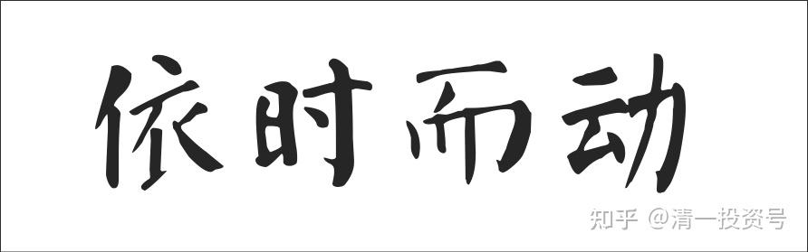

24篇.依时而动，把握投资机会

——节选清一山长 2008年演讲《投资与人生》

**1.道家原则，依时而动**

关于赚钱，从哪个角度下手呢？这里面就要讲我们道家一个基本原则，也是大家经常忽略的一个原则。我们一般人进到一个单位，只要这个单位的领导在慢慢地提拔我，我是不是会一直坚持下去？等坚持到有一天老了，退休。这是大多数人的思考。我们这个老板她能够赚钱，是因为她违背了这个思考，她的思考恰好跟今天讲的这一条有关系，叫做“观乎天文，以察时变”。翻译成现代文来说，就是道家的一个很重要的原则。我们的天是什么样的？天永远是一样的吗？今天没下雨，昨天下雨了。前一段时间又是晴天，再过一段时间又要下雪。所以天是什么呢？天在不断地变化。用《易经》的话讲叫：“变通者，趋时者也。”“生生之谓易。”**天道就是易，就是不停地变化，这是《易经》的基本原理。那么天是变的，人也应该变，变还要有准则，这就是“道”**。但是变不能乱变，今天变个男人，明天变个女人，有这样的人，大家不要这样乱变。**依天道而变，随虚实而变，人要这样变，你就会依时而动**。所以要“观乎天文，以察时变”。时代变化了，你就要跟着变。如果你抱着个死脑子不变，那就麻烦了。

老子的《道德经》第一章就讲的是这种观点，叫做“道可道，非常道”。这句话一般人的翻译不要听，翻错了，一般是翻译：道这个东西，可以说出来的道就不是真正的永恒的道了。这是一般人的翻译，还是大专家、大学者的。因为这些人只管字面意思，以文对意，他自己不去修行，不去做事，他就以为这样翻译对。其实这句话不是这个意思。这句话意思是：**“道可道”，道是可以说的，也可以去做的，也可以去追寻它的规律的**，这是“道可道”的含义。**“非常道”**是什么含义呢？**你虽然可以去做，但是它不是固定的做法，没有固定的方法**。老子的《道德经》就随时告诉你这个道的存在，它存在，但是它又不固定，它可以用各种方式体现出来。就像我们学了《道德经》，学了道家的文化，我把它体现到赚钱上，它就变成了金钱智慧；我把它体现到家庭上，它可能就是男女或家庭智慧；体现到管理上那就是管理智慧；体现到治国上面，他就是大宰相、总理；体现到带兵上，他就是兵法家。所以中国历朝历代真正起作用的人全是道家人物。

**儒家文化虽然很重要，它只是一种在安定社会、稳定社会下的一种文化**，但是真正做事的是道家人。历朝历代改朝换代，或者开创新时代、开创新纪元的，全是道家人物。包括毛泽东也学了很多道家的东西，所以毛泽东的计谋特别厉害，做事情特别厉害。咱们南怀瑾老先生对道家有这样一种评价，说道家是药店，人病了就要吃药，不吃药治不好，那就死了。是不是？所以继往开来是道家。儒家是什么呢？儒家是粮食店，它是日常吃的东西，但是平常正常的时候吃粮食，生病的时候就要吃药了。他对佛家有个评价，佛家叫百货店，啥都有，可以经常去逛逛，丰富一下生活。这种比喻我觉得特别有意思。

**2.灵活投资，实现价值最大**

“道可道，非常道。名可名，非常名。”名就是概念，它就是强调**我们不要被固定的概念给限制住**。这个概念本身有不同的含义。比如今天大家看到我，我叫张健柏。但是我老婆看我，我不叫张健柏了，我老婆看我叫老公是吧？我儿子看我叫爸爸。别人看我又有别的身份。所以身份那叫什么？那叫“名”。那个名是不是固定的？比如说我，公安局来了说，你是不是张健柏？我得老老实实说：“是的，我就是张健柏。”我不能说我不是。但是我一天到晚都以为我是张健柏，那我就完了。但这个名字一天到晚都可以说，在家里面让儿子叫我张健柏，虽然有点别扭，也可以勉强接受。外国人不就这样吗？在中国儿子一定要叫你爸爸，但在外国，儿子叫我张健柏也没什么稀奇的。

名字还好说，问题是我们人会固定一些奇怪的东西。比如我是今日学堂的校长，我一天到晚都端着那个校长的身份，那个名，我把它以为是常名，恒定的名，是不是我有毛病？那就叫脑子不转。有些人当领导当惯了，一天到晚到外面都是一副领导的像，那是不会学道家。道家的话你到哪里就像哪里的样，是不是？家里是家里的样，官场是官场的样，跟朋友也是朋友的样。我有一个中学同学，我的同学都在议论他，说这个人当了官，同学都不认了。为什么？他在同学面前也是一副当官的像。那就是“名可名，非常名”，他没学会。**大家要有一种灵活的思想，你就知道你在什么情况下，知道自己的身份，该做什么样的事情，该取得什么样的机会**。难不难？不难，说不难也蛮难的。

我刚刚讲的那个女孩子的故事，她就知道自己的身份是不固定的。比如一个国有企业的职工，很光荣的职位，她不要。为什么呢？她觉得她要另外一个东西。她去经商，老板很赏识她，要提拔她的时候，她又不要了。为什么呢？她心中有一个目标，所以她心中是有个恒定的追求，但是这追求用不同的形式来表现，它非常符合“道可道，非常道”的思路，因此最终赚到了大钱。

所以要讲投资，要讲人生，这是**最大的投资，就要把我们的价值达到最大的实现**。既然想达到最大的实现，我们每天该做什么？**每天都要把我们的时间安排好，时间就是我们最大的本钱**。做投资当然需要本钱了，将本求利，你本钱都没有，你求什么利？我们想一下，一个人已经七八十岁了，你给他讲投资，他感不感兴趣？有再多的钱他也不感兴趣了。为什么？时日无多，剩下来的日子他干什么？我们现在都说我们人穷，没钱投资。错了，我们每个人现在都富裕得不得了，只不过我们经常把钱花在哪里的问题。比如今天，大家各位，你把你的“人生金钱”，咱们打一个比方，花在到这里面听讲座，就相当于你对自己的一种投资。

**3.时间的投资要一门深入**

但这种投资也别乱投资，讲座要听，但是也不能乱听，一些对你没用的东西你也听，那就麻烦了。比如咱们想象一下，百家讲坛每个人都讲不同的东西，那么每个人的东西你都要去学，你就笨了，学到最后你就变成了一个没有方向的人。会不会这样？所以**你要根据自己这辈子想做什么，根据自己的人生目标来确定你要听的讲题，并且把它系统地完成**，而不是东搞西搞。

我当年就干了这样的愚笨的投资。不过迷途知返，很快回过头来，否则今天也会变成笨蛋。我在大学的时候就对道家感兴趣，而且我经商也是用道家的东西，结果获得了成功。但是我上大学有一个目标，就是我想读尽大学里面的书。我当时在我们那个地区的时候，地区图书馆的书都被我借光了。我读书很快的，前天晚上我做完演讲之后回家，已经快10点了，有点睡不着，去看书，到了1点钟才睡觉。但是我3个小时看完了两本书。我一般每年要看300～500本书，我的阅读速度每分钟是在1500字以上。这个速度怎么来的？因为学道家的人有个特征，脑子快，不是眼睛快，是脑子快。他一看刷一扫就进去了，当然眼睛也快。所以这是我的一大优势。我在初中就得到这个优势了，所以我从初中到现在都是一个大量阅读的人。说读书破万卷，我的书绝对不止万卷，因为一卷其实并不多。但说到这里，我不是说我多成功，我是想告诉大家我的笑话。我进了大学之后，就很想把图书馆里的书全读一遍，我觉得那样我就会成为一个最有本事的人了。结果我只坚持了不到半年，就受不了了。我为了得到这个职位，很难的。我们那时学生不准去书库里面看书。但是我争取了一个免费打工的机会，帮图书馆做卫生、做一些勤杂的活。图书馆就批准我可以进书库里面逛一下，我就可以借我想要的书。那时候我有5个图书证，可以一次借5本书。我就顺着图书馆的架子一架一架地看，看了还不到半年，最后说算了，不看了。第一，很多书看不懂，第二，很多书看下来很无聊，迷途知返，再也不干了。最后选定一个方向，从这方向一门深入。最后就达到了兼及百家。

你在一门上看通了之后，别的很多东西很简单的。像我，主要看道家，回过头来有时候偶尔给别人讲一讲《论语》、《孟子》，给我的弟子们讲一讲，别人觉得讲的挺好的，讲儒家讲得不错。我说没有，我主要是学道家，儒家不行。他说你讲的比很多人讲的都好，别人还捧我，你比于丹讲得都好。我说于丹是搞搞玩的，你不要这样去评价。而且别人讲的的确比我好，而我的签名、我的书没人要的，别人于丹怎么样呢？所以别人肯定有她的好处，别这样说，但起码有人这样抬举我。那么特征是什么呢？就是**要一门深入，顺着一个方向达到人生的目标。**而我当年选的一门深入的方向是什么呢？方向就是智慧。我觉得人生下来我得变聪明一些。聪明有什么好处呢？聪明就是干什么都容易。去赚钱，赚得比别人轻松。我赚钱、做生意的时候，比如我是武汉市最轻松的老板，因为我不像别的老板那么拼命，看我一天到晚东逛西逛的，现在也蛮轻松，生活各方面我觉得安排得也还行。所以这就要用智慧。**智慧不是智商，智慧其实是你的判断，你的眼界，同样的事情你怎么去看**。这东西叫做智慧。

我们**要了解形势，我们要看得见未来。**用我当年对我的学生们打的一个比方：我说赚钱就相当于什么呢？赚钱就相当于我们进了一个黑屋子，黑屋子里面其实有很多金银财宝，但也有很多砖头，你要什么有什么。我们要训练出什么来？训练出在大家都看不见的时候，要看得出什么是真正的财富，什么是真正的宝贝。你们觉得是吗？

**4.投资的机会是变化的**

这就要训练这种眼光。**我经常告诉别人——有赚钱的机会到来了，应该怎么去赚钱，但是我说的时候基本上没人相信我的，但等别人相信我的时候，这个机会已经过去了，别人看见了才相信**。打个比方，十年前，1998年还是1997年的时候，我告诉我周围的所有朋友，我说你们去买长虹股票，因为当时我研究长虹股票，当时它是最红的时候，它每股的利润可以达到一两块钱，它的价格才卖7块钱。7块钱一股，它的利润有一两块钱，这简直就是比你做生意赚钱还快。我说要去买。当时有人说：“你买的理由是什么呢？”买的理由就是我说它十年之后至少涨十倍，我根本不知道它什么时候涨。他说：“你能不能保证今年涨一倍？”我说**不能保证今年涨一倍，但是我能够保证它十年涨十倍**。但没人听我的，他们说不行，它最贵，当时有1块多钱的股票，它7块钱是最贵的股票，大概是1997年还是九几年，我记不清时间了，十几年前了。好了，最后咱们说结果吧！结果这个股票7块钱的价格，在不到一年的时间之内涨到了66块钱，是不是十倍了？不到一年。

好了，涨到66块钱，到一年多一点，我的表妹也打电话给我了，因为我老早告诉过她。她说：“大哥，你说的真对，你说长虹真是好，那我现在去买它了。”我问你多少钱买的，她说50块钱。我说赶快卖掉，都已经亏了一点了。亏了多少？她说55块左右买的，现在跌到50了。我说管它多少钱，全部卖。她说你不说十年涨十倍吗？我等着再过十年它再涨十倍。我说**我是在它6块多钱，7块多钱时说的话，不是现在说的话**。因为当时我看到另外一个消息，看到这个消息我就觉得绝对不能要它了。这个消息是什么呢？长虹的总裁倪润峰，他说有一家山东济南的经销商拒销它的产品，说是它的产品有质量问题。有质量问题不奇怪，总有点问题存在。但他的处理方法不对，他怎么说？他说谁不卖长虹彩电，谁后悔。骄傲十足。我说糟了，我说一家企业的领导，他怎么像个山大王似的，说话特别狠。**一家领导表现出这个样子，下面一定出问题，他太骄傲了，骄兵必败**，这个道理对不对？咱们道家讲的，叫物极必反，骄兵必败。我就说这样必败，所以就告诉她赶快卖。卖了之后没过半年，股票狂垮，最终垮了多少我就不说了，好像前一两年我看到的价格3块多钱吧！

你就会说，张健柏，你为什么有这个眼光？因为我学过道家，道家的知识都在这。但是为什么一般人都是在最贵的时候跑去买了，最便宜的时候——让你捡钱的时候你又不捡？因为一般人没有眼光，没去训练这种智慧。你有这种智慧之后，你觉得赚钱难不难呢？你把十万块钱丢到那里面去，然后你抱着手等一年，如果你买了长虹股票，一年之后变成了一百万，轻不轻松？一百万之后，等它跌到3块钱，你再去买一点，后来据说又涨到了7块钱，你变成200万。这种赚钱是不是特别轻松？而且你赚了这几百万，如果用我们道家方法来生活，几辈子都花不完。

所以是不是赚钱容易花钱难？这都是身边的例子。我当时在极力鼓动我的一个朋友去买长虹股票，这个朋友刚刚从德国回来，赚了一点外汇，很辛苦，他说这些钱存着怎么办？他有5万块钱，我说你十年之后变50万你不就够用了。他说不行，怎么可能。我就告诉他这种方法，他不相信我，后来过了多少年，他说应该相信你的，但是已经晚了。

可是，怎样才能够了解不断变化的现实呢？真的要有眼光。你得不停地观察、思考并处理这样一些问题，这就是一般人学不会道家的原因。一般人都喜欢，“张老师你给我个答案吧！”不是这样的。**我给你的答案，你要经过自己的思考，然后自己接受，这才是真正的道家智慧**。而不是我给你个答案，**因为我给你答案，今天给你的，明天就会变了**，对不对？比如我跟你说长虹，今天就会变了，我给你另外一个东西，明天也会变了。当这些变的时候，你怎么办呢？变了，你可能就会造成损失。我自己看得到它变，我不能随时变了随时通知你呀！

参考链接：

[清一投资号：23篇.赚钱比花钱容易](https://zhuanlan.zhihu.com/p/604725702)

[清一投资号：26篇.跟随时代趋势，掌握赚钱智慧](https://zhuanlan.zhihu.com/p/607757560)

