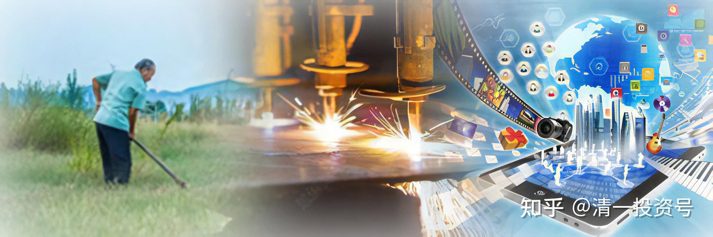

26篇.跟随时代趋势，掌握赚钱智慧

——节选清一山长 2008年演讲《投资与人生》

**一、不同时代的财富来源**

我们在这个时代，如果要实现金钱价值的最大化，该怎么思考问题呢？就要思考这个时代趋势最大的东西是什么。在我们人类历史上，赚钱有一些不同的途径、不同的资源。

**1.农耕时代靠土地**

在古代是要通过掠夺土地来实现自己财富的最大化。所以中国古代最富裕的是什么人？是皇帝，是将军。**中国古代要增加自己的财富，就要掠夺别国的土地**，去打别的国家。这样的游戏规则造成了中国古代连连的战乱。春秋、战国，一直到秦朝的更替。如果有人对政权的分配制度不满，得不到钱，穷人就起来推翻它，重新换一下，那套模式就叫做江山代有才人出。他们争夺的就是土地资源。但这样一些资源现在还有没有效呢？大家发现，我们二战以来到现在，一直没有大规模的战争。一些国家对侵略别的国家根本不感兴趣。为什么不感兴趣？因为土地已经不是资源了，大家对它不感兴趣。很多国家投票，说我们并给美国，把这个国家送给美国。美国要不要？美国不要。所以现在土地已经不是资源，那个时代叫农业经济时代。在农业经济时代，土地是资源，是因为土地能够生产农作物，而农作物代表这个社会的财富，农耕为本，依据的就是那个时代的游戏规则。那个时代要当有钱人，要当大地主，就必须买地，所以中国古人就喜欢买地，一块地一块地的买，买的越多，你就越富有。

**2.工业时代靠制造**

第二个时代开始了。这个时代是17世纪从英国开始的，叫做工业经济时代。工业经济时代的财富从哪里来？**财富从制造当中来**，制造产品。所以这个时代就出现了跟工业时代相应的一些大富翁。这些大富翁再也不是将军，再也不是皇帝，而这些人比将军和皇帝更有钱，富可敌国。比如说福特，造什么的？造汽车的。他能够以最低的成本，最大量地制造汽车，因此他就变成了美国首富。我们还发现摩根金融大王、钢铁大王、石油大王，这样一大批大王出来，是不是？这批大王出来，他们就拥有了财富。因此，**你如果要在工业时代取得竞争的优势地位，你就必须掌握工业时代的核心，掌握制造的技术和窍门，以及掌握资源**，比如矿产。你拥有矿产，拥有这些制造业的资源，你就能够赚大钱。现在大家还有没有这样的机会？这个机会也没有了。

**3.信息时代靠处理信息的能力**

工业时代已经过去，现在跨入了什么时代？信息时代，其实现在叫知识经济时代，也叫做信息时代。信息时代大家听起来好简单。我天天上网一搜索，多少信息。那个是垃圾信息。我很少上网的，别人给我发邮件，有时候我几个月都不上一下我的信箱。你说我信息好落后，**我不要垃圾信息污染我，就相当于我不要垃圾食品污染我一样。**我偶尔上网就是要干事情的。**我搜索我需要的信息，不看其他乱七八糟的信息。**我绝对不泡在网上，浪费时间。所以我喜欢看书，不喜欢上网。但是我家里面随时都有网线，我随时可以上。我上去了之后，我就要干事情，搜索信息，处理问题。最近事情稍微多一些，我收发邮件多了一些。这是传播信息，就是联络，但是我觉得挺烦的。武大曾经有一次公布了我的信箱，结果挺倒霉的，我收到了好多封乱七八糟的信。现在年轻人喜欢玩的把戏，加我为好友。这简直是无聊。如果你有什么想不通的问题，我帮助你解决一下，浪费我一点时间也无所谓。但是什么加好友，莫名其妙，这种所谓的社交等于**把资源拿来浪费**。我们有那么好的网络，我们拿它去**上网成瘾，去玩游戏，等于是把我们的亿万的金钱拿来**买什么？**买了些烂石头、烂垃圾**。所以在我看来这就叫**投资不当。但现在投资不当的人太多了，所以现在的穷人多也很正常。**

**信息时代，不是靠拥有的信息多来赚钱的。信息时代最大的窍门是在于什么？是我们怎样处理信息，而不是怎样拥有信息**。每个人拥有信息的机会一样多。我今天所讲的东西，绝对没有什么秘密。我没有得到什么额外的秘密。我一讲出来，你们发现全是你身边就能得到的信息。但你们的处理方法不一样。比如你们对“道可道，非常道”的处理方式或理解方式跟我理解的不一样。理解的不一样，就造成了我做事情依据的方式可能也跟各位不一样。但不一定我是对的，可能我是错的，但是起码在赚钱上面，如果赚的多一些的话，可能我是对的；或者生活方面我更健康一些，我可能就是对的。咱们看什么呢？看结果，只要你有这个结果，你就是对的。

**处理信息的能力才是信息时代最大的优势**。接下来的问题是什么？**怎样获得处理信息的能力？你就必须拥有智慧去分辨它**。比如一个黑乎乎的石头，你拿在手上。这是石头，把它丢掉；这是钻石，把它留下。但是同样的信息，你获得了，你不知道它是什么。你可能把一大堆石头留下来，在家里面当宝贝供起来，是不是？也有可能钻石送到你手上，你把它扔掉了。会不会这样？大家知道和氏璧的故事，不就是他把那么宝贝的石头送给皇帝，皇帝以为在戏弄他，结果把他的脚给砍掉了。但这个人也很笨的，你把它磨出来不就得了，你把它磨出来，再献给皇帝，皇帝不知道有多高兴啊！他不磨，就这样拿给皇帝，那不是考皇帝的智力吗？皇帝笨你怎么办？只好把你腿砍掉了。所以这个人也比较笨。在我看来，他不会处理信息，他必须把信息拿到别人能够了解的范围上给别人。

现在我们已经了解到了，**信息经济时代最大的价值就是处理信息的能力。而要获得处理信息的能力，我们就必须学习智慧。这是我建议大家学道家智慧的原因**。道家智慧在我看来是全世界最深奥、最有价值，也最实用的智慧。一个外国人就评价中国道家智慧。他说什么呢？中国如果没有道家，就像一棵烂掉了根的大树。所以现在我们中国这棵大树如果能够长得非常好的话，根在哪里？根就是道家，因为我们一直有道家。如果我们不去学，那就太遗憾了。外国人都知道，我们中国人不知道，太遗憾了。像《道德经》，据说德国人每10户人家有4家拥有道德经，我们在这可以调查一下10户人家到底有多少《道德经》，如果没有的话，是不是该买一本？

**二、信息时代的赚钱智慧——虚以控实**

在我们现在这样一个知识经济时代，就发生了我们人类几万年来从来没有发生过的事实，但是这个事实被两千五百多年前的老子准确地把握到了。老子的境界叫什么呢？他说了一句话叫做：“致虚极，守静笃；万物并作，吾以观复。夫物芸芸，各复归其根。归根曰静。”

很多人看不懂这句话什么意思，其实很简单。他这句话的意思是——**这个世界上最根本、最有价值的东西，是一个虚的东西，是一个静的东西，虚和静比实的东西更有价值**。但是长期以来，我们都不了解他的思想，都认为他在胡说八道。你就会想我要赚钱，我要什么呢？我要种粮食去赚钱。粮食是实的，他不知道粮食也是虚的，它怎么虚？粮食无中生有变来的，一颗种子变成了很多很多颗种子，其实它是一个很小、很不起眼的东西，突然变成了很多很多的结果。另外还有一些实的东西，他要什么呢？他要矿产，要铁矿，要产品，那么这个产品现在就闹出这样的笑话啦！

**1.一双鞋的利润**

我原来也讲过这个案例。浙江有个商人，他的鞋子可以卖到全世界最大的商家沃尔玛去，他给沃尔玛的价格是5美元一双。一双运动鞋他只赚多少呢？他只赚5毛钱，50美分，赚得很少。可是他做得很实在，工人很实在地工作，很多原材料、很多机器，轰隆轰隆地工作。拿过去之后，沃尔玛一转手，变成多少钱了？35美金。也不贵，是不是？但是，这双鞋是由中国商人、中国老百姓实实在在地造出来的，耗费了我们中国的能量、能源，也造成了我们的环境污染，我们非常辛苦地造出来，我们赚了50美分。但是拿给沃尔玛之后，沃尔玛做了什么？它其实什么都没做，它就运过去——运还不是它运的，它自己有一个运输队运的——往货架上一摆，就有人把它拎走了。它创造了多少价钱？30美金。35美金减成本5美金，不就30美金，是它赚的。所以**沃尔玛好像什么都没做就赚了30美金。中国人把什么都做了，赚了50美分。**你觉得哪里出了问题？你说不公平，公平得很。为什么？**这已经进入了另外一个世界。这个世界叫做虚以控实的世界，就是虚的东西，控制了实的东西**。浙江这个老板，他很想赚到那30美金。他赚不赚得到？赚不到。他没品牌，他没有控制虚的东西，所以他很郁闷地看着别人赚这个钱，这就叫他被控制了。被谁控制？被虚的东西控制了。

更厉害的是另外一个东西，叫做耐克，叫做阿迪达斯，叫做类似这样的大品牌，是吗？我今天穿的这个服装还不错，挺漂亮，一套。告诉大家价钱，上面跟下面加在一起120块钱。第一它本身就比较便宜，第二还打折。一打折我太太看挺便宜的，给我买了回来。原来她喜欢给我买名牌，我给她讲了今天这套道理之后，她不买了。我这个牌子叫乔丹，不是杂牌，但也不是名牌。如果是耐克变成多少钱？120买不买得到？肯定买不到吧！不知道要卖多少钱，起码要大几百，几倍的钱就出去了。但是质地差不多，我太太看半天，她说质地好像差不多，怎么看也看不太清，我说本来就没差别。咱们还是用数据来说。耐克自己没有一间工厂，没有一个工人。它只有一批设计人员，还有一批销售人员——销售都不用它自己的人，都不用它发工资，销售从卖场拿工资，但它也训练了广告营销这些东西。所以耐克的人很少、很精，但是它赚钱很多。中国生产一双耐克鞋出来，成本大概是10～12美金之间，出厂价，中国人赚了多少呢？赚了1美金。赚的也不少啦！你想十几美金，赚了一美金，接近10%的毛利润，这是毛利润，但是咱们牺牲了多少东西咱们就不提了。但是一双耐克鞋在美国卖多少钱呢？在美国是卖80～120美金。中间差价有多大？我们卖给美国人，美国人占了便宜，还骂我们，他说你倾销。其实我们赚的钱少极了，12美金到80～120美金之间的差价全部被美国人拿走了，而且他拿的是净利。中国人拿了12美金，但是真正到我们中国人手上的利润只有1美金而已。因此我们跟他是差不多80倍以上的差距。我们赚一块钱，他要赚80块钱。所以我们用这种方式来追赶美国，我们说有一天我们能够成为世界强国。你认为追不追得上，各位？**你赚了1美金，他赚80美金，你追吧！你赚了80美金，他赚多少？他赚8000美金；你赚了8000美金，他赚80万美金。是这种速度**。因为很多公司是它控制的，但是我们会算到我们的账上。中国人喜欢面子，它就给你面子。很多在中国大赚其钱的企业，是美国公司或者是合资公司。但是我们中国政府，把账全部往我们头上开，比如我们做了一个很大的营业额，其中大部分的钱被美国人赚走了。美国人赚走了钱他也不肯说是我们美国人的，他才不管谁的呢！只要在自己兜里面就行了。所以我们是赚了面子。里子是谁赚的？美国人赚的，外国人赚的，包括欧洲人。进口货不就这样来的吗？但他做了什么？他什么都没做，他做的是虚的东西。这也不是我的话，有一个经济学家叫郎咸平，他说中国制造业有严重的问题。他的观点跟我一样，因为现在我们是制造业大国，用这种模式去追美国是永远追不上的。我们只有用另外一种方式才能追上国外的先进国家，就是知识经济。可惜我们的教育有严重的问题，这个问题今天就不说了，以后再说。咱们现在都是在培养工人，培养打工仔，这种模式来追，咱们永远成不了世界强国，是永远。现在很多东西是虚的，你们没去了解外国先进到哪里。因此我自己也在教育上多花点心思，也愿意多做些演讲。是**希望我们中国人能够用知识这把武器去赚钱，而不是用体力，用消耗我们国家的资源，用污染我们国家的天空去赚钱**。所以我们也可以跟美国一样，学虚以控实。我最不服气也是最难过的地方，你知道在哪里？虚以控实，致虚守静。这观点是咱们中国的，但咱们中国都把它丢了。咱们中国傻傻地玩实实在在的东西，让美国来虚虚地控制我们。

美国用一个概念就把我们控制得很死，而且中国人还老上这个当。现在很多人是不是崇拜名牌？名牌是啥？**名牌就是个“名可名，非常名”。那个名，是个虚的名，但这个名牌一贴，一个包包一贴LV，卖你几千、几万块钱**。我前一段时间到北京去，到西单大商场里面一逛，我说是不是我脑子出问题了，我以为是100多块钱的包，它1000多块钱，我以为大概几百块钱的包，它1万多块钱。一看上面牌子我还不认识。后来别人说这叫名牌，什么路易·威登，乱七八糟的，我也不知道。我说我看来看去跟普通的一模一样，但是有人就要买。他买了这个东西，往身上一背，就感觉自己高贵一些，是吧？我想今天我们在场的人应该没这种人，如果有的话就惨了。别人说**时尚和消费者的关系，不是销售人员和顾客的关系，而是骗子和傻瓜的关系。卖货的人叫骗子，买的人是傻瓜。**

我太太原来老买名牌给我，我的衣服主要是太太买给我的。她说你配穿名牌，你应该穿名牌，咱们又不是没钱。我太太挣钱，比我还厉害。我一直反对她，但是经常反对无效。前几天她无意中露了口，她说这件衣服挺好的，比上次给你买的1000多块钱的衣服还好。我说你什么时候买过1000多块钱的衣服？她赶快把嘴巴捂住。后来才知道是1200多块钱买回来，她说是200多块钱。因为她知道买贵了我不肯穿。我也不懂，就当200块钱穿了。她说现在重新改过，以后再也不做傻子了。今天给大家建议一下，这叫虚的东西，那些东西都是虚的，看不见的。

**2.电影的故事**

这个虚的东西，控制我们实的东西，我们中国人就永远出不了头，而中国必须有些人会玩虚的东西才能够赚钱。咱们再讲一个故事，你就知道虚的东西有多虚了。美国很会拍电影，这个电影比如叫《狮子王》也好，叫《泰坦尼克号》也好。这样的电影拍出来，它的演员可以赚多少钱呢？如果是一个明星，像施瓦辛格、茱莉亚·罗伯茨这样的大明星，他们片酬是2000万美金，1.4个亿人民币。请问各位在座的如果有做生意的话，你自己思考一下，你要赚到一点几个亿，你难不难？难死了。但是那个演员做了啥？不就是演了一下戏吗？他做的是实的还是虚的？他做的是虚的。而且演的是假的故事，我们都知道是假的，动画片就更假得离奇。但是他赚到了实实在在的money，这就叫虚以控实，控得好不好？想不想玩？《泰坦尼克号》，这样一个影片拍出来，演员得到了大量的钱，是不是？所以他过的日子很舒服。他一部片子就可以赚2000万美金，一年他可以演几部电影。所以演员得了钱，导演得了钱，所有的工人得了钱，而且都很丰富。这些他还全部给你打入成本，布景、道具全部都是他制造的一个产业。产业制造出来之后，他赚了多少钱？**票房收入就有几个亿的美金、几十个亿的人民币。我们国家要牺牲多少老百姓的汗水和健康以及我们国家的环保，才能够挣到几十个亿**。算一算账。这几十个亿的人民币到手了，它有没有完？没完。它还有衍生产品，比如DVD多少钱一部？正版的200多块钱一部。我们国家大家买盗版，你说盗版咱不花钱，总有一天你要花钱的。这是以后的事情。但是大多数地方卖的是正版，正版是200多块钱一部。大家知道DVD压碟的成本就几块钱，但它卖出来200多块钱，我也买了不少这样的原版碟，效果的确很好。虚的东西，一个影碟，实实在在把你的钱拿走了，所以他钱能拿多久呢？只要你还喜欢看这个电影，100年之后你喜欢看，他都可以继续赚你的钱。他还可以卖别的东西，比如像《狮子王》出来之后，跟《狮子王》相关的玩具、服装都可以卖。一部片子，一帮人在那玩一些虚虚的、假假的东西，一下子赚那么多实实实在的钱，这就是虚以控实的一个最典型的实例，比我刚刚说的耐克的例子更吓人的一个实例。

**3.比尔·盖茨的启示**

大家听起来有点沉重，其实不需要沉重，应该高兴才对。怎么高兴？今天咱总算有机会了，这是老百姓的机会，平民的机会。在农耕时代，你除了当大将军、皇帝、封侯，你永远没有机会跨上经济舞台，成为世界经济的顶级人物。在工业经济时代，你如果没有关系，没有一个庞大的资本主义网络、垄断制度，你也成不了大富翁。但是**在知识经济时代，你凭借自己的智慧和眼光，你掌握了某一个机会，你就会变成世界首富**。

最典型的例子就是比尔·盖茨，大家非常熟悉。要成为世界首富，原来要积累几代人，像洛克菲勒、摩根，他们都是靠家族式经营，多少代人积累的财富，才有可能登上这个顶峰。而比尔·盖茨只用了一个人、二三十年时间就登上了顶峰。靠什么？靠他的技术？错了，技术是实的。与比尔·盖茨同时掌握相同技术，跟他一样聪明的人，比如说至少有8个。但**为什么只有他一个人成功呢？因为他把握了机会**。而且比尔·盖茨的理想是让全世界每个家庭都有一台电脑。这句话你听起来不稀奇，现在不就是这个状态吗？请注意他这个宏愿是在他小时候，在30年前做出的。30年前的电脑有多大呢？我说我上大学的时候电脑有多大吧！我上大学的时候，我们大学里面的计算机，有这个讲台那么大，一个大机房，你说机器那么大，一定很厉害是吧？它那么大的一个机器，功能还不如我现在一个掌上电脑。而且我们学校为了装载那台计算机，专门搞了一个计算机楼出来，给它住，还要请美国专家来装配。在计算机那么庞大的时代，比尔·盖茨就说了，将来要让每个家庭都有一台电脑，这说明什么？说明他的眼光特别好。对不对？他能够看到几十年之后电脑的趋势，是往这个方向发展。当时连一些大公司都做不到。有一家公司叫IBM，他就犯了错误了。IBM译成中文叫做国际商业机器公司，商用。当时电脑出来之后，它说了一句话，它说这样的电脑全世界只需要8部，大概美国两部，苏联两部，中国要一部，别的国家要一部，8部就够了，因为不需要。它觉得这东西太先进，制造成本太高，很多人承受不了。现在每个人都有一部，而且现在每个人的一部比当初的房子那么大的电脑，功能都要先进一些。比尔·盖茨有这种眼光，他看到这个趋势。所以他当时要做什么呢？他聪明极了，他不做电脑，他就想，做电脑是做实的东西，实的东西会怎么样？**实的东西一定是容易有竞争对手的**，因为实的东西，你能做，我也能做；你能做大米，我也能做大米；你能做麦子，我也能做麦子，是不是？所以我应该怎么办？**他要去做虚的东西**，所以他在很早的时候就给自己的公司取名叫什么，取名叫Microsoft。Micro就是小，他认为将来一定会小。而且他不去做硬的东西，不去做硬件hard的东西，不去做实的，他要做软的，看不见的东西，就是软件。当时他走这条路，很多人都不理解，你干吗不去大量地造计算机呀？他说我绝对不玩那个东西，要玩软的。但是他要把软的玩成标准。容不容易？不容易。

别人干吗要接受你的标准？当时世界上有很多操作系统，不只是他的。但是他有个好主意，他可以让人免费。所以他为IBM公司免费提供他的软件，免费让它用，或者很低的代价。不完全是免费，很低的代价，别人要高价。他说没关系，我这东西不值钱，你随便用。**你随便用，用到一定的时候，别的贵的东西你就不要啦！你就用便宜的。等有一天别的东西都已经没有了的时候，他再找你要钱**。聪不聪明？他在中国也是这样做的。咱们中国现在大家都在用，而且谁也没有给比尔·盖茨钱，你高兴吧？但是比尔·盖茨说没关系，他们总有一天要付代价的。这是在五六年前我看到的。为什么呢？盗版这些免费的东西，真的让中国人习惯。一个大学生，他习惯了微软的软件，他用惯了盗版。将来他到了一家公司，老板说你去买一个计算机来，再买个软件，他就会说，老板，我们是中国人，应该用中国的软件。他会这样说吗？他会说，老板，我觉得还是Microsoft的东西最好，还是微软的东西最好。咱们用那个。他会说出一大堆理由来。老板说好吧。这个时候比尔·盖茨是不是就赚钱了？所以，只要中国人都使用这套软件，你已经不会使用别的软件了，你非得用他的东西不可。这就是虚以控实的道理。他用到了极致。

我就发现美国人用这些东西，怎么这么像我们老祖宗教的东西。有一天我去研究，突然才发现，**原来外国人，特别是美国的高层人士，全在研究中国的传统文化。中国传统文化他不研究儒家的，他研究道家**，因为他认为道家更智慧，全世界都有人做。但是儒家，他认为是中国人的礼义纲常，君君臣臣父父子子，是讲礼，讲次序的，中国人用得着，咱们不管。所以外国人喜欢道家，中国人喜欢儒家，可能中国人太喜欢儒家了。所以中国人现在赚钱没有外国人厉害，你们觉得呢？

参考链接：

[清一投资号：23篇.赚钱比花钱容易](https://zhuanlan.zhihu.com/p/604725702)

[清一投资号：24篇.依时而动，把握投资机会](https://zhuanlan.zhihu.com/p/605921235)

