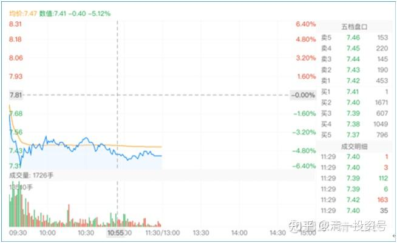
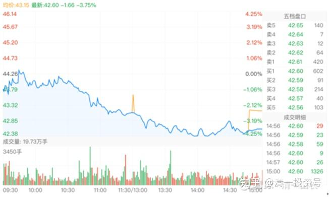
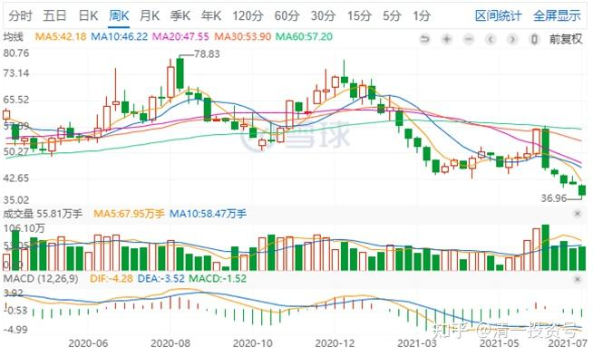

29篇.2021年评顺鑫

清一山长2021年

**一、逆势中苦熬**

**[清一山长](http://link.zhihu.com/?target=https%3A//xueqiu.com/9310099567)** [2021-01-11 11:53·](http://link.zhihu.com/?target=https%3A//xueqiu.com/9310099567/168309821)：

[$燕京啤酒(SZ000729)$](http://link.zhihu.com/?target=http%3A//xueqiu.com/S/SZ000729)权益变动报告书显示，2018年1月11日，裘国根的重阳集团买入1348万股燕京啤酒股票，买入均价7.285元。重阳投资及其一致行动人合计持有燕京啤酒股票占比达到5%。）今天的燕京，最低价7.31元。

真佩服重阳：拿了三年燕京，赚了每股0.12元。我想问裘总：您的资金利息，够不够支付的？

燕京到底在玩什么？我们真不知道。在燕京啤酒销量、利润都取得正增长的时候，股价却与【3年前燕京根本没有啥好出路，一片茫然的时候】相比是一样的。您觉得正常吗？

也许，燕京真的会破五？我不知道，但我决定坚守！我不亏谁亏？你们走吧！我负责善后，只要你们安全就好[加油][加油][大笑]。

[@51nxp](http://link.zhihu.com/?target=http%3A//xueqiu.com/n/51nxp):回复[@清一山长](http://link.zhihu.com/?target=http%3A//xueqiu.com/n/%25E6%25B8%2585%25E4%25B8%2580%25E5%25B1%25B1%25E9%2595%25BF)：很多人会非常在乎每一天的账户市值，这个毛病有，你就做不好投资。你要真正的看清企业的经营前景，和它共同成长才能够赚到属于你认知能力的钱，这个模式才能复制。

**虽然山长更偏向于资产的保值，我更偏向于进攻，但是我觉得山长的投资是很靠谱的。燕京啤酒在消费股中，绝对低估。**

**[清一山长](http://link.zhihu.com/?target=https%3A//xueqiu.com/9310099567)** [2021-1-11 12:56](http://link.zhihu.com/?target=https%3A//xueqiu.com/9310099567/168316757)回复[@51nxp](http://link.zhihu.com/?target=http%3A//xueqiu.com/n/51nxp):

我们都是善于逆势中苦熬的人[献花花]。

顺鑫农业，当年你也一样苦苦守候，面对的是种种的不可思议的低价，打压，以及种种坏消息满天飞。你就守住一条——就是坚持不动：牛栏山的每年销量，都在上升中。作为中国销量第一的酒股，不应该是19元这个价格！

**最终，坚持的赢了。但很多人，有些人坚持了一两年，都受不了庄家的磨叽，最后跑掉了。**我记得，你当时还只有这一只股死拿！别的股都不看[笑]。

啤酒，是我顺鑫创酒股大赚记录后转战的品种。现在看来，不如坚守白酒（比如当时去买入价格与顺鑫差不多的泸州老窖和五粮液更有价值）。但世界上没有后悔药。燕京依然不涨，就只能依然守候了。幸亏惠泉、珠江，都赚了不少。

**但目前，燕京是最有潜力的。**

2019年，燕京啤酒四季度，销量已经提升了31%，明显走出了低谷。

2020二季度、三季度的销量提升，也明显提速。四季度应该也在去年大幅提升基数的情况下，2020还有进一步提升的空间。可惜查不到任何消息，可见封锁严密，就跟当年的顺鑫一样，好消息看不见，坏消息满天飞。

2019年，燕京的下属子公司，一南一北两个控股子公司，漓泉和赤峰，分别录得净利润共计4.81亿，同比分别增加25%和47%，连消费旺季很短的赤峰公司净利润率亦超过10%。**仅此两子公司，净利润就超过[重庆啤酒](http://link.zhihu.com/?target=https%3A//xueqiu.com/S/SH600132%3Ffrom%3Dstatus_stock_match)（4.04亿）和[珠江啤酒](http://link.zhihu.com/?target=https%3A//xueqiu.com/S/SZ002461%3Ffrom%3Dstatus_stock_match)（3.66亿）。市值却相差巨大，特别是和重庆啤酒相比。**燕京主品牌，一分钱不要，也不至于是现在这个价格。

所以，我一直说：万一燕京主品牌开始亮点出现了，燕京的困境反转，可能是令人吃惊的局面。我相信啤酒股，会让我获得比顺鑫农业更多的投资利润（不是指股价），珠江啤酒目前已经实现了这个目标。惠泉啤酒，也基本上实现了这个目标。就是燕京的表现还差一点[笑]。

[@51nxp](http://link.zhihu.com/?target=http%3A//xueqiu.com/n/51nxp):回复[@清一山长](http://link.zhihu.com/?target=http%3A//xueqiu.com/n/%25E6%25B8%2585%25E4%25B8%2580%25E5%25B1%25B1%25E9%2595%25BF):

我买信立泰根本就不是看它底部放没放量。跌破30我就开始慢慢加仓，并非全部买在山长发帖的那天。

凭的是常识。深圳的一家创新药企，研发管线布局慢病，而慢病是60岁以上每4个人就会有一个患者，新增的患者人群越来越富有，医保只是保持最基本的治疗需求，疗效好副作用小的创新药会被有条件的患者选用。凯雷33.94的入股价是最基本的锚。

每个人都有自己的选股方式，山长是我尊敬的投资者！

清一山长 [2021-1-26 12:39](http://link.zhihu.com/?target=https%3A//xueqiu.com/9310099567/169938427)回复[@51nxp](http://link.zhihu.com/?target=http%3A//xueqiu.com/n/51nxp):

您也是我很尊敬的投资人[献花花]。

您对自己选择的企业，**很注重基础面，市场情况的研究。**这是很重要的基础。缺了就不行，**光懂技术没用。我其实喜欢两者配合一起选，顺鑫就是这样选出来的**。信立泰没给机会让我看懂它的模式，时间不够。顺鑫给的时间太长了，我才有机会慢慢研究清楚。

**[清一山长](http://link.zhihu.com/?target=https%3A//xueqiu.com/9310099567)** [2021-03-05 14:54](http://link.zhihu.com/?target=https%3A//xueqiu.com/9310099567/173592017)

顺鑫农业的ROE才11.46.，今年三季度更差，5.70%。几乎只是江苏银行的六折。但，别人卖的是酒，当然赚的是真钱。银行赚的大约是假钱[大笑]。

顺鑫农业也是我原来的重仓股，不是来黑它的。我买入的价格，只是现价的三分之一，所以还算过得去。现在的价格，我怎么都买不下手，宁肯买银行、啤酒。**估值低的，拿在手上放心，睡觉安稳，**不担心第二天起床一看就爆仓了。

[还是种地踏实](http://link.zhihu.com/?target=http%3A//xueqiu.com/n/%25E8%25BF%2598%25E6%2598%25AF%25E7%25A7%258D%25E5%259C%25B0%25E8%25B8%258F%25E5%25AE%259E):回复[@清一山长](http://link.zhihu.com/?target=http%3A//xueqiu.com/n/%25E6%25B8%2585%25E4%25B8%2580%25E5%25B1%25B1%25E9%2595%25BF)：

山长兄不愧是山长兄，股市最美逆行者。佩服归佩服，坦率的说山长兄这个本事别人是学不来的，至少我做不到，主要是北京控股坑怕了。燕京我每天喝两罐，清淡爽口，酒是好酒，但股票一直没敢买，最后祝山长兄大赚！

[清一山长](http://link.zhihu.com/?target=https%3A//xueqiu.com/9310099567) [2021-05-18 19:41·](http://link.zhihu.com/?target=https%3A//xueqiu.com/9310099567/180190984)回复[@还是种地踏实](http://link.zhihu.com/?target=http%3A//xueqiu.com/n/%25E8%25BF%2598%25E6%2598%25AF%25E7%25A7%258D%25E5%259C%25B0%25E8%25B8%258F%25E5%25AE%259E):

北京控股，是在还2013年之前欠的债务。股价从区区从3元多，年年涨不停，一路上涨到66元左右，多少机构都赚饱了。最近这些年，年年下跌。也不奇怪的。不过，我认为应该快到极限了。你们这些铁粉都撑不住了，它就快反转了。也许燕京啤酒涨了，我会换一点去买北京控股的 [大笑] 。

北京股，似乎有个特点——要么死不涨，要么死涨不停。就是不正常，涨跌都让你掉下巴。顺鑫农业，我拿它两年也会被折磨死，最终赚了酒股第一盈利王。所以——对北京的股票，也别太悲观，需要唐建华一样的死守精神。

**二、低位缩量和高位放量**

[清一山长](http://link.zhihu.com/?target=https%3A//xueqiu.com/9310099567) [2021-06-21 15:18](http://link.zhihu.com/?target=https%3A//xueqiu.com/9310099567/186543370)

[$顺鑫农业(SZ000860)$](http://link.zhihu.com/?target=http%3A//xueqiu.com/S/SZ000860)走势好奇异，**典型的破位下跌。今天居然还放量**，这段时间的下跌，量放大不少。顺鑫出了什么幺蛾子吗？下跌以来，有两天都是8%的下跌。成交量都过了十几亿，这对一只才300多亿总市值的股来说，这种成交算是很大了。

月初从50元的平台整体，推高到58元，吸引跟风盘，最终却没有真正的上涨，反而迎来了破位下跌。看样子是主力为了出货，故意造成的假推高。所以在回调过程中，吸引了大量的跟风盘进入，并牢牢地套住他们了。从这种手法来说，很容易观察到右侧交易者的危险系数很高，左侧安全一些。当然，这几天的下跌，都是坑愚蠢的左侧交易者的。左侧必须有很强的原则，没有原则的人，也很容易被坑。从主力嘴里抢饭吃，你没点本事就是送羊入虎口。

今天这种走势，很不寻常。正常情况下，这个价格我会开始买入了，特别是现在我的账上有8位数的现金，更容易蠢蠢欲动。不过，我注意到现在下跌中放量？我从来不喜欢在量大的时候做买入行动，高位低位都不愿意。**我一般会等低位缩量的时候再买入，高位放量，是提醒我卖出的信号。**

**计划：现金不动用，继续观察。**顺鑫毕竟是我酒股第一只超过千万盈利的股。如有机会，我可以再次的加入，买入一千万元的股，依然是负成本。但我现在的持仓，只有几手，是原来故意保留的非卖品。其他酒股盈利状况良好，抽一点利润出来买买老相好，是可以考虑的。**但必须等出现让我安心的信号才行。**

[*男人的逆袭](http://link.zhihu.com/?target=https%3A//xueqiu.com/4063532658)：

目测这一轮行情，顺鑫农业起码要创新高，过79，能不能到100，说不准，79肯定能过。

清一山长 [2021-06-21 15:42](http://link.zhihu.com/?target=https%3A//xueqiu.com/9310099567/186543370)

（评论上贴【*男人的逆袭】）

我看雪球推荐的顺鑫农业发言最多的人，原来都是短线客们[大笑]

这帖子在最高价格的这天（57-58元），乐观估计要过新高，甚至高看100元。号称79元肯定能过，我估计58元前后追涨的人，都是这样想的吧？

不过贴主算是聪明人，五天后（注：2021-06-10）就认错跑了，不再期待79元。第二天大跌8%（注：2021-06-11）左右，逃过一劫。所以——说错了，就算了，不嘴硬，不坚持错误，比元味男强多了。

当然，到底谁更赚钱还不知道。我没有发现脚底抹油的人赚得多。当年我顺鑫赚钱，是坐了两年的冷板凳的。

[@水上尚善](http://link.zhihu.com/?target=http%3A//xueqiu.com/n/%25E6%25B0%25B4%25E4%25B8%258A%25E5%25B0%259A%25E5%2596%2584):回复[@清一山长](http://link.zhihu.com/?target=http%3A//xueqiu.com/n/%25E6%25B8%2585%25E4%25B8%2580%25E5%25B1%25B1%25E9%2595%25BF):

国内猪肉价格从每斤30元跌到10元了，市场上的猪肉股都跌跌不休，顺鑫可能也就是被市场拖下水了吧！猪肉下跌，鱼类产品却不降反升。

[清一山长](http://link.zhihu.com/?target=https%3A//xueqiu.com/9310099567) 回复[@水上尚善](http://link.zhihu.com/?target=http%3A//xueqiu.com/n/%25E6%25B0%25B4%25E4%25B8%258A%25E5%25B0%259A%25E5%2596%2584):

据我所知：顺鑫农业是猪肉加工企业，不是养猪的。所以生猪价格大涨，好处跟它没关系。但大跌，似乎也不会受到什么实质性的影响。如果真是猪周期的影响，倒是一个好的买入点。当年我19元大量买入，就是因为它的养猪业和房地产很差，导致被市场抛弃。相对其他酒股更低而买入的。

可惜我不知道现在到底怎样了，继续跌下去的话，可以考虑买入。但我认为不太可能跌回原地吧？[大笑]再怎么说，别人家里有酒。

**三、反弹出逃的走势图**

[清一山长](http://link.zhihu.com/?target=https%3A//xueqiu.com/9310099567) [2021-7-06 16:41](http://link.zhihu.com/?target=https%3A//xueqiu.com/9310099567/189549515)

[$顺鑫农业(SZ000860)$](http://link.zhihu.com/?target=http%3A//xueqiu.com/S/SZ000860)以下是周线图。**跟最高峰相比，已经腰斩了，一峰更比一峰低。走势不吉祥。**6月份从45元左右拉升到58元，现在来看是一次主力长期下跌的反弹出逃行为，一直到现在跌势未止，不明白顺鑫出了啥问题。

价格上已经进入我可以接受重新买回的区域。**但K线上，还未出现收敛迹象，不够让我安心。**因此基于资金绝对安全的考虑，将继续观望中。错过就算了，反正手上有很多底部的股票。

今天开始首次买如一只新股（我没买过的股），现在的价格，还停留在2013-2014年大牛市启动的低位。但这只股2015年就涨了四倍。会不会以后有奇迹出现？我不知道。我只知道：这只股的现在，比2013年的它更有价值，更低估。所以就买进了，今天第一次实仓，只买了8万股。这股与顺鑫农业相比，安全度就高多了，我拿到手上不怕跌。顺鑫，说实话拿它的时候，心情很压抑的过了两年（很多不确定的因素，猪，以及地产，**靠二锅头的销量数字，以及它才十几元，远远低于茅台、五粮液、泸州老窖的涨幅，勉强坚持下来**。今天买入的这只新股，就不需要我坚持，拿股息都可以美美的睡觉了[俏皮]。未来价格好，就继续买入。（一只小股，就不分享了）。

**四、谁能笑到最后**

[清一山长](http://link.zhihu.com/?target=https%3A//xueqiu.com/9310099567)[2021-07-12 09:55](http://link.zhihu.com/?target=https%3A//xueqiu.com/9310099567/190104193)

[$顺鑫农业(SZ000860)$](http://link.zhihu.com/?target=http%3A//xueqiu.com/S/SZ000860)用37元出头的价格，买了200股顺鑫做纪念。因为我有个账户上，居然只剩3股了[滴汗]。证明我当初走得有多彻底，多么的不留念。连一千股也舍不得留下来。泸州老窖、五粮液、酒鬼酒，都有上千股留下来不动的。

上一个K线图（周线）——

第一波最高收盘价75元，时间，2020年8月。然后陷入12周的调整，最低点周收盘54元，调整空间20元；

接下来开启第二轮上涨，第二波的高点，周收盘72元，高点已经低了一点，未破新高。然后是21周的连续调整，见不到反弹，最低点44元，调整空间30元；

第三波上涨，是今年6月，积累了21周的上涨，以及茅台、五粮液、泸州老窖创新高等行业利好，但顺鑫居然只涨到57元就泄了，套住了很多顺鑫的回头客。只比第一波调整的最低点相当。

然后一直下跌调整到今天，37元还未见止跌信号。我友情买入200股，是个意思，毕竟是我目前在白酒上赚钱最多的股。**但我不看好顺鑫，从技术图形上说，我看，未来还有的跌。**但我最忧心的是：会不会以后的白酒，都学顺鑫这样走？然后十年回不了头？白酒的真实销售量，其实是年年下降的。这个赛道，不是股价上展示的这么美好。总不能天天玩提价吧？

也许，**现在，就已经是白酒的秋天了？黄金时刻，也是收获的时刻。但也是冬季来临前最后的狂欢。**谁能笑到最后？

相关文章：山长最近关于顺鑫农业的相关评论，见新作**《12篇.看盘心理学－博弈学的智慧》**，链接[https://zhuanlan.zhihu.com/p/490393601](https://zhuanlan.zhihu.com/p/490393601)

（标题为编者所加）

参考链接：

[清一投资号：29篇.2021年评顺鑫](https://zhuanlan.zhihu.com/p/498221415)（整理文）

[清一投资号：44篇.顺鑫农业记录一：开始关注买入](https://zhuanlan.zhihu.com/p/539035593)（整理文）

[清一投资号：46篇.顺鑫农业记录二：最多输时间不输钱](https://zhuanlan.zhihu.com/p/539203562)（整理文）

[清一投资号：49篇.顺鑫农业记录三：买、卖、拿住股票的理由](https://zhuanlan.zhihu.com/p/543704521)（整理文）

[清一投资号：51篇.顺鑫农业记录四：主力还没有开始减仓](https://zhuanlan.zhihu.com/p/544147559)（整理文）

[清一投资号：53篇.顺鑫农业记录五：中国炒股最重要的技术是保本](https://zhuanlan.zhihu.com/p/544149372)（整理文）

[清一投资号：58篇.顺鑫农业记录六：最靠谱的投资方法就是不炒股](https://zhuanlan.zhihu.com/p/545612289)（整理文）

[清一投资号：61篇.顺鑫农业记录七——机构坐庄三招：养、套、杀](https://zhuanlan.zhihu.com/p/556331421)（整理文）

[清一投资号：65篇.顺鑫农业记录八：基本面的估值修复和主力技术面的空间](https://zhuanlan.zhihu.com/p/560419930)（整理文）

