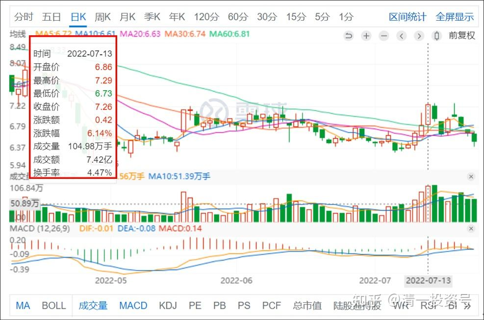
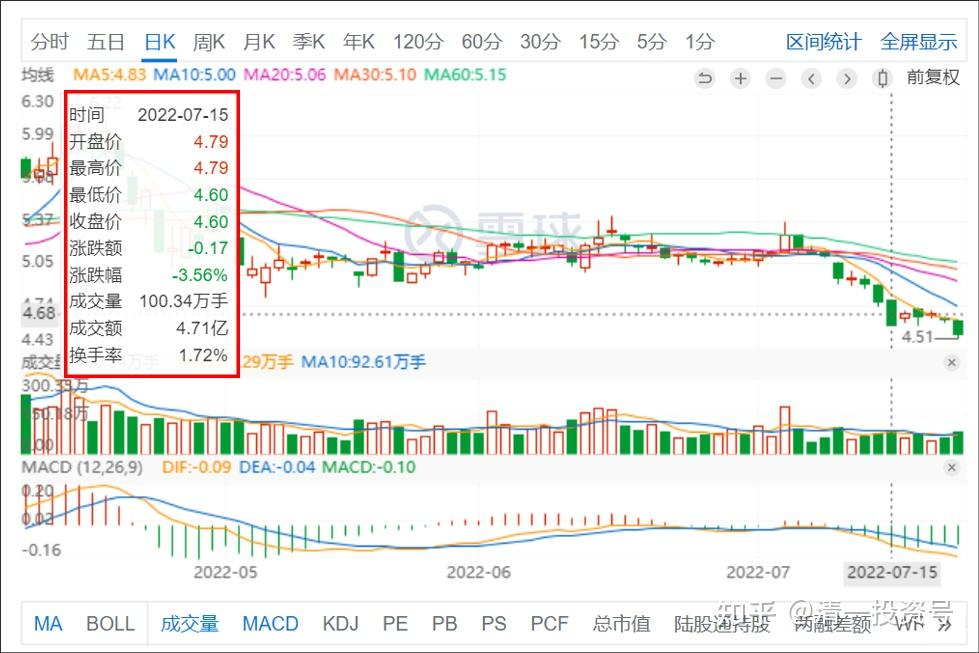

29篇.华菱钢铁是不是可以补仓了

清一山长 2022年7月13日

**

*天山铝业*

**

山长 清一2022/7/13 20:22:56

刚看到天山铝业起涨了。上次涨停没有卖，又跌回原地，6元多我又买了不少。中建的几百万股息分红的资金，都全拿来买它了。当时觉得它股价最低。没想到现在突然涨了。据说傍上了【新能源电池】概念股，不再跟铝股一样低迷。我在想：如果明天涨停，要不要卖掉一些？[滴汗]。我当初买天山，没有想过它的题材问题，就是很本分的想，它的估值已经很低了，难得。而且未来铝能源消耗的情况，对它是有利的。因为成本控制会比其他的电解铝厂要好，低位进入，长期持有也不怕。真没想到现在会大涨。

现在，有些有色，居然是15年来的低价位置，这种股票，买了放起来不管，将来可能某个“意外”消息就引爆了。至于不涨大家也不用操心，反正都十几年不涨了，你着急啥呢？现在搞生产的企业，基础原料企业，起码比终端消费品更靠得住，更比印票子的金融行业靠得住。这就是持有的逻辑。

**天山原来是价值买入，现在就是要考虑“投机卖出”，见好就收了，**洛阳钼业上涨两次，我都是见好就收，现在跌回原地，可以继续买回来。市场给的钱我要（投机盈利），长期持有价值股的好处我也要（价值投资）。双管齐下，有可能比单独死守一只股更好，我的中国经验，不符合巴菲特的逻辑，因此，我这种人也买不到比亚迪。虽然动过心，就缺点什么没动手。因此，我不是巴菲特，赚不到巴菲特的钱[大笑]

*华菱钢铁*

**霞2022/7/15 14:27:09

山长好！华菱钢铁是不是可以补仓了？谢谢

**军2022/7/15 17:58:54

我替山长回答吧。

“如果你们问了，那就不补。”

这里不是股票交流群，山长不是“托”，更不是“投资顾问”。

山长 清一2022/7/15 19:09:34

@**军，谢谢你替我回答。我买华菱赚了没有走，现在也套住了。但我有钱会继续买。因为，我说了拿分红也没问题的。**这家企业的管理很好，市值跟宝钢差很大，但利润却差不多，排行业第二了。这种企业，就是值得拥有的企业，涨涨跌跌，是外向。**你持有的股份一股未少。

天天因为价格涨跌而问我进进出出的人，我认为有点毛病。你看懂了，想买想卖，就做。赚了是本事，亏了是本分。我高位卖了还有更高，我亏了问谁去？因此，**我的操作示范，是分享给你们看我的投资逻辑和思维。**不是让我的带头大哥，一起冲。**人人都要学会自我负责。**一起买的，就一起亏。我买入，告诉你信息，不是让你买，而是告诉你我买了。跌了算我学艺不精，涨了算我运气好。我贴心的示范，无非是：**跌了我如果亏本卖出，我告诉你一声，有来有去；涨了我赚钱走了，也告诉你一声，有来有去。这就是君子。**天天操心你涨了跌了，涨了出来邀功，让你们发红包；跌了就到处哄人，说好听的话，这是啥人才干的？只有骗子才干这事情。

