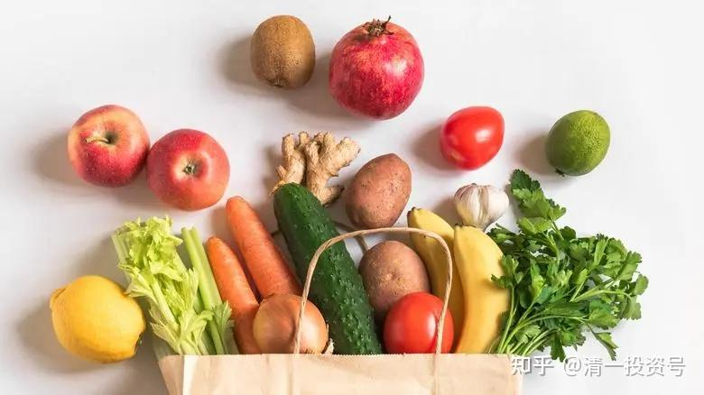

29篇.食物还是毒物

清一山长 2021年3月11日

清一山长雪球非专栏帖子整理文章，第30篇《食物还是毒物》

此文整理自山长专栏文章《为何东亚文化圈为以白为美？以胖为福？以懒为贵？以无能为尊？》[https://xueqiu.com/9310099567/173913840](http://link.zhihu.com/?target=https%3A//xueqiu.com/9310099567/173913840)

慧静666[2021-3-11 09:21](http://link.zhihu.com/?target=https%3A//xueqiu.com/9310099567/174106641)回复清一山长：

在吃的方面，对于儿子我肯定是后妈，但可能因为我引导不到位，现在青春期，反而让他对餐馆吃饭、吃垃圾食品、喝奶茶有种执念。

[清一山长](http://link.zhihu.com/?target=https%3A//xueqiu.com/9310099567)回复[慧静666](http://link.zhihu.com/?target=http%3A//xueqiu.com/n/%25E6%2585%25A7%25E9%259D%2599666)

**吃什么不能禁止，内心会反抗的。越禁止什么，越渴望什么，长大了肯定要反抗。要让身体去体验后果，才是真实的。**我儿子小时候喜欢吃麦当劳（其实是喜欢玩具），每次我都带他去，买儿童套餐给他，逼他吃完才能玩玩具。看他每次吃得难受。我还不断笑话他傻，好东西不吃，吃这些垃圾。他不吭气，吃完了就玩玩具。大了，自动不肯去了。

吃饼干，我一次买个够。不能吃饭，吃饼干，吃三天，再也不吃了。冰淇淋、巧克力，全这样玩。我的观点是，要吃，就吃个够，单一食物，充分体验。结果——这些东西以后孩子看见就恶心。

**垃圾食品，只有吃到一定的量，身体才会给出信号。身体越是垃圾，需要吃的量越大。从小身体好的孩子，往往吃几口就会吐，因为身体特别敏感**。我小女儿，吃几口肉就会呕吐，她的身体最干净。我老坑她吃垃圾食品，都是很快就有反应。心里想吃，但身体不能吃。

[自愈子](http://link.zhihu.com/?target=http%3A//xueqiu.com/n/%25E8%2587%25AA%25E6%2584%2588%25E5%25AD%2590)[2021-3-11 22:52](http://link.zhihu.com/?target=https%3A//xueqiu.com/9310099567/174196200):回复[清一山长](http://link.zhihu.com/?target=http%3A//xueqiu.com/n/%25E6%25B8%2585%25E4%25B8%2580%25E5%25B1%25B1%25E9%2595%25BF):

我从小不让孩子吃肉和工业食品，反复灌输垃圾食品的概念。现在10周岁，放开了，想吃就吃，结果自动不吃，去外婆家过年，外婆自己养的猪没吃饲料和药，我鼓励她吃，结果一口都不吃，有次吃辣条，马上拉肚子。身体不让吃，想吃也没办法！

[清一山长](http://link.zhihu.com/?target=http%3A//xueqiu.com/n/%25E6%25B8%2585%25E4%25B8%2580%25E5%25B1%25B1%25E9%2595%25BF)回复[自愈子](http://link.zhihu.com/?target=http%3A//xueqiu.com/n/%25E8%2587%25AA%25E6%2584%2588%25E5%25AD%2590)：

**小时候的习惯养成很重要，小时候错了，将来要花很大的力气才能纠正过来**。

[清一山长](http://link.zhihu.com/?target=https%3A//xueqiu.com/9310099567)[20212-04-21 14:39](http://link.zhihu.com/?target=https%3A//xueqiu.com/9310099567/177758011)[$康得退(SZ002450)$](http://link.zhihu.com/?target=http%3A//xueqiu.com/S/SZ002450)

这一只神话般的股票，财务造假，创造了千亿市值，现在面临退市。有多少小股民，栽倒在他手下。老板幕后交易，不知道弄走了小民多少钱。

怎样才能看懂上市公司的财务造假？别管谁跟你说啥，我承认我一个小股民，看不懂、看不出谁在财务造假。我一个人，要跟专业财务公司去拼财务报表的实力？我傻了吧？

我只有一招，远离这种骗子公司。保障100%有效。就是：只要你涨了，大涨，我就是不买。没错，我会错过腾讯，错过茅台这样的股票，但我也错过了康得新！乐视等等一大票“好东西”。后者要比腾讯、茅台更多。别以为自己错过了的，都是好股。

我就是低价才买，我看你怎么骗我。现在买[中国建筑](http://link.zhihu.com/?target=https%3A//xueqiu.com/S/SH601668%3Ffrom%3Dstatus_stock_match)，五年都没有涨，我看你怎么挖个大坑让我跳下去？

别人说：**转基因的食品、反季节的食品、垃圾食品如何防范？**我承认有这技术太难。我**就认一条死理：贵的我就不要。我只买当季的，最普通的东西。高价菜、稀奇货色，我都不买**。这种价格，农民连啥添加剂都舍不得加的。

在中国，还有一条可以参考：**民营企业，除非你很了解老板，否则别碰。国企有吃人的，但吃了会吐一点骨头。民企吃人，骨头都不吐的。**国企敢像康得新一样忽悠人，早早的就被抓起来了。你看[燕京啤酒](http://link.zhihu.com/?target=https%3A//xueqiu.com/S/SZ000729%3Ffrom%3Dstatus_stock_match)，抓了董事长。难道会等他把公司都卖掉了，骗光了股民才动手吗？只要有点动静，就有人来下手监管了。

**所以，如果有“恶龙”来守护您的资产，安全度就大得多。我现在越来越关注是不是国企了。**

**房地产，我就喜欢中海系。中国海外宏洋，我走了，又进来了。为啥？拿着放心！**

将来康得新一样的地产公司，不知道会出多少。大家小心。[泰禾集团](http://link.zhihu.com/?target=https%3A//xueqiu.com/S/SZ000732%3Ffrom%3Dstatus_stock_match)不是就出事了吗？从20多元跌到现在的2元多，当年一堆大V死吹的“好股”，吹它的地产生意模式多好，万科都赶不上。我看是杀猪股！

**自己不懂的，别装懂。这样起码不会死。不懂装懂，死的最快！**

f="[https://xueqiu.com/3854208873](http://link.zhihu.com/?target=https%3A//xueqiu.com/3854208873)">万物周期回复清一山长:

我记得你以前买过融创哦！

[清一山长](http://link.zhihu.com/?target=https%3A//xueqiu.com/9310099567)2021-04-21 14:50回复万物周期：

我重仓过恒大，也的确也买过融创，这是我很成功的记录。5元买入，37元清仓。这又不是啥失败的记录。

这是民企没错，买的时候很纠结，不敢放手大仓进入。买中国建筑，就敢大仓——可惜不赚钱。但我就是不走。不赚钱就不离开！(其实中国建筑是我A股最赚钱的股，只是现在啤酒很快就要超过它了）。我是交易者，赚了就跑了。去年买的这部分还没咋赚（几毛钱，算是财务成本，不算赚的）。

[清一山长](http://link.zhihu.com/?target=https%3A//xueqiu.com/9310099567)2021-04-21 15:06

买融创中国的故事，分享一下：

当年在纠结，买融创中国，还是绿城中国！当时绿城，还是宋卫平的绿城。这两个股，原来价格差不多，10元上下。但后来两人闹翻了。绿城，价格还是10元上下。融创的价格，跌倒了5元。我看了半天融绿之争，我认为孙更够意思，够朋友。宋不够朋友，出尔反尔。所以，我就选了融创。结果赚了很多。还在30多元冲40元的时候，在某小兵大谈大吹他的融创要过8848高峰的时候，我说了几句公道话：涨快十倍了，大V出来说这种令人窒息的伟大梦想，可能会害死人的；就算能达到，也不知道什么时候了，中间有啥过程都难说。结果，就被他拉黑了。其实，小兵啥时候进的融创我不知道，很多人说他10元后才进的。我相信5元进的大V真没几个。当时根本没人看好融创。但我一直不鼓吹融创，就是因为我也拿不准这种民企，到底有多大的可信度，不敢拿全部身家去赌。只买了几十万股。不像恒大3元的时候，我还买了300万股。当然，也赚了不少。但真不敢忽悠粉丝去追买的，良心过不去。

不过，我卖出融创中国之后，绿城垮了。所以，后来这笔钱，我就买了绿城。9元开买，7元前后进了不少（最低也到了5元）。这时候，是中交的绿城了。虽然没有中海的绿城好，不过也过得去吧！现在绿城的融资利率已经降到了4.99%，我很满意了。万一地产完蛋，别人要先死，绿城一定后死！所以，融创换绿城，我也不纠结！现在拿融创，我还是不敢拿！

[亲自接盘](http://link.zhihu.com/?target=http%3A//xueqiu.com/n/%25E4%25BA%25B2%25E8%2587%25AA%25E6%258E%25A5%25E7%259B%2598)回复[清一山长](http://link.zhihu.com/?target=http%3A//xueqiu.com/n/%25E6%25B8%2585%25E4%25B8%2580%25E5%25B1%25B1%25E9%2595%25BF):

我老家那里农民种菜最舍得用农药了，这个吃的不能这么选。

[清一山长](http://link.zhihu.com/?target=https%3A//xueqiu.com/9310099567)[2021-04-21 15:14](http://link.zhihu.com/?target=https%3A//xueqiu.com/9310099567/177762729)回复[亲自接盘](http://link.zhihu.com/?target=http%3A//xueqiu.com/n/%25E4%25BA%25B2%25E8%2587%25AA%25E6%258E%25A5%25E7%259B%2598)：

我知道您说的这种情况。我们国内学校的旁边，就是一个大棚，大量出产蔬菜，每天看到大量的农药使用。我们太知道你们餐桌上的东西是咋来的了，不管是肉食，还是素食，往往都是毒死人的东西。

**我的饮食研究结果，就是不吃叶子菜。吃得越多，身体越差。**很多事实，已经证明了这一点。

**我更喜欢吃土豆、红薯、山药、番茄、黄瓜、玉米、红豆汤等果实类，根茎类食物当菜。**这种东西，打药都不知道咋打的。而且营养价值最好。

我还教小女：用泰国的米粉当菜，用来下饭！

好处是：菜钱很低。比你们买叶子菜价格低多了，还不中毒！

[燕子007](http://link.zhihu.com/?target=http%3A//xueqiu.com/n/%25E7%2587%2595%25E5%25AD%2590007)回复[清一山长](http://link.zhihu.com/?target=http%3A//xueqiu.com/n/%25E6%25B8%2585%25E4%25B8%2580%25E5%25B1%25B1%25E9%2595%25BF)：

没有想不到，只有做不到，现在都不知道吃什么好，饮食的确是个大问题。据亲眼所见和农民亲戚所述，**土豆也打膨大剂，黄瓜也用针打什么东西，番茄打催红素**等等。

[清一山长](http://link.zhihu.com/?target=https%3A//xueqiu.com/9310099567)[2021-04-21 15:39](http://link.zhihu.com/?target=https%3A//xueqiu.com/9310099567/177766134)回复[燕子007](http://link.zhihu.com/?target=http%3A//xueqiu.com/n/%25E7%2587%2595%25E5%25AD%2590007)：

“黄瓜也用针打什么东西，番茄打催红素”

真恐怖。我认为是你们给农民的价格太高了，才会这样的。

更说明：我必须逃离中国，不然毒也被你们毒死了。估计到英美也一样。

我在泰国买的黄瓜，50泰铢十公斤。几天前买的一袋五公斤的，红红的番茄，总共才30泰铢。我用来打番茄汁饮料的，很好喝。我认为：农民绝对不舍得放添加剂进去的。因为太划不来了。材料，加人工都划不来的。而且，泰国人没有中国人“勤奋”，很懒！更不善于动这种脑子。

不过，如果番茄可以卖到30泰铢一市斤，我觉得农民还是有打添加剂的积极性的。

球友甲2021-04-21 15:42[清一山长](http://link.zhihu.com/?target=https%3A//xueqiu.com/9310099567)：

黄瓜用针打药也能想的出来，你简单的想人工不用花钱？还用针打？打不坏啊？

[Relax1216](http://link.zhihu.com/?target=http%3A//xueqiu.com/n/Relax1216):回复球友甲:

也就你这样的不谙世事，黄瓜有种药，喷了以后黄瓜笔直！否则哪里会有那么笔直的黄瓜？还有西红柿你吃过沙心的没有？小时候全是。现在的西红柿放三个月都不会坏的。

[清一山长](http://link.zhihu.com/?target=https%3A//xueqiu.com/9310099567)[2021-04-21 16:44](http://link.zhihu.com/?target=https%3A//xueqiu.com/9310099567/177773908)回复[Relax1216](http://link.zhihu.com/?target=http%3A//xueqiu.com/n/Relax1216):

“黄瓜有种药，喷了以后黄瓜笔直！否则哪里会有那么笔直的黄瓜？”

还有这种药？怪不得我见到有两种黄瓜，一种贵，一种便宜，差几倍的价格。

分享一下经验，我在泰国，一样的黄瓜品种。但有些黄瓜，特别漂亮，很嫩绿的样子，而且整整齐齐的，笔直的。装在漂亮的袋子里面，卖价比普通黄瓜贵三倍到五倍。

我根据常识，推断这种黄瓜不正常。普通的黄瓜，我小时候还种过的，是弯曲的。而且皮不嫩，有点老，有些不均匀的色斑，看起来不太好看。但吃起来，里面甜甜的。上面这种直直的黄瓜，是没啥味道的，就是好看而已。

我常买的，就是泰国的普通黄瓜，跟我小时候吃的一样。吃起来也有甜味，而且很便宜的价格。我推测贵几倍的，好看的黄瓜，是大棚菜。专门供应宾馆、超市的。因为超市里面的黄瓜，就没有我见到的便宜土黄瓜，都是贵的，好看的黄瓜，但不好吃，没有甜味。

刚来泰国的时候，没找到农贸市场，只在大超市买东西，觉得东西好贵。一颗白菜，居然卖60泰铢，感觉甚至比中国还贵，而且看超市里面的东西，都是大棚菜的感觉，好看，不中吃的东西。

后来才找到了真正的农贸市场，一大袋白菜，十公斤，才60～80泰铢。最贵的时候120泰铢。差距好大。**中间商，拿走了最多的利润，还给你最毒的品种**。所以，**生活在大城市，好可怜！根本就没有选择的机会。**

参考链接：

[清一投资号：第1篇.身体健康的三个因素：心态、运动、食物](https://zhuanlan.zhihu.com/p/513184686)（整理文）

[清一投资号：第3篇.素食与肉食，养生与医疗，古人与今人](https://zhuanlan.zhihu.com/p/518352472)（整理文）

[山长 清一：日本武士的传统食物是什么？](https://zhuanlan.zhihu.com/p/510535004)（知乎专栏文）

[122篇 为何东亚文化圈为以白为美？以胖为福？以懒为贵？以无能为尊？](http://link.zhihu.com/?target=https%3A//www.ximalaya.com/sound/485885449)（音频）

[清一投资号：83篇.为何东亚文化圈为以白为美？以胖为福？以懒为贵？以无能为尊？](https://zhuanlan.zhihu.com/p/563607298)

[清一投资号：33篇.家长为啥每天都要给孩子吃](https://zhuanlan.zhihu.com/p/543096364)
