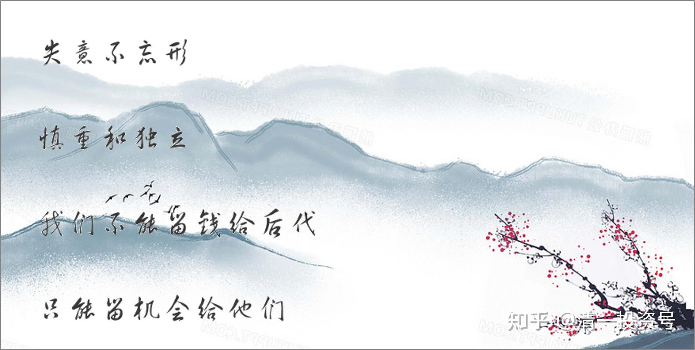

原24篇.赚多少钱才够？钱用来做什么？

清一山长 2021年 4月28日

清一山长雪球非专栏帖子整理文章，第24篇《赚多少钱才够？钱用来做什么？》

**[51nxp](http://link.zhihu.com/?target=https%3A//xueqiu.com/9203843585)** [发布于04-28 12:18](http://link.zhihu.com/?target=https%3A//xueqiu.com/9203843585/178459831)

[$上海机场(SH600009)$](http://link.zhihu.com/?target=http%3A//xueqiu.com/S/SH600009) 至暗时刻，一直坚守。不用融资，分散持仓。今天，机场的浮亏已经创下我26年投资史上最大单笔亏损，论坛上杀逻辑杀估值鼓噪阵阵，内心肯定不舒服，想起去年底自己的选择——从医药股分仓一半买入因疫情影响还在底部的我认为最硬的资产，也就是[上海机场](http://link.zhihu.com/?target=https%3A//xueqiu.com/S/SH600009%3Ffrom%3Dstatus_stock_match)，4个月过去，命运给我开了个玩笑。

投资路上，总有一个你性格中的bug等着你！去年底，我的持仓萎靡不振，抱团股风起云涌，回想当时的我，失去了自2019年长持老窖后的云淡风轻心态，急着寻找股价在相对底部的基金报团股，机场就重回我的观察仓，开始只在73元买了1万股，很快涨到77，元旦节后我急吼吼地大规模建仓，除了[信立泰](http://link.zhihu.com/?target=https%3A//xueqiu.com/S/SZ002294%3Ffrom%3Dstatus_stock_match)，几乎所有的仓位都买进机场。

其实我当时也觉得有点反常，论坛里热帖都是张坤买入[上海机场](http://link.zhihu.com/?target=https%3A//xueqiu.com/S/SH600009%3Ffrom%3Dstatus_stock_match)的逻辑，股价走势却是没有蓝筹股的风范，元月14日涨5个多点，15日大跌5个多点，阴跌到70+，几个交易日拉到81，另外我和一个发帖重仓机场并截屏的球友私聊，他根本没有搭理我，然而这些都被我忽视，满脑子就是疫情过去，机场比老窖的逻辑还要硬——喝酒还可以选茅台、[五粮液](http://link.zhihu.com/?target=https%3A//xueqiu.com/S/SZ000858%3Ffrom%3Dstatus_stock_match)，机场是只要出国都得去。

机场目前亏损百分之32，[信立泰](http://link.zhihu.com/?target=https%3A//xueqiu.com/S/SZ002294%3Ffrom%3Dstatus_stock_match)的盈利今天都不能完全覆盖这笔亏损了，最近印度疫情让机场的前景更加黑暗，世界末日一样，疫情让无数人的生命都不能得到保障，而我只是承受一些浮亏，这么一想，心情好多了。

疫情越重，离峰点越近，疫情终将反转。现在回看三聚氰胺事件下的伊利，2013年的茅台，2018年的[中兴通讯](http://link.zhihu.com/?target=https%3A//xueqiu.com/S/SZ000063%3Ffrom%3Dstatus_stock_match)，我觉得现时的机场面临的考验比这三个案例都轻。

我说过，买机场就是用市场的盈利去换中国最顶级的铺面，我还说过，我希望自己离开这个世界，我的墓碑上刻着nxp，职业投资者，[上海机场](http://link.zhihu.com/?target=https%3A//xueqiu.com/S/SH600009%3Ffrom%3Dstatus_stock_match)[信立泰](http://link.zhihu.com/?target=https%3A//xueqiu.com/S/SZ002294%3Ffrom%3Dstatus_stock_match)的长期股东。真的，我用余生履行我的诺言。[@微进化ing](http://link.zhihu.com/?target=http%3A//xueqiu.com/n/%25E5%25BE%25AE%25E8%25BF%259B%25E5%258C%2596ing)

[清一山长](http://link.zhihu.com/?target=https%3A//xueqiu.com/9310099567) [2021-04-28 18:27](http://link.zhihu.com/?target=https%3A//xueqiu.com/9310099567/178513812)回复[@51nxp](http://link.zhihu.com/?target=http%3A//xueqiu.com/n/51nxp):

幸亏今天有信立泰托底，您单股32%不算啥的，完全在您的承受范围内。如果您是原来的习惯，单押上海机场，这个32%，就会给您带来巨大压力的。看样子您在70元，前后买了不少。在投资顺鑫农业上认识了您，一路走来，都很成功。也许您太顺了，所以要遭遇一点磨难！

我有个习惯：**凡是涨多了的股，再看好就放掉。**上海机场，就是这种。19年以来的涨幅，跟业绩的匹配度是跟不上的，我总会想：如果最终我不能靠市场的估值吃饭，我持有的企业，能给我的回报我能不能接受？万一没人要我股票咋办？**所以，我的确放走了很多牛股，但也避过了更多大坑！**小坑倒是不少，赌一下玩玩。**大的投资，一定要有厚重的逻辑支持才敢买！最基本的，底层的支撑逻辑，就是股息支撑。**

上海机场，其实就算免税这一块丢了，也不用太担忧的，她还是有其他支撑的。中国第一机场，这个业务平台维持下去，这家公司就垮不了，就会慢慢的增长。现在的麻烦，就是他的最基本的业务：机场业务，特别是国际机场业务，受到疫情巨大的冲击！所以需要时间恢复。而且恢复的时间非常不确定——变异的病毒，把免疫这一招给破了（其实感冒根本防范不了的原因，就是不断的变异，新冠就是大感冒吧？）。

医疗机构原来就是：要防范疫情常态化。我不知道原来如何防范，只知道各国都寄希望于免疫针。但我猜测：很多原来持有的机构，未必会愿意坚持上机，赌这种不确定性。进入早一点的机构，他们现价依然是获利的（这是上机最不确定的因素）。这才导致现在大幅的下跌，叠加放量的效应。

如果您不在意时间成本，倒是可以坚持熬下去的，说不定机构重新报团；就算不抱团，我相信总有一天，机场也会恢复到您的成本以上的。如果您在意，恐怕需要选未来三五年更有确定性的品种了。

祝福您安康如意，投资开心，不要因为一两次的投资失误而难过。我的华融亏死了，比您的32%亏损要高得多，我也只好由她去。幸亏不是满仓，只是相对轻仓。单押华融，可能就完蛋了。

**感恩中国市场给我们的一切，毕竟都是抢来的钱，还一点回去也应该。**

//[@51nxp](http://link.zhihu.com/?target=http%3A//xueqiu.com/n/51nxp):回复[@清一山长](http://link.zhihu.com/?target=http%3A//xueqiu.com/n/%25E6%25B8%2585%25E4%25B8%2580%25E5%25B1%25B1%25E9%2595%25BF):

谢谢山长。我们在人生的旅途中，活着活着会成为一个孤岛，感恩雪球，让我多了很多朋友，大多是热爱投资，并且有一定的估值能力的人。

2018年6月，当时我买健康元，从10.9（除权价9.5）跌到9.6，在我非常迷茫的时刻，您发的那个帖带给我的开心至今难忘。

我发这个帖，本想评论那个程序员，看着他惨兮兮的，想着和当初您一样，说说自己的坚持。

昨天下午看隔壁单元加装电梯，造价50万，土建23万，承包工程的到完工才拿到17万，真的可怜，我是目睹了他们在高高的架管上作业了几个月的，他们5个江西宜春的农民工每个人凑8000元包的这个工程（进场要垫资买些档板，起降机等），赚钱是多么不易呀——**对比他们，上帝对我真是太仁慈了。**

再一次感谢您的回帖。

[清一山长](http://link.zhihu.com/?target=https%3A//xueqiu.com/9310099567) [2021-04-29 08:52 · 来自雪球](http://link.zhihu.com/?target=https%3A//xueqiu.com/9310099567/178569782) 回复[@51nxp](http://link.zhihu.com/?target=http%3A//xueqiu.com/n/51nxp):

谢谢你的回复，你是一个很善良的人。

我在泰国建房子，已经花了两个多亿泰铢的投资来建房子。我每天看到泰国的工人，辛辛苦苦的帮我建房，一个月也就赚一万多泰铢。我每天啥活不干，天天睡觉，账上也要多几万人民币（分红）。所以，我觉得我已经太幸运了。有啥好埋怨的？这几天，股市调整，账面丢了上千万，这根本就算不了什么。**我一股未少，股息照样发。当这样去看问题的时候，就云淡风轻了。账上的增增减减，就不会干扰我们的判断了。**

您也一样：您无非是今年不赚钱罢了。假想时间拨回年初，您相当于一分钱没有少。干嘛要认为浮盈就是自己的？浮亏就应该是别人的？您现在，无非等于回到今年年初，再出发，重新规划您的投资规划，您根本没损失。**这就是佛家的【活在当下】，就是【不忘初心】。**这些都是很有智慧的语言。

下岗程序员也一样:与半年前他拿到房款相比，他不仅没少，还多了20万。但跟他期待的拿了上机，就赚千万相比，有较大心理差距。弄到现在就要死要活的。**这种心态，就是输不起。也是对生命无知的表现。生命不是拿来玩这些数字游戏的。**

所以，昨天看到你要用自己的生命和墓碑，来捍卫你现在投资的两个标的，我觉得你情重了。原来记得您让我鼓励粉丝去买酒鬼酒，当时这酒很低迷，我觉得你真是至情之人，很爱护你身边的一切。做您的孩子一定很幸福。不过，我还是告诉你，我不跟标的谈恋爱，也不愿意推荐人买酒，因为我不认为酒有啥好处，自己也不喝。我想做“独立的投资人”。

**情重的好处，就是能守护好股、好企业。**运气好，可以获得超额的回报。就像一路守护茅台、五粮下来，收获多多。

**独立的好处，就是能够摆脱有色眼镜，更理智地对待企业。**我相信：生命自有其意义。我不是公司的董事长，我们不能，也不需要为公司陪葬的。对企业，我们其实啥也没做。我们的资金，甚至根本就没帮公司做啥（没有进入公司运行的）。除非出钱参加定增，配股，所以别把自己看太重。我自己创建的企业，顶峰时期，我都可以放弃掉。因为我要做别的事情——办学教儿子。

**因为我自己有自己的生命目标，要关心家人、后代，不是仅仅去赚钱。**其实，现在赚钱多少，对我们都没意义了，我们已经圆满地完全任务了。如果现在赚钱就是为了要留给后代，这对他们就是生命的毒药。**我们只能留机会给他们，不能留钱给后代。**所以，钱能做的事情其实很少！我们更要关心用钱来做什么。这就是我现在的想法。**多点钱，少点钱，其实真没啥的。关键是我们的心，通过这多多少少的账户变化，获得了什么样的体验和提升！**

祝福您，好人一生平安！

**[51nxp](http://link.zhihu.com/?target=https%3A//xueqiu.com/9203843585)**2021-04-29 09:55[@清一山长](http://link.zhihu.com/?target=http%3A//xueqiu.com/n/%25E6%25B8%2585%25E4%25B8%2580%25E5%25B1%25B1%25E9%2595%25BF):

山长，您这篇文章可以当作投资者的心经。

我们做投资的，理性和善良是最重要的品格。而我，感性的成份多一些。

**[ellhll李华丽](http://link.zhihu.com/?target=https%3A//xueqiu.com/3931532042)**2021-04-29 12:34[@清一山长](http://link.zhihu.com/?target=http%3A//xueqiu.com/n/%25E6%25B8%2585%25E4%25B8%2580%25E5%25B1%25B1%25E9%2595%25BF):

感谢山长和51姐的智慧对话，两位老师都是真性情、真诚面对自己对待他人的典范。平实的对话，兮兮相惜，善意相待，让人感动。南怀瑾老师说，人生难得【得意不忘形】，而【失意不忘形】难上加难。两位老师都做到了【难上加难】的事情。

**一、相对论**

记得刚开始学物理的时候，接触到相对速度的概念：一个物体是运动的还是静止的取决于它的参照物。

山长的、51姐的、程序员的股票都没少，相比起步时候的资金并未有减少，参照物不同，决定了不同的心态：怡然自在和要死要活。

山长和51姐把自己的现状和民工、施工人员相比，满是感恩；程序员把自己的现有和期望中的千万盈利相比，当然是满怀失落。

既然现状已经如此，不管什么情绪都不能改变，为什么不选择更好的心境呢？开心喜悦不是所有追求最终要到达的终点吗？不忘初心，活在当下。

**二、慎重和独立**

慎重，最基本能守住好的股票好企业，让资金慢慢增值；运气好些还会有超额的回报：股价被修复出现超预期的盈利。

独立，能保持理智，不高估自己的影响力。企业并不需要股民去捍卫，它自己有它的走向，股民自有自己的生活轨迹。人生，有比赚钱更重要的事情。

**三、最大的福德是智慧**

南怀瑾老师讲过：最大的福德是智慧。

谁记得从古自今每个朝代第一富翁？他们的钱够多的吧？

谁记得从古自今每个朝代的皇帝？他们的权利够大的吧？

但多数人知道佛陀、孔子、老子、庄子、孟子、曾子、曾国藩、王阳明。

孩子有钱没智慧，多少钱都能被骗光败光。

孩子有智慧，有钱没钱，我们都能安心放心。

这样算起来，我肯定选择能帮助孩子获得最大福德的智慧，而不是为他挣得最多的钱财。
